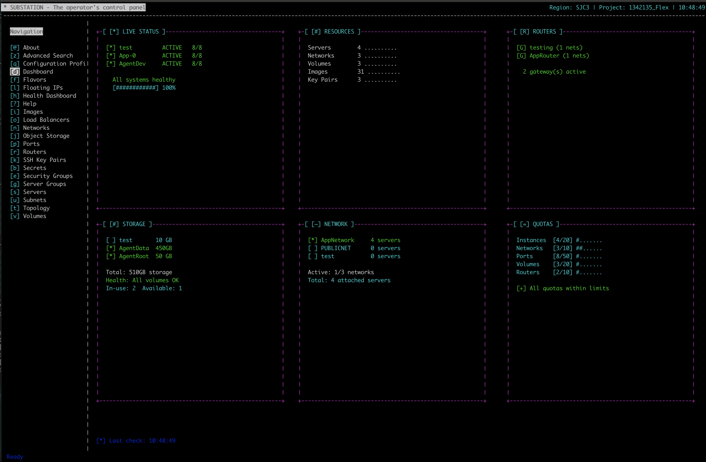

# Substation - OpenStack Terminal UI


**A high-performance, cross-platform terminal user interface for OpenStack infrastructure management.**

Built with Swift 6.1 and custom SwiftTUI framework, because sometimes you just need to manage your cloud without leaving the terminal - especially at 3 AM when the pagers won't stop screaming.

> "Finally, an OpenStack tool that doesn't make me want to throw my laptop out the window." - Anonymous Cloud Operator, 3:47 AM

## Why Substation?

Because listing 50,000 servers shouldn't take 10 minutes and three cups of coffee. Because your OpenStack API is slower than you think (trust us, it's even slower than that). Because when the monitoring alerts at 3 AM, you need answers NOW, not "eventually".

**60-80% API call reduction** through intelligent caching. Your OpenStack cluster will send thank-you notes.

## Features



### Resource Management

Manage everything your OpenStack cluster throws at you (and it will throw a lot):

- **Compute (Nova)**: Servers, flavors, keypairs, server groups - Battle-tested compute management
- **Networking (Neutron)**: Networks, subnets, routers, security groups, floating IPs, ports - Because networking is never simple
- **Storage (Cinder)**: Volumes, snapshots, volume types - Where your data lives (hopefully)
- **Images (Glance)**: Operating system images and snapshots - The good, the bad, and the corrupted
- **Secrets (Barbican)**: Secrets and certificates management - Keeping your secrets safe
- **Load Balancing (Octavia)**: Load balancers, pools, listeners - Traffic distribution made manageable
- **Object Storage (Swift)**: Containers and object management - Blob storage at scale

### Performance & Architecture

The good stuff that keeps you from rage-quitting:

- **60-80% API call reduction** - Intelligent multi-level caching because hammering your API never helped anyone
- **Actor-based concurrency** - Thread-safe operations so you don't get race conditions at 3 AM
- **Memory-efficient** - Handles 10,000+ resources without eating all your RAM (looking at you, Electron apps)
- **Zero-warning build** - Strict Swift 6 concurrency because warnings are just errors in disguise
- **Advanced Search** - Cross-service resource discovery with sub-second response (seriously, it's fast)
- **MemoryKit** - Custom multi-level caching system
  - L1/L2/L3 cache hierarchy, like a proper computer
  - Memory pressure handling and automatic cleanup
  - Type-safe caching because we're not savages
- **Modular Package Design** - OSClient, SwiftTUI, CrossPlatformTimer, MemoryKit - All reusable
- **Cross-Platform** - Native macOS and Linux support (Windows users, we feel your pain)

## Package Architecture

Substation is built as a modular Swift package (because monoliths are so 2010):

- **`OSClient`**: OpenStack API client library with caching and authentication - The heavy lifter
- **`MemoryKit`**: Multi-level caching system - L1/L2/L3 cache hierarchy, memory pressure handling
- **`SwiftTUI`**: Custom terminal UI framework (NCurses-based) - Making terminals pretty since 2024
- **`CrossPlatformTimer`**: Cross-platform timer utilities - Because macOS and Linux can't agree on anything
- **`Substation`**: Main executable combining all components - Where the magic happens

**Zero external dependencies** - We built it all ourselves. Every. Single. Line.

## Quick Start

### Configuration

Create `~/.config/openstack/clouds.yaml` (the same one you've been using for years):

```yaml
clouds:
  mycloud:
    auth:
      auth_url: https://identity.example.com:5000/v3
      username: admin
      password: secretpassword        # Yes, plaintext. Welcome to OpenStack.
      project_name: admin
      user_domain_name: Default       # Because domains make everything better
      project_domain_name: Default    # Twice the domains, twice the fun
    region_name: RegionOne            # Or whatever creative name your team chose
```

> **Pro Tip**: Substation respects the same `clouds.yaml` format as the OpenStack CLI. If it works there, it works here.

### Build Requirements

**macOS:**
- Swift 6.1 or later (we use the bleeding edge features, sorry)
- Xcode 15+ (optional, for IDE support and pretty colors)
- OpenStack clouds.yaml configuration (the one you already have)
- A working OpenStack cluster (the hard part)

**Linux:**
- Swift 6.1 or later (yes, really - Swift 6 strict concurrency is non-negotiable)
- ncurses development headers: `sudo apt-get install libncurses-dev`
- OpenStack clouds.yaml configuration
- Patience (Linux builds are... character building)

### Installation

#### macOS

While not required, it is recommended to use [swiftly](https://github.com/swiftlang/swiftly) for managing Swift toolchains.

```bash
# Build with Swift 6.1 (use system swift or swiftly)
swift build -c release

# Run the application
.build/release/substation
```

#### Linux-specific Setup

Linux build requires ncurses >=6.4 development headers and Swift 6.1 installation.

```bash
# Install Swift 6.1 using swiftly (recommended)
curl -L https://swift-server.github.io/swiftly/swiftly-install.sh | bash
swiftly install 6.1
swiftly use 6.1

# Install development headers and tools
sudo apt update
sudo apt install binutils build-essential libc6-dev libncurses-dev

# Build via swiftly
~/.swiftly/bin/swift build -c release

# Run the application
mv .build/release/substation /usr/local/bin/substation
```

#### Docker

Running Substation in Docker requires an interactive terminal and access to your OpenStack configuration.

##### Build (Linux)

```bash
# Build Docker image
docker build . -t substation:local
```

##### Run (local build)

```bash
# Run with clouds.yaml mounted
docker run --volume ~/.config/openstack:/root/.config/openstack \
           --interactive \
           --tty \
           --env TERM \
           --rm \
           substation:local
```

##### Run (pre-built image)

```bash
docker run --volume ~/.config/openstack:/root/.config/openstack \
           --interactive \
           --tty \
           --env TERM \
           --rm \
           ghcr.io/cloudnull/substation/substation:latest
```

### Usage

```bash
# Use default cloud (first one in your clouds.yaml)
substation

# Use specific cloud (when you have trust issues with defaults)
substation --cloud mycloud

# List available clouds (forgot what you named them again?)
substation --list-clouds

# Use the wiretap feature for debugging (see every API call in excruciating detail)
substation --wiretap
```

> **Wiretap Mode**: When using `--wiretap`, API requests and responses will be logged to `substation.log` in your `${HOME}` directory. Warning: This gets verbose. Very verbose. "Why is this log file 2GB?" verbose. Use it when your OpenStack cluster is misbehaving (so, always).

### Operator Survival Tips

- Press `c` to purge all caches when your data looks stale (happens more often than you'd like)
- Press `?` for help when you forget what key does what (we've all been there)
- Press `q` to quit and go back to bed (the monitoring will call you back anyway)
- The cache TTLs are tuned for typical OpenStack behavior: Servers (2 min), Networks (5 min), Auth tokens (1 hour)
- If searches are slow, your OpenStack API is probably having a bad day (again)

## Navigation

All keyboard-driven, because your mouse is for the weak.

### Main Navigation

| Key | View | When You'll Use It |
|-----|------|--------------------|
| `d` | Dashboard | First thing, every time |
| `s` | Servers | "Why is prod down?" |
| `g` | Server Groups | Advanced placement wizardry |
| `n` | Networks | "Can you see me now?" |
| `e` | Security Groups | Firewall archaeology |
| `v` | Volumes | Where did my data go? |
| `i` | Images | Finding that one CentOS image |
| `f` | Flavors | Size matters |
| `t` | Topology | Pretty network diagrams |
| `h` | Health Dashboard | Is it us or them? |
| `u` | Subnets | CIDR math at 3 AM |
| `p` | Ports | MAC address detective work |
| `r` | Routers | Routing table archaeology |
| `l` | Floating IPs | The IPs that float away |
| `b` | Barbican (Secrets) | Where secrets hide |
| `o` | Octavia (Load Balancers) | Distributing the pain |
| `j` | Swift (Object Storage) | Object storage chaos |
| `z` | Advanced Search | Cross-service grep for your cloud |
| `c` | (Hidden) | Purge all caches - the panic button |

### List Navigation

| Key | Action | Pro Tip |
|-----|--------|---------|
| `↑/↓` | Navigate lists | Or j/k if you're a vim person |
| `Enter` | View details | See everything about a resource |
| `/` | Search/filter | Instant local filtering |
| `?` | Show help | When you forget (again) |
| `q` | Quit | Until next time |

## Package Structure

```
substation/
├── Package.swift              # Swift Package Manager manifest (zero external deps)
├── Sources/
│   ├── OSClient/             # OpenStack API client library (the beast)
│   │   ├── Services/         # OpenStack service clients
│   │   │   ├── NovaService.swift        # Compute
│   │   │   ├── NeutronService.swift     # Networking
│   │   │   ├── CinderService.swift      # Storage
│   │   │   ├── GlanceService.swift      # Images
│   │   │   ├── KeystoneService.swift    # Identity
│   │   │   └── BarbicanService.swift    # Secrets
│   │   ├── Models/           # Data models and DTOs (JSON hell)
│   │   ├── Authentication/   # Auth and token management (1hr TTL)
│   │   └── Cache/            # Caching and optimization (60-80% hit rate)
│   ├── MemoryKit/            # Multi-level caching system
│   │   ├── MultiLevelCacheManager.swift   # L1/L2/L3 hierarchy
│   │   ├── CacheManager.swift             # Main cache engine
│   │   ├── MemoryManager.swift            # Memory pressure
│   │   ├── TypedCacheManager.swift        # Type-safe caching
│   │   └── PerformanceMonitor.swift       # Metrics tracking
│   ├── SwiftTUI/            # Custom terminal UI framework (NCurses magic)
│   │   ├── Core/            # Core rendering engine (60fps or bust)
│   │   ├── Components/      # Reusable UI components (tables, lists, forms)
│   │   └── Events/          # Input and event handling (keyboard wizardry)
│   ├── CrossPlatformTimer/  # Cross-platform timer utilities (Darwin vs Glibc)
│   ├── Substation/          # Main application (where it all comes together)
│   │   ├── Services/        # Refactored service layer (clean code organization)
│   │   │   ├── ResourceOperations.swift      # CRUD operations
│   │   │   ├── ServerActions.swift           # Server-specific actions
│   │   │   ├── UIHelpers.swift               # UI helper methods
│   │   │   ├── OperationErrorHandler.swift   # Error handling
│   │   │   └── ValidationService.swift       # Input validation
│   │   ├── Views/           # Application-specific views (pretty displays)
│   │   └── Telemetry/       # Metrics and performance monitoring
│   └── CNCurses/            # NCurses C bindings (because C is eternal)
└── Tests/                   # Unit and integration tests (we test things)
```

### Library Overview

All standalone, all reusable, all tested:

- **OSClient** (`/Sources/OSClient`): Standalone OpenStack client library - Use it in your own projects
- **MemoryKit** (`/Sources/MemoryKit`): Multi-level caching system - L1/L2/L3 cache hierarchy with memory pressure handling
- **SwiftTUI** (`/Sources/SwiftTUI`): Terminal UI framework with SwiftUI-like declarative syntax - Pretty terminals made easy
- **CrossPlatformTimer** (`/Sources/CrossPlatformTimer`): Timer utilities that work on both macOS and Linux - Because platform differences are pain
- **Substation** (`/Sources/Substation`): The main terminal application combining all components - The star of the show

## Testing

```bash
# Run all tests
swift test

# Run specific test suites
swift test --filter OSClientTests
swift test --filter SubstationTests
```

## Development

### Architecture Patterns

We use the good patterns, not the trendy ones:

- **Actor-based concurrency** - Thread-safe operations because race conditions at 3 AM are not fun
- **Protocol-oriented design** - Extensibility without inheritance hell
- **Modular architecture** - Clear separation of concerns (each package can stand alone)
- **Strict Swift 6 concurrency** - Zero-warning builds or bust (yes, really)
- **Zero external dependencies** - We control our destiny (and our supply chain)

### Performance Features

Because fast matters when you're debugging production at 3 AM:

- **60-80% API call reduction** through intelligent multi-level caching (L1/L2/L3 hierarchy)
- **Memory-efficient** resource handling (10,000+ resources without crying)
- **Predictive data prefetching** (we know what you're about to click)
- **Batch operation processing** (why make 100 calls when 1 will do?)
- **Actor-based parallelism** (search across 6 services simultaneously)
- **Memory pressure handling** (automatic cache eviction before the OOM killer arrives)

## Documentation

For when you want to know how the sausage is made:

- **[Architecture Guide](docs/architecture/index.md)**: System design, patterns, and all the diagrams
- **[API Documentation](docs/api/index.md)**: Library and service APIs (use our code in your projects)
- **[User Guide](docs/user-guide/index.md)**: Interface, navigation, and keyboard wizardry
- **[Performance Guide](docs/performance/index.md)**: Optimization, benchmarking, and cache tuning

Full documentation available at [https://substation.cloud](https://substation.cloud)

## Contributing

Want to make Substation better? We welcome contributions!

1. Fork the repository
2. Create a feature branch (`git checkout -b feature/amazing-feature`)
3. Make your changes with tests (we test things here)
4. Ensure zero warnings: `~/.swiftly/bin/swift build` (yes, zero - we're serious)
5. Run tests: `~/.swiftly/bin/swift test`
6. Submit a pull request with a clear description

**Build Standard**: Zero warnings. Not "mostly zero". Not "zero except that one". Zero. Swift 6 strict concurrency is non-negotiable.

## The Team

Built by cloud operators, for cloud operators. We've felt your 3 AM pain.

## License

MIT License - See [LICENSE](LICENSE) for details.

Because good tools should be free, like beer and speech.

---

**Remember**: The monitoring will call you back anyway. Might as well have good tools when it does.
