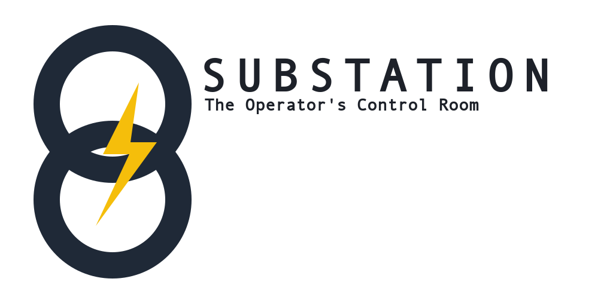

# Substation - OpenStack Terminal UI



**A high-performance, cross-platform terminal user interface for OpenStack infrastructure management.**

Built with Swift 6.1 and custom SwiftNCurses framework, because sometimes you just need to manage your cloud without leaving the terminal - especially at 3 AM when the pagers won't stop screaming.

> "Finally, an OpenStack tool that doesn't make me want to throw my laptop out the window." - Anonymous Cloud Operator (me)

## Why Substation?

Because listing 50,000 servers shouldn't take 10 minutes and three cups of coffee. Because your OpenStack API is slower than you think (trust us, it's even slower than that). Because when the monitoring alerts at 3 AM, you need answers NOW, not "eventually".

**60-80% API call reduction** through intelligent caching. Your OpenStack cluster will send thank-you notes.

## Features


### Resource Management

Manage everything your OpenStack cluster throws at you (and it will throw a lot):

- **Compute (Nova)**: Servers, flavors, keypairs, server groups, hypervisors - Battle-tested compute management
- **Networking (Neutron)**: Networks, subnets, routers, security groups, floating IPs, ports - Because networking is never simple
- **Storage (Cinder)**: Volumes, snapshots, volume types - Where your data lives (hopefully)
- **Images (Glance)**: Operating system images and snapshots - The good, the bad, and the corrupted
- **Secrets (Barbican)**: Secrets and certificates management - Keeping your secrets safe
- **Container Infrastructure (Magnum)**: Kubernetes clusters and cluster templates - Container orchestration at scale
- **Object Storage (Swift)**: Containers and object management - Blob storage at scale

### Performance & Architecture

The good stuff that keeps you from rage-quitting:

- **60-80% API call reduction** - Intelligent multi-level caching because hammering your API never helped anyone
- **Actor-based concurrency** - Thread-safe operations so you don't get race conditions at 3 AM
- **Memory-efficient** - Handles 10,000+ resources without eating all your RAM (looking at you, Electron apps)
- **Zero-warning build** - Strict Swift 6 concurrency because warnings are just errors in disguise
- **Advanced Search** - Cross-service resource discovery with sub-second response (seriously, it's fast)
- **MemoryKit** - Custom multi-level caching system
  - L1/L2/L3 cache hierarchy, like a proper computer
  - Memory pressure handling and automatic cleanup
  - Type-safe caching because we're not savages
- **Modular Package Design** - OSClient, SwiftNCurses, CrossPlatformTimer, MemoryKit - All reusable
- **Cross-Platform** - Native macOS and Linux support (Windows users, we feel your pain)

## Package Architecture

Substation is built as a modular Swift package (because monoliths are so 2010):

- **`OSClient`**: OpenStack API client library with caching and authentication - The heavy lifter
- **`MemoryKit`**: Multi-level caching system - L1/L2/L3 cache hierarchy, memory pressure handling
- **`SwiftNCurses`**: Custom terminal UI framework (NCurses-based) - Making terminals pretty since 2024
- **`CrossPlatformTimer`**: Cross-platform timer utilities - Because macOS and Linux can't agree on anything
- **`Substation`**: Main executable combining all components - Where the magic happens

## Quick Start in 1 minute

### Get the container

```bash
# Docker (fastest)
docker run --volume ~/.config/openstack:/root/.config/openstack \
           --interactive --tty --env TERM --rm \
           ghcr.io/cloudnull/substation/substation:latest
```

### Get pre-built binary

```bash
curl -L "https://github.com/cloudnull/substation/releases/latest/download/substation-$(uname -s)-$(uname -m)" -o substation

# Make executable
chmod +x substation

# Move to your PATH
sudo mv substation /usr/local/bin/
```

## Full guides

- **[Installation Guide](https://substation.cloud/installation/)** - All installation methods (Docker, binary, source)
- **[Configuration Guide](https://substation.cloud/configuration/)** - clouds.yaml setup and authentication
- **[Quick Start Guide](https://substation.cloud/quick-start/)** - Get up and running in 5 minutes
- **[Getting Started](https://substation.cloud/getting-started/)** - Comprehensive first-time setup

**Full keyboard guide:** [Keyboard Shortcuts & Navigation](https://substation.cloud/reference/operators/keyboard-shortcuts/)

### Library Overview

All standalone, all reusable, all tested:

- **OSClient** (`/Sources/OSClient`): Standalone OpenStack client library - Use it in your own projects
- **MemoryKit** (`/Sources/MemoryKit`): Multi-level caching system - L1/L2/L3 cache hierarchy with memory pressure handling
- **SwiftNCurses** (`/Sources/SwiftNCurses`): Terminal UI framework with SwiftUI-like declarative syntax - Pretty terminals made easy
- **CrossPlatformTimer** (`/Sources/CrossPlatformTimer`): Timer utilities that work on both macOS and Linux - Because platform differences are pain
- **Substation** (`/Sources/Substation`): The main terminal application combining all components - The star of the show

## Testing

Substation includes a comprehensive test suite with 36+ tests covering all major components.

```bash
# Run with code coverage
~/.swiftly/bin/swift test --enable-code-coverage
```

### Continuous Integration

All tests run automatically on every push and pull request via GitHub Actions. The CI pipeline:

- Builds in both debug and release configurations
- Runs the full test suite
- Treats build warnings as errors (zero-warning policy)
- Generates code coverage reports
- Validates code formatting

See [Testing Guide](https://substation.cloud/reference/developers/testing/) for detailed testing documentation.

## Development

### Architecture Patterns

We use the good patterns, not the trendy ones:

- **Actor-based concurrency** - Thread-safe operations because race conditions at 3 AM are not fun
- **Protocol-oriented design** - Extensibility without inheritance hell
- **Modular architecture** - Clear separation of concerns (each package can stand alone)
- **Strict Swift 6 concurrency** - Zero-warning builds or bust (yes, really)
- **Zero external dependencies** - We control our destiny (and our supply chain)

### Performance Features

Because fast matters when you're debugging production at 3 AM:

- **60-80% API call reduction** through intelligent multi-level caching (L1/L2/L3 hierarchy)
- **Memory-efficient** resource handling (10,000+ resources without crying)
- **Predictive data prefetching** (we know what you're about to click)
- **Batch operation processing** (why make 100 calls when 1 will do?)
- **Actor-based parallelism** (search across 6 services simultaneously)
- **Memory pressure handling** (automatic cache eviction before the OOM killer arrives)

## Documentation

### Getting Started

- **[Quick Start](https://substation.cloud/quick-start/)** - Get running in 5 minutes
- **[Installation](https://substation.cloud/installation/)** - All installation methods
- **[Configuration](https://substation.cloud/configuration/)** - clouds.yaml and authentication
- **[Getting Started](https://substation.cloud/getting-started/)** - Complete first-time setup

### Operators

- **[Keyboard Shortcuts](https://substation.cloud/reference/operators/keyboard-shortcuts/)** - Complete navigation reference
- **[Common Workflows](https://substation.cloud/reference/operators/workflows/)** - Everyday operations
- **[Troubleshooting](https://substation.cloud/troubleshooting/)** - When things go wrong

### Developers

- **[API Reference](https://substation.cloud/reference/api/)** - Using Substation libraries (OSClient, SwiftNCurses, MemoryKit)
- **[Module Development](https://substation.cloud/reference/developers/module-development-guide/)** - Creating new modules
- **[FormBuilder Guide](https://substation.cloud/reference/developers/formbuilder-guide/)** - Building forms

### Deep Dives

- **[Architecture](https://substation.cloud/architecture/)** - System design and components
- **[Performance](https://substation.cloud/performance/)** - Optimization and benchmarking
- **[Module Reference](https://substation.cloud/reference/modules/)** - All OpenStack modules documented
- **[Security](https://substation.cloud/reference/framework/security/)** - Security implementation details

Full documentation available at [https://substation.cloud](https://substation.cloud)

## Contributing

Want to make Substation better? We welcome contributions!

1. Fork the repository
2. Create a feature branch (`git checkout -b feature/amazing-feature`)
3. Make your changes with tests (we test things here)
4. Ensure zero warnings: `~/.swiftly/bin/swift build` (yes, zero - we're serious)
5. Run tests: `~/.swiftly/bin/swift test`
6. Submit a pull request with a clear description

**Build Standard**: Zero warnings. Not "mostly zero". Not "zero except that one". Zero. Swift 6 strict concurrency is non-negotiable.

## The Team

Built by cloud operators, for cloud operators. We've felt your 3 AM pain.

## License

MIT License - See [LICENSE](LICENSE) for details.

Because good tools should be free, like beer and speech.

---

**Remember**: The monitoring will call you back anyway. Might as well have good tools when it does.
