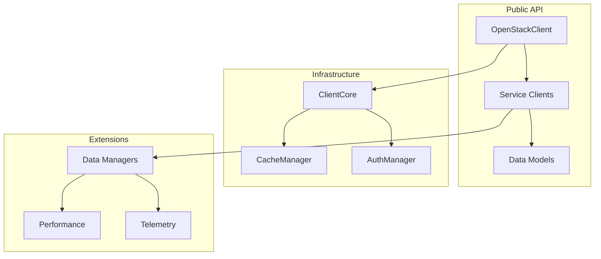

# API Reference

Substation provides multiple packages with clean, modular APIs for OpenStack management and terminal UI development. This reference documents all public APIs across the package ecosystem.

## Package Overview

### OSClient - OpenStack API Library

The OSClient library provides a comprehensive Swift API for interacting with OpenStack services with:

- **Type-safe API** using Swift's strong type system
- **Actor-based concurrency** for thread safety
- **Intelligent caching** for 60-80% API call reduction
- **Comprehensive error handling** with recovery strategies
- **Cross-platform compatibility** (macOS and Linux)

### SwiftTUI - Terminal UI Framework

SwiftTUI provides a declarative terminal UI framework with:

- **SwiftUI-like syntax** for familiar development experience
- **Cross-platform rendering** using NCurses abstraction
- **High-performance rendering** with 60+ FPS capability
- **Component-based architecture** for reusability
- **Event-driven input handling** for responsive UIs

### CrossPlatformTimer - Timer Utilities

CrossPlatformTimer offers unified timer functionality with:

- **Platform abstraction** for consistent behavior
- **High-precision timing** for smooth animations
- **Memory-efficient implementation** with automatic cleanup
- **Actor-safe design** for concurrent environments

## Core Components



## Quick Start

```swift
import OSClient

// Connect to OpenStack
let config = OpenStackConfig(
    authUrl: "https://keystone.example.com:5000/v3"
)

let credentials = OpenStackCredentials(
    username: "operator",
    password: "secret",
    projectName: "myproject",
    domainName: "default"
)

let client = try await OpenStackClient.connect(
    config: config,
    credentials: credentials
)

// Use service clients
let servers = try await client.nova.servers.list()
let networks = try await client.neutron.networks.list()
```

## OpenStackClient

The main entry point for all OpenStack operations.

### Initialization

```swift
public actor OpenStackClient {
    /// Connect to OpenStack with configuration and credentials
    public static func connect(
        config: OpenStackConfig,
        credentials: OpenStackCredentials,
        logger: OpenStackClientLogger = ConsoleLogger(),
        enablePerformanceEnhancements: Bool = true
    ) async throws -> OpenStackClient
}
```

### Service Access

```swift
// Service client properties
public var nova: NovaService { get }
public var neutron: NeutronService { get }
public var cinder: CinderService { get }
public var glance: GlanceService { get }
public var keystone: KeystoneService { get }
public var heat: HeatService { get }
public var barbican: BarbicanService { get }
public var octavia: OctaviaService { get }
```

### Configuration

```swift
public struct OpenStackConfig {
    public let authUrl: String
    public let interface: String = "public"
    public let validateCertificates: Bool = true
    public let timeout: TimeInterval = 30
    public let retryCount: Int = 3
}

public struct OpenStackCredentials {
    public let username: String?
    public let password: String?
    public let projectName: String?
    public let domainName: String?
    public let applicationCredentialId: String?
    public let applicationCredentialSecret: String?
    public let token: String?
}
```

## Service Clients

### NovaService (Compute)

```swift
public actor NovaService {
    // Server operations
    public func servers() -> ServerManager
    public func flavors() -> FlavorManager
    public func keypairs() -> KeyPairManager
    public func serverGroups() -> ServerGroupManager
}

public actor ServerManager {
    /// List all servers
    public func list(
        allTenants: Bool = false,
        detailed: Bool = true,
        limit: Int? = nil,
        marker: String? = nil
    ) async throws -> [Server]

    /// Get server details
    public func get(_ id: String) async throws -> Server

    /// Create a new server
    public func create(
        name: String,
        flavorRef: String,
        imageRef: String?,
        networks: [NetworkConfig] = [],
        securityGroups: [String] = [],
        keyName: String? = nil,
        userData: String? = nil,
        blockDeviceMappings: [BlockDeviceMapping] = []
    ) async throws -> Server

    /// Delete a server
    public func delete(_ id: String) async throws

    /// Server actions
    public func start(_ id: String) async throws
    public func stop(_ id: String) async throws
    public func reboot(_ id: String, type: RebootType = .soft) async throws
    public func resize(_ id: String, flavorRef: String) async throws
    public func rebuild(_ id: String, imageRef: String) async throws

    /// Console access
    public func getConsoleOutput(_ id: String, lines: Int? = nil) async throws -> String
    public func getVNCConsole(_ id: String) async throws -> VNCConsole
}
```

### NeutronService (Networking)

```swift
public actor NeutronService {
    public func networks() -> NetworkManager
    public func subnets() -> SubnetManager
    public func ports() -> PortManager
    public func routers() -> RouterManager
    public func securityGroups() -> SecurityGroupManager
    public func floatingIPs() -> FloatingIPManager
}

public actor NetworkManager {
    /// List networks
    public func list(
        shared: Bool? = nil,
        external: Bool? = nil
    ) async throws -> [Network]

    /// Create network
    public func create(
        name: String,
        shared: Bool = false,
        external: Bool = false,
        segmentationId: Int? = nil
    ) async throws -> Network

    /// Update network
    public func update(
        _ id: String,
        name: String? = nil,
        shared: Bool? = nil
    ) async throws -> Network

    /// Delete network
    public func delete(_ id: String) async throws
}
```

### CinderService (Block Storage)

```swift
public actor CinderService {
    public func volumes() -> VolumeManager
    public func snapshots() -> SnapshotManager
    public func volumeTypes() -> VolumeTypeManager
}

public actor VolumeManager {
    /// List volumes
    public func list(detailed: Bool = true) async throws -> [Volume]

    /// Create volume
    public func create(
        name: String,
        size: Int,
        volumeType: String? = nil,
        sourceVolId: String? = nil,
        snapshotId: String? = nil,
        imageRef: String? = nil,
        bootable: Bool = false
    ) async throws -> Volume

    /// Attach volume to server
    public func attach(
        _ id: String,
        serverId: String,
        device: String? = nil
    ) async throws -> VolumeAttachment

    /// Detach volume from server
    public func detach(
        _ id: String,
        attachmentId: String
    ) async throws

    /// Extend volume size
    public func extend(
        _ id: String,
        newSize: Int
    ) async throws -> Volume
}
```

## Data Models

### Server Model

```swift
public struct Server: Codable, Identifiable {
    public let id: String
    public let name: String
    public let status: ServerStatus
    public let flavor: FlavorRef
    public let image: ImageRef?
    public let addresses: [String: [Address]]
    public let created: Date
    public let updated: Date
    public let metadata: [String: String]
    public let securityGroups: [SecurityGroupRef]
    public let volumesAttached: [String]

    public enum ServerStatus: String, Codable {
        case active = "ACTIVE"
        case building = "BUILD"
        case deleted = "DELETED"
        case error = "ERROR"
        case hardReboot = "HARD_REBOOT"
        case password = "PASSWORD"
        case paused = "PAUSED"
        case reboot = "REBOOT"
        case rebuild = "REBUILD"
        case rescue = "RESCUE"
        case resize = "RESIZE"
        case revertResize = "REVERT_RESIZE"
        case shutoff = "SHUTOFF"
        case softDeleted = "SOFT_DELETED"
        case stopped = "STOPPED"
        case suspended = "SUSPENDED"
        case unknown = "UNKNOWN"
        case verifyResize = "VERIFY_RESIZE"
    }
}
```

### Network Model

```swift
public struct Network: Codable, Identifiable {
    public let id: String
    public let name: String
    public let status: String
    public let shared: Bool
    public let external: Bool
    public let subnets: [String]
    public let adminStateUp: Bool
    public let mtu: Int?
    public let portSecurityEnabled: Bool
    public let providerNetworkType: String?
    public let providerSegmentationId: Int?
}
```

### Volume Model

```swift
public struct Volume: Codable, Identifiable {
    public let id: String
    public let name: String?
    public let status: VolumeStatus
    public let size: Int
    public let volumeType: String
    public let bootable: Bool
    public let encrypted: Bool
    public let attachments: [VolumeAttachment]
    public let createdAt: Date
    public let updatedAt: Date?

    public enum VolumeStatus: String, Codable {
        case creating = "creating"
        case available = "available"
        case attaching = "attaching"
        case inUse = "in-use"
        case deleting = "deleting"
        case error = "error"
        case errorDeleting = "error_deleting"
        case maintenance = "maintenance"
    }
}
```

## Cache Management

### CacheManager

```swift
public actor CacheManager {
    /// Configure cache settings
    public func configure(
        maxSize: Int,
        defaultTTL: TimeInterval,
        resourceTTLs: [ResourceType: TimeInterval] = [:]
    )

    /// Get cache statistics
    public func statistics() -> CacheStatistics

    /// Clear cache
    public func clear(type: ResourceType? = nil)

    /// Warm cache with frequently used data
    public func warm(resources: [ResourceType])
}

public struct CacheStatistics {
    public let hitRate: Double
    public let missRate: Double
    public let evictionCount: Int
    public let currentSize: Int
    public let maxSize: Int
}
```

## Error Handling

### Error Types

```swift
public enum OpenStackError: Error {
    case authentication(String)
    case authorization(String)
    case notFound(resource: String, id: String)
    case conflict(String)
    case quotaExceeded(String)
    case serverError(String)
    case timeout(operation: String)
    case networkError(Error)
    case invalidResponse(String)
    case rateLimited(retryAfter: TimeInterval?)
}
```

### Error Recovery

```swift
public protocol ErrorRecoveryStrategy {
    func shouldRetry(error: Error, attempt: Int) -> Bool
    func delayForRetry(attempt: Int) -> TimeInterval
}

public struct ExponentialBackoffStrategy: ErrorRecoveryStrategy {
    public let maxAttempts: Int
    public let baseDelay: TimeInterval
    public let maxDelay: TimeInterval
}
```

## Data Managers

### ServerDataManager

```swift
public actor ServerDataManager {
    /// Get detailed server information with related resources
    public func getDetailed(_ id: String) async throws -> DetailedServer

    /// Batch operations
    public func batchDelete(_ ids: [String]) async throws -> BatchResult
    public func batchStop(_ ids: [String]) async throws -> BatchResult
    public func batchStart(_ ids: [String]) async throws -> BatchResult

    /// Advanced queries
    public func search(
        name: String? = nil,
        status: ServerStatus? = nil,
        flavor: String? = nil,
        network: String? = nil
    ) async throws -> [Server]
}
```

### NetworkDataManager

```swift
public actor NetworkDataManager {
    /// Get network topology
    public func getTopology() async throws -> NetworkTopology

    /// Find connected resources
    public func getConnectedServers(_ networkId: String) async throws -> [Server]
    public func getConnectedRouters(_ networkId: String) async throws -> [Router]

    /// Network path analysis
    public func findPath(from: String, to: String) async throws -> [NetworkHop]
}
```

## Performance Monitoring

### PerformanceMonitor

```swift
public actor PerformanceMonitor {
    /// Start monitoring
    public func start()

    /// Get metrics
    public func metrics() -> PerformanceMetrics

    /// Export metrics
    public func export(format: ExportFormat) -> Data
}

public struct PerformanceMetrics {
    public let apiCallCount: Int
    public let averageLatency: TimeInterval
    public let p95Latency: TimeInterval
    public let p99Latency: TimeInterval
    public let cacheHitRate: Double
    public let errorRate: Double
}
```

## Logging

### Logger Protocol

```swift
public protocol OpenStackClientLogger {
    func logDebug(_ message: String)
    func logInfo(_ message: String)
    func logWarning(_ message: String)
    func logError(_ message: String, error: Error?)
}

// Built-in loggers
public struct ConsoleLogger: OpenStackClientLogger { }
public struct FileLogger: OpenStackClientLogger { }
public struct NullLogger: OpenStackClientLogger { }
```

## Extensions

### Async Sequences

```swift
extension ServerManager {
    /// Stream server events
    public func events(_ serverId: String) -> AsyncStream<ServerEvent>

    /// Watch for state changes
    public func watchStatus(
        _ serverId: String,
        until status: ServerStatus,
        timeout: TimeInterval = 300
    ) async throws
}
```

### Batch Operations

```swift
public protocol BatchOperation {
    associatedtype Resource
    associatedtype Result

    func execute(
        on resources: [Resource],
        concurrency: Int
    ) async throws -> [Result]
}
```

## Migration Guide

### From Python OpenStack SDK

```python
# Python
from openstack import connection
conn = connection.Connection(
    auth_url="https://keystone.example.com:5000/v3",
    username="user",
    password="pass",
    project_name="project"
)
servers = conn.compute.servers()
```

```swift
// Swift
import OSClient

let client = try await OpenStackClient.connect(
    config: OpenStackConfig(authUrl: "https://keystone.example.com:5000/v3"),
    credentials: OpenStackCredentials(
        username: "user",
        password: "pass",
        projectName: "project"
    )
)
let servers = try await client.nova.servers.list()
```

---

## SwiftTUI Framework API

### Core Components

#### Surface Management

```swift
import SwiftTUI

// Create rendering surface
let surface = SwiftTUI.surface(from: screen)

// Get surface dimensions
let (width, height) = SwiftTUI.getScreenSize()
let maxY = SwiftTUI.getMaxY(screen)
let maxX = SwiftTUI.getMaxX(screen)
```

#### Component Rendering

```swift
// Basic text rendering
await SwiftTUI.render(
    Text("Hello, World!").bold().color(.blue),
    on: surface,
    in: Rect(x: 0, y: 0, width: 20, height: 1)
)

// List component
let listComponent = List(items: ["Item 1", "Item 2", "Item 3"])
await SwiftTUI.render(listComponent, on: surface, in: bounds)

// Table component
let tableComponent = Table(data: serverData, columns: columns)
await SwiftTUI.render(tableComponent, on: surface, in: bounds)
```

#### Input Handling

```swift
// Get user input
let key = SwiftTUI.getInput(screen)

// Handle special keys
switch key {
case Int32(259): // Arrow Up
    // Handle up arrow
case Int32(258): // Arrow Down
    // Handle down arrow
case 10, 13: // Enter
    // Handle enter key
case 27: // Escape
    // Handle escape key
default:
    // Handle other keys
}
```

#### Screen Management

```swift
// Screen operations
SwiftTUI.clear(screen)
SwiftTUI.refresh(screen)

// Initialize/cleanup
let screen = SwiftTUI.initializeScreen()
SwiftTUI.cleanup(screen)
```

### UI Components

#### Text Component

```swift
public struct Text {
    public init(_ content: String)

    // Styling modifiers
    public func bold() -> Text
    public func color(_ color: Color) -> Text
    public func background(_ color: Color) -> Text
    public func underline() -> Text
}
```

#### List Component

```swift
public struct List<Item> {
    public init(items: [Item])

    // Configuration
    public func selectedIndex(_ index: Int) -> List
    public func onSelection(_ handler: @escaping (Item) -> Void) -> List
    public func scrollable(_ enabled: Bool = true) -> List
}
```

#### Table Component

```swift
public struct Table<Data> {
    public init(data: [Data], columns: [TableColumn])

    // Configuration
    public func sortable(_ enabled: Bool = true) -> Table
    public func selectable(_ enabled: Bool = true) -> Table
    public func headerStyle(_ style: HeaderStyle) -> Table
}
```

#### Form Component

```swift
public struct Form {
    public init(@FormBuilder content: () -> [FormField])

    // Validation
    public func validate() -> [ValidationError]
    public func onSubmit(_ handler: @escaping () -> Void) -> Form
}
```

---

## CrossPlatformTimer API

### Timer Creation

```swift
import CrossPlatformTimer

// Create a timer
let timer = createCompatibleTimer(
    interval: 1.0,
    repeats: true
) {
    print("Timer fired!")
}

// One-shot timer
let oneShot = createCompatibleTimer(
    interval: 5.0,
    repeats: false
) {
    print("One-time action")
}
```

### Timer Management

```swift
// Platform-specific timer handling
#if canImport(Darwin)
// macOS/iOS timer implementation
let timer = Timer.scheduledTimer(withTimeInterval: interval, repeats: repeats, block: action)
#else
// Linux timer implementation
let timer = DispatchSource.makeTimerSource(queue: .main)
timer.schedule(deadline: .now() + interval, repeating: repeats ? interval : .never)
timer.setEventHandler(handler: action)
timer.resume()
#endif
```

### High-Performance Timing

```swift
// For animation timing (60+ FPS)
let animationTimer = createCompatibleTimer(interval: 1.0/60.0, repeats: true) {
    // Update animation frame
    updateFrame()
}

// For periodic background tasks
let backgroundTimer = createCompatibleTimer(interval: 30.0, repeats: true) {
    // Perform background maintenance
    performMaintenance()
}
```

---

## Package Integration Examples

### Complete Application Example

```swift
import OSClient
import SwiftTUI
import CrossPlatformTimer

@main
struct MyOpenStackApp {
    static func main() async {
        let screen = SwiftTUI.initializeScreen()
        defer { SwiftTUI.cleanup(screen) }

        // Initialize OpenStack client
        let client = try await OpenStackClient.connect(
            config: OpenStackConfig(authUrl: "https://keystone.example.com:5000/v3"),
            credentials: OpenStackCredentials(
                username: "admin",
                password: "secret",
                projectName: "admin"
            )
        )

        // Create UI surface
        let surface = SwiftTUI.surface(from: screen)
        let bounds = Rect(x: 0, y: 0, width: 80, height: 24)

        // Set up refresh timer
        let refreshTimer = createCompatibleTimer(interval: 5.0, repeats: true) {
            Task {
                await updateServerList(client: client, surface: surface, bounds: bounds)
            }
        }

        // Main application loop
        var running = true
        while running {
            let key = SwiftTUI.getInput(screen)
            if key == 113 { // 'q' key
                running = false
            }
        }
    }
}

func updateServerList(client: OpenStackClient, surface: Surface, bounds: Rect) async {
    do {
        let servers = try await client.nova.servers.list()
        let serverNames = servers.map { $0.name }

        let listComponent = List(items: serverNames)
        await SwiftTUI.render(listComponent, on: surface, in: bounds)
        SwiftTUI.refresh(surface.screen)
    } catch {
        let errorText = Text("Error: \(error.localizedDescription)").color(.red)
        await SwiftTUI.render(errorText, on: surface, in: bounds)
    }
}
```

### Using Individual Packages

```swift
// OSClient only
import OSClient

let client = try await OpenStackClient.connect(/* config */)
let servers = try await client.nova.servers.list()

// SwiftTUI only
import SwiftTUI

let screen = SwiftTUI.initializeScreen()
let surface = SwiftTUI.surface(from: screen)
await SwiftTUI.render(Text("Hello"), on: surface, in: bounds)

// CrossPlatformTimer only
import CrossPlatformTimer

let timer = createCompatibleTimer(interval: 1.0, repeats: true) {
    // Timer action
}
```

## Best Practices

### 1. Use Async/Await

```swift
// Good: Using async/await
let servers = try await client.nova.servers.list()

// Avoid: Blocking calls
// let servers = client.nova.servers.listSync() // Don't do this
```

### 2. Handle Errors Properly

```swift
do {
    let server = try await client.nova.servers.create(...)
} catch OpenStackError.quotaExceeded(let message) {
    // Handle quota error
} catch OpenStackError.conflict(let message) {
    // Handle conflict
} catch {
    // Handle other errors
}
```

### 3. Use Data Managers for Complex Operations

```swift
// Use data manager for detailed info
let details = try await client.serverDataManager.getDetailed(serverId)

// Instead of multiple calls
// let server = try await client.nova.servers.get(serverId)
// let volumes = try await client.cinder.volumes.list(serverId: serverId)
// let networks = ...
```

### 4. Configure Caching Appropriately

```swift
// Configure cache for your use case
await client.cacheManager.configure(
    maxSize: 100_000_000, // 100MB
    defaultTTL: 300, // 5 minutes
    resourceTTLs: [
        .servers: 60,
        .networks: 300,
        .images: 3600
    ]
)
```
