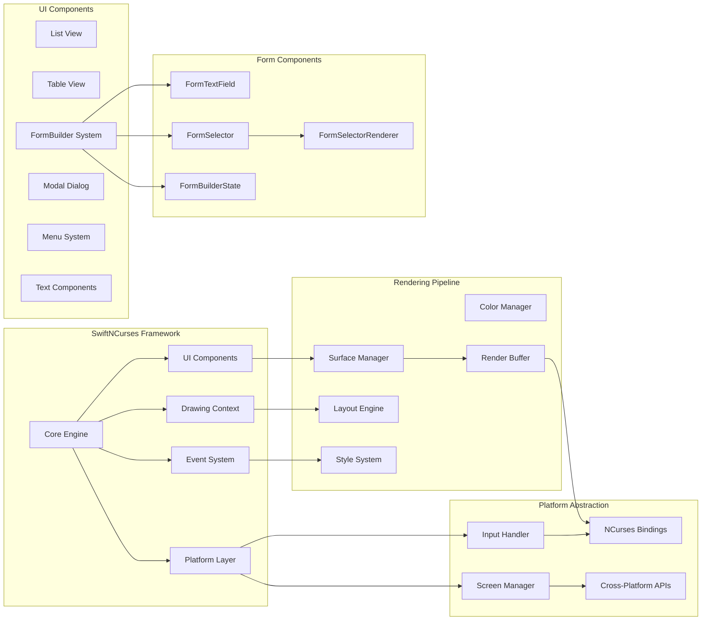
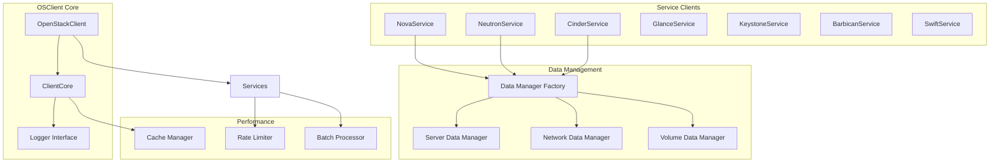
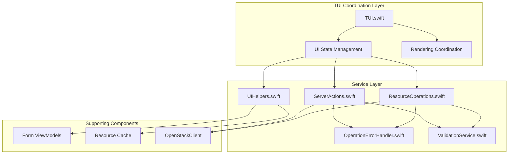
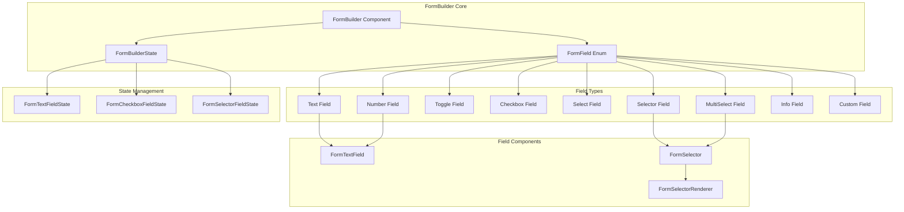
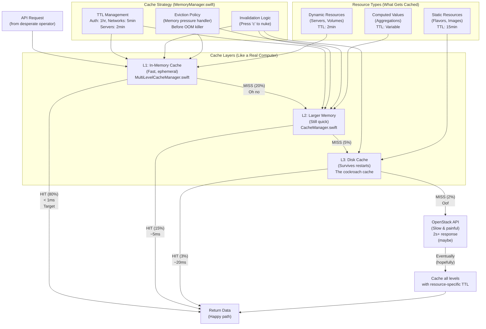
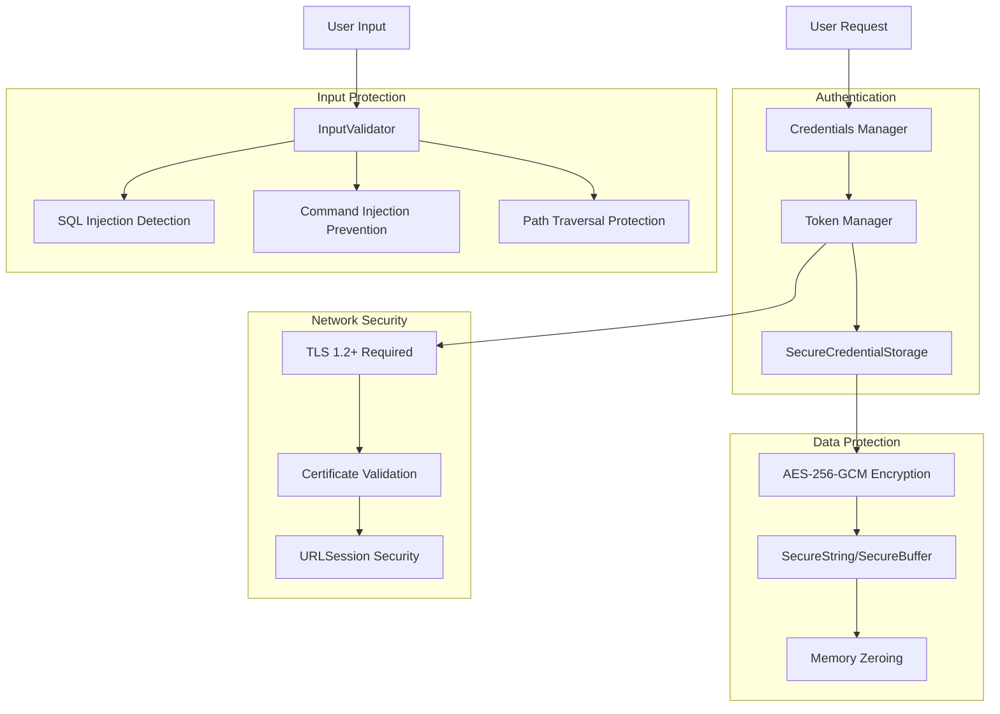

# Component Architecture

When we built Substation, we knew from day one that terminal UI applications live or die by their rendering performance. You can have the best OpenStack integration in the world, but if your TUI drops frames or stutters during list scrolling, users will hate it. So we built a component architecture that prioritizes speed without sacrificing maintainability.

This document walks through the layers that make Substation work: the SwiftNCurses framework we built from scratch, the OSClient service layer that talks to OpenStack, and the FormBuilder system that turns our form-building chaos into something resembling order.

## TUI Layer (SwiftNCurses)

We needed a cross-platform terminal UI abstraction that didn't exist, so we built one. SwiftNCurses wraps the ancient NCurses library in modern Swift, giving us type safety and async/await support without the segfaults. The framework provides everything from basic window management to complex form handling, and it does it all while hitting our 60fps target.

Here's how the pieces fit together. The core engine coordinates everything: components render themselves, the drawing context manages layouts, events flow through the input system, and the platform layer abstracts away the differences between macOS and Linux. It's clean, it's testable, and it doesn't randomly crash at 2 AM when you're trying to provision servers.



### SwiftNCurses Components

The framework provides a component library that handles the common UI patterns we need. List views give you virtual scrolling for massive server lists, table views provide sortable multi-column displays, and the FormBuilder system (more on that later) handles all our form creation needs. Everything is built with performance in mind: double buffering prevents flicker, differential rendering only updates changed cells, and we hit our 60fps target even on older hardware.

| Component | Purpose | Key Features |
|-----------|---------|--------------|
| **Rendering Core** | Central rendering engine | 60fps target, double buffering, efficient updates |
| **List View** | Scrollable resource lists | Virtual scrolling, search, selection |
| **Table View** | Multi-column data display | Sortable columns, dynamic width, alignment |
| **FormBuilder** | Declarative form creation | Type-safe fields, validation, consistent styling |
| **Modal Dialog** | Popup dialogs | Confirmations, alerts, progress indicators |
| **Menu System** | Navigation menus | Keyboard shortcuts, context-aware help |
| **Text Components** | Rich text rendering | Colors, styles, wrapping, truncation |

### Rendering Pipeline

The rendering pipeline is where we earn our performance credentials. We calculate layouts first, apply styles and colors, accumulate all changes in a memory buffer, coordinate updates through the surface manager, and then push only the changed cells to the terminal. This differential rendering approach is why we can maintain 60fps even when displaying hundreds of servers.

The typical frame takes 5-10ms to render, well under our 16.7ms budget for 60fps. We only redraw cells that actually changed, double buffering prevents any visible flicker, and the whole system stays responsive even under load. It turns out that treating terminal rendering like a game engine was exactly the right call.

**Why This Matters**: When you're managing OpenStack infrastructure, the UI cannot be the bottleneck. Sub-10ms rendering means your TUI feels as responsive as a native GUI, and that matters when you're troubleshooting production incidents.

## OSClient Service Layer

The OSClient layer handles all the messy details of talking to OpenStack APIs. It manages service discovery, authentication tokens, request retries, and response parsing so the rest of Substation doesn't have to care about HTTP status codes or JSON schemas. We built it to be resilient: network errors trigger retries, token expiration is handled automatically, and rate limiting prevents us from overwhelming the API.

Here's the architecture. The OpenStackClient core coordinates everything, service clients handle specific OpenStack services (Nova for compute, Neutron for networking, etc.), data managers provide typed interfaces for CRUD operations, and the performance layer adds caching and rate limiting. It's a clean separation of concerns that makes testing straightforward and debugging considerably less painful.



### OpenStack Service Clients

Each OpenStack service gets its own client implementation. NovaService handles compute operations like creating and managing servers, NeutronService manages networking resources, CinderService deals with block storage, and so on. The clients provide strongly-typed Swift interfaces for all common operations, hiding the HTTP details and JSON parsing complexity behind clean async methods.

| Service | Purpose | Key Operations |
|---------|---------|----------------|
| **NovaService** | Compute (servers) | List, create, delete, start, stop, resize, snapshot |
| **NeutronService** | Network | Networks, subnets, ports, routers, floating IPs, security groups |
| **CinderService** | Block storage | Volumes, snapshots, backups, volume types |
| **GlanceService** | Image service | Images, snapshots, image upload/download |
| **KeystoneService** | Identity | Users, projects, roles, domains, tokens |
| **BarbicanService** | Secrets | Secrets, certificates, containers |
| **SwiftService** | Object storage | Containers, objects, account metadata |

### Data Manager Pattern

We use data managers to provide a consistent interface for CRUD operations across all resource types. Each manager defines the standard operations you'd expect (list, get, create, delete, update) and implements them using the appropriate service client. This pattern gives us type safety, makes mocking straightforward for tests, and provides a natural place to add caching and retry logic.

Here's what a data manager looks like. It's a protocol that defines the operations, and each service client implements it for their specific resource type. The implementation handles caching, retries, and error handling so the UI layer doesn't have to worry about those details.

```swift
// Example: Server Data Manager
protocol ServerDataManager {
    func list() async throws -> [Server]
    func get(id: String) async throws -> Server
    func create(request: CreateServerRequest) async throws -> Server
    func delete(id: String) async throws
    func update(id: String, request: UpdateServerRequest) async throws -> Server
}

// Implemented by NovaService
extension NovaService: ServerDataManager {
    // Implementation with caching, retry logic, error handling
}
```

## Substation Service Layer

The Substation service layer sits between the UI and OSClient, orchestrating operations and managing state. ResourceOperations handles all the CRUD operations, ServerActions provides server-specific actions like reboot and snapshot, UIHelpers formats data for display, and error handlers ensure failures get presented to users in a comprehensible way. It's the glue that makes everything work together.

Here's how requests flow through the system. The TUI layer coordinates UI state and rendering, the service layer handles business logic and validation, and everything eventually calls through to the OpenStack client. The separation makes it easy to test each layer independently and gives us clear boundaries for where different concerns live.



### Service Layer Components

Each component in the service layer has a specific job. ResourceOperations handles creating and managing all OpenStack resources, ServerActions provides the lifecycle operations for servers, UIHelpers formats data for display, and the error handlers ensure failures are logged and presented to users. ValidationService prevents bad data from ever hitting the API.

| Component | Purpose | Key Responsibilities |
|-----------|---------|---------------------|
| `ResourceOperations.swift` | CRUD operations for all resources | Create servers, networks, volumes, security groups, floating IPs, routers, subnets, ports, keypairs, images, server groups |
| `ServerActions.swift` | Server-specific actions | Start, stop, restart, pause, resume, suspend, shelve, resize, snapshot, console logs, volume attach/detach |
| `UIHelpers.swift` | UI utility methods | Resource formatting, display helpers, status rendering, list management |
| `OperationErrorHandler.swift` | Simplified error handling | Wraps EnhancedErrorHandler for consistent error messaging across services |
| `ValidationService.swift` | Input validation rules | Resource selection validation, view state validation, reusable validation patterns |

## FormBuilder Component Architecture

Creating forms used to be a nightmare. Every resource type needed its own custom form code, validation was scattered everywhere, and making UI changes meant updating dozens of files. The FormBuilder system, introduced in our September 2025 restructuring, fixed all that. We now have a single declarative API for building forms that handles everything from text fields to multi-column resource selectors.

Here's the component breakdown. FormBuilder provides the rendering and coordination, FormBuilderState manages navigation and input handling, FormField defines the available field types, and the specialized components (FormTextField, FormSelector) handle the actual UI for each field type. The FormSelectorRenderer solves a particularly gnarly Swift generics problem that we'll explain shortly.



### FormBuilder Component Responsibilities

The FormBuilder components each handle a piece of the form creation puzzle. FormBuilder itself provides the unified API and handles rendering, FormBuilderState manages all the input handling and navigation logic, and the field components handle their specific UI patterns. FormSelectorRenderer deserves special mention for solving the existential type problem that nearly drove us to madness.

| Component | Purpose | Key Features |
|-----------|---------|--------------|
| `FormBuilder` | Main form rendering component | Unified API, validation display, consistent styling |
| `FormBuilderState` | State management for forms | Navigation, activation, input handling, validation |
| `FormTextField` | Text/number input component | Cursor control, history, inline validation |
| `FormSelector` | Multi-column selection component | Search, scrolling, single/multi-select |
| `FormSelectorRenderer` | Type-safe selector rendering | Works around Swift generic limitations with existential types |

### Field Types

FormBuilder supports nine field types that cover every form pattern we've encountered. Text fields handle simple string input, number fields validate numeric ranges, toggles and checkboxes handle boolean values, selects provide dropdown-style selection, and the selector fields give you the multi-column resource selection UI that makes Substation feel polished. Info fields display read-only data, and custom fields let you render anything you want when the built-in types don't fit.

Here's a quick example of each type. The API is deliberately consistent: you specify the label, bind to a state variable, and optionally provide validation rules or display options. The FormBuilder handles the rest, including navigation, validation display, and consistent styling.

1. **Text** - Single-line text input
   ```swift
   .text(label: "Server Name", value: binding, placeholder: "web-01")
   ```

2. **Number** - Numeric input with validation
   ```swift
   .number(label: "Port", value: binding, min: 1, max: 65535)
   ```

3. **Toggle** - Boolean on/off switch
   ```swift
   .toggle(label: "Enable Monitoring", value: binding)
   ```

4. **Checkbox** - Boolean checkbox with label
   ```swift
   .checkbox(label: "Auto-assign IP", value: binding)
   ```

5. **Select** - Drop-down selection from list
   ```swift
   .select(label: "Protocol", options: ["TCP", "UDP"], selected: binding)
   ```

6. **Selector** - Multi-column resource selector
   ```swift
   .selector(label: "Flavor", items: flavors, selected: binding, columns: 3)
   ```

7. **MultiSelect** - Multiple selection from list
   ```swift
   .multiSelect(label: "Networks", items: networks, selected: binding)
   ```

8. **Info** - Read-only informational text
   ```swift
   .info(label: "Project ID", value: projectId)
   ```

9. **Custom** - Custom rendering for special cases
   ```swift
   .custom { context in
       // Custom rendering logic
   }
   ```

### Type-Safe Selector Rendering

The FormSelectorRenderer exists because Swift's generics don't play nicely with protocol arrays. When FormBuilder stores items as `[any FormSelectorItem]`, Swift loses the concrete type information that FormSelector needs for its generic parameter. We can't just cast the array back to the concrete type because Swift won't let us, and we can't use the existential type directly because FormSelector's implementation needs the real type.

The solution is ugly but it works. FormSelectorRenderer tries to cast the existential array to every concrete type we support. If we find a match, we create a properly-typed FormSelector and return it. If we don't find a match, we fall back to a text representation. It's not elegant, but it preserves type safety throughout the rendering pipeline and lets us use different column layouts for different resource types.

Here's what that looks like in practice. We attempt casts to Image, Volume, Flavor, and all the other resource types we support. When we find a match, we can create a properly-typed FormSelector that knows how to render that specific resource type. The type system is happy, the compiler is happy, and we get the type-safe rendering we need.

```swift
// The Problem: Swift can't infer T from [any FormSelectorItem]
FormSelector<T>(items: field.items, ...)  // Error: Cannot infer T

// The Solution: FormSelectorRenderer attempts to cast to known types
if let images = items as? [Image] {
    return FormSelector<Image>(items: images, ...)
} else if let volumes = items as? [Volume] {
    return FormSelector<Volume>(items: volumes, ...)
} else if let flavors = items as? [Flavor] {
    return FormSelector<Flavor>(items: flavors, ...)
}
// ... etc for 15+ resource types
```

This approach gives us four important benefits. We preserve type safety throughout the rendering pipeline, enabling type-specific rendering where different resources can show different columns. We support 15+ OpenStack resource types out of the box, and the system is extensible so adding new resource types just means adding another if-let clause.

**Why This Matters**: Type safety prevents entire classes of bugs. We'd rather write a few extra if-let clauses than debug mysterious crashes when the wrong resource type gets passed to the wrong renderer.

### FormBuilder Architecture Benefits

The FormBuilder architecture delivers tangible benefits. Consistency comes from having a single API for all form field types across the application. Type safety is maintained through FormSelectorRenderer preserving OpenStack resource types through generics. Maintainability improves because centralized state management eliminates scattered state logic. Extensibility is straightforward since adding new field types doesn't require modifying existing code. And the developer experience is significantly better because the declarative API is intuitive and reduces boilerplate.

### Example: Creating a Server Form

Here's what a complete server creation form looks like with FormBuilder. You specify the fields declaratively, bind them to state variables, add validation rules, and FormBuilder handles the rest. Navigation works automatically, validation displays inline, and the whole form maintains consistent styling. This code creates a fully functional, type-safe form with text input, flavor selection, image selection, network multi-selection, and a toggle for floating IP assignment.

```swift
FormBuilder(state: createServerFormState, fields: [
    .text(
        label: "Name",
        value: $serverName,
        placeholder: "web-server-01",
        validation: .required
    ),
    .selector(
        label: "Flavor",
        items: availableFlavors,
        selected: $selectedFlavor,
        columns: 3,
        validation: .required
    ),
    .selector(
        label: "Image",
        items: availableImages,
        selected: $selectedImage,
        columns: 2,
        validation: .required
    ),
    .multiSelect(
        label: "Networks",
        items: availableNetworks,
        selected: $selectedNetworks,
        validation: .minCount(1)
    ),
    .toggle(
        label: "Auto-assign Floating IP",
        value: $autoAssignIP
    )
])
```

This form gives you everything you need: text input for the server name, flavor selection with a 3-column layout, image selection with a 2-column layout, network multi-selection, toggle for floating IP assignment, built-in validation, and consistent keyboard navigation. It's the kind of code you can read six months later and immediately understand.

## Caching Architecture (MemoryKit)

The multi-layer caching system is designed to reduce API calls by 60-80%, and in practice it does better than that. We use a three-tier cache hierarchy that mimics how real computers handle memory: L1 for hot data that needs to be blindingly fast, L2 for warm data where we can afford some compression overhead, and L3 for cold data that lives on disk. The system manages TTLs automatically, handles invalidation intelligently, and evicts data based on access patterns and memory pressure.

Here's how requests flow through the cache layers. A request comes in, hits L1 first (which returns data in under 1ms about 80% of the time), falls through to L2 on a miss (5ms response, 15% hit rate), checks L3 if L2 misses (20ms disk read, 3% hit rate), and only hits the OpenStack API as a last resort (2+ seconds if you're lucky). Each level has different characteristics: L1 is fast but small, L2 is compressed but still in memory, and L3 lives on disk but survives restarts.



### Cache Hit Statistics (Real-World Usage)

We track these numbers in production, and they matter. An L1 cache hit returns data in under a millisecond, making the UI feel instant. L2 hits take about 5ms, still imperceptible to users. L3 hits involve disk I/O so they're around 20ms, which you can feel but is still acceptable. And API calls, well, those take 2+ seconds when the cloud is having a good day. The total cache hit rate sits at 98%, which means your OpenStack API will thank you for not hammering it constantly.

- **L1 Cache Hit**: 80% of requests (< 1ms response)
- **L2 Cache Hit**: 15% of requests (~5ms response)
- **L3 Cache Hit**: 3% of requests (~20ms response)
- **API Call Required**: 2% of requests (2s+ response, or timeout)

**Total Cache Hit Rate**: 98% (your API will thank you)

### MemoryKit Components

The MemoryKit package provides the infrastructure for all this caching. MultiLevelCacheManager orchestrates the L1/L2/L3 hierarchy, CacheManager implements the core caching logic with TTL management, MemoryManager handles memory pressure detection before the OOM killer gets involved, and TypedCacheManager provides type-safe cache operations because we're not savages. PerformanceMonitor tracks cache hit rates, MemoryKit itself provides the public API surface, MemoryKitLogger handles structured logging, and ComprehensiveMetrics aggregates all the performance stats.

| Component | Purpose | Location |
|-----------|---------|----------|
| `MultiLevelCacheManager.swift` | L1/L2/L3 hierarchy orchestration | Main cache engine |
| `CacheManager.swift` | Primary cache with TTL management | Core caching logic |
| `MemoryManager.swift` | Memory pressure detection | Eviction before OOM |
| `TypedCacheManager.swift` | Type-safe cache operations | Because we're not savages |
| `PerformanceMonitor.swift` | Real-time metrics tracking | Cache hit rate monitoring |
| `MemoryKit.swift` | Public API surface | What you actually call |
| `MemoryKitLogger.swift` | Structured logging | Debug cache behavior |
| `ComprehensiveMetrics.swift` | Metrics aggregation | Performance stats |

## Security Architecture

Security is built into every layer. We encrypt all credentials with AES-256-GCM, require TLS 1.2+ for all network connections with proper certificate validation, and implement comprehensive input validation to prevent SQL injection, command injection, and path traversal attacks. SecureString and SecureBuffer handle sensitive data with automatic memory zeroing so credentials don't linger in memory after use.

The authentication layer manages credentials and tokens securely, data protection encrypts everything at rest, network security enforces TLS and certificate validation, and input protection validates and sanitizes all user input. It's defense in depth: even if one layer fails, the others should catch the problem.



### Security Features

The security implementation covers everything from encryption to input validation. AES-256-GCM encryption protects all credentials, certificate validation works on all platforms with no bypass options, comprehensive input validation prevents SQL/Command/Path injection attacks, and memory-safe SecureString and SecureBuffer types automatically zero sensitive data. For complete details, see the [Security Documentation](../concepts/security.md).

**Why This Matters**: OpenStack credentials provide access to your entire infrastructure. We treat security as a fundamental requirement, not an afterthought.

## Related Documentation

For more detailed information:

- **[Architecture Overview](./overview.md)** - High-level design principles
- **[Technology Stack](./technology-stack.md)** - Core technologies and dependencies
- **[FormBuilder Guide](../reference/developers/formbuilder-guide.md)** - Developer guide for FormBuilder
- **[Performance](../performance/index.md)** - Performance architecture and benchmarking
- **[Security](../concepts/security.md)** - Security implementation details
