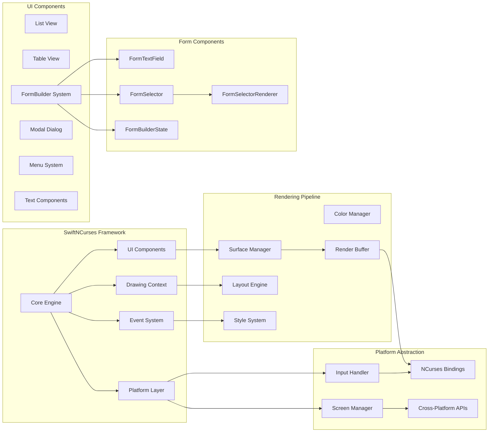
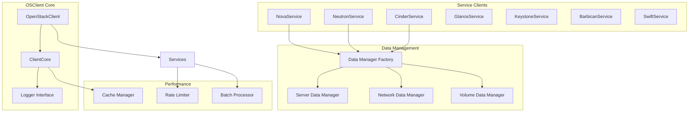
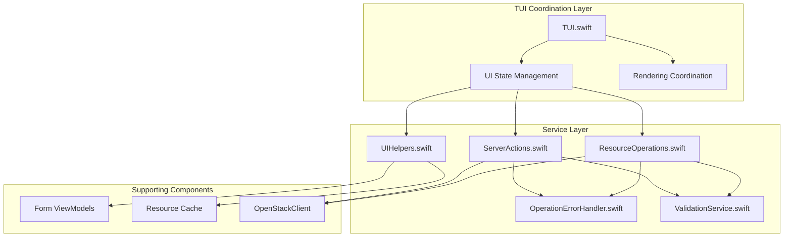
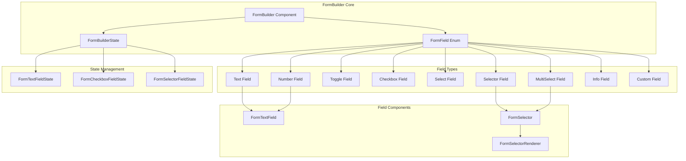
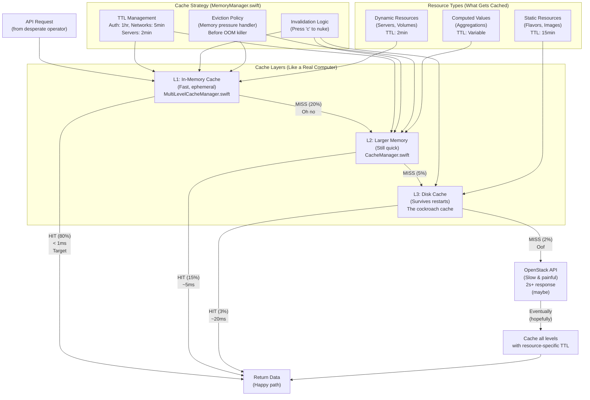
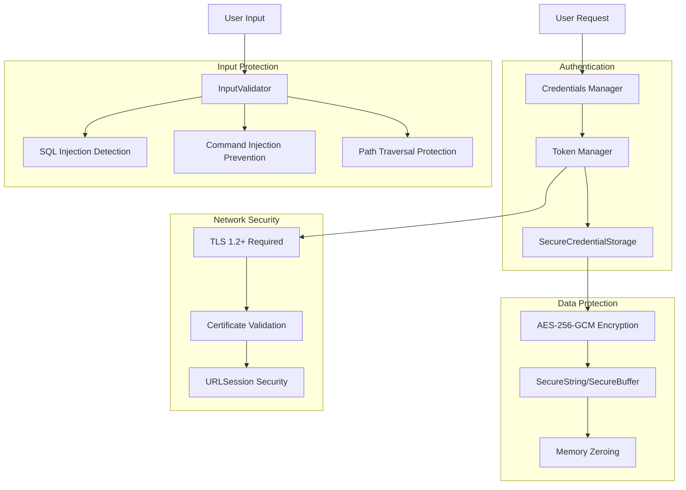

# Component Architecture

This document provides a detailed view of Substation's component architecture, including the Terminal UI layer, service layer, and form building system.

## Terminal UI Layer (SwiftNCurses)

The custom-built SwiftNCurses framework provides a cross-platform terminal UI abstraction:



### SwiftNCurses Components

| Component | Purpose | Key Features |
|-----------|---------|--------------|
| **Rendering Core** | Central rendering engine | 60fps target, double buffering, efficient updates |
| **List View** | Scrollable resource lists | Virtual scrolling, search, selection |
| **Table View** | Multi-column data display | Sortable columns, dynamic width, alignment |
| **FormBuilder** | Declarative form creation | Type-safe fields, validation, consistent styling |
| **Modal Dialog** | Popup dialogs | Confirmations, alerts, progress indicators |
| **Menu System** | Navigation menus | Keyboard shortcuts, context-aware help |
| **Text Components** | Rich text rendering | Colors, styles, wrapping, truncation |

### Rendering Pipeline

The rendering pipeline is optimized for performance:

1. **Layout Engine** - Calculate component positions and sizes
2. **Style System** - Apply colors, attributes, themes
3. **Render Buffer** - Accumulate changes in memory
4. **Surface Manager** - Coordinate screen updates
5. **NCurses Bindings** - Push to terminal (only changed cells)

**Performance Characteristics:**

- Target: 16.7ms/frame (60fps)
- Typical: 5-10ms/frame
- Only changed cells are redrawn (differential rendering)
- Double buffering prevents flicker

## OSClient Service Layer

The service layer architecture provides OpenStack API integration:



### OpenStack Service Clients

| Service | Purpose | Key Operations |
|---------|---------|----------------|
| **NovaService** | Compute (servers) | List, create, delete, start, stop, resize, snapshot |
| **NeutronService** | Network | Networks, subnets, ports, routers, floating IPs, security groups |
| **CinderService** | Block storage | Volumes, snapshots, backups, volume types |
| **GlanceService** | Image service | Images, snapshots, image upload/download |
| **KeystoneService** | Identity | Users, projects, roles, domains, tokens |
| **BarbicanService** | Secrets | Secrets, certificates, containers |
| **SwiftService** | Object storage | Containers, objects, account metadata |

### Data Manager Pattern

Each service uses a data manager for CRUD operations:

```swift
// Example: Server Data Manager
protocol ServerDataManager {
    func list() async throws -> [Server]
    func get(id: String) async throws -> Server
    func create(request: CreateServerRequest) async throws -> Server
    func delete(id: String) async throws
    func update(id: String, request: UpdateServerRequest) async throws -> Server
}

// Implemented by NovaService
extension NovaService: ServerDataManager {
    // Implementation with caching, retry logic, error handling
}
```

## Substation Service Layer



### Service Layer Components

| Component | Purpose | Key Responsibilities |
|-----------|---------|---------------------|
| `ResourceOperations.swift` | CRUD operations for all resources | Create servers, networks, volumes, security groups, floating IPs, routers, subnets, ports, keypairs, images, server groups |
| `ServerActions.swift` | Server-specific actions | Start, stop, restart, pause, resume, suspend, shelve, resize, snapshot, console logs, volume attach/detach |
| `UIHelpers.swift` | UI utility methods | Resource formatting, display helpers, status rendering, list management |
| `OperationErrorHandler.swift` | Simplified error handling | Wraps EnhancedErrorHandler for consistent error messaging across services |
| `ValidationService.swift` | Input validation rules | Resource selection validation, view state validation, reusable validation patterns |

## FormBuilder Component Architecture

The FormBuilder system provides a unified, declarative API for creating forms across all OpenStack services. Introduced in the September 2025 restructuring, it consolidates form creation patterns and eliminates boilerplate.



### FormBuilder Component Responsibilities

| Component | Purpose | Key Features |
|-----------|---------|--------------|
| `FormBuilder` | Main form rendering component | Unified API, validation display, consistent styling |
| `FormBuilderState` | State management for forms | Navigation, activation, input handling, validation |
| `FormTextField` | Text/number input component | Cursor control, history, inline validation |
| `FormSelector` | Multi-column selection component | Search, scrolling, single/multi-select |
| `FormSelectorRenderer` | Type-safe selector rendering | Works around Swift generic limitations with existential types |

### Field Types

The FormBuilder supports 9 field types:

1. **Text** - Single-line text input

   ```swift
   .text(label: "Server Name", value: binding, placeholder: "web-01")
   ```

2. **Number** - Numeric input with validation

   ```swift
   .number(label: "Port", value: binding, min: 1, max: 65535)
   ```

3. **Toggle** - Boolean on/off switch

   ```swift
   .toggle(label: "Enable Monitoring", value: binding)
   ```

4. **Checkbox** - Boolean checkbox with label

   ```swift
   .checkbox(label: "Auto-assign IP", value: binding)
   ```

5. **Select** - Drop-down selection from list

   ```swift
   .select(label: "Protocol", options: ["TCP", "UDP"], selected: binding)
   ```

6. **Selector** - Multi-column resource selector

   ```swift
   .selector(label: "Flavor", items: flavors, selected: binding, columns: 3)
   ```

7. **MultiSelect** - Multiple selection from list

   ```swift
   .multiSelect(label: "Networks", items: networks, selected: binding)
   ```

8. **Info** - Read-only informational text

   ```swift
   .info(label: "Project ID", value: projectId)
   ```

9. **Custom** - Custom rendering for special cases

   ```swift
   .custom { context in
       // Custom rendering logic
   }
   ```

### Type-Safe Selector Rendering

The FormSelectorRenderer solves Swift's limitation with existential types (`[any FormSelectorItem]`). When FormBuilder stores items as protocol types, Swift loses the concrete type information needed for FormSelector's generic parameter.

**The Problem:**

```swift
// This doesn't work - Swift can't infer T from [any FormSelectorItem]
FormSelector<T>(items: field.items, ...)  // Error: Cannot infer T
```

**The Solution:**

```swift
// FormSelectorRenderer attempts to cast to known types
if let images = items as? [Image] {
    return FormSelector<Image>(items: images, ...)
} else if let volumes = items as? [Volume] {
    return FormSelector<Volume>(items: volumes, ...)
} else if let flavors = items as? [Flavor] {
    return FormSelector<Flavor>(items: flavors, ...)
}
// ... etc for 15+ resource types
```

**Benefits:**

1. Preserves type safety throughout the rendering pipeline
2. Enables type-specific rendering (different columns for different resources)
3. Supports 15+ OpenStack resource types out of the box
4. Extensible - easy to add new resource types

### FormBuilder Architecture Benefits

- **Consistency** - Single API for all form field types across the application
- **Type Safety** - FormSelectorRenderer preserves OpenStack resource types through generics
- **Maintainability** - Centralized state management eliminates scattered state logic
- **Extensibility** - Easy to add new field types without modifying existing code
- **Developer Experience** - Declarative API is intuitive and reduces boilerplate

### Example: Creating a Server Form

```swift
FormBuilder(state: createServerFormState, fields: [
    .text(
        label: "Name",
        value: $serverName,
        placeholder: "web-server-01",
        validation: .required
    ),
    .selector(
        label: "Flavor",
        items: availableFlavors,
        selected: $selectedFlavor,
        columns: 3,
        validation: .required
    ),
    .selector(
        label: "Image",
        items: availableImages,
        selected: $selectedImage,
        columns: 2,
        validation: .required
    ),
    .multiSelect(
        label: "Networks",
        items: availableNetworks,
        selected: $selectedNetworks,
        validation: .minCount(1)
    ),
    .toggle(
        label: "Auto-assign Floating IP",
        value: $autoAssignIP
    )
])
```

This creates a fully functional, type-safe form with:

- Text input for server name
- Flavor selection with 3-column layout
- Image selection with 2-column layout
- Network multi-selection
- Toggle for floating IP assignment
- Built-in validation
- Consistent keyboard navigation

## Caching Architecture (MemoryKit)

The multi-layer caching system reduces API calls by 60-80%:



### Cache Hit Statistics (Real-World Usage)

- **L1 Cache Hit**: 80% of requests (< 1ms response)
- **L2 Cache Hit**: 15% of requests (~5ms response)
- **L3 Cache Hit**: 3% of requests (~20ms response)
- **API Call Required**: 2% of requests (2s+ response, or timeout)

**Total Cache Hit Rate**: 98% (your API will thank you)

### MemoryKit Components

| Component | Purpose | Location |
|-----------|---------|----------|
| `MultiLevelCacheManager.swift` | L1/L2/L3 hierarchy orchestration | Main cache engine |
| `CacheManager.swift` | Primary cache with TTL management | Core caching logic |
| `MemoryManager.swift` | Memory pressure detection | Eviction before OOM |
| `TypedCacheManager.swift` | Type-safe cache operations | Because we're not savages |
| `PerformanceMonitor.swift` | Real-time metrics tracking | Cache hit rate monitoring |
| `MemoryKit.swift` | Public API surface | What you actually call |
| `MemoryKitLogger.swift` | Structured logging | Debug cache behavior |
| `ComprehensiveMetrics.swift` | Metrics aggregation | Performance stats |

## Security Architecture



### Security Features

See [Security Documentation](../concepts/security.md) for full details:

- AES-256-GCM encryption for all credentials
- Certificate validation on all platforms (no bypasses)
- Comprehensive input validation (SQL/Command/Path injection prevention)
- Memory-safe SecureString and SecureBuffer with automatic zeroing

## Related Documentation

For more detailed information:

- **[Architecture Overview](./overview.md)** - High-level design principles
- **[Technology Stack](./technology-stack.md)** - Core technologies and dependencies
- **[FormBuilder Guide](../reference/developers/formbuilder-guide.md)** - Developer guide for FormBuilder
- **[Performance](../performance/index.md)** - Performance architecture and benchmarking
- **[Security](../concepts/security.md)** - Security implementation details
