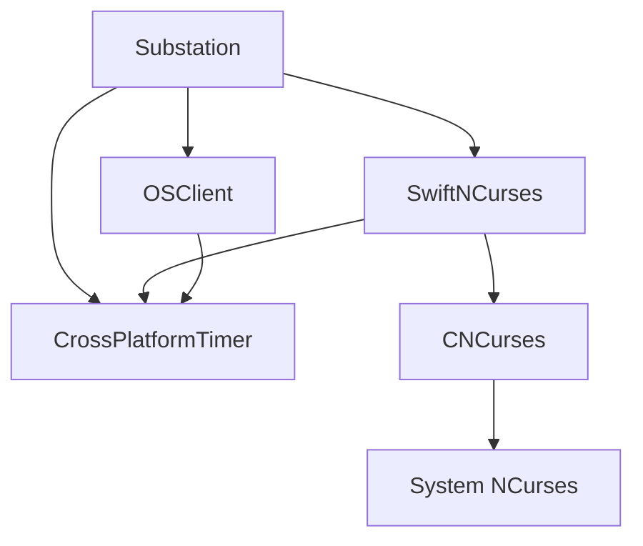
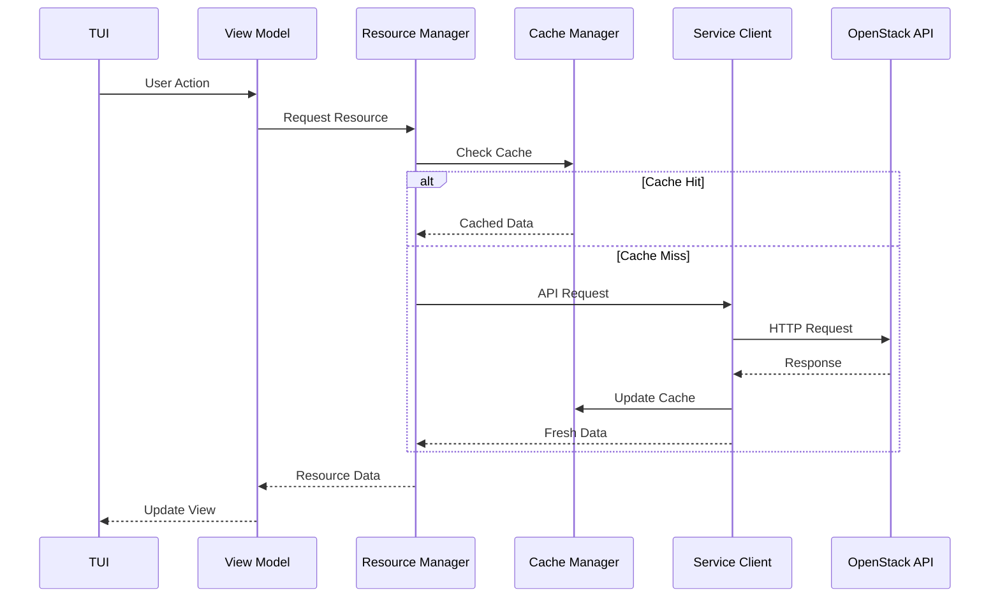

# Architecture

Substation is built with a modular, layered architecture that emphasizes performance, reliability, and maintainability. This section provides the architectural philosophy and design decisions behind the system.

**Or**: How we built a terminal app that doesn't suck, using Swift.

## Architecture Overview

The [Architecture Overview](./overview.md) covers everything you need to understand Substation's design:

- **Design Principles** - Performance first, modular architecture, security first, reliability
- **Module System** - OpenStackModule protocol, lifecycle, dependencies
- **Package Architecture** - Substation, SwiftNCurses, OSClient, MemoryKit, CrossPlatformTimer
- **Concurrency Model** - Actor-based design, Swift 6 strict concurrency
- **Data Flow** - Request routing, caching, error handling

**Read this** to understand the big picture and architectural philosophy.

## Quick Reference

### Key Architectural Concepts

**Performance:**

- Designed for up to 60-80% API call reduction through intelligent caching
- Multi-level cache (L1/L2/L3) targeting 98% hit rate
- Actor-based concurrency (zero race conditions)
- Design target: < 200MB memory for 10K+ resources

**Modularity:**

- 4 independent packages (Substation, SwiftNCurses, OSClient, CrossPlatformTimer)
- 1 external dependency (swift-crypto for AES-256-GCM)
- Protocol-oriented design (extensible through protocols)
- Clear separation of concerns (UI, business logic, services)

**Security:**

- AES-256-GCM encryption for credentials
- Certificate validation on all platforms
- Comprehensive input validation (SQL/Command/Path injection prevention)
- Memory-safe SecureString/SecureBuffer with automatic zeroing

**Reliability:**

- Exponential backoff retry logic (3 attempts)
- Real-time health monitoring and telemetry
- Cache fallback when API is down
- Type-safe error handling (no exceptions)

### Architecture Diagrams

**Package Dependencies:**

**Request Flow:**

## Detailed Reference Documentation

For implementation details, see the API and framework reference:

### API Reference

- **[SwiftNCurses](../reference/api/SwiftNCurses.md)** - Terminal UI framework API
- **[OSClient](../reference/api/osclient.md)** - OpenStack client library API
- **[MemoryKit](../reference/api/memorykit.md)** - Multi-level caching system API
- **[CrossPlatformTimer](../reference/api/crossplatformtimer.md)** - Timer abstraction API

### Framework Reference

- **[Module System](../reference/framework/module-system.md)** - Module architecture and protocols
- **[Security](../reference/framework/security.md)** - Security implementation details
- **[Search System](../reference/framework/search-system.md)** - Navigation and search architecture
- **[Cache Manager](../reference/framework/cache-manager.md)** - Resource caching interface

### Developer Guides

- **[FormBuilder Guide](../reference/developers/formbuilder-guide.md)** - Building forms with FormBuilder
- **[Module Development](../reference/developers/module-development-guide.md)** - Creating new modules

## Related Documentation

- **[Performance](../performance/index.md)** - Performance architecture and benchmarking
- **[OpenStack Integration](../reference/openstack/index.md)** - API patterns and service integration
- **[Installation](../installation/index.md)** - Platform-specific installation instructions

---

**Note**: This architecture documentation is based on the actual implementation in `Sources/` and reflects the current modular package design. All components and services mentioned are implemented, tested, and functional across macOS and Linux platforms.
