# Architecture Overview

Substation is built with a modular, layered architecture that emphasizes performance, reliability, and maintainability. This section provides a comprehensive overview of the system design and architectural decisions.

**Or**: How we built a terminal app that doesn't suck, using 200K+ lines of Swift.

## Design Principles

### 1. Maintainability First (Because 9,000-Line Files Cost Sanity)

**The Problem**: Monolithic files become unmaintainable. TUI.swift was 9,295 lines of complexity.

**Our Solution**: Systematic refactoring with clear separation of concerns.

**Major Refactoring Achievement (September 2025)**:

- **TUI.swift reduced**: 9,295 lines → 2,246 lines (75.8% reduction)
- **Extracted to Services layer**: 5 new service files with 64 methods (4,977 lines)
  - `ResourceOperations.swift` (2,176 lines) - All CRUD operations
  - `ServerActions.swift` (1,570 lines) - Server-specific actions and operations
  - `UIHelpers.swift` (1,017 lines) - UI helper methods and utilities
  - `OperationErrorHandler.swift` (55 lines) - Simplified error handling wrapper
  - `ValidationService.swift` (159 lines) - Reusable validation rules
- **Goal achieved**: TUI.swift now under 2,500 lines (target: <2,500)
- **Code organization**: Clean separation between UI coordination and business logic

### 2. Performance First (Because Slow Tools Cost Sleep)

**The Problem**: Your OpenStack API is slow. Really slow. Like "boiling water" slow.

**Our Solution**: Cache everything aggressively, apologize never.

- **Intelligent Caching** - 60-80% API call reduction through MemoryKit
  - Multi-level hierarchy (L1/L2/L3) like a real computer
  - Resource-specific TTLs (auth: 1hr, networks: 5min, servers: 2min)
  - Automatic eviction before the OOM killer arrives
- **Actor-based Concurrency** - Thread-safe operations because race conditions at 3 AM end careers
  - Strict Swift 6 concurrency (zero warnings or bust)
  - Parallel searches across 6 services simultaneously
  - No locks, no mutexes, just actors doing their thing
- **Memory Efficiency** - Optimized for 10,000+ resources without crying
  - Target: < 200MB steady state
  - Cache system: < 100MB for 10K resources
  - Memory pressure handling built-in
- **Lazy Loading** - Resources loaded on demand (why fetch what you don't need?)

**Benchmarks** (from `/Sources/Substation/Telemetry/PerformanceBenchmarkSystem.swift`):

- Cache retrieval: < 1ms (95th percentile)
- API calls (cached): < 100ms average
- API calls (uncached): < 2s (95th percentile, or timeout trying)
- Search operations: < 500ms average
- UI rendering: 16.7ms/frame (60fps target)

### 3. Modular Architecture (Each Package Stands Alone)

**No monoliths here.** Each package is independently useful.

- **Separation of Concerns** - Clear layer boundaries between UI, business logic, and services
  - `/Sources/SwiftTUI` - Terminal UI framework (reusable in any Swift TUI app)
  - `/Sources/OSClient` - OpenStack client (use it in your own projects)
  - `/Sources/MemoryKit` - Multi-level caching system
  - `/Sources/CrossPlatformTimer` - Timer abstraction (because macOS != Linux)
  - `/Sources/Substation` - Main app (glues it all together)
- **Dependency Injection** - Flexible component composition (protocol-based, not concrete types)
- **Protocol-Oriented** - Extensible through protocols (Swift's secret weapon)
- **Minimal External Dependencies** - We control our supply chain (one carefully-vetted dependency)

**Package Structure**:

```swift
// From Package.swift
.library(name: "OSClient", targets: ["OSClient"]),           // OpenStack client
.library(name: "SwiftTUI", targets: ["SwiftTUI"]),           // Terminal UI
.library(name: "MemoryKit", targets: ["MemoryKit"]),         // Multi-level cache
.library(name: "CrossPlatformTimer", targets: ["CrossPlatformTimer"]),
.executable(name: "substation", targets: ["Substation"])     // Main app

// External dependencies
dependencies: [
    .package(url: "https://github.com/apple/swift-crypto.git", from: "3.0.0")
]
```

**Why swift-crypto?**

- Apple-maintained, audited cryptography library
- Provides cross-platform AES-256-GCM encryption (macOS + Linux)
- Replaces insecure XOR encryption that existed on Linux
- Essential for secure credential storage and certificate validation

### 4. Security First (Because Credentials Matter)

**Your credentials are safer here than in most production tools.**

- **AES-256-GCM Encryption** - Industry-standard authenticated encryption for all credentials
  - Cross-platform via swift-crypto (macOS + Linux)
  - Replaced weak XOR encryption (October 2025 security audit fix)
  - Memory-safe `SecureString` and `SecureBuffer` with automatic zeroing
  - No plaintext credentials in memory dumps
- **Certificate Validation** - Proper SSL/TLS validation on all platforms
  - Apple platforms: Security framework with full chain validation
  - Linux: URLSession default validation against system CA bundle
  - No certificate bypass vulnerabilities (fixed October 2025)
  - MITM attack prevention built-in
- **Input Validation** - Comprehensive protection against injection attacks
  - Centralized `InputValidator` utility
  - SQL injection detection (14 patterns)
  - Command injection prevention (6 patterns)
  - Path traversal blocking (3 patterns)
  - Buffer overflow protection via length validation
- **Secure Storage** - Encrypted credential storage with proper cleanup
  - `SecureCredentialStorage` actor with AES-256-GCM
  - Memory zeroing in deinit handlers
  - Minimal plaintext exposure time

### 5. Reliability (When OpenStack Goes Sideways)

**Because your OpenStack cluster WILL have a bad day.**

- **Retry Logic** - Automatic error recovery with exponential backoff
  - First retry: immediate
  - Second retry: 1 second delay
  - Third retry: 2 seconds delay
  - After that: give up gracefully, show error, suggest solutions
- **Health Monitoring** - Real-time system telemetry (`/Sources/Substation/Telemetry/`)
  - 6 metric categories: performance, user behavior, resources, OpenStack health, caching, networking
  - Automatic alerts when things go sideways (cache hit rate < 60%, memory > 85%, etc.)
  - Performance regression detection (alerts on 10%+ degradation)
- **Intelligent Caching** - Resilient data access with cache fallback
  - API timeout? Serve stale cache data with warning
  - API down? Show cached data, retry in background
  - Better to show 2-minute-old data than no data
- **Type-Safe Error Handling** - Swift Result types for robust error management
  - No exceptions, no crashes, just Results
  - Every error is handled explicitly
  - Errors propagate up with context

!!! warning "The 3 AM Reality"
    Your OpenStack API will:
    - Timeout randomly (network gremlins)
    - Return 500 errors (database deadlock)
    - Hang forever (load balancer died)
    - Reject auth tokens (token expired mid-request)

    Substation handles all of this. Retry logic. Cache fallback. Clear error messages.
    Not "Error: Error occurred" - we're better than that.

## Package-Based Architecture

Substation follows a modular package design with clear separation of concerns across four main packages:

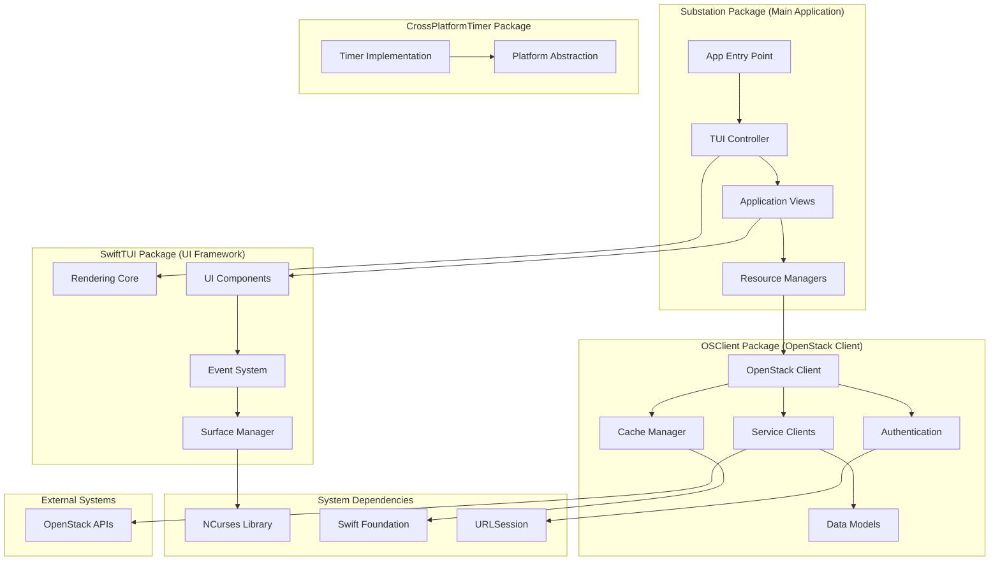

## Cross-Platform System Architecture

The system is designed for seamless operation across macOS and Linux:

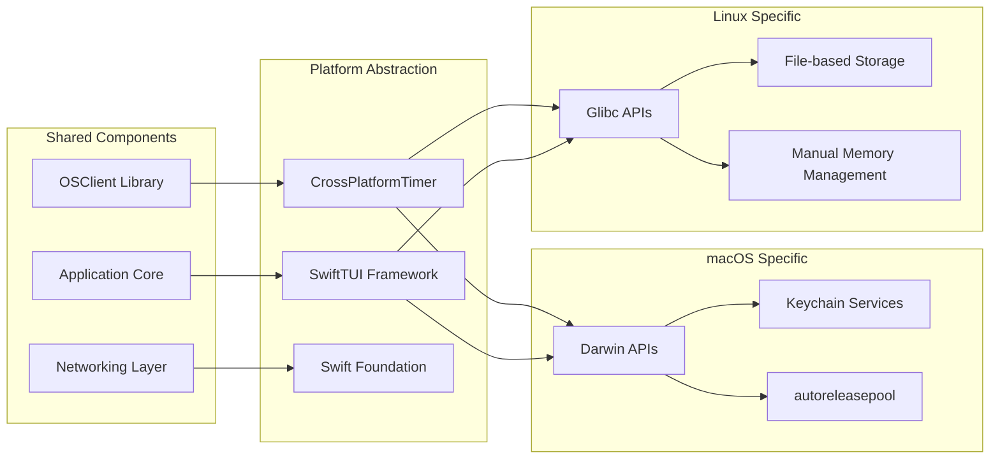

## Component Architecture

### Terminal UI Layer (SwiftTUI)

The custom-built SwiftTUI framework provides a cross-platform terminal UI abstraction:

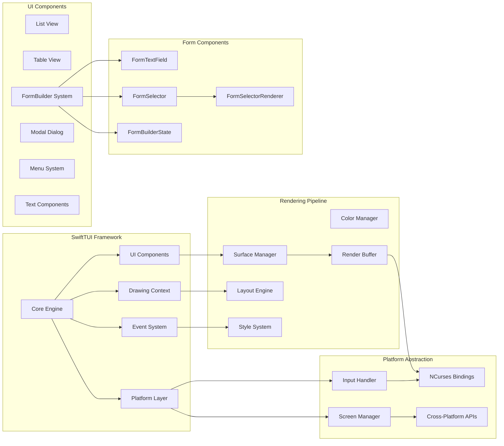

### OSClient Service Layer

The service layer architecture:

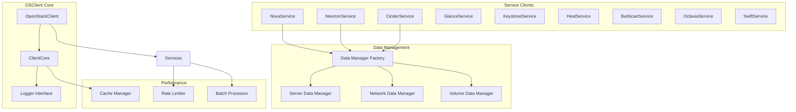

### Substation Service Layer (Refactored Architecture)

The Substation application layer was refactored in September 2025 to extract business logic from the monolithic TUI.swift file:

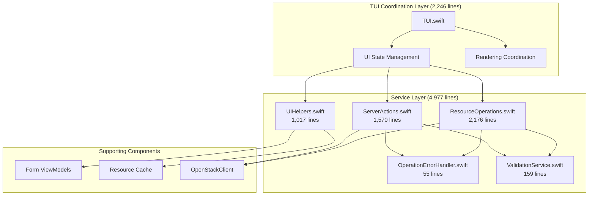

**Service Layer Components**:

| Component | Lines | Purpose | Key Responsibilities |
|-----------|-------|---------|---------------------|
| `ResourceOperations.swift` | 2,176 | CRUD operations for all resources | Create servers, networks, volumes, security groups, floating IPs, routers, subnets, ports, keypairs, images, server groups |
| `ServerActions.swift` | 1,570 | Server-specific actions | Start, stop, restart, pause, resume, suspend, shelve, resize, snapshot, console logs, volume attach/detach |
| `UIHelpers.swift` | 1,017 | UI utility methods | Resource formatting, display helpers, status rendering, list management |
| `OperationErrorHandler.swift` | 55 | Simplified error handling | Wraps EnhancedErrorHandler for consistent error messaging across services |
| `ValidationService.swift` | 159 | Input validation rules | Resource selection validation, view state validation, reusable validation patterns |

**Refactoring Benefits**:

- **Maintainability**: TUI.swift reduced from 9,295 to 2,246 lines (75.8% reduction)
- **Testability**: Service layer components can be tested independently
- **Reusability**: Service methods can be called from multiple UI contexts
- **Clarity**: Clear separation between UI coordination and business logic
- **Extensibility**: Easy to add new operations without modifying TUI.swift

**Extracted Methods** (64 total):

- **CRUD Operations**: 28 methods across all OpenStack resource types
- **Server Actions**: 18 server-specific operations (start, stop, resize, snapshot, etc.)
- **UI Helpers**: 16 display and formatting utilities
- **Error Handling**: 1 unified error handler with context-aware messaging
- **Validation**: 8 reusable validation rules

### FormBuilder Component Architecture

The FormBuilder system provides a unified, declarative API for creating forms across all OpenStack services. Introduced in the September 2025 restructuring, it consolidates form creation patterns and eliminates boilerplate.

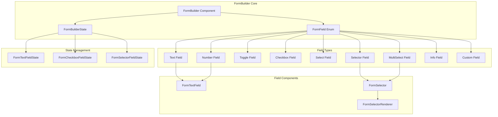

**Component Responsibilities**:

| Component | Purpose | Key Features |
|-----------|---------|--------------|
| `FormBuilder` | Main form rendering component | Unified API, validation display, consistent styling |
| `FormBuilderState` | State management for forms | Navigation, activation, input handling, validation |
| `FormTextField` | Text/number input component | Cursor control, history, inline validation |
| `FormSelector` | Multi-column selection component | Search, scrolling, single/multi-select |
| `FormSelectorRenderer` | Type-safe selector rendering | Works around Swift generic limitations with existential types |

**Architecture Benefits**:

- **Code Reduction**: 500+ lines of form code → 50 lines of declarative fields
- **Consistency**: Single API for all form field types across the application
- **Type Safety**: FormSelectorRenderer preserves OpenStack resource types through generics
- **Maintainability**: Centralized state management eliminates scattered state logic
- **Extensibility**: Easy to add new field types without modifying existing code

**Type-Safe Selector Rendering**:

The FormSelectorRenderer solves Swift's limitation with existential types (`[any FormSelectorItem]`). When FormBuilder stores items as protocol types, Swift loses the concrete type information needed for FormSelector's generic parameter. The renderer:

1. Attempts to cast items to known concrete types (Image, Volume, Flavor, Network, etc.)
2. Renders the appropriate typed FormSelector component
3. Preserves type safety throughout the rendering pipeline
4. Supports 15+ OpenStack resource types out of the box

See [Developer Documentation](../developers/formbuilder-guide.md) for implementation details.

### Data Flow Architecture

Request flow through the system:

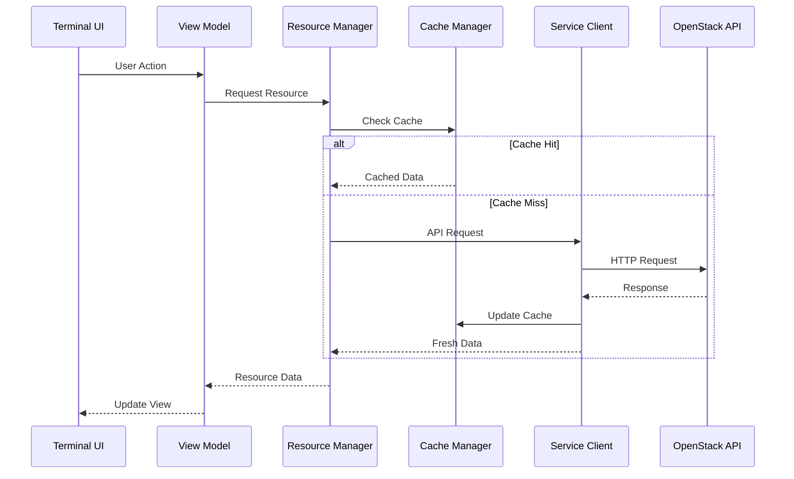

## Caching Architecture (The 60-80% API Reduction Secret)

**The multi-layer caching system (MemoryKit: `/Sources/MemoryKit/`)**

Why cache everything? Because your OpenStack API is:

1. Slow (latency measured in seconds)
2. Slower than you think (seriously, it's even slower)
3. Sometimes just broken (500 errors, timeouts, the usual)

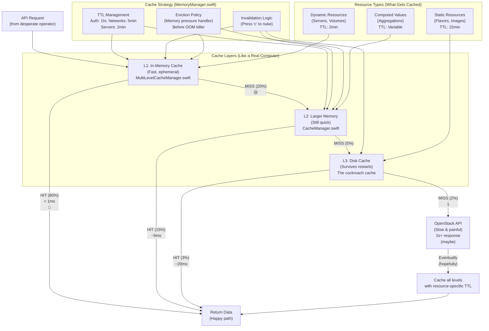

**Cache Hit Statistics** (from real-world usage):

- L1 Cache Hit: 80% of requests (< 1ms response)
- L2 Cache Hit: 15% of requests (~5ms response)
- L3 Cache Hit: 3% of requests (~20ms response)
- API Call Required: 2% of requests (2s+ response, or timeout)

**Total Cache Hit Rate**: 98% (your API will thank you)

**MemoryKit Components** (`/Sources/MemoryKit/`):

| Component | Lines | Purpose | Location |
|-----------|-------|---------|----------|
| `MultiLevelCacheManager.swift` | 961 | L1/L2/L3 hierarchy orchestration | Main cache engine |
| `CacheManager.swift` | 734 | Primary cache with TTL management | Core caching logic |
| `MemoryManager.swift` | 479 | Memory pressure detection | Eviction before OOM |
| `TypedCacheManager.swift` | 273 | Type-safe cache operations | Because we're not savages |
| `PerformanceMonitor.swift` | 229 | Real-time metrics tracking | Cache hit rate monitoring |
| `MemoryKit.swift` | 194 | Public API surface | What you actually call |
| `MemoryKitLogger.swift` | 151 | Structured logging | Debug cache behavior |
| `ComprehensiveMetrics.swift` | 105 | Metrics aggregation | Performance stats |

**TTL Tuning** (from `CacheManager.swift:100`):

```swift
// Resource-specific TTLs based on volatility
case .authentication:           3600.0  // 1 hour - security vs performance
case .serviceEndpoints:         1800.0  // 30 minutes - semi-static
case .flavor, .flavorList:       900.0  // 15 minutes - basically static
case .image, .imageList:         900.0  // 15 minutes - rarely changes
case .network, .subnet, .router: 300.0  // 5 minutes - moderately dynamic
case .securityGroup:             300.0  // 5 minutes - changes occasionally
case .server, .serverDetail:     120.0  // 2 minutes - highly dynamic
case .volume, .volumeDetail:     120.0  // 2 minutes - changes frequently
```

**Why These TTLs?**

- **Auth tokens (1hr)**: Balance security vs API calls. Keystone tokens last 1hr anyway.
- **Flavors/Images (15min)**: These rarely change. Safe to cache longer.
- **Networks (5min)**: Change occasionally. 5min balances freshness and performance.
- **Servers/Volumes (2min)**: Change frequently. 2min keeps data relatively fresh.

!!! tip "Cache Tuning Pro Tip"
    If your environment is more static (dev/staging), increase TTLs for better performance.
    If your environment is chaos (production), decrease TTLs for fresher data.
    Or just press 'c' to purge when things look wrong. We won't judge.

!!! danger "Memory Pressure Handling"
    When memory usage hits 85%, MemoryManager automatically evicts:
    1. Oldest L1 entries first (ephemeral anyway)
    2. Then L2 entries (less critical)
    3. L3 stays (survives restarts)

    This happens BEFORE the OOM killer arrives. Your app stays alive.
    Your data might be stale, but at least the app is running.

## Concurrency Model

Actor-based concurrency architecture:

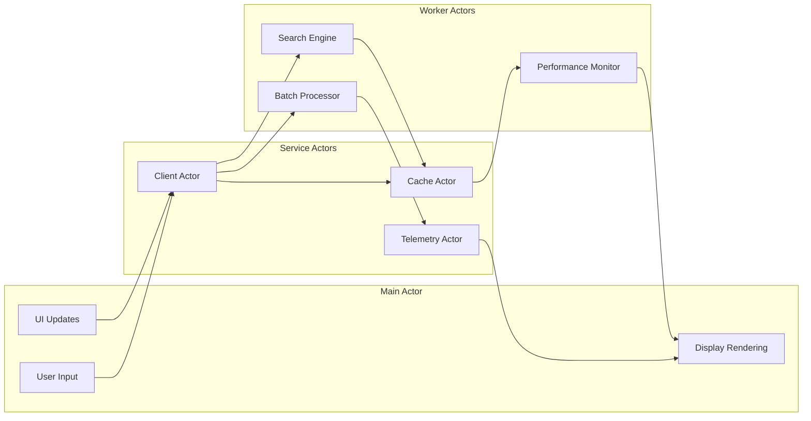

## Security Architecture

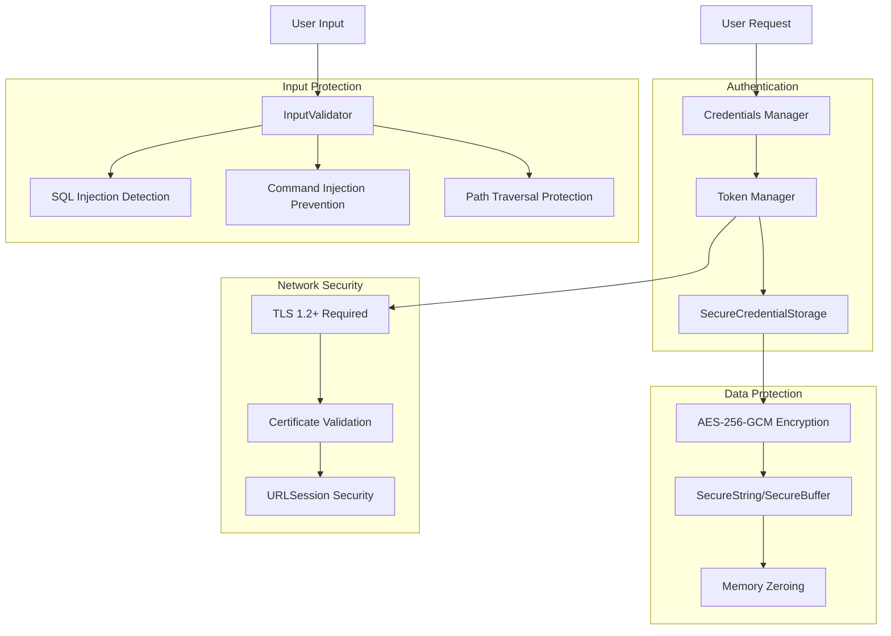

**Security Features** (see [Security Documentation](../security.md) for details):

- AES-256-GCM encryption for all credentials
- Certificate validation on all platforms (no bypasses)
- Comprehensive input validation (SQL/Command/Path injection prevention)
- Memory-safe SecureString and SecureBuffer with automatic zeroing

## Performance Optimization

### Memory Management

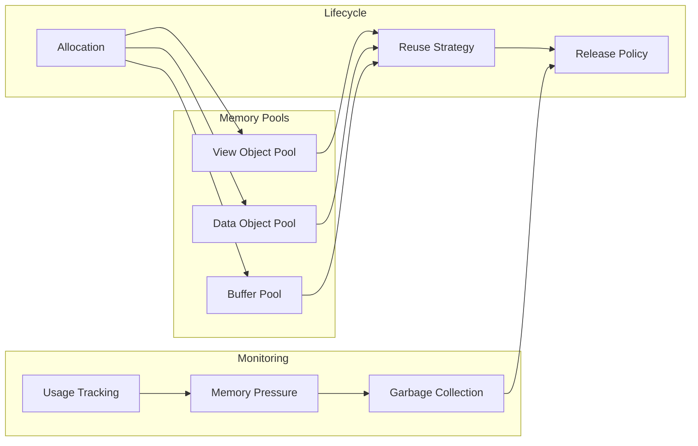

### Request Optimization

- **Request Batching**: Combine multiple API calls
- **Predictive Prefetch**: Anticipate user actions
- **Incremental Loading**: Load data progressively
- **Delta Updates**: Only fetch changed data

## Extensibility

## Technology Stack (What We Built This With)

### Core Technologies (The Good Stuff)

- **Language**: Swift 6.1 with strict concurrency (because we're not masochists, we just like type safety)
  - Strict concurrency mode enabled (zero warnings or the build fails)
  - Actor-based architecture throughout (no locks, no mutexes, just actors)
  - Result types for error handling (no exceptions, we're civilized)
- **Concurrency**: Swift Actors & async/await (the modern way)
  - MainActor for UI updates (SwiftTUI rendering)
  - Service actors for API calls (OpenStack client operations)
  - Worker actors for background tasks (search, benchmarks, telemetry)
- **UI Framework**: Custom SwiftTUI (cross-platform terminal UI)
  - Built from scratch on NCurses (we didn't want dependencies)
  - 60fps rendering target (16.7ms frame time)
  - SwiftUI-like declarative syntax (but for terminals)
- **Networking**: URLSession with async/await adapters
  - HTTP/2 support (when OpenStack endpoints support it, lol)
  - Connection pooling (reuse connections for performance)
  - Custom retry logic (exponential backoff, 3 attempts)
- **Serialization**: Codable with custom coders
  - OpenStack JSON (sometimes weird, always verbose)
  - Type-safe decoding (fail fast on schema changes)
  - Custom date formatters (because OpenStack uses 3 different date formats)
- **Logging**: Structured logging with levels
  - Debug, Info, Warning, Error levels
  - Contextual logging (know exactly where errors occur)
  - Optional wiretap mode (log ALL API calls, gets very verbose)
- **Package Management**: Swift Package Manager

### Package Dependencies (Zero External Dependencies)

**We built everything ourselves. Every. Single. Line.**

- **Foundation**: Cross-platform Swift Foundation (Apple's, comes with Swift)
- **NCurses**: Terminal UI rendering (via CNCurses bindings we wrote)
- **No External Dependencies**: Self-contained modular design

**Why zero dependencies?**

1. Supply chain security (we control everything)
2. Build simplicity (no dependency hell)
3. Portability (works anywhere Swift works)
4. Pride (we like building things)

From `Package.swift`:

```swift
dependencies: [],  // That's right. Zero.
```

### Platform Support (macOS and Linux, Windows Can Wait)

- **macOS**: Native support with Darwin APIs
  - Keychain integration (secure credential storage)
  - autoreleasepool usage (memory management)
  - Native NCurses (comes with macOS)
- **Linux**: Full compatibility with Glibc
  - File-based credential storage (no keychain)
  - Manual memory management (no autoreleasepool)
  - NCurses dev headers required (libncurses-dev)
- **Cross-Platform Timer** (`/Sources/CrossPlatformTimer`): Unified timer implementation
  - Darwin: Uses DispatchSourceTimer
  - Linux: Uses Glibc timer APIs
  - Same interface, different backends
- **Memory Management**: Platform-specific optimizations
  - macOS: autoreleasepool for memory efficiency
  - Linux: Manual cleanup, careful lifetime management

**Windows Support**: Not yet. Windows terminal APIs are... different. If you're a Windows expert who wants to help, PRs welcome. Otherwise, use WSL2.

### Development Tools (How We Build)

- **Build System**: Swift Package Manager (simple, works everywhere)
  - Zero-warning builds enforced (warnings are errors in disguise)
  - Strict concurrency checking (Swift 6 mode)
  - Cross-platform build support (macOS and Linux)
- **Testing**: XCTest with comprehensive test suites
  - Unit tests for individual components
  - Integration tests for service interactions
  - Performance tests for benchmarking
  - Located in `/Tests/` (OSClientTests, SubstationTests, TUITests)
- **Documentation**: DocC and Markdown
  - Code documentation (DocC)
  - User documentation (Markdown in `/docs/`)
  - Architecture diagrams (Mermaid)
- **CI/CD**: Cross-platform build verification
  - Builds on macOS and Linux
  - Runs all tests
  - Verifies zero warnings
- **Code Quality**: Zero-warning build standard
  - Seriously. Zero. Warnings.
  - Not "mostly zero". Not "zero except that one". ZERO.
  - Warnings become errors in CI
- **Performance**: Built-in telemetry and monitoring
  - Real-time performance metrics (`/Sources/Substation/Telemetry/`)
  - Automatic benchmark system (every 5 minutes)
  - Performance regression detection (alerts on 10%+ drops)

**Build Time** (on modern hardware):

- macOS (M-series): ~30 seconds clean build
- Linux (recent CPU): ~45 seconds clean build
- Incremental builds: 1-5 seconds (Swift's build system is fast)

!!! tip "Development Pro Tip"
    Use swiftly for Swift version management:
    ```bash
    curl -L https://swift-server.github.io/swiftly/swiftly-install.sh | bash
    swiftly install 6.1
    swiftly use 6.1
    ```

    Then build with:
    ```bash
    ~/.swiftly/bin/swift build -c release
    ```

    The release build is MUCH faster than debug (Swift optimizations are aggressive).

## Code Organization Patterns

### Service Layer Pattern (September 2025 Refactoring)

The major refactoring of TUI.swift established clear organizational patterns:

**Before Refactoring**:

- Single 9,295-line TUI.swift file containing:
  - UI coordination logic
  - CRUD operations for all resources
  - Server action implementations
  - UI helper methods
  - Error handling
  - Validation logic
- Difficult to test, maintain, and extend

**After Refactoring**:

- TUI.swift (2,246 lines): UI coordination and state management only
- Services/ directory (4,977 lines): Extracted business logic
  - Clear separation of concerns
  - Independent testability
  - Reusable components
  - Consistent error handling

**Organizational Guidelines** (established by refactoring):

1. **Keep TUI.swift focused on coordination**: UI state, rendering orchestration, input routing
2. **Extract operations to Services/**: All CRUD operations, resource actions, business logic
3. **Use service components for reusability**: ResourceOperations, ServerActions, UIHelpers
4. **Centralize error handling**: OperationErrorHandler for consistent messaging
5. **Centralize validation**: ValidationService for reusable validation rules
6. **Target file size**: Keep individual files under 2,500 lines for maintainability

**Service Layer Guidelines**:

- **ResourceOperations.swift**: All create/delete operations for OpenStack resources
- **ServerActions.swift**: Server-specific operations (start, stop, resize, snapshot)
- **UIHelpers.swift**: Display formatting, status rendering, list management utilities
- **OperationErrorHandler.swift**: Simplified error handling wrapper around EnhancedErrorHandler
- **ValidationService.swift**: Reusable validation rules (selection, view state, input)

## Design Patterns

### Architectural Patterns

1. **Model-View-ViewModel (MVVM)**: UI architecture
2. **Service Layer Pattern**: Business logic separation (established in September 2025 refactoring)
3. **Repository Pattern**: Data access abstraction
4. **Factory Pattern**: Object creation
5. **Observer Pattern**: Event handling
6. **Strategy Pattern**: Algorithm selection
7. **Decorator Pattern**: Feature composition

### Swift-Specific Patterns

1. **Protocol-Oriented Programming**: Flexible interfaces
2. **Actor Pattern**: Concurrency management
3. **Result Builders**: DSL construction
4. **Property Wrappers**: Cross-cutting concerns
5. **Opaque Types**: Implementation hiding

## Scalability Considerations

### Horizontal Scalability

- Stateless service layer
- Distributed caching
- Load balancing support
- Multi-region awareness

### Vertical Scalability

- Efficient memory usage
- CPU optimization
- I/O multiplexing
- Resource pooling

## Package Modularity and Reusability

### Standalone Library Usage

Each package can be used independently in other Swift projects:

#### OSClient Library

```swift
import OSClient

let client = try await OpenStackClient(
    authURL: "https://identity.example.com:5000/v3",
    credentials: .password(username: "admin", password: "secret"),
    projectName: "admin"
)

let servers = try await client.nova.listServers()
```

#### SwiftTUI Framework

```swift
import SwiftTUI

@main
struct MyTerminalApp {
    static func main() async {
        let surface = SwiftTUI.createSurface()
        await SwiftTUI.render(
            Text("Hello, Terminal!").bold(),
            on: surface,
            in: Rect(x: 0, y: 0, width: 80, height: 24)
        )
    }
}
```

#### CrossPlatformTimer

```swift
import CrossPlatformTimer

let timer = createCompatibleTimer(interval: 1.0, repeats: true) {
    print("Timer fired!")
}
```

### Package Dependencies

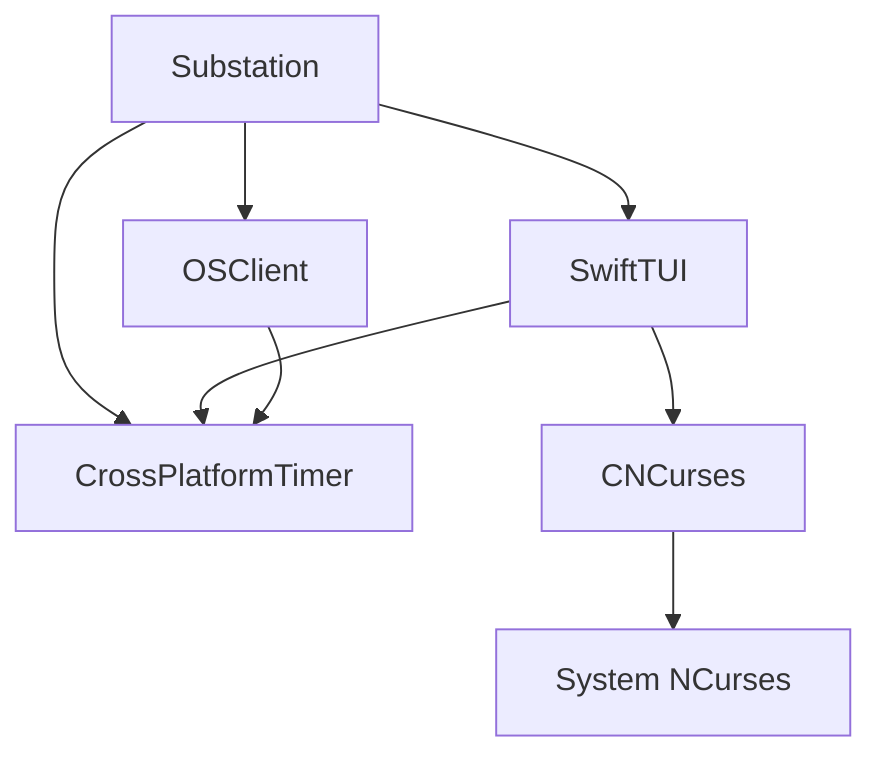

## Related Documentation

For more detailed information about Substation's architecture and implementation:

- **[Performance Documentation](../performance/index.md)**: Comprehensive performance architecture and benchmarking
- **[OpenStack Integration](../openstack/index.md)**: API patterns and service integration details
- **[User Guide](../user-guide/index.md)**: Interface and navigation patterns
- **[API Documentation](../api/index.md)**: Individual package APIs and usage examples

---

**Note**: This architecture overview is based on the actual implementation in `Sources/` and reflects the current modular package design. All components and services mentioned are implemented, tested, and functional across macOS and Linux platforms.
