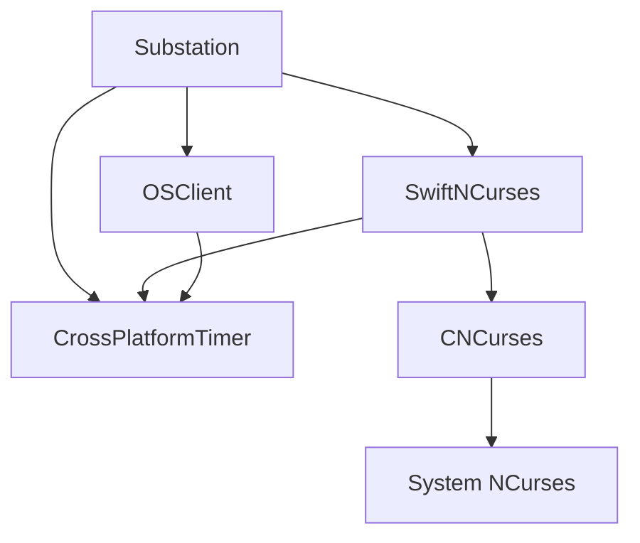
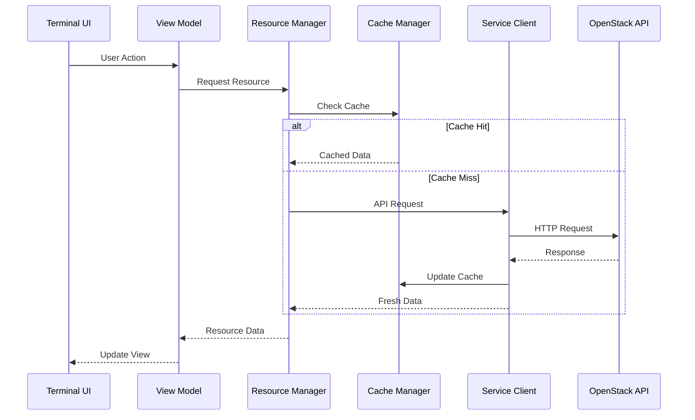

# Architecture

Substation is built with a modular, layered architecture that emphasizes performance, reliability, and maintainability. This section provides comprehensive documentation of the system design and architectural decisions.

**Or**: How we built a terminal app that doesn't suck, using Swift.

## Architecture Documentation

This section is organized into focused documents covering different aspects of the architecture:

### [Overview](./overview.md)

Design principles and high-level architecture:

- **Performance First** - Caching strategy, concurrency model, memory efficiency
- **Modular Architecture** - Package structure, dependency management
- **Security First** - Credential encryption, certificate validation, input validation
- **Reliability** - Retry logic, health monitoring, error handling
- **Package-Based Architecture** - Cross-platform design, data flow

**Read this first** to understand the big picture and architectural philosophy.

### [Components](./components.md)

Detailed component architecture and implementation:

- **Terminal UI Layer (SwiftNCurses)** - Rendering pipeline, UI components, event system
- **OSClient Service Layer** - OpenStack service clients, data managers, caching
- **Substation Service Layer** - Resource operations, server actions, UI helpers
- **FormBuilder System** - Declarative forms, field types, type-safe rendering
- **Caching Architecture (MemoryKit)** - Multi-level cache, hit rates, TTL management
- **Security Architecture** - Authentication, encryption, validation

**Read this** for implementation details and how components interact.

### [Technology Stack](./technology-stack.md)

Core technologies, dependencies, and development tools:

- **Core Technologies** - Swift 6.1, actors, async/await, SwiftNCurses, URLSession
- **Package Dependencies** - swift-crypto, Foundation, NCurses
- **Platform Support** - macOS, Linux, cross-platform abstractions
- **Development Tools** - Build system, testing, CI/CD, performance monitoring

**Read this** to understand the technology choices and platform-specific details.

## Quick Reference

### Key Architectural Concepts

**Performance:**

- Designed for up to 60-80% API call reduction through intelligent caching
- Multi-level cache (L1/L2/L3) targeting 98% hit rate
- Actor-based concurrency (zero race conditions)
- Design target: < 200MB memory for 10K+ resources

**Modularity:**

- 4 independent packages (Substation, SwiftNCurses, OSClient, CrossPlatformTimer)
- 1 external dependency (swift-crypto for AES-256-GCM)
- Protocol-oriented design (extensible through protocols)
- Clear separation of concerns (UI, business logic, services)

**Security:**

- AES-256-GCM encryption for credentials
- Certificate validation on all platforms
- Comprehensive input validation (SQL/Command/Path injection prevention)
- Memory-safe SecureString/SecureBuffer with automatic zeroing

**Reliability:**

- Exponential backoff retry logic (3 attempts)
- Real-time health monitoring and telemetry
- Cache fallback when API is down
- Type-safe error handling (no exceptions)

### Architecture Diagrams

**Package Dependencies:**

**Request Flow:**

## Related Documentation

For related architectural documentation:

- **[Performance](../performance/index.md)** - Performance architecture and benchmarking
- **[Security](../concepts/security.md)** - Security implementation details
- **[Caching](../concepts/caching.md)** - Multi-level caching architecture
- **[OpenStack Integration](../reference/openstack/index.md)** - API patterns and service integration
- **[FormBuilder Guide](../reference/developers/formbuilder-guide.md)** - Developer guide for forms

---

**Note**: This architecture documentation is based on the actual implementation in `Sources/` and reflects the current modular package design. All components and services mentioned are implemented, tested, and functional across macOS and Linux platforms.
