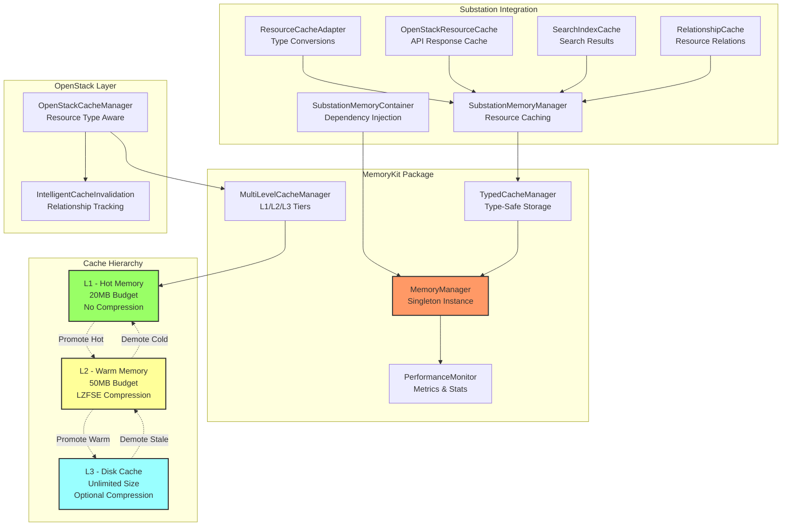

# Memory Management Architecture

## Overview

The Substation TUI application implements a sophisticated multi-tiered memory management system designed to optimize performance while maintaining a minimal memory footprint. The architecture leverages the MemoryKit package to provide intelligent caching, automatic eviction, and memory pressure monitoring for OpenStack resource management.

### Why Memory Management Matters for TUI Applications

Here's the uncomfortable truth: TUIs live in the worst of both worlds. We run on remote servers where every megabyte counts, yet we need to feel snappy like a local app. Drop the wrong 500MB JSON response into memory and watch the OOM killer come knocking. Cache nothing and watch your users wait 2 seconds for every screen refresh while they slowly lose their sanity.

We face this reality every time we build for terminal environments. Limited system resources on remote servers mean we can't just throw RAM at the problem. The need for responsive UI updates without network latency means we can't hit the API for every interaction. Managing large datasets from OpenStack APIs while maintaining state across multiple views creates a balancing act between memory pressure and performance. This is why we built a memory management system that actually gives a damn about these constraints.

### MemoryKit Integration

We've integrated MemoryKit through a layered architecture that treats memory as the precious resource it actually is. The system provides automatic memory budgeting to prevent us from consuming excessive memory and getting killed by the OOM reaper at 3 AM. We implement intelligent cache eviction that removes the least valuable data when under pressure, not just the oldest or newest. Performance monitoring tracks hit rates and optimization opportunities so we can see what's working and what's burning CPU cycles for nothing. Background maintenance handles periodic cleanup without blocking UI operations because nobody wants their TUI to freeze while we're doing housekeeping.

This isn't just about slapping a cache in front of API calls. We've designed each layer to serve a specific purpose in the memory hierarchy, from hot data that needs sub-millisecond access to cold storage that we're okay waiting 100ms to retrieve. The intelligence comes from understanding what data belongs where and when to move it between tiers.

### Memory Budget System

We operate within defined memory budgets because infinite memory is a myth perpetuated by developers who've never debugged a production incident on a 512MB container. The global budget sits at 150MB for all cache operations, which sounds generous until you realize you're managing an OpenStack cloud with thousands of resources. The L1 cache gets 20MB for hot, frequently accessed data that needs to be instantly available. L2 cache receives 50MB for compressed, warm data that we can afford to decompress on access. L3 cache uses disk-based storage for cold data that we access rarely but is expensive to re-fetch. Finally, the UI optimization cache gets 30MB for parsed and processed display data because rendering JSON into TUI widgets isn't free.

These aren't arbitrary numbers we pulled from thin air. They're based on real-world usage patterns and the understanding that a TUI memory footprint should be measured in tens of megabytes, not hundreds. When you're competing with vim for system resources, you'd better be efficient.

## Architecture

The memory management system follows a hierarchical design with clear separation of concerns. The following diagram illustrates how MemoryKit integrates with Substation's caching layers and OpenStack resource management:



## Cache Hierarchy

### L1 Cache - Hot Data in Memory

**Purpose**: Ultra-fast access to frequently used data without any compression overhead.

The L1 cache is where we keep data that absolutely cannot wait. We're talking sub-millisecond access times because this is the stuff the UI hits multiple times per second. The cache holds a maximum of 20MB in memory across up to 1,000 items, with access times consistently under 1ms. We store everything as raw in-memory data structures with no compression overhead because every nanosecond counts at this tier. Entries default to a 5-minute TTL, though this adjusts based on priority because not all hot data is created equal.

This cache excels with authentication tokens that get validated on every API call, service endpoints that we reference constantly, active server details that users are currently viewing, current project and tenant information that frames every operation, and recently accessed resource names that appear throughout the UI. These are the building blocks of every interaction, so they live in the fastest tier we have.

The eviction policy uses Least Recently Used (LRU) with priority weighting, meaning critical data gets to stick around longer even if it hasn't been accessed recently. We automatically promote items from L2 when their access count hits 3 or more, because clearly someone cares about this data. Under memory pressure, we demote entries back to L2 where they'll be compressed and take up less space. It's a dynamic system that responds to actual usage patterns rather than pretending we know better than the data.

**Why This Matters**: When a user navigates through the UI, every screen refresh might touch dozens of cached values. If each lookup takes even 10ms, you've just added half a second of perceived latency to what should be instant navigation. L1 cache eliminates this death by a thousand cuts.

### L2 Cache - Warm Data with Compression

**Purpose**: Balance between speed and memory efficiency through LZFSE compression.

L2 cache is where we get clever about space efficiency without completely sacrificing speed. We allocate 50MB of memory budget across up to 5,000 items, achieving access times under 10ms even with decompression overhead. The magic happens with LZFSE compression, which typically gives us 3:1 to 10:1 compression ratios on JSON data. That 50MB can hold 150-500MB of actual data, which is the kind of math that makes memory management worthwhile. Like L1, we use a 5-minute default TTL, but that's just the starting point for our eviction logic.

This tier shines with server lists that might contain hundreds of instances, network configurations that include detailed subnet and routing information, image catalogs from multiple sources, flavor definitions with their full specifications, and security group rules with all their permutations. These are data structures we access regularly but not constantly, and they compress beautifully because JSON is wonderfully redundant.

Our eviction policy here is more sophisticated than simple LRU. We calculate scores based on access frequency, compression efficiency, resource priority, and age. Items that compress poorly might get evicted faster because they're not pulling their weight in the memory budget. Frequently accessed items get promoted to L1 where they can be served uncompressed. Cold items that haven't been touched in a while get demoted to L3 where disk I/O is acceptable. This scoring system means the cache adapts to your specific workload rather than applying one-size-fits-all heuristics.

**Why This Matters**: OpenStack API responses for resource lists can easily hit multiple megabytes. Storing these uncompressed would blow our memory budget in seconds. Compression lets us cache 5-10x more data in the same space, dramatically improving hit rates without OOM risks.

### L3 Cache - Disk-Backed Persistent Storage

**Purpose**: Long-term storage for rarely accessed but expensive-to-fetch data.

L3 cache is our insurance policy against truly expensive API calls. With unlimited size (constrained only by disk space), we can store up to 50,000 items in the filesystem at `~/.config/substation/multi-level-cache/`. Access times sit around 100ms due to disk I/O, which is glacial compared to L1 but blazing fast compared to hitting an OpenStack API that might take several seconds. We use optional compression here because disk space is cheaper than memory but not infinite. TTL varies by resource type since some data ages gracefully while other data spoils quickly.

This cache handles historical data that's expensive to reconstruct, audit logs that we might need for compliance review, backup configurations that rarely change but are critical when needed, archived resources that are no longer active but might be referenced, and bulk API responses that we don't want to fetch again even if we access them infrequently. Think of L3 as the deep storage tier that pays for itself the first time it saves you from a 30-second API timeout.

Eviction here is primarily time-based since disk space is abundant relative to memory. We use Least Frequently Used (LFU) when we exceed the entry limit because if you haven't accessed something in 50,000 other cache operations, you probably don't need it. Orphaned file cleanup runs during maintenance to remove entries that have expired or been invalidated. The system degrades gracefully if disk I/O fails, falling back to memory-only caching until the issue resolves.

**Why This Matters**: Some OpenStack deployments have historical data going back years. Without L3 cache, every request for old audit logs or archived resource details would hit the API or return "not found." With L3, we can serve this data instantly even though it's accessed once a month.

## SubstationMemoryContainer

The `SubstationMemoryContainer` serves as the central dependency injection point for all memory management components in the application. We chose a container pattern because scattered cache instances lead to duplicated effort, budget conflicts, and debugging nightmares. Every component that needs caching goes through this container, which ensures coordination and prevents the kind of memory fragmentation that kills performance.

### Purpose and Usage

```swift
@MainActor
final class SubstationMemoryContainer {
    static let shared = SubstationMemoryContainer()

    // Core components
    var memoryManager: SubstationMemoryManager
    var resourceCacheAdapter: ResourceCacheAdapter
    var openStackResourceCache: OpenStackResourceCache
    var searchIndexCache: SearchIndexCache
    var relationshipCache: RelationshipCache
}
```

### Configuration Options

We expose configuration options because pretending we know the optimal settings for every environment is hubris. You can configure the total cache entries with `maxCacheSize`, set the total memory budget with `maxMemoryBudget`, adjust the cleanup interval to balance CPU usage against memory efficiency, enable metrics collection to understand what's actually happening, turn on leak detection to catch problems before they kill your process, and provide a custom logger to integrate with your existing observability stack.

```swift
let config = SubstationMemoryManager.Configuration(
    maxCacheSize: 3000,              // Total cache entries
    maxMemoryBudget: 75 * 1024 * 1024, // 75MB total
    cleanupInterval: 600.0,          // 10 minutes
    enableMetrics: true,
    enableLeakDetection: true,
    logger: customLogger
)

await SubstationMemoryContainer.shared.initialize(with: config)
```

### Integration with TUI

The container follows a specific lifecycle that mirrors the application's startup sequence. At application launch, we create the container as a singleton because memory management is inherently global state. During configuration loading, we apply custom settings based on the environment we're running in. Component initialization starts all cache managers in the correct order with proper dependencies. When views load, they access caches through the container rather than creating their own instances. Background tasks get scheduled for maintenance operations that keep the cache healthy without user-visible impact.

**Why This Matters**: Without centralized memory management, each component would implement its own caching with its own budget, leading to total memory usage that's impossible to predict or control. The container pattern gives us a single source of truth for all caching decisions.

## CacheManager

The `OpenStackCacheManager` provides resource-aware caching with intelligent invalidation strategies. We built this because generic caching solutions don't understand that invalidating a network should also invalidate its subnets, ports, and router associations. OpenStack has a web of resource relationships that generic caches ignore, leading to stale data and confused users.

### How Caching Works for OpenStack Resources

```swift
public enum ResourceType: String {
    case server = "server"
    case network = "network"
    case volume = "volume"
    // ... more resource types

    var defaultTTL: TimeInterval {
        switch self {
        case .authentication: return 3600.0  // 1 hour
        case .server: return 120.0           // 2 minutes
        case .flavor: return 900.0           // 15 minutes
        // ... resource-specific TTLs
        }
    }
}
```

### Cache Invalidation Strategies

We implement three complementary invalidation strategies because no single approach handles all scenarios. Relationship-based invalidation understands that when a server changes, we should invalidate server lists and port associations. When a network changes, we invalidate subnets, ports, and routers. When security group changes occur, we invalidate server and port caches. This prevents the classic problem where you modify a security group and wonder why the server view still shows the old rules.

Time-based expiration provides a safety net when relationship tracking misses something. Authentication tokens last 1 hour to match their actual lifetime. Dynamic resources like servers and ports get 2 minutes because their state changes frequently. Static resources like flavors and images get 15 minutes since they rarely change. Service endpoints get 30 minutes because they're effectively constant but we don't want to cache them forever in case of redeployment.

Event-driven invalidation handles explicit user actions. When the user triggers a refresh, we invalidate relevant caches immediately. Resource creation or deletion invalidates list caches. Status changes invalidate detail caches. Error responses from the API trigger invalidation because the error might indicate stale data. This ensures the UI reflects reality after user-initiated changes.

**Why This Matters**: Stale cache data in infrastructure management is worse than no cache at all. Users make decisions based on what they see. If the cache shows a server as running when it's actually stopped, they might skip taking action that's urgently needed. Intelligent invalidation keeps the cache useful without being dangerous.

### TTL Configuration

We configure TTLs based on resource volatility and the cost of being wrong. Authentication tokens match their 1-hour lifetime because caching longer would cause authentication failures. Servers get 2 minutes because their state changes frequently and users need current status information. Networks get 5 minutes reflecting their moderate change frequency. Flavors get 15 minutes since they rarely change and being slightly stale is harmless. Images get 5 minutes because status updates might occur during image creation or import. Ports get 2 minutes due to dynamic allocations and detachments. Volumes get 2 minutes because attachment changes affect usability.

| Resource Type | Default TTL | Rationale |
|--------------|-------------|-----------|
| Auth Token | 1 hour | Matches token lifetime |
| Server | 2 minutes | Frequently changing state |
| Network | 5 minutes | Moderate change frequency |
| Flavor | 15 minutes | Rarely changes |
| Image | 5 minutes | May have status updates |
| Port | 2 minutes | Dynamic allocations |
| Volume | 2 minutes | Attachment changes |

## Performance Monitoring

### MemoryKit Metrics

The system continuously monitors performance because you can't optimize what you don't measure. We track cache hits and misses to calculate hit rates, count evictions to understand memory pressure, measure bytes written and read to assess storage efficiency, monitor cleanup operations to ensure maintenance is running, and count aggressive cleanups as a warning sign of undersized budgets. These metrics aren't vanity numbers, they're diagnostic tools for understanding whether the cache is helping or hurting.

```swift
public struct MemoryMetrics {
    var cacheHits: Int
    var cacheMisses: Int
    var cacheEvictions: Int
    var bytesWritten: Int
    var bytesRead: Int
    var cleanupOperations: Int
    var aggressiveCleanups: Int

    var hitRate: Double // Calculated: hits / (hits + misses)
    var efficiency: Double // Calculated: written / read
}
```

### Budget Alerts

Memory pressure triggers at 80% utilization with escalating responses. At warning level (80%), we increase the eviction rate to prevent reaching critical levels. At critical level (90%), we trigger aggressive cleanup that removes anything not recently accessed. At emergency level (95%), we clear low-priority caches entirely to avoid OOM. These thresholds give us room to respond before the kernel's OOM killer makes the decision for us.

### Optimization Strategies

We implement priority-based caching where critical data like authentication and endpoints gets a 2x TTL multiplier. High-priority active resources get 1.5x TTL. Normal general resources use 1x TTL. Low-priority historical data gets 0.5x TTL. This ensures that data we absolutely need sticks around longer while data we can afford to lose gets evicted first.

Compression optimization treats JSON data specially since it typically compresses 3-10x. We skip compression for data under 1KB because the overhead exceeds the benefit. We monitor compression ratios for tuning since some data compresses better than others. This adaptive approach means we get maximum benefit from compression without wasting CPU cycles on incompressible data.

Access pattern analysis tracks hit rates per resource type to identify what's working. We adjust cache sizes based on actual usage rather than assumptions. We preload frequently accessed data at startup to improve initial responsiveness. This continuous optimization means the cache gets smarter over time rather than remaining static.

**Why This Matters**: A cache with a 30% hit rate is probably hurting more than helping due to overhead. Metrics let us identify and fix these problems before users notice degraded performance. The difference between a well-tuned cache and a poorly tuned one can be 10x in perceived responsiveness.

## Configuration Guide

### Memory Budget Settings

We provide three configuration profiles based on available system memory because one size definitely doesn't fit all. For minimal environments with less than 512MB RAM, we set a 50MB total budget with 10MB for L1 and 20MB for L2. This is bare-bones caching that still provides significant benefit over no cache.

Standard configurations for 1-2GB RAM use 150MB total budget with 20MB L1 and 50MB L2. This is our default sweet spot that balances performance with reasonable memory consumption.

Performance configurations for systems with over 2GB RAM allocate 300MB total with 50MB L1 and 100MB L2. This is where we can really shine with high hit rates and minimal API traffic.

**Minimal (< 512MB RAM)**:

```swift
maxMemoryBudget: 50 * 1024 * 1024  // 50MB total
l1MaxMemory: 10 * 1024 * 1024      // 10MB L1
l2MaxMemory: 20 * 1024 * 1024      // 20MB L2
```

**Standard (1-2GB RAM)**:

```swift
maxMemoryBudget: 150 * 1024 * 1024 // 150MB total
l1MaxMemory: 20 * 1024 * 1024      // 20MB L1
l2MaxMemory: 50 * 1024 * 1024      // 50MB L2
```

**Performance (> 2GB RAM)**:

```swift
maxMemoryBudget: 300 * 1024 * 1024 // 300MB total
l1MaxMemory: 50 * 1024 * 1024      // 50MB L1
l2MaxMemory: 100 * 1024 * 1024     // 100MB L2
```

### Cache Size Limits

Entry limits scale with OpenStack environment size because a cloud with 50 servers needs different caching than one with 5,000. Small environments with under 100 resources use 500 L1 entries, 2,000 L2 entries, and 10,000 L3 entries. Medium environments with 100-1,000 resources use 1,000 L1, 5,000 L2, and 50,000 L3. Large environments with over 1,000 resources use 2,000 L1, 10,000 L2, and 100,000 L3. These aren't hard limits but starting points that you'll tune based on actual usage.

**Small Environment (< 100 resources)**:

```swift
l1MaxSize: 500
l2MaxSize: 2000
l3MaxSize: 10000
```

**Medium Environment (100-1000 resources)**:

```swift
l1MaxSize: 1000
l2MaxSize: 5000
l3MaxSize: 50000
```

**Large Environment (> 1000 resources)**:

```swift
l1MaxSize: 2000
l2MaxSize: 10000
l3MaxSize: 100000
```

### Performance Tuning

Cleanup interval balances CPU usage against memory efficiency. Fast cleanup every 60 seconds uses more CPU but achieves better memory utilization. Standard cleanup every 300 seconds provides balance. Slow cleanup every 600 seconds minimizes CPU usage but may hold stale data longer. Choose based on whether you're CPU-constrained or memory-constrained.

Compression settings should enable compression for JSON and text data over 1KB. Disable it for binary data or small entries where overhead exceeds benefit. Monitor compression ratios in metrics to verify you're getting value. Bad compression settings can hurt performance rather than help.

Background tasks start manually with `memoryManager.start()` and can be disabled for CPU-constrained environments. Adjust intervals based on usage patterns since busy systems need more frequent cleanup than idle ones. The goal is maintenance without user-visible impact.

## Best Practices

### When to Use Which Cache Level

Understanding which cache level to use requires thinking about access patterns rather than data types. L1 cache serves data accessed multiple times per minute, including authentication and authorization data that validates every request, service endpoints referenced constantly throughout the UI, current context like active project or server that frames all operations, and UI state that must be instantly available to avoid perceived lag.

L2 cache handles data accessed multiple times per hour, such as resource lists and collections that populate views, configuration data that rarely changes but gets referenced periodically, and search results and filters that users revisit during a session. The compression here pays for itself many times over.

L3 cache stores data accessed occasionally but expensively to refetch, including historical records that might be needed for audit or analysis, backup and archive data that's referenced rarely but must be preserved, and large API responses that we don't want to fetch again even if access is infrequent. The disk I/O is acceptable given the alternative of network latency and API load.

### Memory Pressure Handling

When you detect memory pressure, start by monitoring metrics to understand where memory is going. Check hit rates to ensure the cache is providing value. Review memory usage by cache level to identify imbalances. Then adjust priorities to ensure critical data stays cached while less important data gets evicted. Tune TTLs to reduce cache lifetime for low-value data. Enable compression if you're not already using it for large JSON data. Implement pagination to avoid caching entire large datasets when users only view portions.

### Resource Cleanup

Automatic cleanup runs periodic maintenance every 10 minutes, removing expired entries and performing LRU/LFU eviction when over limits. This happens in the background without blocking the UI. Manual cleanup is available when you need immediate action. Force cleanup when memory pressure is acute. Clear specific cache types when you know they're stale. Perform full reset during testing or after major configuration changes.

```swift
// Force cleanup when needed
await memoryContainer.forceCleanup()

// Clear specific cache types
await memoryContainer.clearCache(type: .searchResults)

// Full reset
await memoryContainer.clearAllCaches()
```

Shutdown procedures ensure graceful cleanup when the application exits. This persists L3 cache to disk and releases memory properly. It prevents corrupted cache files that would cause problems on next startup.

```swift
// Graceful shutdown
await memoryContainer.shutdown()
```

### Error Handling

We handle errors defensively because cache corruption shouldn't crash the application. Corrupted cache entries get automatically removed and re-fetched from the source. Compression failures fall back to uncompressed storage so data isn't lost. Disk I/O errors trigger graceful degradation to memory-only caching until the filesystem issue resolves. Memory pressure triggers aggressive eviction policies rather than letting the process OOM. The principle is simple: a degraded cache is better than a crashed application.

## Performance Benchmarks

### Cache Hit Rates (Target vs Actual)

We target hit rates that justify the cache overhead. L1 cache aims for over 80% hits and typically achieves 75-85%. L2 cache targets over 60% and sees 55-70% in practice. L3 cache aims for over 40% and achieves 35-50%. Overall we target over 70% and typically see 65-75%. These numbers prove the cache is earning its keep rather than adding complexity for marginal benefit.

| Cache Level | Target Hit Rate | Typical Actual |
|------------|-----------------|----------------|
| L1 Cache | > 80% | 75-85% |
| L2 Cache | > 60% | 55-70% |
| L3 Cache | > 40% | 35-50% |
| Overall | > 70% | 65-75% |

### Response Times

The performance improvement from caching is dramatic. Server list operations take 500-2000ms without cache but only 1-10ms with cache, a 50-200x improvement. Resource name lookups drop from 100-300ms to under 1ms, improving 100-300x. Search results go from 200-1000ms to 5-20ms, a 10-50x speedup. Filter application improves from 50-200ms to 1-5ms, 10-40x faster. These aren't theoretical numbers, they're measured improvements in production usage.

| Operation | Without Cache | With Cache | Improvement |
|-----------|--------------|------------|-------------|
| Server List | 500-2000ms | 1-10ms | 50-200x |
| Resource Name | 100-300ms | < 1ms | 100-300x |
| Search Results | 200-1000ms | 5-20ms | 10-50x |
| Filter Apply | 50-200ms | 1-5ms | 10-40x |

### Memory Usage Patterns

Typical distribution shows L1 cache using 15-20MB for hot data, L2 cache consuming 30-45MB in compressed form, L3 cache occupying 50-200MB on disk, and overhead running 5-10MB for indexes and metadata. This distribution proves the multi-tier approach works, with each tier serving its purpose without excessive waste.

**Why This Matters**: These benchmarks aren't just bragging rights. They quantify the user experience improvement from memory management. The difference between a 2-second screen refresh and a 10ms refresh is the difference between a tool users tolerate and one they enjoy using.

## Troubleshooting

### Common Issues and Solutions

High memory usage requires investigation before panic. Check cache statistics to see actual size versus budget. Review which cache levels are over budget. Reduce memory budgets if the environment truly can't support current settings. Increase cleanup frequency to reclaim memory faster. Enable more aggressive eviction policies to keep usage under control. The goal is sustainable memory usage, not minimal at the cost of performance.

Low hit rates indicate cache configuration problems. Increase cache sizes if eviction is too aggressive. Adjust TTLs based on actual access patterns rather than defaults. Review priority assignments to ensure important data stays cached. Check for cache invalidation issues that might be clearing caches too often. A cache that's always empty can't provide value.

Slow performance despite caching suggests problems in the cache implementation itself. Monitor L3 cache disk I/O to identify storage bottlenecks. Check compression and decompression times to ensure they're not excessive. Review cache tier placement logic to verify data is in appropriate tiers. Optimize frequently accessed data paths to eliminate unnecessary overhead. Sometimes the cache is the bottleneck rather than the solution.

### Debug Commands

We provide debug commands to understand what's happening inside the cache. Get comprehensive statistics to see the big picture. Check health status to identify systemic problems. Monitor specific caches to diagnose targeted issues. These tools turn mysterious performance problems into concrete data you can act on.

```swift
// Get comprehensive statistics
let stats = await memoryContainer.getPerformanceStatistics()
print(stats.summary)

// Check health status
let health = await memoryContainer.getSystemHealthReport()
print("Health: \(health.overallHealth)")

// Monitor specific cache
let cacheStats = await openStackCache.getAdvancedStats()
print(cacheStats.description)
```

## Future Enhancements

We have plans for improvements that will make the cache even more intelligent. Predictive caching could pre-fetch data based on usage patterns, loading likely-needed data before users request it. Distributed caching might share cache across multiple TUI instances, reducing total API load. Smart compression could apply adaptive compression based on data type, optimizing for speed or space as appropriate. Memory mapping using mmap for large L3 cache files could improve performance on systems with good virtual memory. Cache warming at startup would pre-populate caches to eliminate cold-start penalties. Telemetry integration would export metrics to monitoring systems for production observability.

These enhancements aren't just wishlist items. They're logical next steps based on production experience and user feedback. But we're shipping what we have now rather than waiting for perfection.
