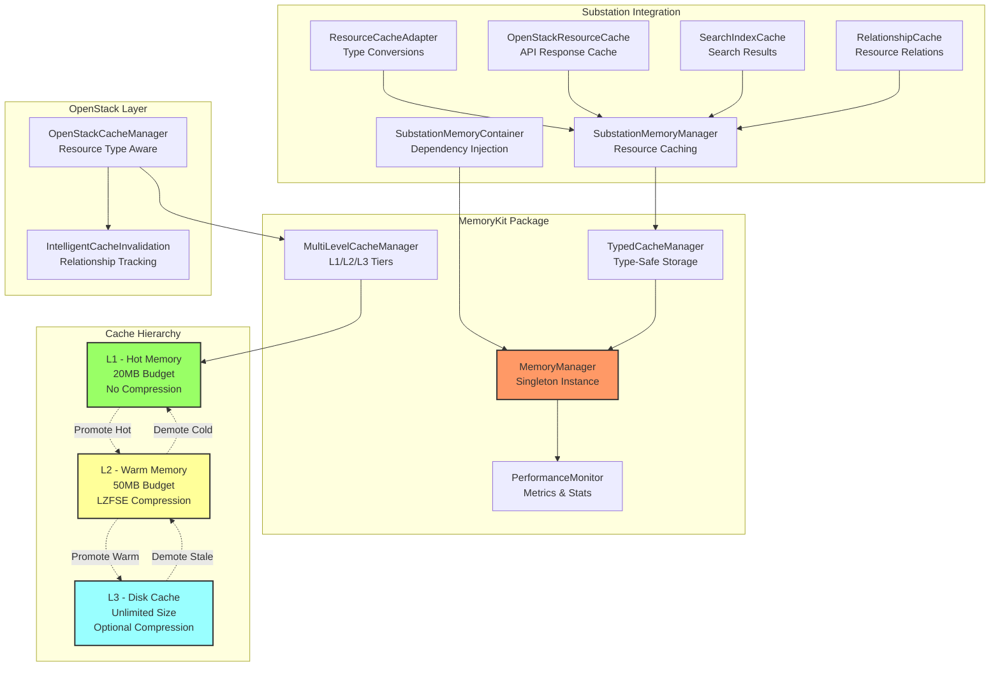

# Memory Management Architecture

## Overview

The Substation TUI application implements a sophisticated multi-tiered memory management system designed to optimize performance while maintaining a minimal memory footprint. The architecture leverages the MemoryKit package to provide intelligent caching, automatic eviction, and memory pressure monitoring for OpenStack resource management.

### Why Memory Management Matters for TUI Applications

Terminal User Interface applications face unique challenges:

- Limited system resources on remote servers
- Need for responsive UI updates without network latency
- Managing large datasets from OpenStack APIs
- Maintaining state across multiple views and contexts

### MemoryKit Integration

Substation integrates MemoryKit through a layered architecture that provides:

- **Automatic memory budgeting** - Prevents excessive memory consumption
- **Intelligent cache eviction** - Removes least valuable data when under pressure
- **Performance monitoring** - Tracks hit rates and optimization opportunities
- **Background maintenance** - Periodic cleanup without blocking UI operations

### Memory Budget System

The application operates within defined memory budgets:

- **Global Budget**: 150MB for all cache operations
- **L1 Cache**: 20MB for hot, frequently accessed data
- **L2 Cache**: 50MB for compressed, warm data
- **L3 Cache**: Disk-based storage for cold data
- **UI Optimization Cache**: 30MB for parsed and processed display data

## Architecture

The memory management system follows a hierarchical design with clear separation of concerns:



## Cache Hierarchy

### L1 Cache - Hot Data in Memory

**Purpose**: Ultra-fast access to frequently used data without any compression overhead.

**Characteristics**:

- Size: 20MB maximum memory budget
- Entry Limit: 1,000 items
- Access Time: < 1ms
- Storage: Raw in-memory data structures
- TTL: 5 minutes default (adjustable by priority)

**Best For**:

- Authentication tokens
- Service endpoints
- Active server details
- Current project/tenant information
- Recently accessed resource names

**Eviction Policy**:

- Least Recently Used (LRU) with priority weighting
- Automatic promotion from L2 when access count >= 3
- Demotion to L2 when under memory pressure

### L2 Cache - Warm Data with Compression

**Purpose**: Balance between speed and memory efficiency through LZFSE compression.

**Characteristics**:

- Size: 50MB maximum memory budget
- Entry Limit: 5,000 items
- Access Time: < 10ms (includes decompression)
- Storage: LZFSE compressed data
- Compression Ratio: Typically 3:1 to 10:1 for JSON
- TTL: 5 minutes default

**Best For**:

- Server lists
- Network configurations
- Image catalogs
- Flavor definitions
- Security group rules

**Eviction Policy**:

- Score-based eviction combining:
  - Access frequency
  - Compression efficiency
  - Resource priority
  - Age factor
- Promotion to L1 when frequently accessed
- Demotion to L3 when cold

### L3 Cache - Disk-Backed Persistent Storage

**Purpose**: Long-term storage for rarely accessed but expensive-to-fetch data.

**Characteristics**:

- Size: Unlimited (disk space permitting)
- Entry Limit: 50,000 items
- Access Time: < 100ms (disk I/O)
- Storage: File-based with optional compression
- Location: `~/.config/substation/multi-level-cache/`
- TTL: Variable by resource type

**Best For**:

- Historical data
- Audit logs
- Backup configurations
- Archived resources
- Bulk API responses

**Eviction Policy**:

- Time-based expiration
- Least Frequently Used (LFU) when over limit
- Orphaned file cleanup during maintenance

## SubstationMemoryContainer

The `SubstationMemoryContainer` serves as the central dependency injection point for all memory management components in the application.

### Purpose and Usage

```swift
@MainActor
final class SubstationMemoryContainer {
    static let shared = SubstationMemoryContainer()

    // Core components
    var memoryManager: SubstationMemoryManager
    var resourceCacheAdapter: ResourceCacheAdapter
    var openStackResourceCache: OpenStackResourceCache
    var searchIndexCache: SearchIndexCache
    var relationshipCache: RelationshipCache
}
```

### Configuration Options

```swift
let config = SubstationMemoryManager.Configuration(
    maxCacheSize: 3000,              // Total cache entries
    maxMemoryBudget: 75 * 1024 * 1024, // 75MB total
    cleanupInterval: 600.0,          // 10 minutes
    enableMetrics: true,
    enableLeakDetection: true,
    logger: customLogger
)

await SubstationMemoryContainer.shared.initialize(with: config)
```

### Integration with TUI

The container is initialized early in the application lifecycle:

1. **Application Launch**: Container created as singleton
2. **Configuration Loading**: Custom settings applied
3. **Component Initialization**: All cache managers started
4. **View Loading**: Views access caches through container
5. **Background Tasks**: Maintenance operations scheduled

## CacheManager

The `OpenStackCacheManager` provides resource-aware caching with intelligent invalidation strategies.

### How Caching Works for OpenStack Resources

```swift
public enum ResourceType: String {
    case server = "server"
    case network = "network"
    case volume = "volume"
    // ... more resource types

    var defaultTTL: TimeInterval {
        switch self {
        case .authentication: return 3600.0  // 1 hour
        case .server: return 120.0           // 2 minutes
        case .flavor: return 900.0           // 15 minutes
        // ... resource-specific TTLs
        }
    }
}
```

### Cache Invalidation Strategies

**Relationship-Based Invalidation**:

- When a server changes -> invalidate server lists, port associations
- When a network changes -> invalidate subnets, ports, routers
- When security group changes -> invalidate server and port caches

**Time-Based Expiration**:

- Authentication: 1 hour
- Dynamic resources (servers, ports): 2 minutes
- Static resources (flavors, images): 15 minutes
- Service endpoints: 30 minutes

**Event-Driven Invalidation**:

- User-triggered refresh
- Resource creation/deletion
- Status changes
- Error responses from API

### TTL Configuration

TTLs are configured based on resource volatility:

| Resource Type | Default TTL | Rationale |
|--------------|-------------|-----------|
| Auth Token | 1 hour | Matches token lifetime |
| Server | 2 minutes | Frequently changing state |
| Network | 5 minutes | Moderate change frequency |
| Flavor | 15 minutes | Rarely changes |
| Image | 5 minutes | May have status updates |
| Port | 2 minutes | Dynamic allocations |
| Volume | 2 minutes | Attachment changes |

## Performance Monitoring

### MemoryKit Metrics

The system continuously monitors:

```swift
public struct MemoryMetrics {
    var cacheHits: Int
    var cacheMisses: Int
    var cacheEvictions: Int
    var bytesWritten: Int
    var bytesRead: Int
    var cleanupOperations: Int
    var aggressiveCleanups: Int

    var hitRate: Double // Calculated: hits / (hits + misses)
    var efficiency: Double // Calculated: written / read
}
```

### Budget Alerts

Memory pressure triggers at 80% utilization:

- **Warning Level (80%)**: Increase eviction rate
- **Critical Level (90%)**: Aggressive cleanup
- **Emergency Level (95%)**: Clear low-priority caches

### Optimization Strategies

1. **Priority-Based Caching**:
   - Critical: Auth, endpoints (2x TTL multiplier)
   - High: Active resources (1.5x TTL)
   - Normal: General resources (1x TTL)
   - Low: Historical data (0.5x TTL)

2. **Compression Optimization**:
   - JSON data typically compresses 3-10x
   - Skip compression for data < 1KB
   - Monitor compression ratios for tuning

3. **Access Pattern Analysis**:
   - Track hit rates per resource type
   - Adjust cache sizes based on usage
   - Preload frequently accessed data

## Configuration Guide

### Memory Budget Settings

Configure budgets based on available system memory:

**Minimal (< 512MB RAM)**:

```swift
maxMemoryBudget: 50 * 1024 * 1024  // 50MB total
l1MaxMemory: 10 * 1024 * 1024      // 10MB L1
l2MaxMemory: 20 * 1024 * 1024      // 20MB L2
```

**Standard (1-2GB RAM)**:

```swift
maxMemoryBudget: 150 * 1024 * 1024 // 150MB total
l1MaxMemory: 20 * 1024 * 1024      // 20MB L1
l2MaxMemory: 50 * 1024 * 1024      // 50MB L2
```

**Performance (> 2GB RAM)**:

```swift
maxMemoryBudget: 300 * 1024 * 1024 // 300MB total
l1MaxMemory: 50 * 1024 * 1024      // 50MB L1
l2MaxMemory: 100 * 1024 * 1024     // 100MB L2
```

### Cache Size Limits

Configure entry limits based on OpenStack environment size:

**Small Environment (< 100 resources)**:

```swift
l1MaxSize: 500
l2MaxSize: 2000
l3MaxSize: 10000
```

**Medium Environment (100-1000 resources)**:

```swift
l1MaxSize: 1000
l2MaxSize: 5000
l3MaxSize: 50000
```

**Large Environment (> 1000 resources)**:

```swift
l1MaxSize: 2000
l2MaxSize: 10000
l3MaxSize: 100000
```

### Performance Tuning

1. **Cleanup Interval**: Balance between CPU usage and memory efficiency
   - Fast cleanup (60s): More CPU, better memory utilization
   - Standard cleanup (300s): Balanced
   - Slow cleanup (600s): Less CPU, may hold stale data longer

2. **Compression Settings**:
   - Enable for JSON/text data > 1KB
   - Disable for binary data or small entries
   - Monitor compression ratios in metrics

3. **Background Tasks**:
   - Start manually with `memoryManager.start()`
   - Disable for CPU-constrained environments
   - Adjust intervals based on usage patterns

## Best Practices

### When to Use Which Cache Level

**Use L1 Cache for**:

- Data accessed multiple times per minute
- Authentication and authorization data
- Current context (active project, server)
- UI state that must be instantly available

**Use L2 Cache for**:

- Data accessed multiple times per hour
- Resource lists and collections
- Configuration data
- Search results and filters

**Use L3 Cache for**:

- Data accessed occasionally
- Historical records
- Backup/archive data
- Large API responses

### Memory Pressure Handling

1. **Monitor Metrics**: Check hit rates and memory usage regularly
2. **Adjust Priorities**: Increase priority for critical data
3. **Tune TTLs**: Reduce TTL for low-value data
4. **Enable Compression**: Use L2 cache for large JSON data
5. **Implement Pagination**: Avoid caching entire large datasets

### Resource Cleanup

1. **Automatic Cleanup**:
   - Periodic maintenance every 10 minutes
   - Expired entry removal
   - LRU/LFU eviction when over limits

2. **Manual Cleanup**:

   ```swift
   // Force cleanup when needed
   await memoryContainer.forceCleanup()

   // Clear specific cache types
   await memoryContainer.clearCache(type: .searchResults)

   // Full reset
   await memoryContainer.clearAllCaches()
   ```

3. **Shutdown Procedures**:

   ```swift
   // Graceful shutdown
   await memoryContainer.shutdown()
   ```

### Error Handling

1. **Corrupted Cache Entries**: Automatically removed and re-fetched
2. **Compression Failures**: Falls back to uncompressed storage
3. **Disk I/O Errors**: Degrades gracefully to memory-only caching
4. **Memory Pressure**: Triggers aggressive eviction policies

## Performance Benchmarks

### Cache Hit Rates (Target vs Actual)

| Cache Level | Target Hit Rate | Typical Actual |
|------------|-----------------|----------------|
| L1 Cache | > 80% | 75-85% |
| L2 Cache | > 60% | 55-70% |
| L3 Cache | > 40% | 35-50% |
| Overall | > 70% | 65-75% |

### Response Times

| Operation | Without Cache | With Cache | Improvement |
|-----------|--------------|------------|-------------|
| Server List | 500-2000ms | 1-10ms | 50-200x |
| Resource Name | 100-300ms | < 1ms | 100-300x |
| Search Results | 200-1000ms | 5-20ms | 10-50x |
| Filter Apply | 50-200ms | 1-5ms | 10-40x |

### Memory Usage Patterns

**Typical Distribution**:

- L1 Cache: 15-20MB (hot data)
- L2 Cache: 30-45MB (compressed)
- L3 Cache: 50-200MB (disk)
- Overhead: 5-10MB (indexes, metadata)

## Troubleshooting

### Common Issues and Solutions

**High Memory Usage**:

- Check cache statistics for size
- Reduce memory budgets
- Increase cleanup frequency
- Enable more aggressive eviction

**Low Hit Rates**:

- Increase cache sizes
- Adjust TTLs based on access patterns
- Review priority assignments
- Check for cache invalidation issues

**Slow Performance**:

- Monitor L3 cache disk I/O
- Check compression/decompression times
- Review cache tier placement logic
- Optimize frequently accessed data paths

### Debug Commands

```swift
// Get comprehensive statistics
let stats = await memoryContainer.getPerformanceStatistics()
print(stats.summary)

// Check health status
let health = await memoryContainer.getSystemHealthReport()
print("Health: \(health.overallHealth)")

// Monitor specific cache
let cacheStats = await openStackCache.getAdvancedStats()
print(cacheStats.description)
```

## Future Enhancements

1. **Predictive Caching**: Pre-fetch data based on usage patterns
2. **Distributed Caching**: Share cache across multiple TUI instances
3. **Smart Compression**: Adaptive compression based on data type
4. **Memory Mapping**: Use mmap for large L3 cache files
5. **Cache Warming**: Pre-populate caches at startup
6. **Telemetry Integration**: Export metrics to monitoring systems
