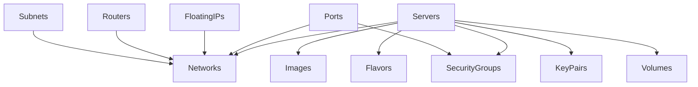

# Substation Modular Ecosystem Documentation

## Introduction

When we started building Substation, we made a classic mistake: we built a monolith. Everything lived in one giant TUI class, service-specific logic was scattered everywhere, and adding support for a new OpenStack service meant touching dozens of files. It worked, but it was a maintenance nightmare.

The modular ecosystem we built to replace that mess transforms how OpenStack services integrate into Substation. Each service lives in its own module with clear boundaries, modules can be enabled or disabled at runtime based on what your cloud actually supports, dependencies get resolved automatically, and everything loads lazily to keep memory usage reasonable. The result is a system where adding support for a new OpenStack service takes an afternoon instead of a week, and modules can be developed and tested independently.

This document explains how the modular architecture works, why we made the design choices we did, and how to extend it when you need to add new services.

## Core Architecture

### The Module System

The module system centers on the `OpenStackModule` protocol, which defines the contract between modules and the TUI system. Every module must identify itself with a unique identifier and version, declare its dependencies on other modules, implement lifecycle hooks for configuration and cleanup, register its views and handlers, expose a configuration schema, and optionally provide navigation integration.

Here's the protocol definition. The `@MainActor` isolation ensures all module operations run on the main thread, which simplifies state management and prevents the kind of threading bugs that plague concurrent systems. The required properties and methods cover everything from basic identification to complex lifecycle management.

```swift
@MainActor
protocol OpenStackModule {
    // Identification
    var identifier: String { get }
    var displayName: String { get }
    var version: String { get }
    var dependencies: [String] { get }

    // Lifecycle
    init(tui: TUI)
    func configure() async throws
    func cleanup() async
    func healthCheck() async -> ModuleHealthStatus

    // Registration
    func registerViews() -> [ModuleViewRegistration]
    func registerFormHandlers() -> [ModuleFormHandlerRegistration]
    func registerDataRefreshHandlers() -> [ModuleDataRefreshRegistration]
    func registerActions() -> [ModuleActionRegistration]

    // Configuration
    var configurationSchema: ConfigurationSchema { get }
    func loadConfiguration(_ config: ModuleConfig?)

    // Navigation
    var navigationProvider: (any ModuleNavigationProvider)? { get }
    var handledViewModes: Set<ViewMode> { get }
}
```

### Module Lifecycle

The module lifecycle follows a predictable path from discovery to operation. First, the ModuleCatalog maintains metadata for all available modules so the system knows what exists. Then ModuleRegistry validates dependencies and registers modules in the correct order. Modules load their configuration from ModuleConfigurationManager, which handles both defaults and user overrides. The integration phase registers views, handlers, and actions with the respective registries so the TUI can route to them. During operation, modules handle their specific ViewModes and data operations. Finally, periodic health checks ensure modules remain stable and responsive.

The registration process itself includes dependency validation (ensuring required modules are loaded first), configuration loading (both schema defaults and user settings), module configuration (calling the async configure method), and TUI integration (registering all the views and handlers). If any step fails, the module doesn't load and the system logs why.

### Module Structure Pattern

Every module follows a consistent directory structure. This consistency makes it easy to find things and helps new contributors understand the codebase quickly. The main module file implements the OpenStackModule protocol, the data provider handles data fetching logic, form state extensions add module-specific form state to the TUI, models contain service-specific data structures, views implement the UI, and extensions provide TUI extensions and handlers.

Here's what the structure looks like for the Servers module. The pattern repeats for every service: one main module file, one data provider, form state extensions, and then directories for models, views, and extensions. The consistency means you can jump into any module and immediately know where to find things.

```
Modules/Servers/
    ServersModule.swift              # OpenStackModule implementation
    ServersDataProvider.swift        # DataProvider for Nova instances
    TUI+ServersFormState.swift       # Server-specific form state
    Models/
        ServerOperations.swift
        ServerState.swift
    Views/
        ServerViews.swift
        ServerCreateView.swift
        ServerSelectionView.swift
        SnapshotManagementView.swift
    Extensions/
        TUI+ServersHandlers.swift
        TUI+ServersNavigation.swift
        TUI+ServersActions.swift
```

### DataProvider Pattern

The DataProvider protocol enables modules to handle their own data fetching while integrating with the centralized data management system. Each provider identifies its resource type, tracks when it last refreshed, reports how many items it currently has cached, and implements the standard operations for fetching and refreshing data.

The protocol is straightforward but powerful. Modules register their data providers with the DataProviderRegistry, which coordinates data fetching across the entire application. This gives us centralized cache management while maintaining module isolation. The TUI can request a refresh of all data, or target specific resource types, without knowing the details of how each module fetches its data.

## Core Packages

The modular ecosystem relies on four foundational packages that provide cross-cutting functionality. These packages handle concerns that span multiple modules, like memory management, API communication, UI rendering, and timing.

### MemoryKit

MemoryKit provides advanced memory management with thread-safe caching using Swift actors, intelligent cache eviction policies (LRU, LFU, TTL), real-time memory monitoring and alerting, and cross-platform compatibility for macOS and Linux. The public API revolves around a shared actor that coordinates the memory manager and performance monitor.

### OSClient

OSClient is the OpenStack API client library that handles all the messy details of talking to OpenStack. Service catalog discovery finds the endpoints for available services, authentication and token management keeps sessions alive, API request/response handling abstracts away HTTP, error handling and retries make the system resilient, and response parsing maps JSON to Swift models. Every module uses OSClient to talk to its corresponding OpenStack service.

### SwiftNCurses

SwiftNCurses provides the terminal UI framework. It abstracts NCurses behind a clean Swift API, manages windows and panels, handles input and key mapping, supports colors and styling, and provides a component library for consistent UI elements. Every view in every module renders through SwiftNCurses.

### CrossPlatformTimer

CrossPlatformTimer solves the problem that macOS and Linux have different timer APIs. It provides consistent timer behavior across platforms, high-precision timing for performance monitoring, scheduled task execution, and proper timer lifecycle management. Modules use it for things like auto-refresh and periodic health checks.

## Service Modules

We've built 14 specialized modules, each handling a specific OpenStack service. The dependency graph shows how they relate.



The module loading happens in three phases. Phase 1 loads independent modules with no dependencies: Barbican for key management, Swift for object storage, KeyPairs for SSH keys, ServerGroups for anti-affinity policies, Flavors for hardware profiles, Images for boot images, SecurityGroups for firewall rules, and Volumes for block storage. Phase 2 loads network-dependent modules: Networks for virtual network management, Subnets for IP allocation, Routers for routing and NAT, FloatingIPs for public IPs, and Ports for network interfaces. Phase 3 loads multi-dependent modules, which is currently just Servers with its six dependencies on networks, images, flavors, keypairs, volumes, and security groups.

**Why This Matters**: The phased loading ensures dependencies are always satisfied. A module never tries to use functionality that hasn't been loaded yet, which prevents entire classes of initialization bugs.

## Data Flow Architecture

The data flow through the modular system is clean and predictable. The TUI controller coordinates everything at the top, the ModuleOrchestrator manages module lifecycle and coordination, ViewRegistry routes views to the correct modules, and DataProviderRegistry coordinates data fetching. Below that, the caching layer (CacheManager and the three-tier L1/L2/L3 memory system) sits between the application and OpenStack API.

Requests flow top-down through this stack. The TUI makes a request, ModuleOrchestrator routes it to the appropriate module, the module checks ViewRegistry if it's a view request or DataProviderRegistry if it's data, data requests hit CacheManager first, and only on cache miss does the system actually call the OpenStack API. Responses flow back up the same path, caching at each level.

## Inter-Module Communication

Modules communicate through well-defined interfaces rather than direct dependencies. This keeps modules loosely coupled and makes testing straightforward.

### Action Registry

Modules register actions that can be triggered from various contexts. Each action registration includes an identifier, title, optional keybinding, the view modes where it's available, and the handler function. Actions get categorized (lifecycle, network, storage, security) and can be invoked across module boundaries without tight coupling.

### DataProvider Registry

The centralized DataProviderRegistry manages all module data providers. Modules register their providers for specific resource types, the registry tracks them, and other parts of the system can request refreshes by resource type without knowing which module owns that type. This enables coordinated data fetching and cache management across modules while maintaining isolation.

### View Registry

Modules register their views for dynamic navigation. Each registration includes the view mode, title, render handler, optional input handler, and category. The TUI dynamically routes to appropriate module views based on ViewMode, which means adding a new view is just a matter of registering it. No need to modify the central routing logic.

### Event Broadcasting

Modules can broadcast and subscribe to events through NotificationCenter. When a module creates a server, it posts a notification. Other interested modules subscribe to that notification and react accordingly. It's a publish-subscribe pattern that keeps modules decoupled while enabling coordination.

The shared state pattern complements event broadcasting. The TUI instance provides shared state accessible to all modules: cacheManager for centralized resource caching, formStateManager for shared form state, navigationStack for navigation history, and the OpenStack client instance. Modules can read and write this shared state without direct dependencies on each other.

## Module Lifecycle State Machine

The lifecycle state machine ensures modules progress through their initialization in a predictable order. Discovery finds all available modules, registration adds them to the registry, validation checks dependencies, configuration loads settings, integration registers views and handlers, operation is the steady state where modules handle requests, health checks run periodically, and cleanup happens on shutdown or reload.

## Development Guide

### Creating a New Module

Adding support for a new OpenStack service follows a standard process. First, define the module in ModuleCatalog with its identifier, display name, dependencies, and phase. Create the directory structure with the main module file, data provider, form state extension, and subdirectories for models, views, and extensions. Implement the OpenStackModule protocol with all required methods. Finally, register it with ModuleRegistry in the loadCoreModules function.

Here's a concrete example for adding Heat (OpenStack orchestration service). You'd define it in the catalog with dependencies on networks and servers, create the directory structure following our standard pattern, implement HeatModule conforming to OpenStackModule, and register it conditionally based on whether it's enabled in configuration.

```swift
// 1. ModuleCatalog definition
ModuleDefinition(
    identifier: "heat",
    displayName: "Orchestration (Heat)",
    dependencies: ["networks", "servers"],
    phase: .multiDependent
)

// 2. Directory structure
Modules/Heat/
    HeatModule.swift
    HeatDataProvider.swift
    TUI+HeatFormState.swift
    Models/
    Views/
    Extensions/

// 3. Module implementation
@MainActor
final class HeatModule: OpenStackModule {
    let identifier = "heat"
    let displayName = "Orchestration (Heat)"
    let version = "1.0.0"
    let dependencies = ["networks", "servers"]

    // Implementation...
}

// 4. Registration in loadCoreModules()
if enabledModules.contains("heat") {
    let heatModule = HeatModule(tui: tui)
    try await registry.register(heatModule)
}
```

### Module Best Practices

When building modules, follow these guidelines. Keep dependencies minimal and explicit so modules remain loosely coupled. Handle service unavailability gracefully because not all OpenStack deployments have all services. Implement efficient data fetching with caching to keep the UI responsive. Provide unit tests for module logic to catch bugs early. Include SwiftDoc comments for public interfaces so the code is self-documenting. And define sensible defaults in your configuration schema so the module works out of the box.

For detailed module development instructions, see the [Module Development Guide](../reference/developers/module-development-guide.md).

## Performance Considerations

The modular architecture provides several performance benefits that weren't possible with the monolithic approach.

### Lazy Loading

Modules load only when needed, which reduces initial startup time. The LazyModuleLoader tracks which modules are loaded, loads modules on demand when first accessed, and can preload dependencies to avoid loading delays during operation. This means if your cloud doesn't have Barbican, you never load the Barbican module and never pay the memory cost.

### Resource Pooling

Shared resource pools minimize memory allocation overhead. The ResourcePool actor manages acquisition and release of resources, maintains a pool of reusable objects, and can drain the pool when needed. This is particularly useful for things like network connections and JSON parsers where allocation is expensive.

### Performance Metrics

Each module tracks its performance through standardized metrics: load time, memory usage, API call count, and cache hit rate. These metrics help identify performance bottlenecks and validate optimizations. When you're optimizing, you need data, and the metrics system provides it.

## Configuration Management

Modules support runtime configuration through ModuleConfigurationManager. Each module defines a configuration schema with entries, where each entry specifies a key, type, default value, description, and optional validation rule.

Configuration can come from multiple sources: default values in the schema, configuration files in YAML or JSON, environment variables for containerized deployments, and runtime updates for dynamic reconfiguration. The configuration manager merges these sources with a clear precedence order so you always know where a setting came from.

## Hot Reload Support

The module system supports hot reloading for development, which makes iteration much faster. The HotReloadManager watches for file changes in a module, reloads the module without restarting the application, and can reload configuration without affecting running modules. This means you can modify a view, trigger a reload, and see your changes in the running application within seconds.

## Future Enhancements

The modular ecosystem is designed for extensibility, and we have several enhancements planned. A plugin system would let us load third-party modules dynamically, expanding beyond built-in OpenStack services. Remote modules could load from package repositories, enabling community contributions. A module marketplace could provide discoverability and ratings. Auto-discovery could detect available OpenStack services and load appropriate modules automatically. Module versioning would support multiple module versions simultaneously. And cross-module transactions would coordinate operations that span services, like creating a server with an attached volume in a single transaction.

## Conclusion

The Substation modular ecosystem provides a robust, scalable foundation for OpenStack management. By isolating service-specific logic into discrete modules with well-defined interfaces, the architecture promotes maintainability, testability, and extensibility while delivering excellent performance and user experience.

The consistent module structure means new contributors can jump in quickly. The comprehensive registries and sophisticated lifecycle management ensure modules integrate smoothly. And the performance benefits of lazy loading and resource pooling keep the application responsive even as we add more services.

When you need to integrate a new OpenStack service, the modular architecture makes it straightforward. Define your module, implement the protocol, register it, and you're done. The framework handles the rest, from dependency resolution to view routing to data caching. That's the power of a well-designed modular system.
