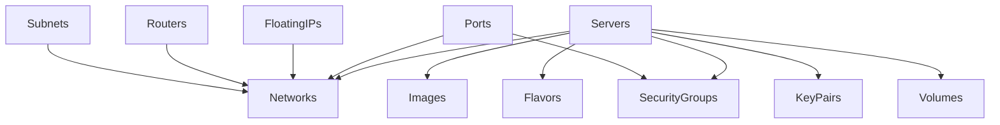
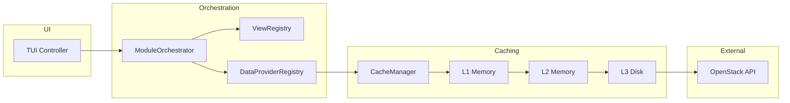
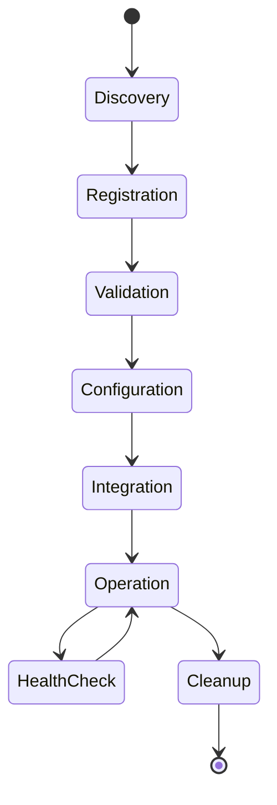
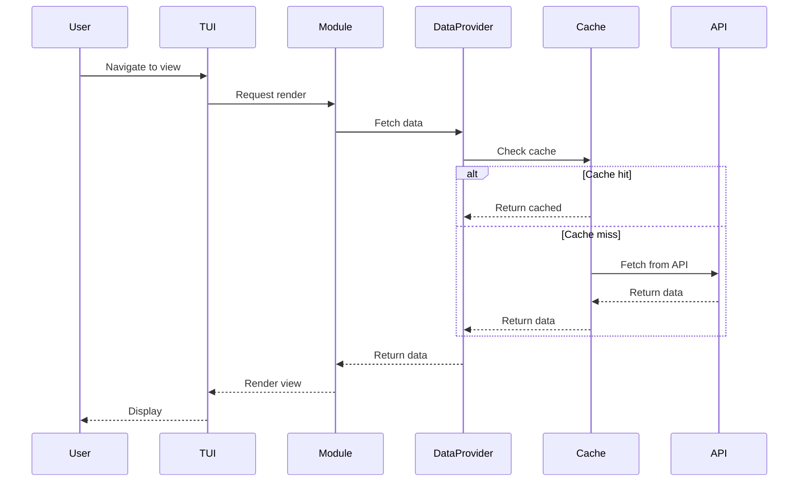

# Substation Modular Ecosystem Documentation

## Introduction

The Substation TUI has evolved from a monolithic architecture to a sophisticated modular ecosystem, transforming how OpenStack services are integrated and managed. This architectural shift brings significant benefits:

- **Isolated Responsibilities**: Each OpenStack service is encapsulated in its own module with clear boundaries
- **Dynamic Loading**: Modules can be enabled/disabled at runtime based on cloud capabilities
- **Dependency Management**: Automatic resolution and validation of inter-module dependencies
- **Performance Optimization**: Lazy loading and resource pooling reduce memory footprint
- **Maintainability**: Independent module development and testing cycles
- **Extensibility**: New OpenStack services can be added without core modifications

## Core Architecture

### The Module System

At the heart of the modular ecosystem is the `OpenStackModule` protocol, which defines the contract between modules and the TUI system:

```swift
@MainActor
protocol OpenStackModule {
    // Identification
    var identifier: String { get }
    var displayName: String { get }
    var version: String { get }
    var dependencies: [String] { get }

    // Lifecycle
    init(tui: TUI)
    func configure() async throws
    func cleanup() async
    func healthCheck() async -> ModuleHealthStatus

    // Registration
    func registerViews() -> [ModuleViewRegistration]
    func registerFormHandlers() -> [ModuleFormHandlerRegistration]
    func registerDataRefreshHandlers() -> [ModuleDataRefreshRegistration]
    func registerActions() -> [ModuleActionRegistration]

    // Configuration
    var configurationSchema: ConfigurationSchema { get }
    func loadConfiguration(_ config: ModuleConfig?)

    // Navigation
    var navigationProvider: (any ModuleNavigationProvider)? { get }
    var handledViewModes: Set<ViewMode> { get }
}
```

#### Module Lifecycle

1. **Discovery**: ModuleCatalog maintains metadata for all available modules
2. **Registration**: ModuleRegistry validates dependencies and registers modules
3. **Configuration**: Modules load configuration from ModuleConfigurationManager
4. **Integration**: Views, handlers, and actions are registered with respective registries
5. **Operation**: Modules handle their specific ViewModes and data operations
6. **Health Monitoring**: Periodic health checks ensure module stability

#### Module Registration Process

The `ModuleRegistry` orchestrates module loading with dependency resolution:

```swift
func register(_ module: any OpenStackModule) async throws {
    // Validate dependencies
    for dep in module.dependencies {
        guard modules[dep] != nil else {
            throw ModuleError.missingDependency(...)
        }
    }

    // Load configuration
    let moduleConfig = configManager.configuration(for: module.identifier)
    module.loadConfiguration(moduleConfig)

    // Configure module
    try await module.configure()

    // Integrate with TUI
    await integrateModule(module)
}
```

### Module Structure Pattern

Each module follows a consistent directory structure that promotes organization and discoverability:

```
Modules/[ServiceName]/
    [ServiceName]Module.swift        # Main module implementation
    [ServiceName]DataProvider.swift  # Data fetching logic
    TUI+[ServiceName]FormState.swift # Form state extensions
    Models/                          # Service-specific data models
    Views/                           # UI views for the service
    Extensions/                      # TUI extensions and handlers
```

#### Example: Servers Module Structure

```
Modules/Servers/
    ServersModule.swift              # OpenStackModule implementation
    ServersDataProvider.swift        # DataProvider for Nova instances
    TUI+ServersFormState.swift       # Server-specific form state
    Models/
        ServerOperations.swift
        ServerState.swift
    Views/
        ServerViews.swift
        ServerCreateView.swift
        ServerSelectionView.swift
        SnapshotManagementView.swift
    Extensions/
        TUI+ServersHandlers.swift
        TUI+ServersNavigation.swift
        TUI+ServersActions.swift
```

### DataProvider Pattern

The DataProvider protocol enables modules to handle their own data fetching:

```swift
@MainActor
protocol DataProvider {
    var resourceType: String { get }
    var lastRefreshTime: Date? { get }
    var currentItemCount: Int { get }

    func fetchData(priority: DataFetchPriority, forceRefresh: Bool) async -> DataFetchResult
    func refreshResource(id: String, priority: DataFetchPriority) async -> DataFetchResult
    func clearCache() async
    func needsRefresh(threshold: TimeInterval) -> Bool
}
```

Each module implements its own DataProvider, registered with the DataProviderRegistry for centralized data management while maintaining module isolation.

## Core Packages

The modular ecosystem relies on several foundational packages that provide cross-cutting functionality:

### MemoryKit

Advanced memory management system providing:

- Thread-safe caching using Swift actors
- Intelligent cache eviction policies (LRU, LFU, TTL)
- Real-time memory monitoring and alerting
- Cross-platform compatibility (macOS/Linux)

```swift
public actor MemoryKit {
    public let memoryManager: MemoryManager
    public let performanceMonitor: PerformanceMonitor
}
```

### OSClient

OpenStack API client library handling:

- Service catalog discovery
- Authentication and token management
- API request/response handling
- Error handling and retries
- Response parsing and model mapping

### SwiftNCurses

Terminal UI framework providing:

- NCurses abstraction layer
- Window and panel management
- Input handling and key mapping
- Color and styling support
- Component library for consistent UI

### CrossPlatformTimer

Platform-agnostic timer implementation:

- Consistent timer behavior across macOS/Linux
- High-precision timing for performance monitoring
- Scheduled task execution
- Timer lifecycle management

## Service Modules

The ecosystem includes 14 specialized modules, each handling a specific OpenStack service:

### Module Dependency Graph



### Independent Modules (Phase 1)

Modules with no dependencies, loaded first:

- **Barbican** (`barbican`): Key management service for secrets and certificates
- **Swift** (`swift`): Object storage with container and object management
- **KeyPairs** (`keypairs`): SSH key pair management for instance access
- **ServerGroups** (`servergroups`): Anti-affinity and affinity policies
- **Flavors** (`flavors`): Hardware profiles for instances
- **Images** (`images`): Boot images and snapshots
- **SecurityGroups** (`securitygroups`): Firewall rules and network security
- **Volumes** (`volumes`): Block storage management

### Network-Dependent Modules (Phase 2)

Modules requiring network functionality:

- **Networks** (`networks`): Virtual network management
- **Subnets** (`subnets`): IP allocation pools and DHCP configuration
- **Routers** (`routers`): Network routing and NAT gateways
- **FloatingIPs** (`floatingips`): Public IP address management
- **Ports** (`ports`): Network interface management

### Multi-Dependent Modules (Phase 3)

Complex modules with multiple dependencies:

- **Servers** (`servers`): Compute instance management
  - Dependencies: networks, images, flavors, keypairs, volumes, securitygroups
  - Most complex module with comprehensive lifecycle management

## Data Flow Architecture



## Module Lifecycle State Diagram



## Inter-module Communication

Modules communicate through well-defined interfaces and shared registries:

### Action Registry

Modules register actions that can be triggered from various contexts:

```swift
struct ModuleActionRegistration {
    let identifier: String
    let title: String
    let keybinding: Character?
    let viewModes: Set<ViewMode>
    let handler: @MainActor @Sendable (OpaquePointer?) async -> Void
}
```

Actions are categorized (lifecycle, network, storage, security) and can be invoked across module boundaries.

### DataProvider Registry

Centralized registry for all module DataProviders:

```swift
@MainActor
final class DataProviderRegistry {
    func register(provider: any DataProvider, for resourceType: String)
    func provider(for resourceType: String) -> (any DataProvider)?
    func refreshAll(priority: DataFetchPriority) async
}
```

This enables coordinated data fetching and cache management across modules.

### View Registry

Modules register their views for dynamic navigation:

```swift
struct ModuleViewRegistration {
    let viewMode: ViewMode
    let title: String
    let renderHandler: @MainActor (OpaquePointer?, Int32, Int32, Int32, Int32) async -> Void
    let inputHandler: (@MainActor (Int32, OpaquePointer?) async -> Bool)?
    let category: ViewCategory
}
```

The TUI dynamically routes to appropriate module views based on ViewMode.

### Event Broadcasting

Modules can broadcast and subscribe to events through the notification system:

```swift
// Broadcasting module
NotificationCenter.default.post(
    name: .serverCreated,
    object: nil,
    userInfo: ["serverId": newServer.id]
)

// Subscribing module
NotificationCenter.default.addObserver(
    self,
    selector: #selector(handleServerCreated),
    name: .serverCreated,
    object: nil
)
```

### Shared State

The TUI instance provides shared state accessible to all modules:

- `cacheManager`: Centralized cache for OpenStack resources
- `formStateManager`: Shared form state across modules
- `navigationStack`: Navigation history and state
- `client`: OpenStack API client instance

## Request Flow Sequence



## Development Guide

### Creating a New Module

To add support for a new OpenStack service:

1. **Define the module in ModuleCatalog**:

```swift
ModuleDefinition(
    identifier: "heat",
    displayName: "Orchestration (Heat)",
    dependencies: ["networks", "servers"],
    phase: .multiDependent
)
```

2. **Create module structure**:

```
Modules/Heat/
    HeatModule.swift
    HeatDataProvider.swift
    TUI+HeatFormState.swift
    Models/
    Views/
    Extensions/
```

3. **Implement OpenStackModule protocol**:

```swift
@MainActor
final class HeatModule: OpenStackModule {
    let identifier = "heat"
    let displayName = "Orchestration (Heat)"
    let version = "1.0.0"
    let dependencies = ["networks", "servers"]

    // Implementation...
}
```

4. **Register with ModuleRegistry** in `loadCoreModules()`:

```swift
if enabledModules.contains("heat") {
    let heatModule = HeatModule(tui: tui)
    try await registry.register(heatModule)
}
```

### Module Best Practices

1. **Dependency Management**: Keep dependencies minimal and explicit
2. **Error Handling**: Gracefully handle service unavailability
3. **Performance**: Implement efficient data fetching with caching
4. **Testing**: Provide unit tests for module logic
5. **Documentation**: Include SwiftDoc comments for public interfaces
6. **Configuration**: Define sensible defaults in configuration schema

For detailed module development instructions, see the [Module Development Guide](../reference/developers/module-development-guide.md).

## Performance Considerations

The modular architecture provides several performance benefits:

### Lazy Loading

Modules are loaded only when needed, reducing initial startup time:

```swift
class LazyModuleLoader {
    func loadModuleIfNeeded(_ identifier: String) async throws
    func preloadDependencies(for identifier: String) async
}
```

### Resource Pooling

Shared resource pools minimize memory allocation:

```swift
actor ResourcePool<T> {
    func acquire() async throws -> T
    func release(_ resource: T) async
    func drain() async
}
```

### Performance Metrics

Each module tracks its performance:

```swift
struct ModulePerformanceMetrics {
    let loadTime: TimeInterval
    let memoryUsage: Int
    let apiCallCount: Int
    let cacheHitRate: Double
}
```

## Configuration Management

Modules support runtime configuration through ModuleConfigurationManager:

```swift
struct ConfigurationSchema {
    let entries: [ConfigurationEntry]
}

struct ConfigurationEntry {
    let key: String
    let type: ConfigurationType
    let defaultValue: Any?
    let description: String
    let validation: ValidationRule?
}
```

Configuration can be loaded from:

- Default values in schema
- Configuration files (YAML/JSON)
- Environment variables
- Runtime updates

## Hot Reload Support

The module system supports hot reloading for development:

```swift
class HotReloadManager {
    func watchForChanges(in module: String)
    func reloadModule(_ identifier: String) async throws
    func reloadConfiguration() async throws
}
```

This enables rapid development without restarting the TUI.

## Future Enhancements

The modular ecosystem is designed for extensibility:

1. **Plugin System**: Load third-party modules dynamically
2. **Remote Modules**: Load modules from package repositories
3. **Module Marketplace**: Community-contributed modules
4. **Auto-discovery**: Detect available OpenStack services
5. **Module Versioning**: Support multiple module versions
6. **Cross-module Transactions**: Coordinated operations across modules

## Conclusion

The Substation modular ecosystem provides a robust, scalable foundation for OpenStack management. By isolating service-specific logic into discrete modules with well-defined interfaces, the architecture promotes maintainability, testability, and extensibility while delivering excellent performance and user experience.

The consistent module structure, comprehensive registries, and sophisticated lifecycle management ensure that new OpenStack services can be integrated seamlessly, making Substation a future-proof solution for cloud infrastructure management.
