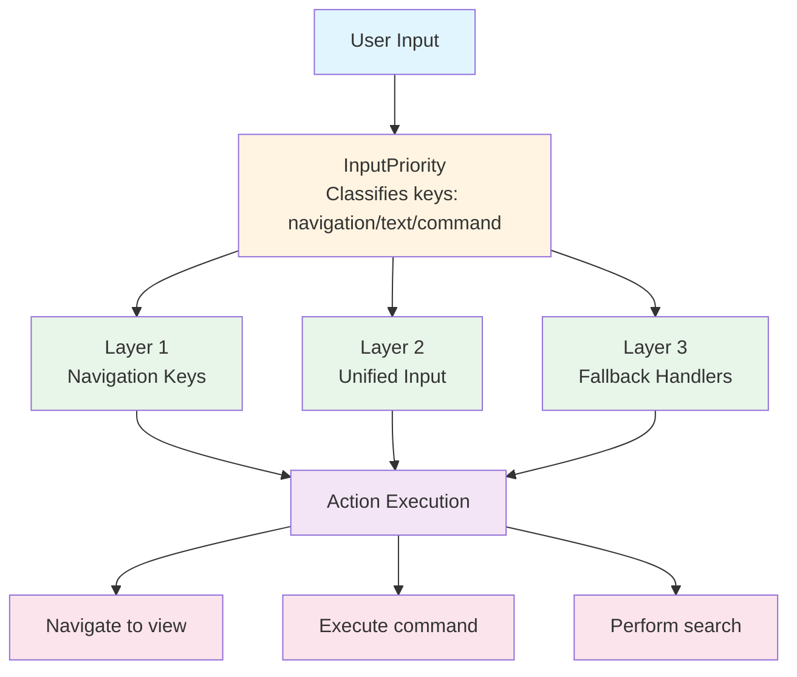
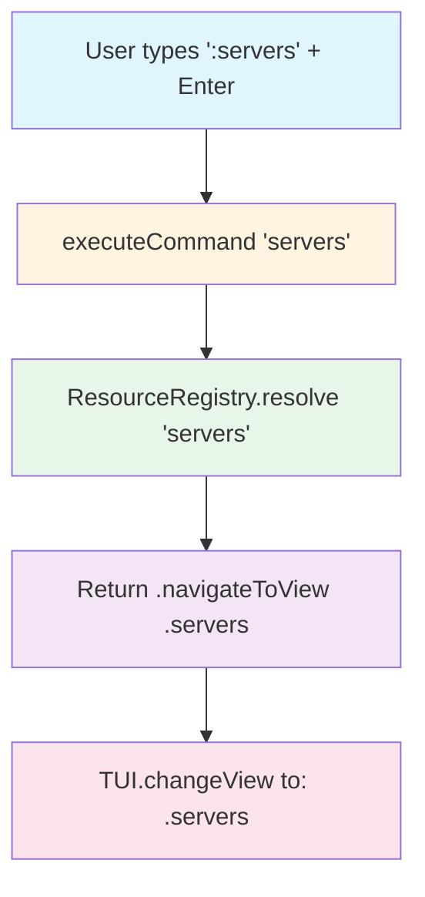
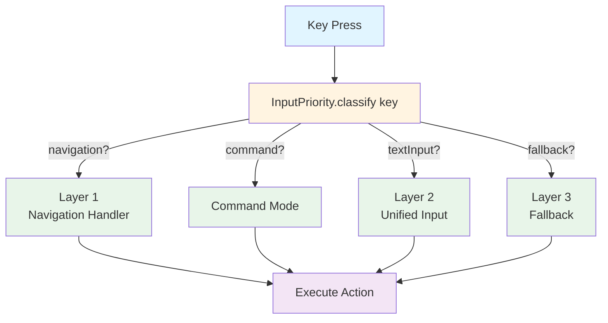
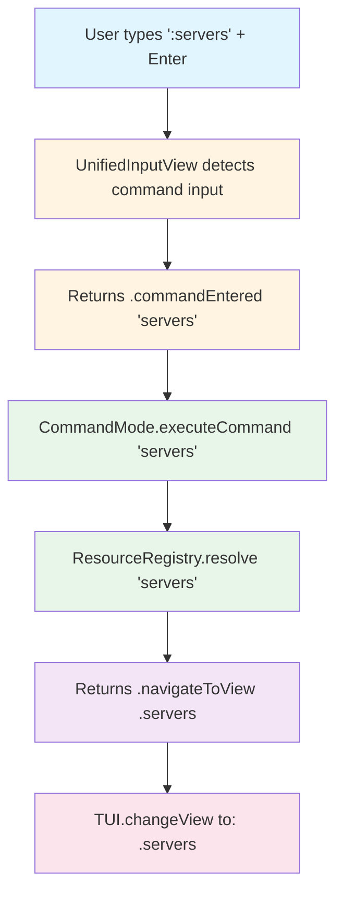
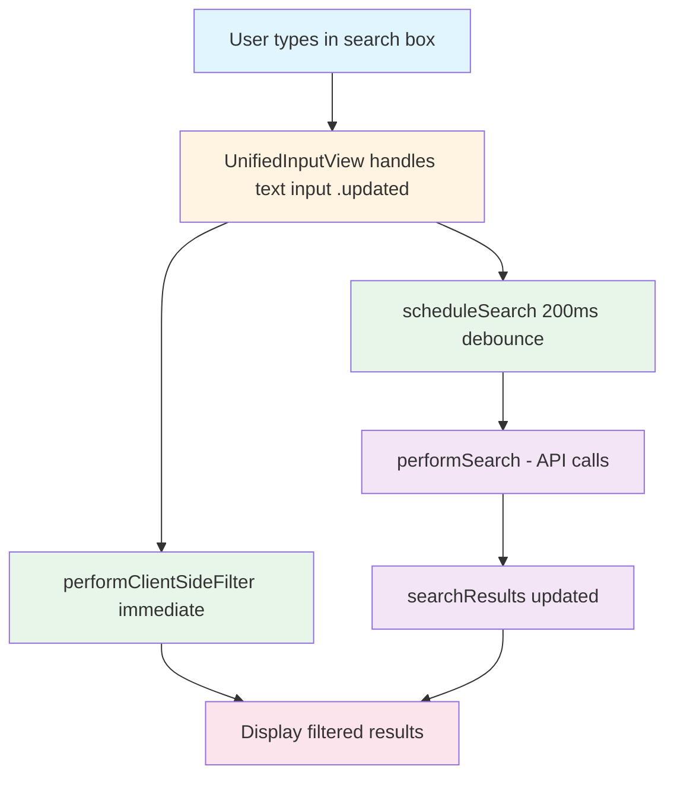

# Navigation System Architecture

**Version**: 2.0
**Last Updated**: 2025-10-08
**Status**: Production Ready

---

## Table of Contents

1. [Overview](#overview)
2. [Architecture](#architecture)
3. [Components](#components)
4. [Input Handling](#input-handling)
5. [Command System](#command-system)
6. [Search System](#search-system)
7. [Adding New Resources](#adding-new-resources)
8. [Testing](#testing)
9. [Troubleshooting](#troubleshooting)

---

## Overview

Substation uses a **VIM-inspired command-driven navigation system** that provides:

- **Command Input**: Type `:servers` to navigate to any resource
- **Fuzzy Matching**: Type `:fla` and it matches "flavors"
- **Aliases**: Multiple ways to reach the same resource (e.g., `servers`, `srv`, `s`)
- **Advanced Search**: Cross-service search across all 19 OpenStack resource types
- **Keyboard Navigation**: Single-key shortcuts and arrow key navigation

### Key Features

[x] Command-based navigation (`:resource-name`)
[x] Fuzzy matching with ranked scoring
[x] Tab completion for commands
[x] Command history (up/down arrows)
[x] Real-time sidebar filtering
[x] Cross-service search
[x] ID-based selection (persists through filtering)

---

## Architecture

### High-Level Components



### Directory Structure

```
Sources/Substation/
|-- Navigation/
|   |-- CommandMode.swift         # Command parsing & execution
|   |-- ResourceRegistry.swift    # Resource aliases & fuzzy matching
|   |-- InputPriority.swift       # Input classification system
|   +-- LayoutUtilities.swift     # Layout helpers
|-- Views/
|   |-- UnifiedInputView.swift    # Unified input state management
|   |-- AdvancedSearchView.swift  # Cross-service search
|   +-- SidebarView.swift         # Navigation sidebar with filtering
+-- Search/
    |-- SearchModels.swift        # Search data structures
    |-- SearchEngine.swift        # Search execution
    +-- SearchIndex.swift         # Search indexing
```

---

## Components

### 1. ResourceRegistry

**Purpose**: Maps command aliases to view modes with fuzzy matching support.

**Location**: `Sources/Substation/Navigation/ResourceRegistry.swift`

**Key Features**:

- Comprehensive alias mapping (e.g., `servers`, `server`, `srv`, `s`, `nova`)
- Fuzzy matching with Levenshtein distance
- Ranked match scoring (0-100)
- Command categorization (Compute, Networking, Storage, Services, Utilities)

**Example Usage**:

```swift
// Exact match
let view = ResourceRegistry.shared.resolve("servers")  // -> .servers

// Alias match
let view = ResourceRegistry.shared.resolve("srv")      // -> .servers

// Fuzzy match
let suggestion = ResourceRegistry.shared.fuzzyMatch("servrs")  // -> "servers"

// Ranked matches for prefix
let matches = ResourceRegistry.shared.rankedMatches(for: "fla")
// -> [(command: "flavors", score: 99, viewMode: .flavors), ...]
```

**Data Structure**:

```swift
private let resourceMap: [ViewMode: [String]] = [
    .servers: ["servers", "server", "srv", "s", "nova"],
    .flavors: ["flavors", "flavor", "flv", "f", "novaflavors"],
    // ... all resources
]
```

### 2. CommandMode

**Purpose**: Command parsing, execution, and history management.

**Location**: `Sources/Substation/Navigation/CommandMode.swift`

**Key Features**:

- Command execution (`:servers` -> navigate to servers)
- Command history (up to 50 entries)
- Tab completion with cycling
- Special commands (`:q`, `:help`, `:commands`)
- Contextual suggestions

**Example Usage**:

```swift
let commandMode = CommandMode()

// Execute command
let result = commandMode.executeCommand("servers")
// -> .navigateToView(.servers)

// Tab completion
let completion = commandMode.completeCommand("fla")
// -> "flavors"

// History navigation
let previous = commandMode.previousCommand()  // -> "networks"
```

**Command Flow**:



### 3. InputPriority

**Purpose**: Centralized input key classification and priority management.

**Location**: `Sources/Substation/Navigation/InputPriority.swift`

**Key Features**:

- Key classification (navigation, textInput, command, fallback)
- Predefined key sets for each category
- Human-readable key descriptions
- Debug logging support

**Example Usage**:

```swift
let priority = InputPriority.classify(key)

switch priority {
case .navigation:
    // Handle Enter, arrows, Page Up/Down immediately
    return handleNavigation(key)

case .textInput:
    // Delegate to UnifiedInputView
    return handleTextInput(key)

case .command:
    // Activate command input
    activateCommandInput()

case .fallback:
    // View-specific handlers
    return handleFallback(key)
}
```

**Key Categories**:

```swift
navigationKeys:    [10, 13, 258, 259, 338, 339]  // Enter, arrows, Page Up/Down
textEditingKeys:   [127, 8, 260, 261]            // Backspace, cursor movement
commandKeys:       [58]                          // : (colon)
controlKeys:       [27, 9]                       // ESC, Tab
printableRange:    32...126                      // Alphanumeric
```

### 4. UnifiedInputView

**Purpose**: Unified input state management across all views.

**Location**: `Sources/Substation/Modules/Core/Views/UnifiedInputView.swift`

**Key Features**:

- Input state tracking (displayText, cursor, mode)
- Command input detection (auto-activates on `:`)
- Text buffer management
- Result reporting via InputResult enum

**InputState Structure**:

```swift
struct InputState {
    var displayText: String = ""
    var cursorPosition: Int = 0
    var isActive: Bool = false
    var isCommandMode: Bool = false
    var placeholder: String = "Type to search or : for commands"
}
```

**Usage Pattern**:

```swift
var state = inputState
let result = UnifiedInputView.handleInput(key, state: &state)

switch result {
case .updated:
    // Text changed
case .searchEntered(let query):
    // User pressed Enter in search mode
case .commandEntered(let command):
    // User pressed Enter after typing a command
case .cancelled:
    // User pressed ESC
// ... etc
}
```

### 5. AdvancedSearchView

**Purpose**: Cross-service search with filtering and navigation.

**Location**: `Sources/Substation/Modules/Core/Views/AdvancedSearchView.swift`

**Key Features**:

- Cross-service search (19 resource types)
- Client-side filtering
- ID-based selection (persists through filtering)
- Debounced search (200ms)
- Navigation to resource detail views

**Selection Architecture**:

```swift
// ID-based selection (survives filtering)
private static var selectedResourceId: String? = nil

// Helper to get index from ID
private static func getSelectedIndex(in results: [SearchResult]) -> Int {
    guard let resourceId = selectedResourceId else { return 0 }
    return results.firstIndex { $0.resourceId == resourceId } ?? 0
}
```

---

## Input Handling

### 3-Layer Priority Model

Input handling uses a priority-based delegation model to ensure the right handler processes each key press.

#### Layer 1: View-Specific Navigation (Highest Priority)

**Responsibility**: Handle navigation keys that require immediate response.

**Keys Handled**:

- Enter (10, 13): Navigate to selected item
- Arrow keys (258, 259): Move selection up/down
- Page Up/Down (338, 339): Fast navigation

**When to Use**:

- When navigation must happen BEFORE other processing
- When default behavior needs to be overridden
- When view-specific navigation logic is required

**Example** (AdvancedSearchView):

```swift
static func handleInput(_ key: Int32) -> Bool {
    let priority = InputPriority.classify(key)

    // PRIORITY 1: Handle navigation keys first
    if inMainSearchMode && priority == .navigation {
        if key == 10 || key == 13 {  // Enter
            if !filteredResults.isEmpty || !searchResults.isEmpty {
                navigateToDetailView()
                return true
            }
        }
    }

    // Fall through to Layer 2...
}
```

#### Layer 2: UnifiedInputView State Management (Medium Priority)

**Responsibility**: Handle text input, command input state, and cursor management.

**Keys Handled**:

- Alphanumeric (32-126): Text input
- Backspace (127, 8): Delete characters
- Arrow keys (260, 261): Cursor movement
- Colon (58): Activate command input
- ESC (27): Cancel/clear
- Tab (9): Completion

**When to Use**:

- For standard text input
- For command input activation
- For cursor management

**Example**:

```swift
// Layer 2: Delegate to UnifiedInputView
if inMainSearchMode {
    let result = UnifiedInputView.handleInput(key, state: &inputState)

    switch result {
    case .updated:
        performClientSideFilter()
        scheduleSearch()
        return true
    case .commandEntered(let cmd):
        executeCommand(cmd)
        return true
    // ... handle other results
    }
}
```

#### Layer 3: Fallback Handlers (Lowest Priority)

**Responsibility**: Handle view-specific keys not covered by Layers 1 & 2.

**When to Use**:

- View-specific shortcuts
- Special function keys
- Legacy key bindings

**Example**:

```swift
// Layer 3: Fallback to legacy handlers
return handleNavigationInput(key)  // Handles arrow keys in specific contexts
```

### Input Flow Diagram



### Best Practices

1. **Always check priority first**:

   ```swift
   let priority = InputPriority.classify(key)
   ```

2. **Handle navigation keys in Layer 1**:
   - Enter, arrows should be handled before UnifiedInputView
   - Prevents unwanted side effects

3. **Use UnifiedInputView for text**:
   - Don't reimplement text input logic
   - Let UnifiedInputView manage command input detection

4. **Log for debugging**:

   ```swift
   InputPriority.logInput(key, layer: "MyView", handled: true)
   ```

5. **Document override reasons**:
   - If handling a key in Layer 1, explain why
   - See AdvancedSearchView for examples

---

## Command System

### Activating Command Input

**Trigger**: Type `:` (colon)

**Visual Indicator**: Input prompt changes from `>` to `:`

**State Change**:

```swift
inputState.isCommandInput = true
inputState.displayText = ":"
```

### Command Execution Flow



### Supported Commands

#### Navigation Commands

```
:servers      -> Navigate to Servers view
:networks     -> Navigate to Networks view
:volumes      -> Navigate to Volumes view
:images       -> Navigate to Images view
:flavors      -> Navigate to Flavors view
... (see ResourceRegistry for full list)
```

#### Special Commands

```
:help         -> Show help view
:q, :quit     -> Quit application
:commands     -> List all available commands
```

#### Future Commands (Planned)

```
:ctx          -> List available cloud contexts
:ctx <name>   -> Switch to cloud context
```

### Tab Completion

**Trigger**: Press Tab while entering a command

**Behavior**:

1. First Tab: Show first matching command
2. Subsequent Tabs: Cycle through all matches
3. Displays hint: "Tab: servers (1/3)"

**Example**:

```
User types: ":ser"
Presses Tab: -> "servers"
Presses Tab: -> "servergroups"
Presses Tab: -> "servers" (cycles back)
```

**Implementation**:

```swift
let completion = commandMode.completeCommand("ser")
// -> "servers" (first match)

// Get all matches
let matches = commandMode.getCompletionMatches()
// -> ["servers", "servergroups", "securitygroups"]
```

### Command History

**Navigation**:

- **Up Arrow**: Previous command
- **Down Arrow**: Next command

**Limit**: 50 commands (configurable)

**Persistence**: In-memory only (resets on restart)

**Example**:

```swift
commandMode.executeCommand("servers")
commandMode.executeCommand("networks")

let prev = commandMode.previousCommand()  // -> "networks"
let prev2 = commandMode.previousCommand() // -> "servers"
```

---

## Search System

### Overview

The search system provides cross-service resource search across all 19 OpenStack resource types with:

- **Fuzzy search**: Partial matching
- **Real-time filtering**: Client-side filtering as you type
- **Debounced search**: 200ms delay to avoid excessive API calls
- **ID-based selection**: Selection persists through filtering
- **Navigation**: Enter key navigates to selected resource

### Search Flow



### Search Architecture

#### Client-Side Filtering

**When**: On every keystroke
**Purpose**: Instant feedback while typing
**Limit**: Up to 1000 results

```swift
private static func performClientSideFilter() {
    let query = inputState.searchQuery

    filteredResults = searchResults.filter { result in
        let name = (result.name ?? result.resourceId).lowercased()
        let resourceType = result.resourceType.displayName.lowercased()

        return name.contains(queryLower) ||
               resourceType.contains(queryLower) ||
               // ... other fields
    }
}
```

#### Debounced API Search

**When**: 200ms after user stops typing
**Purpose**: Avoid excessive API calls
**Scope**: All 19 resource types

```swift
private static func scheduleSearch() {
    searchDebounceTask?.cancel()
    searchDebounceTask = Task {
        try? await Task.sleep(nanoseconds: 200_000_000)  // 200ms
        await performSearch()
    }
}
```

### Supported Resource Types

1. **Compute**: servers, server_groups, flavors, keypairs
2. **Networking**: networks, subnets, routers, ports, floating_ips, security_groups
3. **Storage**: volumes, volume_snapshots, volume_backups, images
4. **Services**: barbican_secrets, barbican_containers, load_balancers, swift_containers, swift_objects

### Selection Behavior

**ID-Based Selection**: Selection is tied to resource ID, not array index.

**Benefits**:

- Selection persists when filtering results
- No manual index clamping needed
- Intuitive UX

**Implementation**:

```swift
// Store selected resource ID
private static var selectedResourceId: String? = nil

// Convert to index for display
private static func getSelectedIndex(in results: [SearchResult]) -> Int {
    guard let resourceId = selectedResourceId else { return 0 }
    return results.firstIndex { $0.resourceId == resourceId } ?? 0
}

// Move selection up/down
private static func moveSelection(by offset: Int, in results: [SearchResult]) {
    let currentIndex = getSelectedIndex(in: results)
    let newIndex = max(0, min(currentIndex + offset, results.count - 1))
    selectedResourceId = results[newIndex].resourceId
}
```

### Navigation from Search

**Trigger**: Press Enter on selected result
**Behavior**: Navigate to resource's list view (not detail view)
**Reason**: User sees resource in context, can then press Space for details

```swift
private static func navigateToDetailView() {
    let selectedResult = resultsToShow[selectedIndex]

    // Map to list view (not detail)
    if let listView = mapResourceToDetailView(selectedResult.resourceType) {
        // Find resource in cache and set selectedIndex
        selectResourceInCache(tui, selectedResult)

        // Navigate to list view
        tui.changeView(to: listView)
    }
}
```

---

## Adding New Resources

### 1. Add to ResourceRegistry

```swift
// In ResourceRegistry.swift
private let resourceMap: [ViewMode: [String]] = [
    // ... existing entries ...
    .myNewResource: ["mynewresource", "mynew", "mr", "new"],
]
```

### 2. Add ViewMode (if new)

```swift
// In MainPanelView.swift
enum ViewMode: CaseIterable {
    // ... existing cases ...
    case myNewResource

    var title: String {
        switch self {
        // ... existing cases ...
        case .myNewResource: return "My New Resource"
        }
    }

    var key: String {
        switch self {
        // ... existing cases ...
        case .myNewResource: return "[m]"
        }
    }
}
```

### 3. Add to Search (Optional)

If the resource should be searchable:

**a) Add SearchResourceType**:

```swift
// In SearchModels.swift
enum SearchResourceType: String, Codable {
    // ... existing cases ...
    case myNewResource = "my_new_resource"

    var displayName: String {
        switch self {
        // ... existing cases ...
        case .myNewResource: return "MyNewResource"
        }
    }
}
```

**b) Add indexing logic**:

```swift
// In SearchIndex.swift
private func indexMyNewResource(_ resource: MyNewResource) async {
    let text = buildMyNewResourceText(resource)
    let entry = SearchIndexEntry(
        resourceId: resource.id,
        resourceType: .myNewResource,
        text: text,
        // ... other fields
    )
    entries.append(entry)
}
```

**c) Add to AdvancedSearchView**:

```swift
// In AdvancedSearchView.swift
private static func initializeSearchEngineIfNeeded() async {
    // ... existing code ...

    for resource in tui.cachedMyNewResources {
        // Add to searchable resources
    }
}
```

### 4. Add View Implementation

Create the view file and implement the rendering logic.

### 5. Test

- `:mynewresource` navigates correctly
- Search includes the new resource type
- Tab completion works
- Fuzzy matching works

---

## Performance Considerations

### Fuzzy Matching Optimization

**Current**: O(n) where n = number of aliases (~50)

**Optimization** (if needed):

```swift
// Early exit when we have enough good matches
func rankedMatches(for query: String, limit: Int? = 10) -> [...] {
    var matches: [...] = []
    var perfectMatches = 0

    for (viewMode, aliases) in resourceMap {
        for alias in aliases {
            let score = matchScore(command: alias, query: query)
            if score > 0 {
                matches.append(...)
                if score == 100 { perfectMatches += 1 }

                // Early exit if we have enough perfect matches
                if let limit = limit, perfectMatches >= limit {
                    break
                }
            }
        }
    }
    return matches
}
```

### Search Performance

**Debouncing**: 200ms delay avoids excessive API calls
**Client-side filtering**: Immediate feedback without API calls
**Limit**: 1000 results max for client-side filtering

**If search is slow**:

1. Reduce `resultsPerPage` (default: 20)
2. Increase `searchDebounceDelay` (default: 200ms)
3. Disable cross-service search for specific queries

---

## References

- [Swift 6.1 Documentation](https://swift.org/documentation/)
