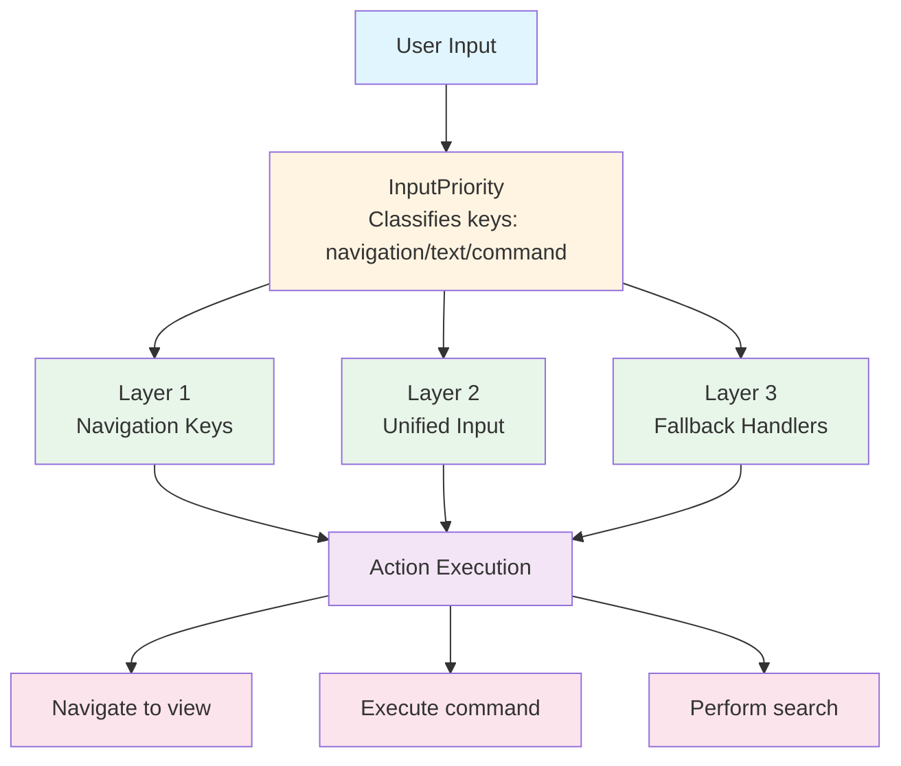
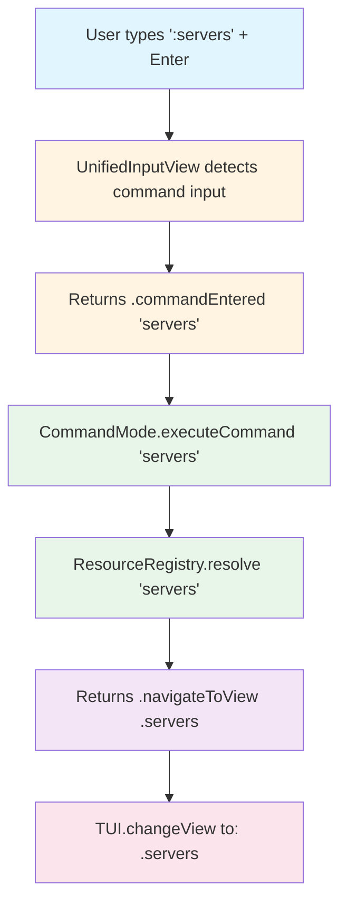
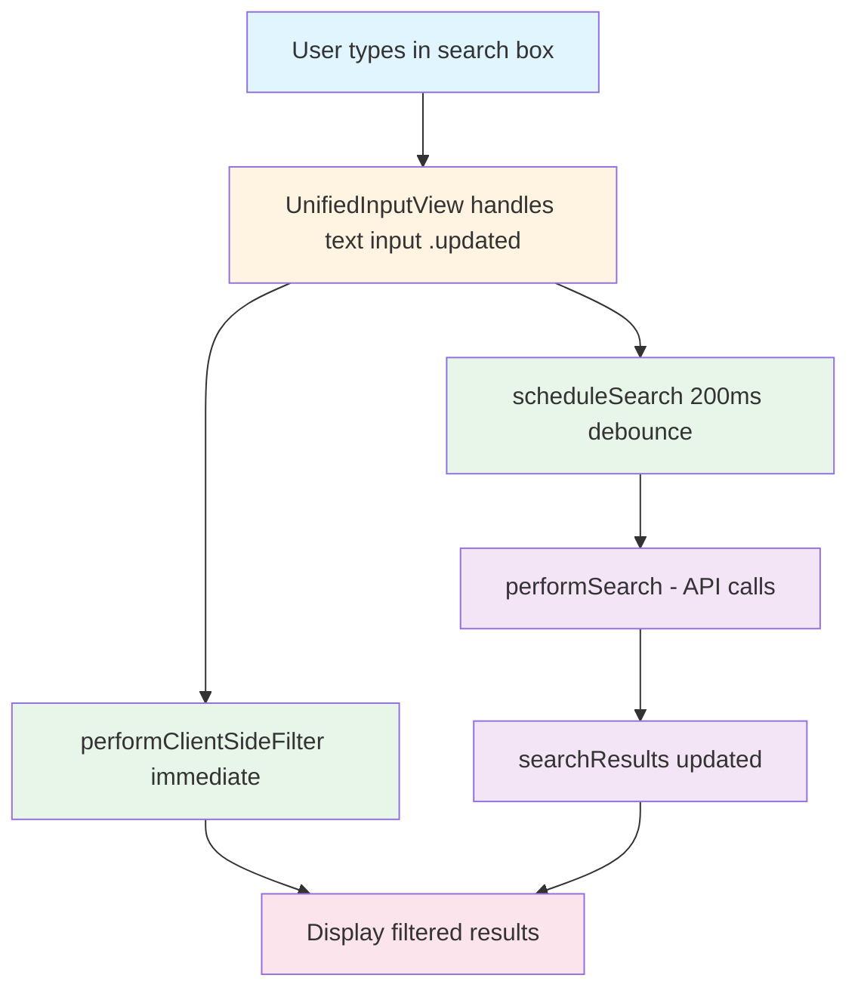

# Navigation System Architecture

**Version**: 2.0
**Last Updated**: 2025-10-08
**Status**: Production Ready

---

Navigating a complex OpenStack environment through a terminal UI could easily become a disaster of nested menus and forgotten keyboard shortcuts. We took a different approach: build a VIM-inspired command system that feels natural to anyone who's spent time in a terminal. Type `:servers` and you're looking at your server list. Type `:fla` and fuzzy matching figures out you meant "flavors". Press `:` and start typing to activate command mode, or use single-key shortcuts for the most common operations.

The system we built combines command-driven navigation with real-time search across all resource types. It's fast, it's discoverable, and it doesn't require memorizing a hundred keyboard shortcuts. This document explains how it all fits together.

## Architecture

The navigation system works in layers. Input comes in as raw key presses, gets classified by priority (is this a navigation key that needs immediate handling, or text input for the search box?), routes through the appropriate handler, and triggers an action. The three-layer priority model ensures navigation keys like Enter and arrow keys work consistently, text input gets delegated to the unified input handler, and view-specific fallbacks catch anything that doesn't fit the standard patterns.

Here's the flow at a high level. When you press a key, InputPriority classifies it into one of four categories: navigation keys that need immediate handling, text input that should go to the search box, command keys that activate command mode, or fallback keys for view-specific handlers. Each classification routes to the appropriate layer, which executes the action and updates the UI.



The directory structure keeps navigation concerns isolated and organized. CommandMode handles command parsing and execution, ResourceRegistry maps aliases to views with fuzzy matching, InputPriority provides the classification system, and LayoutUtilities helps with layout calculations. Views live in their own directory, and search components get their own namespace.

```
Sources/Substation/
|-- Navigation/
|   |-- CommandMode.swift         # Command parsing & execution
|   |-- ResourceRegistry.swift    # Resource aliases & fuzzy matching
|   |-- InputPriority.swift       # Input classification system
|   +-- LayoutUtilities.swift     # Layout helpers
|-- Views/
|   |-- UnifiedInputView.swift    # Unified input state management
|   |-- AdvancedSearchView.swift  # Cross-service search
|   +-- SidebarView.swift         # Navigation sidebar with filtering
+-- Search/
    |-- SearchModels.swift        # Search data structures
    |-- SearchEngine.swift        # Search execution
    +-- SearchIndex.swift         # Search indexing
```

## Core Components

### ResourceRegistry: Mapping Commands to Views

The ResourceRegistry is the heart of the command system. It maintains a comprehensive map of command aliases to view modes, implements fuzzy matching with Levenshtein distance, ranks matches by score, and categorizes commands into logical groups (Compute, Networking, Storage, Services, Utilities). When you type `:srv`, the registry knows you probably meant "servers" and suggests it. When you type `:servrs` with a typo, it still figures out what you meant.

The registry provides several ways to resolve commands. Exact matches return instantly if you type the full command name. Alias matches work for any registered alias (so "srv", "s", and "nova" all resolve to the servers view). Fuzzy matches use Levenshtein distance to find close matches even with typos. And ranked matches return scored results for prefix-based completion.

Here's how you use it in practice. Exact matches are straightforward: pass a string, get a view mode back. Fuzzy matching tries to figure out what you meant when the exact match fails. Ranked matches power the tab completion system by returning all possible matches scored by relevance.

```swift
// Exact match
let view = ResourceRegistry.shared.resolve("servers")  // -> .servers

// Alias match
let view = ResourceRegistry.shared.resolve("srv")      // -> .servers

// Fuzzy match
let suggestion = ResourceRegistry.shared.fuzzyMatch("servrs")  // -> "servers"

// Ranked matches for prefix
let matches = ResourceRegistry.shared.rankedMatches(for: "fla")
// -> [(command: "flavors", score: 99, viewMode: .flavors), ...]
```

The data structure is simple but effective. Each view mode maps to an array of command aliases. When you add a new resource type, you just add it to this map with whatever aliases make sense. The fuzzy matching and ranking logic handles everything else.

```swift
private let resourceMap: [ViewMode: [String]] = [
    .servers: ["servers", "server", "srv", "s", "nova"],
    .flavors: ["flavors", "flavor", "flv", "f", "novaflavors"],
    // ... all resources
]
```

### CommandMode: Parsing and Executing Commands

CommandMode handles everything related to command execution. It parses user input, maintains command history (up to 50 entries), implements tab completion with cycling, supports special commands like `:q` and `:help`, and provides contextual suggestions based on what you're typing.

The command execution flow is straightforward. You type `:servers` and press Enter, UnifiedInputView detects command input and returns it, CommandMode executes the command by resolving it through ResourceRegistry, the registry returns a view mode, and TUI changes to that view. The whole process feels instant because there's no network involved until you actually render the view.



Tab completion is one of those features that seems simple but makes a huge difference in usability. Press Tab while typing a command and you'll see the first matching command. Press Tab again and it cycles through all matches, showing you a hint like "Tab: servers (1/3)" so you know where you are in the list. It's the kind of feature that becomes muscle memory after a few uses.

### InputPriority: Classifying Key Presses

InputPriority solves a problem that plagued earlier versions of the code: how do you know which handler should process a key press? The solution is classification. Every key gets classified into one of four categories based on predefined key sets, and the classification determines which layer handles it.

Navigation keys (Enter, arrows, Page Up/Down) need immediate handling and bypass other processing. Text input keys (alphanumerics, backspace) go to UnifiedInputView for state management. Command keys (colon) activate command mode. And fallback keys go to view-specific handlers for custom behavior.

Here's how you use InputPriority in a view. Classify the key first, then switch on the classification to determine which handler processes it. Navigation keys typically get handled first to ensure immediate response. Text input delegates to UnifiedInputView. And fallback keys go to view-specific logic.

```swift
let priority = InputPriority.classify(key)

switch priority {
case .navigation:
    // Handle Enter, arrows, Page Up/Down immediately
    return handleNavigation(key)

case .textInput:
    // Delegate to UnifiedInputView
    return handleTextInput(key)

case .command:
    // Activate command input
    activateCommandInput()

case .fallback:
    // View-specific handlers
    return handleFallback(key)
}
```

The key sets are defined explicitly so there's no ambiguity about what goes where. Navigation keys are the obvious ones: Enter (both key codes), arrow keys, and Page Up/Down. Text editing keys include backspace and cursor movement. Command keys are just the colon. Control keys are ESC and Tab. And printable keys are the standard ASCII alphanumerics.

### UnifiedInputView: Managing Input State

UnifiedInputView provides centralized input state management across all views. It tracks the display text and cursor position, detects command input automatically when you type `:`, manages the text buffer, and reports results through a clean enum so callers know exactly what happened.

The input state structure captures everything needed to manage text input. Display text is what the user sees, cursor position tracks where they're typing, isActive indicates whether the input box has focus, isCommandMode switches to true when command input is detected, and placeholder provides helpful hints when the box is empty.

```swift
struct InputState {
    var displayText: String = ""
    var cursorPosition: Int = 0
    var isActive: Bool = false
    var isCommandMode: Bool = false
    var placeholder: String = "Type to search or : for commands"
}
```

The usage pattern is consistent across all views. You maintain an input state variable, pass it to UnifiedInputView.handleInput (which mutates it in place), and then switch on the result to know what action to take. Updated means the text changed. SearchEntered means the user pressed Enter while searching. CommandEntered means they pressed Enter after typing a command. Cancelled means they pressed ESC to clear.

### AdvancedSearchView: Cross-Service Search

AdvancedSearchView implements the search functionality that spans all 19 OpenStack resource types. It performs client-side filtering for instant feedback, debounces API searches by 200ms to avoid hammering the API, uses ID-based selection that persists through filtering, and provides navigation to resource detail views.

The selection architecture deserves explanation because it's more sophisticated than it looks. We store the selected resource ID, not the array index. This means when you filter the results, your selection stays on the same resource even though its index might change. Helper functions translate between IDs and indices, and moving selection up or down updates the ID to match the new position.

```swift
// ID-based selection (survives filtering)
private static var selectedResourceId: String? = nil

// Helper to get index from ID
private static func getSelectedIndex(in results: [SearchResult]) -> Int {
    guard let resourceId = selectedResourceId else { return 0 }
    return results.firstIndex { $0.resourceId == resourceId } ?? 0
}
```

## Input Handling: The 3-Layer Model

Input handling uses a priority-based delegation model to ensure the right handler processes each key press. The model has three layers with decreasing priority.

### Layer 1: View-Specific Navigation

Layer 1 handles navigation keys that require immediate response. This includes Enter for navigating to selected items, arrow keys for moving selection, and Page Up/Down for fast navigation. Views use this layer when navigation must happen before other processing, when default behavior needs to be overridden, or when view-specific navigation logic is required.

Here's an example from AdvancedSearchView. When in main search mode and InputPriority says it's a navigation key, we check if it's Enter and if we have results. If both are true, we navigate to the detail view and return true to indicate we handled the input. Otherwise, we fall through to Layer 2.

```swift
static func handleInput(_ key: Int32) -> Bool {
    let priority = InputPriority.classify(key)

    // PRIORITY 1: Handle navigation keys first
    if inMainSearchMode && priority == .navigation {
        if key == 10 || key == 13 {  // Enter
            if !filteredResults.isEmpty || !searchResults.isEmpty {
                navigateToDetailView()
                return true
            }
        }
    }

    // Fall through to Layer 2...
}
```

### Layer 2: UnifiedInputView State Management

Layer 2 handles text input, command input state, and cursor management. This layer processes alphanumerics for text input, backspace for deleting characters, arrow keys for cursor movement, colon for activating command input, ESC for canceling, and Tab for completion. Use this layer for standard text input, command input activation, and cursor management.

The usage pattern is consistent. If we're in the appropriate mode, we delegate to UnifiedInputView.handleInput and switch on the result. Updated means we should refresh any client-side filtering and schedule a debounced search. CommandEntered means we should execute the command. The other result cases handle their respective scenarios.

### Layer 3: Fallback Handlers

Layer 3 handles view-specific keys not covered by Layers 1 and 2. This includes view-specific shortcuts, special function keys, and legacy key bindings. It's the catch-all for anything that doesn't fit the standard patterns.

The fallback pattern is simple: if neither Layer 1 nor Layer 2 handled the key, call your view-specific handler. This might handle arrow keys in specific contexts, single-key shortcuts, or any other custom behavior your view needs.

## Command System

### Activating Command Mode

Command mode activates when you type `:` (colon). The visual indicator changes from `>` to `:` in the input prompt, and the state updates to reflect command input mode. It's a small detail but it makes the mode clear at a glance.

### Supported Commands

Navigation commands cover all the resource types we support. `:servers` goes to servers, `:networks` to networks, `:volumes` to volumes, and so on. Special commands include `:help` for the help view, `:q` or `:quit` to exit, and `:commands` to list all available commands. Future commands will include `:ctx` to list cloud contexts and `:ctx <name>` to switch contexts.

### Tab Completion

Tab completion makes command entry fast and accurate. Press Tab while entering a command and you'll see the first matching command. Press Tab again and it cycles through all matches. The system displays hints like "Tab: servers (1/3)" so you know there are three matches and you're looking at the first one.

The example flow shows how this feels in practice. You type `:ser`, press Tab, and it completes to "servers". Press Tab again and it cycles to "servergroups". Press Tab once more and it cycles back to "servers". It's fast, predictable, and saves typing.

### Command History

Command history keeps your last 50 commands in memory. Navigate with up arrow for previous commands and down arrow for next commands. The limit is configurable but 50 is enough for most sessions. Persistence is in-memory only so history resets on restart, which is fine for a TUI that typically runs for short sessions.

## Search System

The search system provides cross-service resource search across all 19 OpenStack resource types. Fuzzy search enables partial matching, real-time filtering provides instant client-side filtering as you type, debounced search waits 200ms after you stop typing to avoid excessive API calls, ID-based selection persists through filtering, and navigation takes you to the selected resource.

### Search Flow

Here's how a search flows through the system. You type in the search box, UnifiedInputView handles the text input and returns updated, we perform client-side filtering immediately for instant feedback, we schedule a search with 200ms debounce, the client-side filter displays results right away, the debounced search fires if you've stopped typing, we perform the API search across services, update searchResults with the response, and display the combined filtered results.



### Client-Side Filtering vs Debounced Search

Client-side filtering runs on every keystroke for instant feedback, operates on up to 1000 cached results, and provides immediate visual response. Debounced API search waits 200ms after you stop typing, searches across all 19 resource types, and updates the results with fresh data from the API.

The debouncing logic is straightforward. Cancel any existing search task, create a new task that sleeps for 200ms, then perform the search if the task hasn't been cancelled. This prevents us from firing a new API request on every keystroke while still making search feel responsive.

### Resource Types

We search across four categories of OpenStack resources. Compute includes servers, server groups, flavors, and keypairs. Networking covers networks, subnets, routers, ports, floating IPs, and security groups. Storage includes volumes, volume snapshots, volume backups, and images. Services covers Barbican secrets and containers, load balancers, and Swift containers and objects.

### Selection Behavior

ID-based selection is one of those details that elevates the user experience from "functional" to "polished". Selection ties to resource ID, not array index, which means selection persists when filtering results. There's no manual index clamping needed, and the UX is intuitive: your selection stays where you put it even as the filtered results change.

The implementation stores the selected resource ID, converts to index for display using a helper function, and moves selection by updating the ID to match the new position. When you filter, the selection stays on the same resource (if it's still in the results) or defaults to the first result if your previous selection got filtered out.

## Performance

Fuzzy matching runs in O(n) time where n is the number of aliases (about 50). This is fast enough that it feels instant. If we ever needed to optimize, we could add early exit when we have enough good matches, but so far it hasn't been necessary.

Search performance is where the debouncing and client-side filtering really pay off. The 200ms delay avoids excessive API calls, client-side filtering provides immediate feedback without any network traffic, and the 1000-result limit keeps the UI responsive even with large datasets.

If search ever becomes slow, we have several knobs to turn: reduce resultsPerPage (default 20), increase searchDebounceDelay (default 200ms), or disable cross-service search for specific queries. So far we haven't needed to touch these.

## Adding New Resources

Adding a new resource type to the navigation system is straightforward. You add the aliases to ResourceRegistry, add a ViewMode case if it's a new type, optionally add search support if the resource should be searchable, implement the view, and test that commands, completion, and fuzzy matching work.

The process takes about 15 minutes for a simple resource type. Add the aliases to the resource map, add the ViewMode case with title and key, add the SearchResourceType enum case, implement indexing logic, add to AdvancedSearchView's initialization, create the view, and test all the navigation paths.

## Related Documentation

For more context on the broader architecture and how navigation fits into the overall system:

- [Architecture Overview](./overview.md) - High-level design principles
- [Component Architecture](./components.md) - UI component details
- [Swift 6.1 Documentation](https://swift.org/documentation/)
