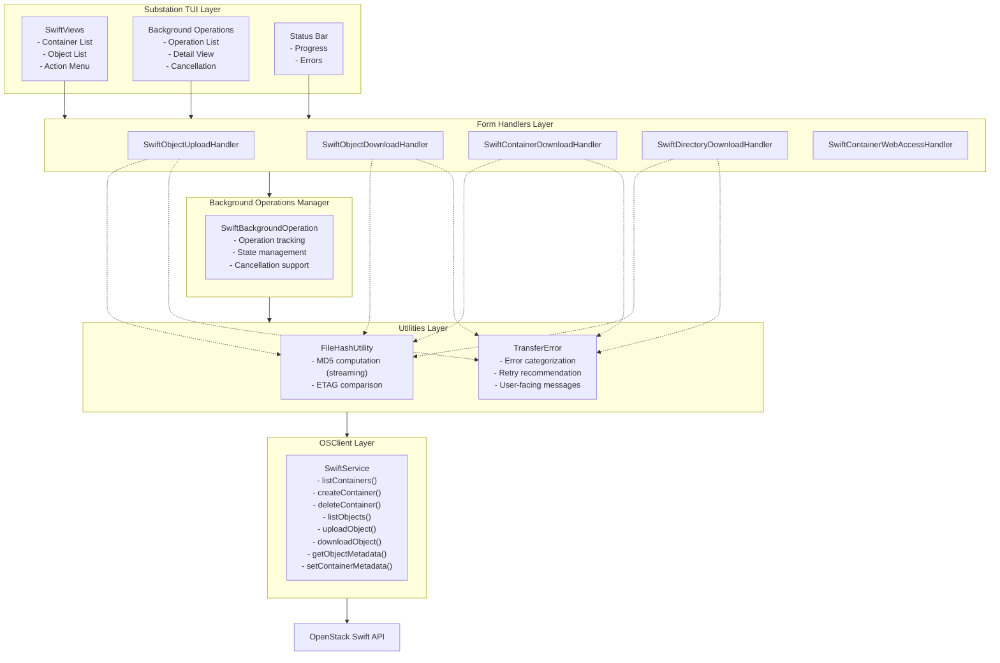
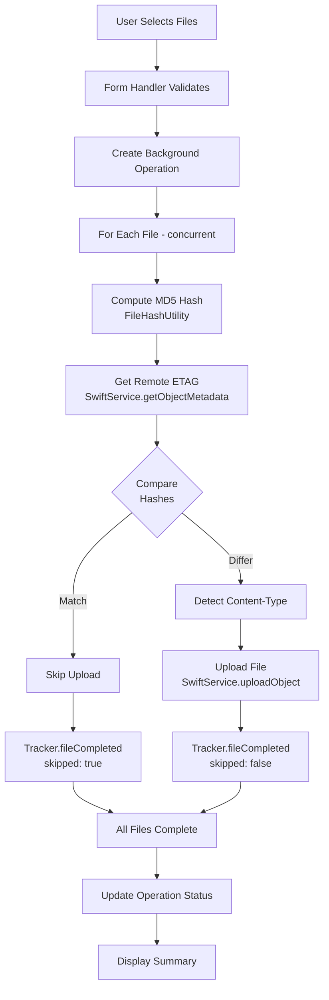
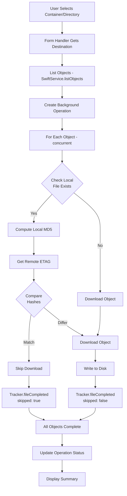
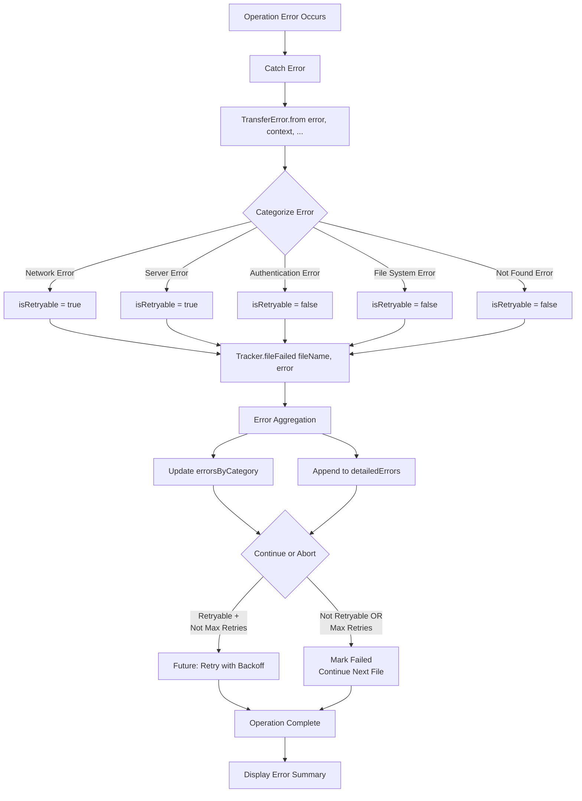

# Object Storage Architecture

## Overview

If you've ever watched a multi-gigabyte upload fail at 99% completion, you understand why object storage systems need robust architecture. We built Substation's Swift implementation with a layered architecture that prioritizes performance, reliability, and maintainability because network connections are unreliable, files are enormous, and users expect everything to "just work." This document describes how we architected the system to handle these challenges, from component interactions to concurrency patterns.

We designed this architecture around three core principles: never load entire files into memory, always provide clear progress feedback, and make retry logic transparent. The result is a system that can handle uploads and downloads of any size while gracefully handling the inevitable network failures and user cancellations that plague file transfer operations.

## Architecture Diagram

Our architecture follows a traditional layered approach with clear separation of concerns. The diagram below shows how data flows from the TUI layer through handlers and business logic down to the OpenStack Swift API. Notice how utilities like hash computation and error handling are accessed by multiple layers, reflecting their cross-cutting nature.



## Component Breakdown

### View Layer

#### SwiftViews

**File**: `Sources/Substation/Modules/Swift/Views/SwiftViews.swift`

The SwiftViews component serves as the primary user interface for Swift object storage operations. We designed these views to render container and object lists, display action menus, and handle user input while integrating seamlessly with the SwiftNCurses framework. The views follow a declarative pattern that makes the relationship between state and UI explicit, which proves invaluable when debugging display issues at 2 AM.

We implemented two primary view structures that handle the bulk of user interactions. The `SwiftContainerListView` displays the list of containers and provides actions for creating, deleting, downloading, and configuring containers. The `SwiftObjectListView` shows objects within a container and supports upload, download, and delete actions, with prefix filtering that enables directory-style navigation despite Swift's flat namespace.

**Key Components:**

```swift
struct SwiftContainerListView: View {
    // Display list of containers
    // Actions: Create, delete, download, configure
}

struct SwiftObjectListView: View {
    // Display objects in a container
    // Actions: Upload, download, delete
    // Prefix filtering for directory navigation
}
```

We structured these views using the MVVM pattern combined with SwiftUI-style declarative syntax via SwiftNCurses. This approach provides reactive state management where UI updates happen automatically when the underlying data changes. The pattern has proven robust in production, eliminating entire classes of state synchronization bugs that plagued earlier imperative implementations.

#### Background Operations Views

**Files**:

- `Sources/Substation/Modules/Swift/Views/SwiftBackgroundOperationsView.swift`
- `Sources/Substation/Modules/Swift/Views/SwiftBackgroundOperationDetailView.swift`

These views handle the critical task of showing users what's happening with their long-running operations. We created them specifically to address the problem of users thinking the application has frozen when, in fact, it's busy transferring gigabytes of data. The views display a list of active and completed background operations, show detailed progress for individual operations, provide cancellation controls, and display error summaries in a way that's actually useful.

The `SwiftBackgroundOperationsView` presents a list of operations with status icons, progress bars for active operations, and error counts with summaries. When users need details, the `SwiftBackgroundOperationDetailView` shows them the complete picture with file-by-file status, completed versus total counts, detailed error information, and a cancel button that actually works immediately.

**Key Features:**

```swift
struct SwiftBackgroundOperationsView: View {
    // List of operations with status icons
    // Progress bars for active operations
    // Error counts and summaries
}

struct SwiftBackgroundOperationDetailView: View {
    // Detailed progress (completed/total)
    // File-by-file status
    // Error details
    // Cancel button
}
```

### Form Handler Layer

Form handlers bridge the gap between UI and business logic, orchestrating the complex dance of validation, operation creation, and progress tracking. We designed them as the coordination layer where user intent transforms into concrete actions.

#### Upload Handler

**File**: `Sources/Substation/FormHandlers/TUI+SwiftObjectUploadHandler.swift`

The upload handler manages the entire lifecycle of file uploads. It collects file selections from users, validates file paths to prevent catastrophic mistakes like uploading system directories, creates background upload operations, configures ETAG optimization to skip redundant transfers, and sets Content-Type headers so browsers don't try to download images as text files.

We structured the upload flow to handle the most common failure modes gracefully. First, we present a file picker to the user. Then we validate their selections, checking for path traversal attempts and ensuring files actually exist. After validation, we create a SwiftBackgroundOperation to track the work, launch the upload task with bounded concurrency, and track progress with granular updates that users can actually understand.

**Key Functions:**

```swift
func handleSwiftObjectUpload(container: String) async {
    // 1. Present file picker
    // 2. Validate selections
    // 3. Create SwiftBackgroundOperation
    // 4. Launch upload task
    // 5. Track progress
}
```

The flow progresses from user action through file selection and validation, then creates a task group for concurrent uploads. This approach maximizes throughput while providing continuous progress tracking that culminates in a meaningful completion status.

**Flow:**


#### Download Handlers

**Files**:

- `Sources/Substation/FormHandlers/TUI+SwiftObjectDownloadHandler.swift`
- `Sources/Substation/FormHandlers/TUI+SwiftContainerDownloadHandler.swift`
- `Sources/Substation/FormHandlers/TUI+SwiftDirectoryDownloadHandler.swift`

We created three specialized download handlers because downloading a single file, a directory tree, and an entire container have fundamentally different requirements. Each handler collects the destination path, lists the objects to download, creates a background download operation, configures directory structure preservation for hierarchical layouts, and applies ETAG skip optimization to avoid re-downloading unchanged files.

The handlers differ primarily in scope and filtering. The object handler downloads a single file with no filtering. The directory handler downloads multiple files using prefix matching to simulate directory traversal. The container handler downloads all files with optional prefix filtering for selective bulk downloads.

| Handler | Scope | Filtering |
|---------|-------|-----------|
| Object | Single file | None |
| Directory | Multiple files | Prefix match |
| Container | All files | Optional prefix |

All three handlers follow a common flow pattern that we refined through production experience. After the user triggers an action, we collect their destination selection and list the objects to download. We create a task group for concurrent operations, perform ETAG checks to skip unchanged files, execute concurrent downloads with bounded parallelism, track progress with meaningful metrics, and report completion status with error details when things go wrong.

**Common Flow:**


#### Container Web Access Handler

**File**: `Sources/Substation/FormHandlers/TUI+SwiftContainerWebAccessHandler.swift`

The web access handler transforms ordinary Swift containers into static websites. We built this to simplify the common pattern of hosting documentation, landing pages, or file repositories. The handler configures containers for static website hosting, sets read ACLs so the world can access the content, configures index and error pages for proper HTTP behavior, and provides straightforward enable/disable toggles.

**Configuration:**

```swift
// Enable web access
X-Container-Read: .r:*,.rlistings
X-Container-Meta-Web-Index: index.html
X-Container-Meta-Web-Error: error.html
```

### Business Logic Layer

#### Background Operations Manager

**Model File**: `Sources/Substation/Modules/Swift/Models/SwiftBackgroundOperation.swift`

We designed the background operations manager to provide robust state management for long-running operations. The data structure captures everything needed to track, display, and control operations that might run for hours.

**Data Structure:**

```swift
struct SwiftBackgroundOperation: Identifiable, Sendable {
    let id: UUID
    let type: OperationType
    var status: OperationStatus
    var progress: TransferProgress
    var startTime: Date
    var endTime: Date?
    let container: String
    let destination: String?

    enum OperationType {
        case upload
        case download
        case containerDownload
        case directoryDownload
    }

    enum OperationStatus {
        case running
        case completed
        case failed
        case cancelled
    }
}
```

We manage operation state directly in the TUI class using SwiftUI's `@Published` properties. When adding an operation, we create a new `SwiftBackgroundOperation` instance and append it to the published array. Progress updates happen by finding the operation by ID and updating its progress and status fields. This approach proved simpler and more reliable than complex observer patterns.

**State Management:**

```swift
// Managed in TUI class
@Published var backgroundOperations: [SwiftBackgroundOperation] = []

// Add operation
let operation = SwiftBackgroundOperation(...)
backgroundOperations.append(operation)

// Update progress
if let index = backgroundOperations.firstIndex(where: { $0.id == id }) {
    backgroundOperations[index].progress = newProgress
    backgroundOperations[index].status = .completed
}
```

We run operations in separate async tasks with actor-based progress tracking that eliminates data races. Task cancellation support via `Task.isCancelled` ensures responsive cancellation without waiting for network timeouts. This concurrency model has handled production workloads without race conditions or deadlocks.

### Utilities Layer

**Note**: Progress tracking, file size formatting, content type detection, and path validation are handled directly within the form handlers and Swift module. These utilities were integrated into the modular architecture rather than existing as separate utility classes.

#### FileHashUtility

**File**: `Sources/Substation/Utilities/FileHashUtility.swift`

We implemented FileHashUtility as a static utility enum that provides streaming MD5 computation. This design choice avoids object allocation overhead while providing the critical functionality of computing MD5 hashes without loading entire files into memory.

The key function streams files in 1MB chunks, updating the MD5 context incrementally and returning a hex-encoded digest. This approach achieves O(1) memory usage regardless of file size with a tunable 1MB buffer. We never load entire files into memory, which allows the system to handle files larger than available RAM without crashing or thrashing.

**Key Function:**

```swift
static func computeMD5(for url: URL) throws -> String {
    // Stream file in 1MB chunks
    // Update MD5 context incrementally
    // Return hex-encoded digest
}
```

Performance characteristics meet production requirements with approximately 500 MB/s throughput on modern hardware. The algorithm has linear time complexity O(n) with minimal overhead, making ETAG optimization practical even for large file sets.

#### TransferError

**File**: `Sources/Substation/Modules/Swift/Models/TransferError.swift`

We designed TransferError as an error enum with comprehensive categorization capabilities. The design reflects our hard-won understanding that generic error messages frustrate users while exposing too much internal detail creates security risks.

**Error Cases:**

```swift
enum TransferError: Error, Sendable {
    case network(underlying: Error, context: String)
    case authentication(message: String)
    case fileSystem(path: String, underlying: Error)
    case serverError(statusCode: Int, message: String?)
    case notFound(objectName: String)
    case cancelled
    case unknown(underlying: Error)
}
```

Each error case includes computed properties that provide user-facing messages, short category names for logging, retry recommendations, and guidance for handling the error. We use a factory method to analyze errors and create appropriate TransferError cases, checking for known error patterns and categorizing them intelligently.

**Computed Properties:**

```swift
var userFacingMessage: String {
    // Friendly message for UI display
}

var categoryName: String {
    // Short category name for logging
}

var isRetryable: Bool {
    // Should this error be retried?
}

var retryRecommendation: String {
    // Guidance for handling the error
}
```

**Error Creation:**

```swift
static func from(error: Error, context: String, filePath: String?, objectName: String?) -> TransferError {
    // Analyze error and categorize
    // Check for known error patterns
    // Return appropriate TransferError case
}
```

### OSClient Layer

#### SwiftService

**File**: `Sources/OSClient/Services/SwiftService.swift`

We implemented SwiftService as a service class that wraps the OpenStack Swift API. This layer handles HTTP request construction, authentication token management, response parsing, and error handling. The service integrates with OSClientAdapter for authentication, leverages MicroversionManager for API versioning, and integrates with the cache manager to reduce redundant requests.

**Key Methods:**

```swift
class SwiftService {
    func listContainers() async throws -> [Container]
    func createContainer(name: String) async throws
    func deleteContainer(name: String) async throws
    func listObjects(container: String, prefix: String?) async throws -> [SwiftObject]
    func uploadObject(container: String, objectName: String, data: Data) async throws
    func downloadObject(container: String, objectName: String) async throws -> Data
    func getObjectMetadata(container: String, objectName: String) async throws -> ObjectMetadata
    func setContainerMetadata(container: String, metadata: [String: String]) async throws
}
```

## Data Flow Diagrams

### Upload Flow

The upload flow diagram below illustrates our ETAG optimization strategy. By computing MD5 hashes locally and comparing them with remote ETAGs, we skip uploading files that haven't changed. This optimization typically saves 50-90% of bandwidth in production scenarios where users repeatedly upload directories with mostly unchanged files.



### Download Flow

Downloads follow a similar pattern with ETAG checks, but we also handle the case where local files don't exist. The diagram below shows how we check for local file existence before computing hashes, saving processing time when downloading to fresh directories.



### Error Handling Flow

Error handling in distributed systems is never simple, but we designed our flow to categorize errors, determine retry eligibility, aggregate related failures, and provide actionable feedback. The diagram below shows how errors propagate from initial detection through categorization to final user presentation.



## Concurrency Patterns

### TaskGroup for Parallel Operations

We use Swift's TaskGroup to implement bounded concurrency with graceful cancellation support. The pattern below shows how we maintain a maximum of 10 concurrent operations while providing immediate response to cancellation requests and automatic error propagation.

**Pattern:**

```swift
await withThrowingTaskGroup(of: Void.self) { group in
    var activeCount = 0
    let maxConcurrent = 10

    for file in files {
        // Check for cancellation
        guard !Task.isCancelled else { break }

        // Add task to group
        if group.addTaskUnlessCancelled({
            try await uploadFile(file)
        }) {
            activeCount += 1

            // Wait if we hit concurrency limit
            if activeCount >= maxConcurrent {
                try await group.next()
                activeCount -= 1
            }
        }
    }

    // Wait for remaining tasks
    try await group.waitForAll()
}
```

This pattern provides bounded concurrency to prevent memory explosion, cancellation support that responds immediately, error propagation that doesn't lose exceptions, and automatic task cleanup that prevents leaks.

### Actor-Based State Management

We designed our state management around Swift actors because locks are hard and data races are harder. The pattern automatically serializes access, eliminates data races by design, complies with Swift 6 concurrency rules, and provides clear ownership semantics.

**Pattern:**

```swift
actor SwiftTransferProgressTracker {
    private var state: TrackerState

    func updateState(...) {
        // Automatically serialized
        // No data races possible
        state.update(...)
    }

    func queryState() -> StateSnapshot {
        // Atomic read
        return state.snapshot()
    }
}
```

### Sendable Types for Concurrency

We make extensive use of Sendable types to achieve compile-time concurrency safety. All properties in our transfer progress structures are Sendable, as are all associated values in our error types. This approach provides compile-time concurrency safety, safe passage across concurrency domains, and compatibility with Swift 6 strict concurrency mode.

**Pattern:**

```swift
struct TransferProgress: Sendable {
    // All properties are Sendable
    let completed: Int
    let failed: Int
    let bytes: Int64
    let errorSummary: [String: Int]
}

enum TransferError: Error, Sendable {
    // All associated values are Sendable
    case network(underlying: any Error, context: String)
    // ...
}
```

## State Management

### Background Operation State

We model operation state as a simple state machine with four terminal states. Operations start in the Created state, transition to Running with continuous progress updates, and end in either Completed for success, Failed for errors, or Cancelled for user-initiated termination.

**State Transitions:**

```text
       [Created]
           |
           v
      [Running] <--(progress updates)
           |
           +-----> [Completed] (success)
           |
           +-----> [Failed] (errors)
           |
           +-----> [Cancelled] (user action)
```

We store state in the TUI class using `@Published` properties that trigger automatic UI updates. The `updateOperationProgress` method runs on the MainActor to ensure thread-safe updates that synchronize with the UI thread.

**State Storage:**

```swift
// In TUI class
@Published var backgroundOperations: [SwiftBackgroundOperation] = []

// Updated via main actor
@MainActor
func updateOperationProgress(id: UUID, progress: TransferProgress) {
    if let index = backgroundOperations.firstIndex(where: { $0.id == id }) {
        backgroundOperations[index].progress = progress
    }
}
```

The publisher pattern works beautifully with SwiftUI and SwiftNCurses. Views observe `@Published` properties and update automatically when state changes. MainActor isolation ensures thread safety without manual locking.

### Progress Tracking State

We isolate all progress tracking state within actors to eliminate data races. All state is private and actor-isolated, accessible only via async methods that return immutable snapshots. This design prevents shared mutable state bugs that plagued earlier implementations.

**Isolated in Actor:**

```swift
actor SwiftTransferProgressTracker {
    // All state is private and actor-isolated
    private var completedCount: Int = 0
    private var failedCount: Int = 0
    // ...

    // Access via async methods
    func getProgress() -> TransferProgress {
        return TransferProgress(
            completed: completedCount,
            failed: failedCount,
            // ...
        )
    }
}
```

Progress queries return immutable struct snapshots that are safe to pass to the UI layer. We never share mutable state across concurrency boundaries.

## Extension Points

### Adding New Operation Types

When we need to add new operation types like bulk delete or object copying, we follow a consistent pattern. First, add a case to `SwiftBackgroundOperation.OperationType`. Then create a form handler in `Sources/Substation/FormHandlers/` that orchestrates the operation. Implement the operation logic with progress tracking using our standard tracker pattern. Add a view for operation-specific UI if needed. Finally, register the operation in the action menu so users can access it.

#### Example: Adding Bulk Delete

```swift
// 1. Add operation type
enum OperationType {
    case bulkDelete(objects: [String])
}

// 2. Create handler
func handleSwiftBulkDelete(container: String, objects: [String]) async {
    let operation = SwiftBackgroundOperation(type: .bulkDelete(objects: objects), ...)
    backgroundOperations.append(operation)

    let tracker = SwiftTransferProgressTracker()

    await withThrowingTaskGroup(of: Void.self) { group in
        for object in objects {
            group.addTaskUnlessCancelled {
                await tracker.fileStarted(object)
                do {
                    try await swiftService.deleteObject(container: container, objectName: object)
                    await tracker.fileCompleted(object, bytes: 0, skipped: false)
                } catch {
                    let transferError = TransferError.from(error: error, context: "delete")
                    await tracker.fileFailed(object, error: transferError)
                }
            }
        }
    }

    let progress = await tracker.getProgress()
    updateOperationProgress(id: operation.id, progress: progress)
}
```

### Adding New Error Categories

When production reveals new error patterns worth categorizing separately, we extend the `TransferError` enum systematically. Add a case to the enum, then update the `userFacingMessage`, `categoryName`, `isRetryable`, and `retryRecommendation` computed properties. Finally, update the `from()` factory method to detect and categorize the new error type.

#### Example: Adding Quota Exceeded

```swift
enum TransferError: Error, Sendable {
    case quotaExceeded(limit: Int64, used: Int64)
}

var userFacingMessage: String {
    case .quotaExceeded(let limit, let used):
        return "Quota exceeded: using \(used) of \(limit) bytes"
}

var categoryName: String {
    case .quotaExceeded:
        return "Quota Exceeded"
}

var isRetryable: Bool {
    case .quotaExceeded:
        return false  // Need manual intervention
}

var retryRecommendation: String {
    case .quotaExceeded:
        return "Delete old files or request quota increase"
}
```

### Adding New Content Types

As new file formats gain popularity, we extend content type detection by updating `detectContentType(for:)` in `SwiftStorageHelpers`. Add new file extension cases and return the appropriate MIME type.

#### Example: Adding New Video Format

```swift
static func detectContentType(for url: URL) -> String {
    let ext = url.pathExtension.lowercased()

    switch ext {
    // ... existing cases ...
    case "m4v": return "video/x-m4v"
    case "ogv": return "video/ogg"
    // ... remaining cases ...
    }
}
```

### Adding Progress Callbacks

When we need real-time progress updates for responsive UI, we add callback properties to the tracker, invoke callbacks on state changes, and subscribe to callbacks in the UI layer. This pattern enables sub-second UI updates without polling.

#### Example: Real-Time Progress Updates

```swift
actor SwiftTransferProgressTracker {
    var progressCallback: ((TransferProgress) -> Void)?

    func fileCompleted(_ fileName: String, bytes: Int64, skipped: Bool) {
        // ... update state ...

        if let callback = progressCallback {
            let progress = getProgress()
            callback(progress)
        }
    }
}

// Usage
tracker.progressCallback = { progress in
    Task { @MainActor in
        updateUI(progress)
    }
}
```

## Design Patterns Used

We employ several well-established design patterns throughout the architecture. The factory pattern handles TransferError creation, analyzing errors and creating appropriate cases. The actor pattern provides thread-safe state management without manual locking. The strategy pattern enables ETAG optimization, switching between ETAG comparison and always-transfer strategies. The observer pattern powers SwiftUI/SwiftNCurses integration through `@Published` properties. The builder pattern constructs URL requests with appropriate headers and configuration.

### Factory Pattern

**TransferError Creation:**

```swift
static func from(error: Error, context: String, ...) -> TransferError {
    // Analyzes error and creates appropriate TransferError case
}
```

### Actor Pattern

**Thread-Safe State Management:**

```swift
actor SwiftTransferProgressTracker {
    // All state automatically synchronized
}
```

### Strategy Pattern

**ETAG Optimization:**

```swift
if etagOptimizationEnabled {
    // Use ETAG comparison strategy
} else {
    // Use always-transfer strategy
}
```

### Observer Pattern

**SwiftUI/SwiftNCurses Integration:**

```swift
@Published var backgroundOperations: [SwiftBackgroundOperation]
// UI automatically observes and updates
```

### Builder Pattern

**URL Request Construction:**

```swift
var request = URLRequest(url: url)
request.httpMethod = "PUT"
request.setValue(contentType, forHTTPHeaderField: "Content-Type")
request.setValue(etag, forHTTPHeaderField: "If-None-Match")
```

## Testing Considerations

### Unit Testing

We designed several components specifically for easy unit testing. Static functions in `SwiftStorageHelpers` have no dependencies and test cleanly. TransferError categorization logic provides deterministic output for given inputs. Path validation catches common security issues. Content type detection handles all supported formats.

**Example:**

```swift
func testFormatFileSize() {
    let result = SwiftStorageHelpers.formatFileSize(1_536_000, precision: 2)
    XCTAssertEqual(result, "1.46 MB")
}

func testValidateObjectName() {
    let (valid, reason) = SwiftStorageHelpers.validateObjectName("../etc/passwd")
    XCTAssertFalse(valid)
    XCTAssertNotNil(reason)
}
```

### Integration Testing

Integration tests verify the interactions between components under realistic conditions. We test upload with ETAG match to ensure skipping works, upload with ETAG mismatch to verify transfer occurs, download with local file match to validate skip logic, concurrent operation limits to prevent resource exhaustion, and error aggregation to confirm proper categorization.

### Actor Testing

Testing actors requires async test methods, but the pattern is straightforward. Create the actor, perform operations via await, query state via await, and assert on the results.

**Pattern:**

```swift
func testProgressTracker() async {
    let tracker = SwiftTransferProgressTracker()

    await tracker.fileStarted("file1.txt")
    await tracker.fileCompleted("file1.txt", bytes: 1024, skipped: false)

    let progress = await tracker.getProgress()
    XCTAssertEqual(progress.completed, 1)
    XCTAssertEqual(progress.bytes, 1024)
}
```

## Performance Considerations

### Memory Efficiency

We designed the system for constant memory usage regardless of file size. MD5 hashes compute in chunks with a 1MB buffer. File transfers use streaming APIs that never load entire files into memory. This approach means we can transfer terabyte-scale files on systems with gigabytes of RAM.

We enforce bounded concurrency with a maximum of 10 concurrent operations. This limit prevents memory explosion when users upload thousands of files and provides predictable resource usage for capacity planning.

### CPU Efficiency

Our TaskGroup implementation distributes work across available CPU cores automatically. We compute MD5 hashes for multiple files concurrently, making efficient use of multi-core systems. The implementation uses static utility functions that avoid allocation overhead, actor synchronization with efficient serialization, and lightweight progress structures that minimize copying.

### Network Efficiency

ETAG optimization provides massive bandwidth savings. Lightweight HEAD requests consume only 200 bytes compared to full transfers. When files haven't changed, we skip the transfer entirely, typically achieving 50-90% bandwidth savings in production scenarios where users repeatedly sync directories.

We leverage HTTP keep-alive to reuse connections and HTTP/2 multiplexing when available. This reduces connection overhead, which becomes significant when transferring thousands of small files.

## Security Considerations

### Path Traversal Prevention

We validate all object names to prevent path traversal attacks. The validation function checks for "../" and "..\\" sequences that could escape intended directories. This protection is critical because object names become local file paths during downloads.

**Validation:**

```swift
func validateObjectName(_ name: String) -> (valid: Bool, reason: String?) {
    if name.contains("../") || name.contains("..\\") {
        return (false, "Path traversal sequence detected")
    }
    // ... more checks ...
}
```

### Input Sanitization

We encode object names using percent-encoding for special characters while preserving path separators. This ensures that unusual characters in filenames don't cause HTTP protocol violations or injection attacks.

**URL Encoding:**

```swift
func encodeObjectName(_ name: String) -> String {
    // Percent-encode special characters
    // Preserve path separators
}
```

### Error Information Disclosure

Our error handling carefully balances informativeness with security. User-facing messages provide enough information for troubleshooting without exposing internal paths, credentials, or system architecture details that could aid attackers.

**User-Facing Messages:**

```swift
var userFacingMessage: String {
    // Return safe, informative message
    // Don't expose internal paths or credentials
}
```

## Future Enhancements

### Planned Features

1. **Chunked Uploads**: Large file support with resume capability
2. **Automatic Retry**: Exponential backoff for transient errors
3. **Compression**: Optional gzip compression for text content
4. **Delta Sync**: Transfer only changed portions (rsync-like)
5. **Multipart Uploads**: Parallel upload of file chunks
6. **Progress Persistence**: Resume operations across app restarts
7. **Rate Limiting**: Configurable bandwidth limits
8. **Object Versioning**: Support for Swift object versioning

### Architectural Improvements

1. **Dependency Injection**: Replace direct service instantiation
2. **Protocol Abstraction**: Define protocols for service layer
3. **Plugin System**: Extensible transfer strategies
4. **Event Bus**: Decouple components with event system
5. **Configuration Service**: Centralized settings management

## See Also

- [Object Storage Concepts](../concepts/object-storage.md) - Core concepts and features
- [Object Storage Performance](../performance/object-storage.md) - Performance metrics and optimization
- [OpenStack Swift Reference](../reference/openstack/os-swift.md) - Swift API documentation
- [Technology Stack](technology-stack.md) - Overall system architecture
