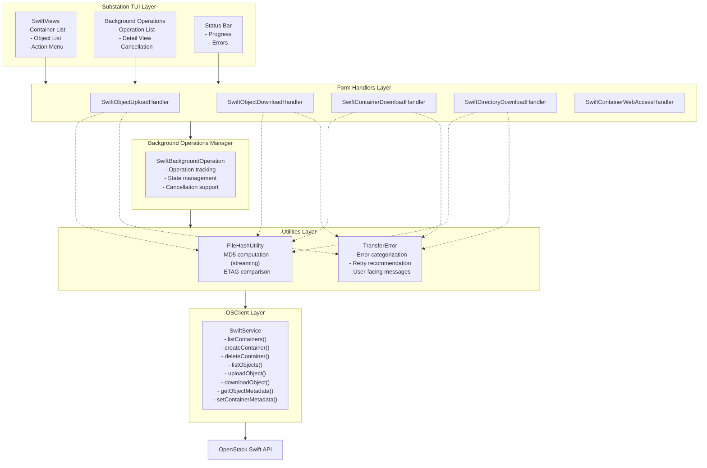
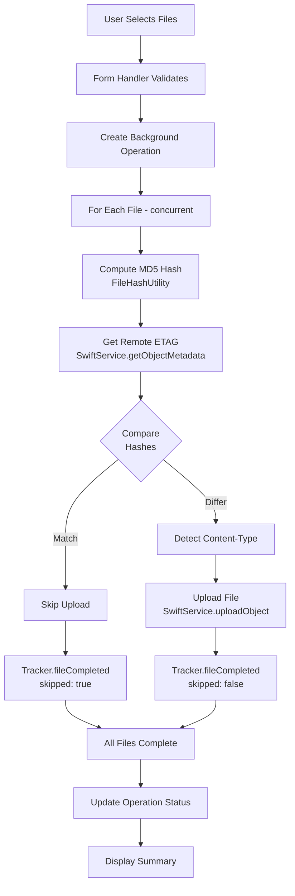
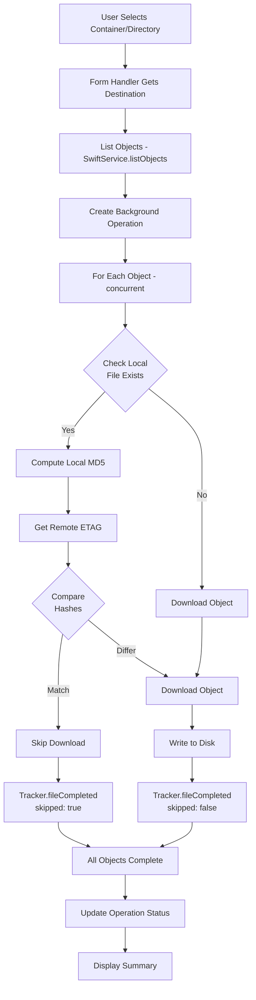
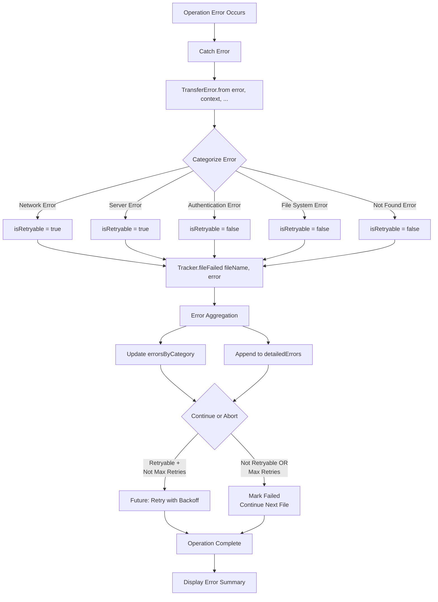

# Object Storage Architecture

## Overview

Substation's Swift object storage implementation is built with a layered architecture emphasizing performance, reliability, and maintainability. This document describes the system architecture, component interactions, and design patterns.

## Architecture Diagram



## Component Breakdown

### View Layer

#### SwiftViews

**File**: `Sources/Substation/Modules/Swift/Views/SwiftViews.swift`

**Responsibilities:**

- Render container and object lists
- Display action menus for Swift operations
- Handle user input and navigation
- Integrate with SwiftNCurses framework

**Key Components:**

```swift
struct SwiftContainerListView: View {
    // Display list of containers
    // Actions: Create, delete, download, configure
}

struct SwiftObjectListView: View {
    // Display objects in a container
    // Actions: Upload, download, delete
    // Prefix filtering for directory navigation
}
```

**Design Patterns:**

- MVVM (Model-View-ViewModel)
- SwiftUI-style declarative views via SwiftNCurses
- Reactive state management

#### Background Operations Views

**Files**:

- `Sources/Substation/Modules/Swift/Views/SwiftBackgroundOperationsView.swift`
- `Sources/Substation/Modules/Swift/Views/SwiftBackgroundOperationDetailView.swift`

**Responsibilities:**

- Display list of active/completed background operations
- Show detailed progress for individual operations
- Provide cancellation controls
- Display error summaries

**Key Features:**

```swift
struct SwiftBackgroundOperationsView: View {
    // List of operations with status icons
    // Progress bars for active operations
    // Error counts and summaries
}

struct SwiftBackgroundOperationDetailView: View {
    // Detailed progress (completed/total)
    // File-by-file status
    // Error details
    // Cancel button
}
```

### Form Handler Layer

Form handlers bridge the UI and business logic, orchestrating operations.

#### Upload Handler

**File**: `Sources/Substation/FormHandlers/TUI+SwiftObjectUploadHandler.swift`

**Responsibilities:**

- Collect file selection from user
- Validate file paths
- Create background upload operation
- Configure ETAG optimization
- Set Content-Type headers

**Key Functions:**

```swift
func handleSwiftObjectUpload(container: String) async {
    // 1. Present file picker
    // 2. Validate selections
    // 3. Create SwiftBackgroundOperation
    // 4. Launch upload task
    // 5. Track progress
}
```

**Flow:**


#### Download Handlers

**Files**:

- `Sources/Substation/FormHandlers/TUI+SwiftObjectDownloadHandler.swift`
- `Sources/Substation/FormHandlers/TUI+SwiftContainerDownloadHandler.swift`
- `Sources/Substation/FormHandlers/TUI+SwiftDirectoryDownloadHandler.swift`

**Responsibilities:**

- Collect destination path
- List objects to download
- Create background download operation
- Configure directory structure preservation
- Apply ETAG skip optimization

**Key Differences:**

| Handler | Scope | Filtering |
|---------|-------|-----------|
| Object | Single file | None |
| Directory | Multiple files | Prefix match |
| Container | All files | Optional prefix |

**Common Flow:**


#### Container Web Access Handler

**File**: `Sources/Substation/FormHandlers/TUI+SwiftContainerWebAccessHandler.swift`

**Responsibilities:**

- Configure container for static website hosting
- Set read ACLs
- Configure index and error pages
- Enable/disable web access

**Configuration:**

```swift
// Enable web access
X-Container-Read: .r:*,.rlistings
X-Container-Meta-Web-Index: index.html
X-Container-Meta-Web-Error: error.html
```

### Business Logic Layer

#### Background Operations Manager

**Model File**: `Sources/Substation/Modules/Swift/Models/SwiftBackgroundOperation.swift`

**Data Structure:**

```swift
struct SwiftBackgroundOperation: Identifiable, Sendable {
    let id: UUID
    let type: OperationType
    var status: OperationStatus
    var progress: TransferProgress
    var startTime: Date
    var endTime: Date?
    let container: String
    let destination: String?

    enum OperationType {
        case upload
        case download
        case containerDownload
        case directoryDownload
    }

    enum OperationStatus {
        case running
        case completed
        case failed
        case cancelled
    }
}
```

**State Management:**

```swift
// Managed in TUI class
@Published var backgroundOperations: [SwiftBackgroundOperation] = []

// Add operation
let operation = SwiftBackgroundOperation(...)
backgroundOperations.append(operation)

// Update progress
if let index = backgroundOperations.firstIndex(where: { $0.id == id }) {
    backgroundOperations[index].progress = newProgress
    backgroundOperations[index].status = .completed
}
```

**Concurrency:**

- Operations run in separate async tasks
- Actor-based progress tracking
- Task cancellation support via Task.isCancelled

### Utilities Layer

**Note**: Progress tracking, file size formatting, content type detection, and path validation are handled directly within the form handlers and Swift module. These utilities were integrated into the modular architecture rather than existing as separate utility classes.

#### FileHashUtility

**File**: `Sources/Substation/Utilities/FileHashUtility.swift`

**Design**: Static utility enum with streaming MD5 computation

**Key Function:**

```swift
static func computeMD5(for url: URL) throws -> String {
    // Stream file in 1MB chunks
    // Update MD5 context incrementally
    // Return hex-encoded digest
}
```

**Memory Efficiency:**

- O(1) memory regardless of file size
- 1MB buffer size (tunable)
- No loading entire file into memory

**Performance:**

- ~500 MB/s on modern hardware
- Linear time complexity O(n)
- Minimal overhead

#### TransferError

**File**: `Sources/Substation/Modules/Swift/Models/TransferError.swift`

**Design**: Error enum with categorization

**Error Cases:**

```swift
enum TransferError: Error, Sendable {
    case network(underlying: Error, context: String)
    case authentication(message: String)
    case fileSystem(path: String, underlying: Error)
    case serverError(statusCode: Int, message: String?)
    case notFound(objectName: String)
    case cancelled
    case unknown(underlying: Error)
}
```

**Computed Properties:**

```swift
var userFacingMessage: String {
    // Friendly message for UI display
}

var categoryName: String {
    // Short category name for logging
}

var isRetryable: Bool {
    // Should this error be retried?
}

var retryRecommendation: String {
    // Guidance for handling the error
}
```

**Error Creation:**

```swift
static func from(error: Error, context: String, filePath: String?, objectName: String?) -> TransferError {
    // Analyze error and categorize
    // Check for known error patterns
    // Return appropriate TransferError case
}
```

### OSClient Layer

#### SwiftService

**File**: `Sources/OSClient/Services/SwiftService.swift`

**Design**: Service class wrapping OpenStack Swift API

**Key Methods:**

```swift
class SwiftService {
    func listContainers() async throws -> [Container]
    func createContainer(name: String) async throws
    func deleteContainer(name: String) async throws
    func listObjects(container: String, prefix: String?) async throws -> [SwiftObject]
    func uploadObject(container: String, objectName: String, data: Data) async throws
    func downloadObject(container: String, objectName: String) async throws -> Data
    func getObjectMetadata(container: String, objectName: String) async throws -> ObjectMetadata
    func setContainerMetadata(container: String, metadata: [String: String]) async throws
}
```

**Responsibilities:**

- HTTP request construction
- Authentication token management
- Response parsing
- Error handling

**Integration:**

- Uses OSClientAdapter for auth
- Leverages MicroversionManager for API versioning
- Integrates with cache manager

## Data Flow Diagrams

### Upload Flow



### Download Flow



### Error Handling Flow



## Concurrency Patterns

### TaskGroup for Parallel Operations

**Pattern:**

```swift
await withThrowingTaskGroup(of: Void.self) { group in
    var activeCount = 0
    let maxConcurrent = 10

    for file in files {
        // Check for cancellation
        guard !Task.isCancelled else { break }

        // Add task to group
        if group.addTaskUnlessCancelled({
            try await uploadFile(file)
        }) {
            activeCount += 1

            // Wait if we hit concurrency limit
            if activeCount >= maxConcurrent {
                try await group.next()
                activeCount -= 1
            }
        }
    }

    // Wait for remaining tasks
    try await group.waitForAll()
}
```

**Benefits:**

- Bounded concurrency (max 10)
- Cancellation support
- Error propagation
- Automatic task cleanup

### Actor-Based State Management

**Pattern:**

```swift
actor SwiftTransferProgressTracker {
    private var state: TrackerState

    func updateState(...) {
        // Automatically serialized
        // No data races possible
        state.update(...)
    }

    func queryState() -> StateSnapshot {
        // Atomic read
        return state.snapshot()
    }
}
```

**Benefits:**

- Thread safety without locks
- Race-free by design
- Swift 6 concurrency compliance
- Clear ownership model

### Sendable Types for Concurrency

**Pattern:**

```swift
struct TransferProgress: Sendable {
    // All properties are Sendable
    let completed: Int
    let failed: Int
    let bytes: Int64
    let errorSummary: [String: Int]
}

enum TransferError: Error, Sendable {
    // All associated values are Sendable
    case network(underlying: any Error, context: String)
    // ...
}
```

**Benefits:**

- Compile-time concurrency safety
- Safe to pass across concurrency domains
- Swift 6 strict concurrency mode compatible

## State Management

### Background Operation State

**State Transitions:**

```
       [Created]
           |
           v
      [Running] <--(progress updates)
           |
           +-----> [Completed] (success)
           |
           +-----> [Failed] (errors)
           |
           +-----> [Cancelled] (user action)
```

**State Storage:**

```swift
// In TUI class
@Published var backgroundOperations: [SwiftBackgroundOperation] = []

// Updated via main actor
@MainActor
func updateOperationProgress(id: UUID, progress: TransferProgress) {
    if let index = backgroundOperations.firstIndex(where: { $0.id == id }) {
        backgroundOperations[index].progress = progress
    }
}
```

**Publisher Pattern:**

- SwiftUI/SwiftNCurses observes `@Published` properties
- Automatic UI updates on state changes
- Thread-safe via MainActor isolation

### Progress Tracking State

**Isolated in Actor:**

```swift
actor SwiftTransferProgressTracker {
    // All state is private and actor-isolated
    private var completedCount: Int = 0
    private var failedCount: Int = 0
    // ...

    // Access via async methods
    func getProgress() -> TransferProgress {
        return TransferProgress(
            completed: completedCount,
            failed: failedCount,
            // ...
        )
    }
}
```

**Immutable Snapshots:**

- Progress queries return immutable struct
- Safe to pass to UI layer
- No shared mutable state

## Extension Points

### Adding New Operation Types

**Steps:**

1. Add case to `SwiftBackgroundOperation.OperationType`
2. Create form handler in `Sources/Substation/FormHandlers/`
3. Implement operation logic with progress tracking
4. Add view for operation-specific UI
5. Register in action menu

**Example: Adding Bulk Delete**

```swift
// 1. Add operation type
enum OperationType {
    case bulkDelete(objects: [String])
}

// 2. Create handler
func handleSwiftBulkDelete(container: String, objects: [String]) async {
    let operation = SwiftBackgroundOperation(type: .bulkDelete(objects: objects), ...)
    backgroundOperations.append(operation)

    let tracker = SwiftTransferProgressTracker()

    await withThrowingTaskGroup(of: Void.self) { group in
        for object in objects {
            group.addTaskUnlessCancelled {
                await tracker.fileStarted(object)
                do {
                    try await swiftService.deleteObject(container: container, objectName: object)
                    await tracker.fileCompleted(object, bytes: 0, skipped: false)
                } catch {
                    let transferError = TransferError.from(error: error, context: "delete")
                    await tracker.fileFailed(object, error: transferError)
                }
            }
        }
    }

    let progress = await tracker.getProgress()
    updateOperationProgress(id: operation.id, progress: progress)
}
```

### Adding New Error Categories

**Steps:**

1. Add case to `TransferError` enum
2. Update `userFacingMessage` property
3. Update `categoryName` property
4. Update `isRetryable` property
5. Update `retryRecommendation` property
6. Update `from()` factory method for detection

**Example: Adding Quota Exceeded**

```swift
enum TransferError: Error, Sendable {
    case quotaExceeded(limit: Int64, used: Int64)
}

var userFacingMessage: String {
    case .quotaExceeded(let limit, let used):
        return "Quota exceeded: using \(used) of \(limit) bytes"
}

var categoryName: String {
    case .quotaExceeded:
        return "Quota Exceeded"
}

var isRetryable: Bool {
    case .quotaExceeded:
        return false  // Need manual intervention
}

var retryRecommendation: String {
    case .quotaExceeded:
        return "Delete old files or request quota increase"
}
```

### Adding New Content Types

**Steps:**

1. Update `detectContentType(for:)` in `SwiftStorageHelpers`
2. Add new file extension cases
3. Return appropriate MIME type

**Example: Adding New Video Format**

```swift
static func detectContentType(for url: URL) -> String {
    let ext = url.pathExtension.lowercased()

    switch ext {
    // ... existing cases ...
    case "m4v": return "video/x-m4v"
    case "ogv": return "video/ogg"
    // ... remaining cases ...
    }
}
```

### Adding Progress Callbacks

**Steps:**

1. Add callback property to tracker
2. Invoke callback on state changes
3. Subscribe to callbacks in UI layer

**Example: Real-Time Progress Updates**

```swift
actor SwiftTransferProgressTracker {
    var progressCallback: ((TransferProgress) -> Void)?

    func fileCompleted(_ fileName: String, bytes: Int64, skipped: Bool) {
        // ... update state ...

        if let callback = progressCallback {
            let progress = getProgress()
            callback(progress)
        }
    }
}

// Usage
tracker.progressCallback = { progress in
    Task { @MainActor in
        updateUI(progress)
    }
}
```

## Design Patterns Used

### Factory Pattern

**TransferError Creation:**

```swift
static func from(error: Error, context: String, ...) -> TransferError {
    // Analyzes error and creates appropriate TransferError case
}
```

### Actor Pattern

**Thread-Safe State Management:**

```swift
actor SwiftTransferProgressTracker {
    // All state automatically synchronized
}
```

### Strategy Pattern

**ETAG Optimization:**

```swift
if etagOptimizationEnabled {
    // Use ETAG comparison strategy
} else {
    // Use always-transfer strategy
}
```

### Observer Pattern

**SwiftUI/SwiftNCurses Integration:**

```swift
@Published var backgroundOperations: [SwiftBackgroundOperation]
// UI automatically observes and updates
```

### Builder Pattern

**URL Request Construction:**

```swift
var request = URLRequest(url: url)
request.httpMethod = "PUT"
request.setValue(contentType, forHTTPHeaderField: "Content-Type")
request.setValue(etag, forHTTPHeaderField: "If-None-Match")
```

## Testing Considerations

### Unit Testing

**Testable Components:**

- `SwiftStorageHelpers` static functions
- `TransferError` categorization logic
- Path validation
- Content type detection

**Example:**

```swift
func testFormatFileSize() {
    let result = SwiftStorageHelpers.formatFileSize(1_536_000, precision: 2)
    XCTAssertEqual(result, "1.46 MB")
}

func testValidateObjectName() {
    let (valid, reason) = SwiftStorageHelpers.validateObjectName("../etc/passwd")
    XCTAssertFalse(valid)
    XCTAssertNotNil(reason)
}
```

### Integration Testing

**Test Scenarios:**

- Upload with ETAG match (skip)
- Upload with ETAG mismatch (transfer)
- Download with local file match (skip)
- Concurrent operation limits
- Error aggregation

### Actor Testing

**Pattern:**

```swift
func testProgressTracker() async {
    let tracker = SwiftTransferProgressTracker()

    await tracker.fileStarted("file1.txt")
    await tracker.fileCompleted("file1.txt", bytes: 1024, skipped: false)

    let progress = await tracker.getProgress()
    XCTAssertEqual(progress.completed, 1)
    XCTAssertEqual(progress.bytes, 1024)
}
```

## Performance Considerations

### Memory Efficiency

**Streaming Operations:**

- MD5 computed in chunks (1MB buffer)
- File transfers use streaming
- No loading entire files into memory

**Bounded Concurrency:**

- Max 10 concurrent operations
- Prevents memory explosion
- Predictable resource usage

### CPU Efficiency

**Parallel Processing:**

- TaskGroup distributes work across cores
- Concurrent MD5 computation for multiple files
- Efficient use of multi-core systems

**Minimal Overhead:**

- Static utility functions (no allocation)
- Actor synchronization (efficient serialization)
- Lightweight progress structures

### Network Efficiency

**ETAG Optimization:**

- Lightweight HEAD requests (200 bytes)
- Skip full transfers when possible
- 50-90% bandwidth savings

**Connection Reuse:**

- HTTP keep-alive
- HTTP/2 multiplexing
- Reduced connection overhead

## Security Considerations

### Path Traversal Prevention

**Validation:**

```swift
func validateObjectName(_ name: String) -> (valid: Bool, reason: String?) {
    if name.contains("../") || name.contains("..\\") {
        return (false, "Path traversal sequence detected")
    }
    // ... more checks ...
}
```

### Input Sanitization

**URL Encoding:**

```swift
func encodeObjectName(_ name: String) -> String {
    // Percent-encode special characters
    // Preserve path separators
}
```

### Error Information Disclosure

**User-Facing Messages:**

```swift
var userFacingMessage: String {
    // Return safe, informative message
    // Don't expose internal paths or credentials
}
```

## Future Enhancements

### Planned Features

1. **Chunked Uploads**: Large file support with resume capability
2. **Automatic Retry**: Exponential backoff for transient errors
3. **Compression**: Optional gzip compression for text content
4. **Delta Sync**: Transfer only changed portions (rsync-like)
5. **Multipart Uploads**: Parallel upload of file chunks
6. **Progress Persistence**: Resume operations across app restarts
7. **Rate Limiting**: Configurable bandwidth limits
8. **Object Versioning**: Support for Swift object versioning

### Architectural Improvements

1. **Dependency Injection**: Replace direct service instantiation
2. **Protocol Abstraction**: Define protocols for service layer
3. **Plugin System**: Extensible transfer strategies
4. **Event Bus**: Decouple components with event system
5. **Configuration Service**: Centralized settings management

## See Also

- [Object Storage Concepts](../concepts/object-storage.md) - Core concepts and features
- [Object Storage Performance](../performance/object-storage.md) - Performance metrics and optimization
- [OpenStack Swift Reference](../reference/openstack/os-swift.md) - Swift API documentation
- [Technology Stack](technology-stack.md) - Overall system architecture
