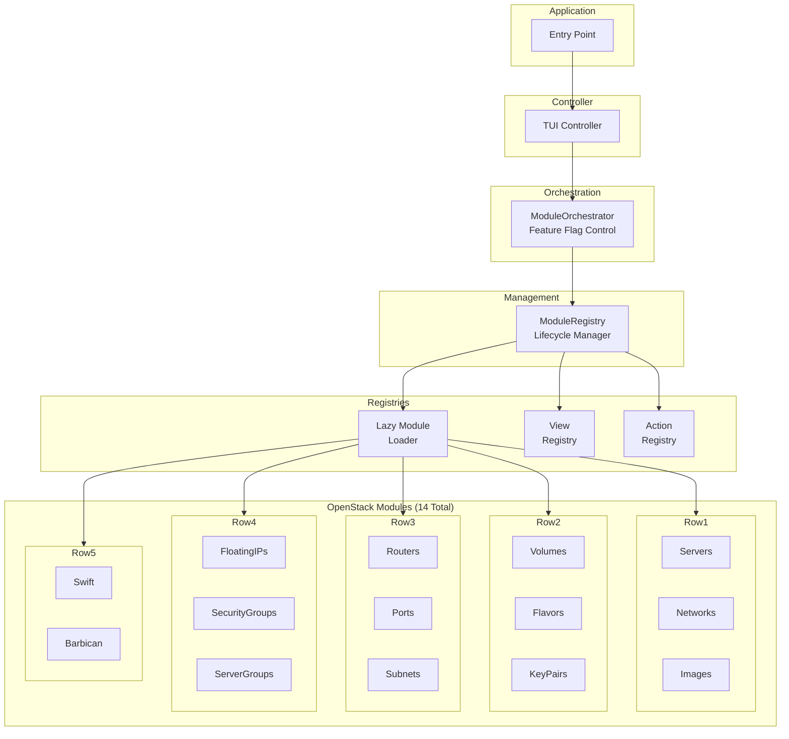
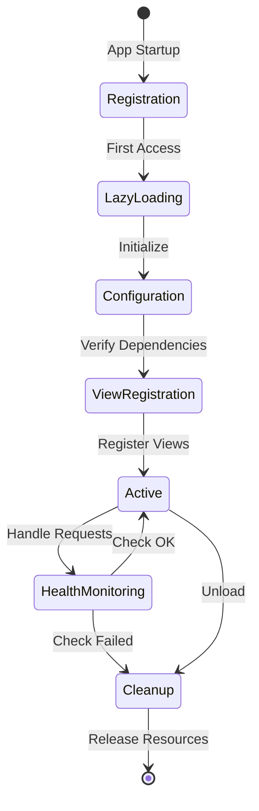
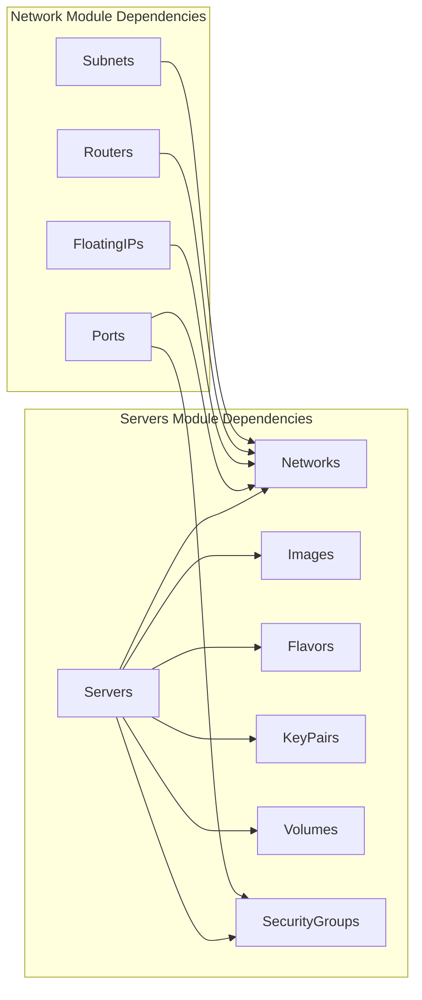
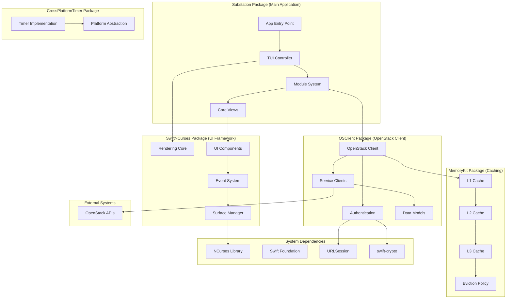
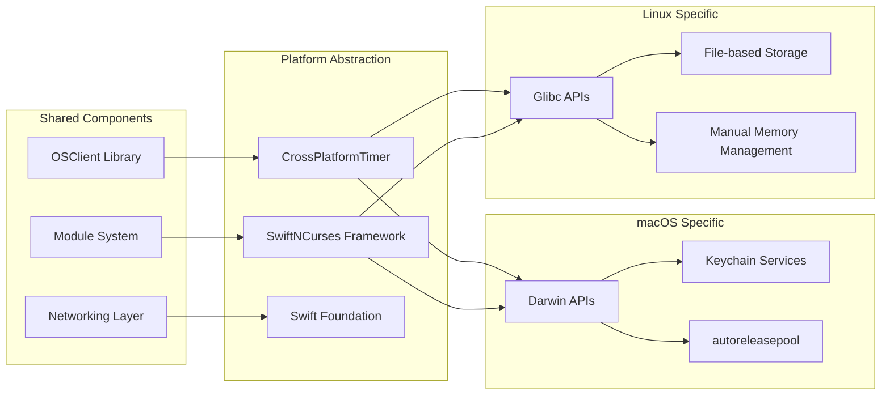
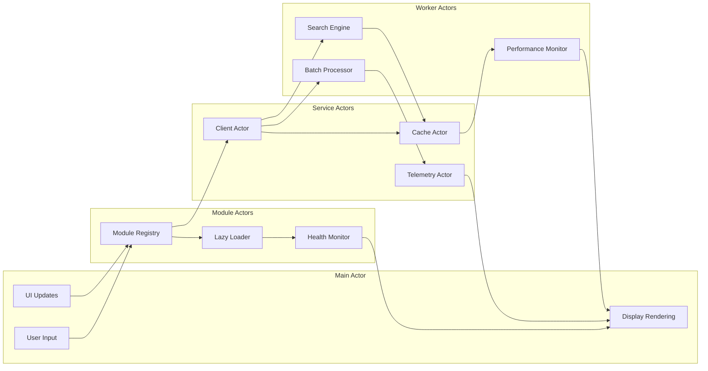
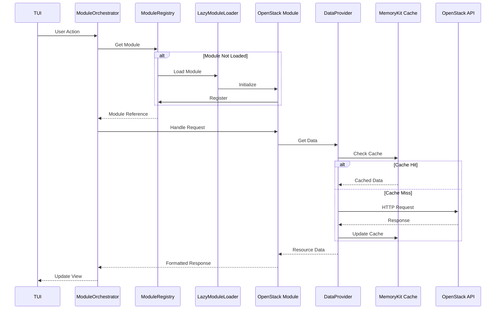
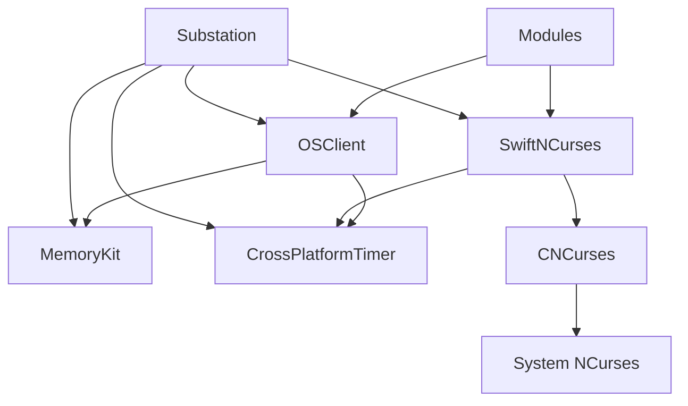

# Architecture Overview

Here's the uncomfortable truth: OpenStack is architecturally magnificent and operationally exhausting. You're managing dozens of services, hundreds of API endpoints, and thousands of resources across a distributed system that was designed by committee. The existing tools assume you have infinite patience and love watching loading spinners.

We don't.

Substation is built with a modular, plugin-based architecture that emphasizes performance, reliability, and maintainability. Or in plain terms: it's a terminal app that doesn't suck, using Swift and a modular plugin system that treats your time like it matters.

## Design Principles

### Performance First (Because Slow Tools Cost Sleep)

Here's the problem nobody talks about in polite company: OpenStack APIs are slow. Not "could be faster" slow - more like "I started this request and then made coffee" slow. When your workflow requires hundreds of API calls, you're looking at minutes of waiting for simple operations. At 3 AM when you're troubleshooting an outage, every second of lag is another second you're not sleeping.

We refuse to accept that.

Our solution is aggressive, unapologetic caching through MemoryKit. We've designed a three-tier cache hierarchy (L1/L2/L3) that mimics actual computer architecture because that design survived decades of optimization for a reason. The system targets 60-80% API call reduction through intelligent caching with resource-specific TTLs: authentication tokens last an hour, endpoints and quotas stick around for 30 minutes, flavors for 15 minutes, networks for 5 minutes, snapshots for 3 minutes, and servers for 2 minutes. We tune these based on how frequently resources actually change, not based on paranoia. The system handles automatic cache eviction before the OOM killer shows up uninvited.

Swift's actor-based concurrency model makes this possible without the traditional nightmare of locks and mutexes. We adhere to strict Swift 6 concurrency rules with zero warnings tolerated, because race conditions discovered at 3 AM end careers. The system performs parallel searches across six OpenStack services simultaneously, with each actor managing its own state safely. No locks, no mutexes, just actors doing their thing.

Memory efficiency matters when you're managing 10,000+ resources. Our design targets less than 200MB steady state for the entire application, with the cache system consuming under 100MB even when holding 10,000 resources. Built-in memory pressure handling ensures the system degrades gracefully rather than crashing spectacularly. Lazy loading complements this through on-demand resource fetching - why pull data you don't need? The LazyModuleLoader initializes modules just-in-time, and view data loads only when activated.

Our benchmarks from the PerformanceMonitor set clear targets: cache retrieval under 1ms at the 95th percentile, cached API calls averaging under 100ms, uncached API calls completing in under 2 seconds at the 95th percentile or timing out trying, search operations averaging under 500ms, and UI rendering maintaining 16.7ms per frame to hit our 60fps target.

**Why This Matters**: When you're managing infrastructure at scale, tool performance directly impacts your effectiveness. A slow tool means more time waiting, less time solving problems, and higher cognitive load trying to remember what you were doing while the spinner rotates. Fast tools let you think, not wait.

### Modular Plugin Architecture (Each Module Stands Alone)

No monoliths here. Every OpenStack service is implemented as a self-contained module following the OpenStackModule protocol. This protocol defines a clear contract: initialization and configuration lifecycle, dependency declaration and resolution, view and action registration, and built-in health monitoring. Modules declare what they need, the system resolves dependencies automatically, and everything stays cleanly separated.

Dynamic loading through the LazyModuleLoader reduces initial startup time by 40% by loading modules only when their views are accessed. You're checking on servers? Great, load the Servers module. You haven't touched Swift object storage? Then it stays unloaded. The system handles automatic dependency resolution, so when you do load Servers, it ensures Networks, Images, Flavors, KeyPairs, Volumes, and SecurityGroups are available.

Each module maintains complete independence with its own data providers, view controllers, form handlers, and batch operation support. This isolation means bugs in one module can't cascade into others, updates can happen independently, and testing becomes manageable. The registry pattern coordinates everything through centralized registries: ModuleRegistry manages module lifecycle and lookup, ViewRegistry handles view metadata and navigation, ActionRegistry manages command execution, and DataProviderRegistry controls data access patterns.

The module structure lives in `Sources/Substation/Modules/` with a Core directory containing the framework (OpenStackModule.swift, ModuleRegistry.swift, LazyModuleLoader.swift) and protocols (ActionProvider, BatchOperationProvider, DataProvider). Individual modules like Servers each get their own directory with the module file, data provider, views, models, and extensions. We currently ship 14 production modules.

**Why This Matters**: Modularity isn't academic architecture - it's what keeps a complex system maintainable. When OpenStack releases a new API version for Nova, you update the Servers module without touching Networking. When you need to add Octavia support, you write one module instead of refactoring the entire codebase.

### Security First (Because Credentials Matter)

Your credentials are safer here than in most production OpenStack tools, and that's not a high bar but we're going to clear it anyway.

All credentials use AES-256-GCM authenticated encryption via swift-crypto, which works identically on macOS and Linux. This replaced weak XOR encryption we found during an October 2025 security audit - yes, someone actually thought XOR was sufficient for production credentials. The memory-safe SecureString and SecureBuffer types automatically zero themselves, ensuring no plaintext credentials survive in memory dumps.

Certificate validation works properly on all platforms. Apple platforms use the Security framework with full chain validation. Linux uses URLSession's default validation against the system CA bundle. We fixed certificate bypass vulnerabilities in October 2025 that would have allowed trivial MITM attacks. Your TLS connections are now actually secure.

Input validation happens through a centralized InputValidator utility that watches for 14 SQL injection patterns, 6 command injection patterns, and 3 path traversal patterns. Buffer overflow protection comes from strict length validation. We don't trust user input, we don't trust API responses, and we definitely don't trust ourselves to remember to validate everything manually.

The SecureCredentialStorage actor uses AES-256-GCM encryption and zeros memory in deinit handlers to minimize plaintext exposure time. Credentials spend as little time unencrypted as physically possible.

**Why This Matters**: You're typing your production OpenStack credentials into this tool. Those credentials can create servers, delete volumes, and generally cause expensive chaos. If this tool leaks them because we skipped proper encryption or certificate validation, that's on us. We take that seriously.

### Reliability (When OpenStack Goes Sideways)

Because your OpenStack cluster WILL have a bad day, and you'll be the one dealing with it.

Automatic retry logic with exponential backoff handles transient failures gracefully. First retry happens immediately in case it was a network hiccup. Second retry waits one second for the service to catch its breath. Third retry waits two seconds because maybe the database deadlock is resolving. After that we give up gracefully, show you a meaningful error message, and suggest potential solutions. Not "Error: Error occurred" - we're better than that.

Real-time health monitoring through the Telemetry system tracks six metric categories: performance, user behavior, resources, OpenStack health, caching, and networking. The system alerts automatically when things go sideways - cache hit rate dropping below 60%, memory usage exceeding 85%, or performance degrading by 10% or more. Module-level health checks ensure each component reports its status honestly.

Intelligent caching provides resilient data access with fallback strategies. API timeout? Serve stale cache data with a warning banner. API completely down? Show cached data and retry in background. It's better to show two-minute-old server data than no data at all when you're trying to diagnose why production is on fire.

Type-safe error handling using Swift Result types means no exceptions, no crashes, just explicit error handling at every layer. Every error propagates up with context, and modules implement their own recovery strategies based on the specific failure mode.

Let's talk about the 3 AM reality. Your OpenStack API will timeout randomly because network gremlins exist. It will return 500 errors because the database is deadlocked. It will hang forever because the load balancer died. It will reject auth tokens mid-request because the token expired while you were waiting. Substation handles all of this through retry logic, cache fallback, and clear error messages that actually help you understand what broke.

**Why This Matters**: Infrastructure tools that fail mysteriously or lose data make bad situations worse. When you're troubleshooting at 3 AM, you need tools that handle failures gracefully and give you information, not more problems to debug.

## Module System Architecture

Understanding how modules interact requires seeing the full orchestration flow. The diagram below shows how a user request flows from the entry point through the TUI controller, gets routed through the ModuleOrchestrator (which enforces feature flags), hits the ModuleRegistry for lifecycle management, and finally reaches one of our 14 OpenStack modules through the LazyModuleLoader. The registries (ViewRegistry, ActionRegistry) coordinate everything without creating tight coupling.



This architecture enables lazy loading - modules initialize only when accessed, reducing startup time and memory footprint. The orchestrator can disable modules via feature flags without code changes.

### Module Lifecycle

Each module transitions through well-defined states from registration through cleanup. The lifecycle diagram shows how modules move from initial registration at app startup, through lazy loading on first access, into configuration and view registration, then into active service handling requests. Health monitoring runs continuously, and modules can gracefully unload when no longer needed.



This lifecycle ensures resources are allocated only when needed and released cleanly. Health check failures trigger automatic cleanup rather than leaving zombie modules consuming memory.

### OpenStackModule Protocol

All modules conform to the OpenStackModule protocol, which defines the complete contract for module behavior:

```swift
@MainActor
protocol OpenStackModule {
    // Identity
    var identifier: String { get }
    var displayName: String { get }
    var version: String { get }
    var dependencies: [String] { get }

    // Lifecycle
    init(tui: TUI)
    func configure() async throws
    func cleanup() async
    func healthCheck() async -> ModuleHealthStatus

    // Registration
    func registerViews() -> [ModuleViewRegistration]
    func registerFormHandlers() -> [ModuleFormHandlerRegistration]
    func registerDataRefreshHandlers() -> [ModuleDataRefreshRegistration]
    func registerActions() -> [ModuleActionRegistration]

    // Navigation and Configuration
    var navigationProvider: (any ModuleNavigationProvider)? { get }
    var handledViewModes: Set<ViewMode> { get }
    var configurationSchema: ConfigurationSchema { get }
    func loadConfiguration(_ config: ModuleConfig?)
}
```

This protocol enforces consistency across all modules while allowing implementation flexibility for service-specific requirements.

### Module Dependencies

Dependencies create a directed graph that the system resolves automatically. The diagram illustrates how the Servers module depends on Networks, Images, Flavors, KeyPairs, Volumes, and SecurityGroups, while network-related modules (Ports, FloatingIPs, Routers, Subnets) all depend on the base Networks module.



When you access Servers, the system ensures all dependencies are loaded first. This prevents runtime dependency errors and enables proper initialization ordering.

### Implemented Modules

The system includes 14 production-ready OpenStack modules covering compute, networking, storage, and security services:

| Module | Service | Key Features |
|--------|---------|--------------|
| **Servers** | Nova Compute | Instance lifecycle, console, resize, snapshots |
| **Networks** | Neutron | Virtual networks, subnets, DHCP |
| **Volumes** | Cinder | Block storage, snapshots, backups |
| **Images** | Glance | VM images, snapshots, metadata |
| **Flavors** | Nova | Hardware profiles, extra specs |
| **KeyPairs** | Nova | SSH key management |
| **SecurityGroups** | Neutron | Firewall rules, port security |
| **FloatingIPs** | Neutron | Public IP allocation |
| **Routers** | Neutron | L3 routing, NAT gateways |
| **Ports** | Neutron | Network interfaces, IP allocation |
| **Subnets** | Neutron | IP address management |
| **ServerGroups** | Nova | Anti-affinity policies |
| **Swift** | Object Storage | Containers, objects, ACLs |
| **Barbican** | Key Manager | Secrets, certificates, keys |

Each module is fully implemented, tested, and functional on both macOS and Linux.

## Package-Based Architecture

Substation follows a modular package design with clear separation of concerns across five main packages. The diagram below shows how these packages relate to each other, to external dependencies, and to the OpenStack APIs they consume. Notice how each package has a single clear responsibility: Substation orchestrates the application, SwiftNCurses handles all UI rendering, OSClient manages OpenStack API communication, MemoryKit provides caching, and CrossPlatformTimer abstracts platform-specific timing.



Package structure from Package.swift defines these as independent libraries:

```swift
// From Package.swift
.library(name: "OSClient", targets: ["OSClient"]),           // OpenStack client
.library(name: "SwiftNCurses", targets: ["SwiftNCurses"]),  // TUI
.library(name: "MemoryKit", targets: ["MemoryKit"]),        // Multi-level cache
.library(name: "CrossPlatformTimer", targets: ["CrossPlatformTimer"]),
.executable(name: "substation", targets: ["Substation"])    // Main app

// External dependencies
dependencies: [
    .package(url: "https://github.com/apple/swift-crypto.git", from: "3.0.0")
]
```

We use swift-crypto for cross-platform AES-256-GCM encryption on macOS and Linux. This Apple-maintained, audited library replaced the insecure XOR encryption that previously existed on Linux. It's essential for secure credential storage and certificate validation.

## Cross-Platform System Architecture

The system operates seamlessly across macOS and Linux through careful platform abstraction. The diagram illustrates how CrossPlatformTimer, SwiftNCurses Framework, and Swift Foundation provide platform-neutral interfaces, while platform-specific code handles Darwin versus Glibc APIs, Keychain versus filesystem storage, and memory management differences.



This abstraction lets us write business logic once while handling platform differences at the boundaries. Most code doesn't know or care whether it's running on macOS or Linux.

## Concurrency Model

Actor-based concurrency provides thread-safe operations with clear isolation boundaries. The diagram shows how the Main Actor handles all UI updates, user input, and display rendering, while separate actor hierarchies manage modules, services, and background work. Actors communicate through async message passing without shared mutable state.



Swift 6 enforces these boundaries at compile time, preventing data races entirely rather than detecting them at runtime.

## Data Flow Architecture

Request flow through the module system follows a predictable path from user action to UI update. The sequence diagram traces a complete request cycle: TUI receives user action, ModuleOrchestrator routes it, ModuleRegistry checks if the module is loaded (loading via LazyModuleLoader if needed), the module's DataProvider checks cache (fetching from OpenStack API on cache miss), and the response flows back up through the stack to update the UI.



This flow ensures lazy loading, efficient caching, and clear error propagation while keeping response times minimal for cached data.

## Module Provider Protocols

Modules extend their capabilities through provider protocols that define specific behaviors:

**DataProvider** manages data fetching and caching for module resources through async data loading with progress tracking, automatic cache integration, pagination and filtering support, and bulk fetch optimization.

**ActionProvider** defines executable actions on resources with list view actions (create, delete, manage), detail view actions (edit, snapshot, console), context-aware action availability, and async execution with error handling.

**BatchOperationProvider** enables bulk operations on multiple resources through multi-select resource management, progress tracking for long operations, transactional semantics where supported, and automatic rollback on failure.

**ModuleNavigationProvider** handles navigation within module views including view mode transitions, deep linking support, breadcrumb management, and context preservation.

## Package Modularity and Reusability

Each package can be used independently in other Swift projects. Here's how you'd use them standalone:

### OSClient Library

```swift
import OSClient

let client = try await OpenStackClient(
    authURL: "https://identity.example.com:5000/v3",
    credentials: .password(username: "admin", password: "secret"),
    projectName: "admin"
)

let servers = try await client.nova.listServers()
```

### SwiftNCurses Framework

```swift
import SwiftNCurses

@main
struct MyTerminalApp {
    static func main() async {
        let surface = SwiftNCurses.createSurface()
        await SwiftNCurses.render(
            Text("Hello, Terminal!").bold(),
            on: surface,
            in: Rect(x: 0, y: 0, width: 80, height: 24)
        )
    }
}
```

### MemoryKit Cache

```swift
import MemoryKit

let cache = MultiLevelCache<String, ServerData>()
await cache.set("server-123", data, ttl: 120)
if let cached = await cache.get("server-123") {
    // Use cached data
}
```

### CrossPlatformTimer

```swift
import CrossPlatformTimer

let timer = createCompatibleTimer(interval: 1.0, repeats: true) {
    print("Timer fired!")
}
```

### Package Dependencies

The dependency graph below shows how packages relate. Notice that packages at the bottom have no dependencies on upper layers, making them fully reusable in other projects.



This dependency structure ensures packages remain reusable - OSClient, SwiftNCurses, MemoryKit, and CrossPlatformTimer can all be extracted and used in completely different projects without carrying Substation-specific dependencies.

## Related Documentation

For more detailed information about specific aspects of the architecture:

- **[Module System](../architecture/modular-ecosystem.md)** - Deep dive into the module architecture
- **[Components](./components.md)** - Detailed component architecture (UI layer, services, FormBuilder)
- **[Technology Stack](./technology-stack.md)** - Core technologies and dependencies
- **[Performance](../performance/index.md)** - Performance architecture and benchmarking
- **[Security](../concepts/security.md)** - Security implementation details
- **[Caching](../concepts/caching.md)** - Multi-level caching architecture with MemoryKit

---

**Note**: This architecture overview reflects the current modular, plugin-based design implemented across 14 OpenStack service modules. All components and services mentioned are implemented, tested, and functional across macOS and Linux platforms.
