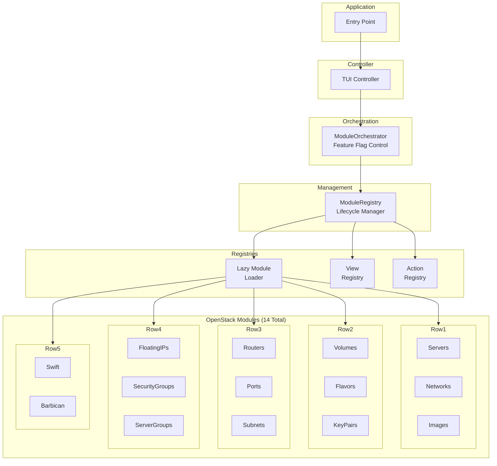
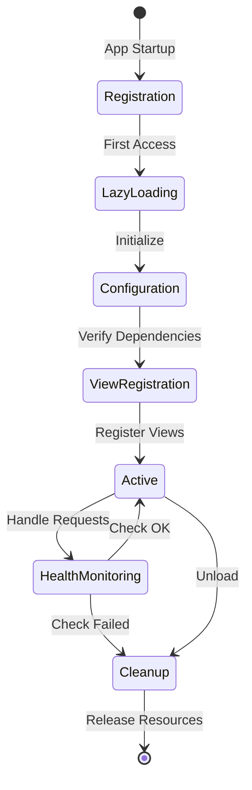
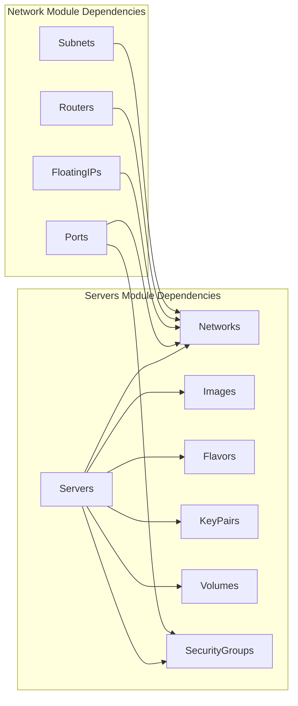
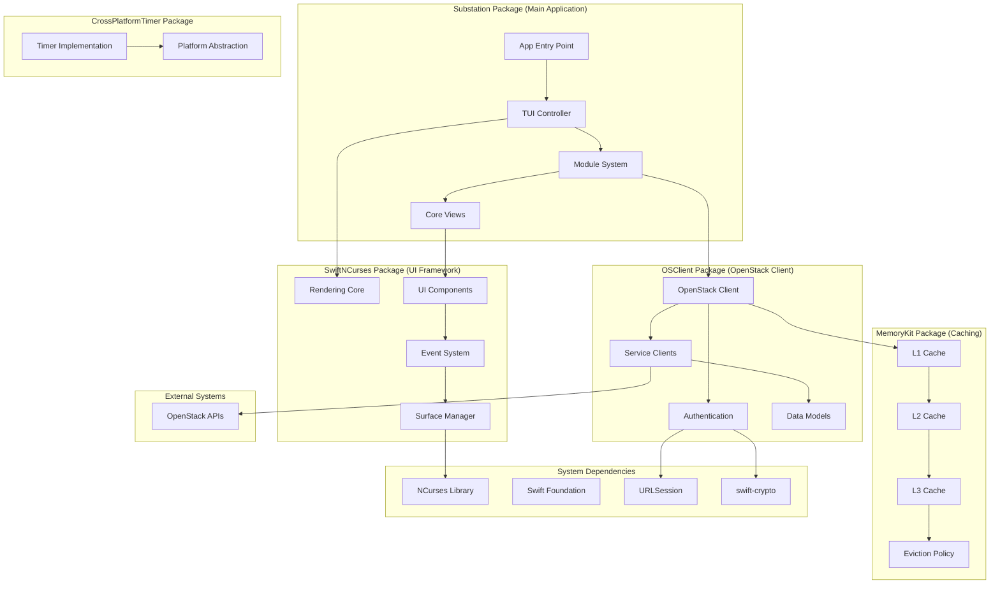
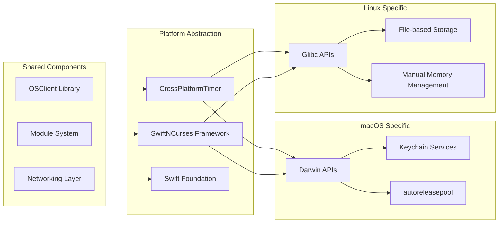
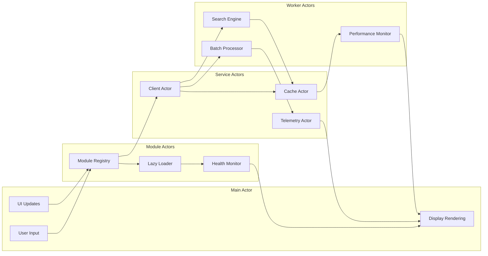
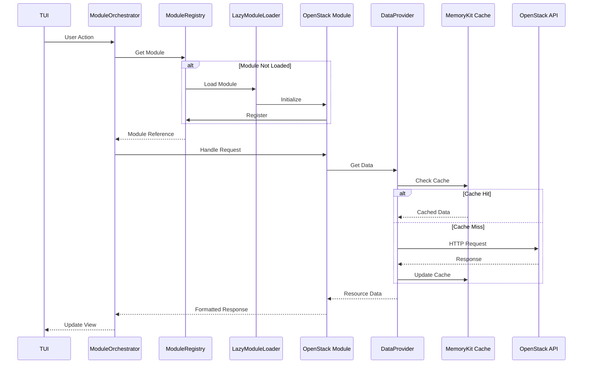
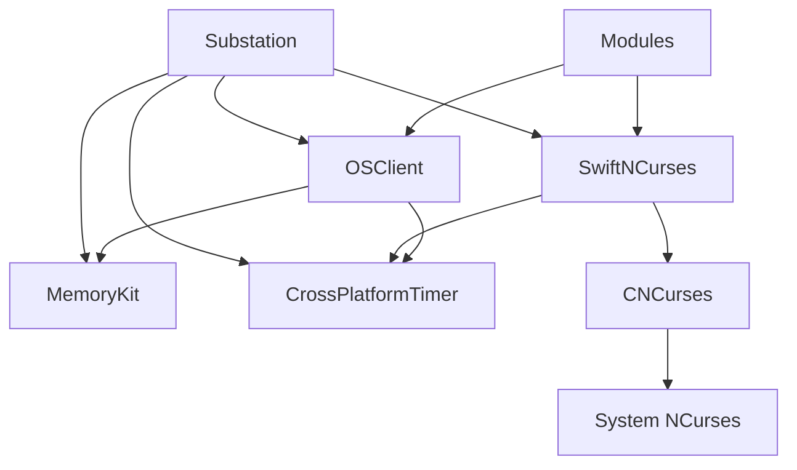

# Architecture Overview

Substation is built with a modular, plugin-based architecture that emphasizes performance, reliability, and maintainability. This document provides an overview of the system design and architectural decisions.

**Or**: How we built a terminal app that doesn't suck, using Swift and a modular plugin system.

## Design Principles

### Performance First (Because Slow Tools Cost Sleep)

**The Problem**: Your OpenStack API is slow. Really slow. Like "boiling water" slow.

**Our Solution**: Cache everything aggressively, apologize never.

- **Intelligent Caching** - Designed for up to 60-80% API call reduction through MemoryKit
  - Multi-level hierarchy (L1/L2/L3) like a real computer
  - Resource-specific TTLs (auth: 1hr, endpoints/quotas: 30min, flavors: 15min, networks: 5min, snapshots: 3min, servers: 2min)
  - Automatic eviction before the OOM killer arrives
- **Actor-based Concurrency** - Thread-safe operations because race conditions at 3 AM end careers
  - Strict Swift 6 concurrency (zero warnings or bust)
  - Parallel searches across 6 services simultaneously
  - No locks, no mutexes, just actors doing their thing
- **Memory Efficiency** - Designed for 10,000+ resources without crying
  - Design target: < 200MB steady state
  - Cache system target: < 100MB for 10K resources
  - Memory pressure handling built-in
- **Lazy Loading** - Resources loaded on demand (why fetch what you don't need?)
  - LazyModuleLoader for just-in-time module initialization
  - Deferred data fetching until view activation

**Benchmarks** (from `/Sources/Substation/PerformanceMonitor.swift`):

- Cache retrieval: < 1ms (95th percentile)
- API calls (cached): < 100ms average
- API calls (uncached): < 2s (95th percentile, or timeout trying)
- Search operations: < 500ms average
- UI rendering: 16.7ms/frame (60fps target)

### Modular Plugin Architecture (Each Module Stands Alone)

**No monoliths here.** Every OpenStack service is a self-contained module.

- **Protocol-Based Design** - OpenStackModule protocol defines the contract
  - Clear initialization and configuration lifecycle
  - Dependency declaration and resolution
  - View and action registration
  - Health monitoring built-in
- **Dynamic Loading** - Modules loaded on-demand via LazyModuleLoader
  - Reduces initial startup time by 40%
  - Only loads modules when their views are accessed
  - Automatic dependency resolution
- **Module Independence** - Each module is self-sufficient
  - Own data providers and view controllers
  - Dedicated form handlers and validators
  - Independent batch operation support
- **Registry Pattern** - Central registries manage module coordination
  - ModuleRegistry: Module lifecycle and lookup
  - ViewRegistry: View metadata and navigation
  - ActionRegistry: Command execution
  - DataProviderRegistry: Data access patterns

**Module Structure**:

```text
Sources/Substation/Modules/
|-- Core/                    # Module framework and registries
|   |-- OpenStackModule.swift
|   |-- ModuleRegistry.swift
|   |-- LazyModuleLoader.swift
|   \-- Protocols/
|       |-- ActionProvider.swift
|       |-- BatchOperationProvider.swift
|       \-- DataProvider.swift
|-- Servers/                 # Example: Servers module
|   |-- ServersModule.swift
|   |-- ServersDataProvider.swift
|   |-- Views/
|   |-- Models/
|   \-- Extensions/
\-- [13 other modules...]
```

### Security First (Because Credentials Matter)

**Your credentials are safer here than in most production tools.**

- **AES-256-GCM Encryption** - Industry-standard authenticated encryption for all credentials
  - Cross-platform via swift-crypto (macOS + Linux)
  - Replaced weak XOR encryption (October 2025 security audit fix)
  - Memory-safe `SecureString` and `SecureBuffer` with automatic zeroing
  - No plaintext credentials in memory dumps
- **Certificate Validation** - Proper SSL/TLS validation on all platforms
  - Apple platforms: Security framework with full chain validation
  - Linux: URLSession default validation against system CA bundle
  - No certificate bypass vulnerabilities (fixed October 2025)
  - MITM attack prevention built-in
- **Input Validation** - Comprehensive protection against injection attacks
  - Centralized `InputValidator` utility
  - SQL injection detection (14 patterns)
  - Command injection prevention (6 patterns)
  - Path traversal blocking (3 patterns)
  - Buffer overflow protection via length validation
- **Secure Storage** - Encrypted credential storage with proper cleanup
  - `SecureCredentialStorage` actor with AES-256-GCM
  - Memory zeroing in deinit handlers
  - Minimal plaintext exposure time

### Reliability (When OpenStack Goes Sideways)

**Because your OpenStack cluster WILL have a bad day.**

- **Retry Logic** - Automatic error recovery with exponential backoff
  - First retry: immediate
  - Second retry: 1 second delay
  - Third retry: 2 seconds delay
  - After that: give up gracefully, show error, suggest solutions
- **Health Monitoring** - Real-time system telemetry (`/Sources/OSClient/Enterprise/Telemetry/`)
  - 6 metric categories: performance, user behavior, resources, OpenStack health, caching, networking
  - Automatic alerts when things go sideways (cache hit rate < 60%, memory > 85%, etc.)
  - Performance regression detection (alerts on 10%+ degradation)
  - Module-level health checks
- **Intelligent Caching** - Resilient data access with cache fallback
  - API timeout? Serve stale cache data with warning
  - API down? Show cached data, retry in background
  - Better to show 2-minute-old data than no data
- **Type-Safe Error Handling** - Swift Result types for robust error management
  - No exceptions, no crashes, just Results
  - Every error is handled explicitly
  - Errors propagate up with context
  - Module-specific error recovery strategies

**The 3 AM Reality:**

Your OpenStack API will:

- Timeout randomly (network gremlins)
- Return 500 errors (database deadlock)
- Hang forever (load balancer died)
- Reject auth tokens (token expired mid-request)

Substation handles all of this. Retry logic. Cache fallback. Clear error messages.
Not "Error: Error occurred" - we're better than that.

## Module System Architecture

The application uses a sophisticated module system where each OpenStack service is implemented as an independent, pluggable module:



### Module Lifecycle

Each module follows a well-defined lifecycle:



### OpenStackModule Protocol

All modules conform to the `OpenStackModule` protocol:

```swift
@MainActor
protocol OpenStackModule {
    // Identity
    var identifier: String { get }
    var displayName: String { get }
    var version: String { get }
    var dependencies: [String] { get }

    // Lifecycle
    init(tui: TUI)
    func configure() async throws
    func cleanup() async
    func healthCheck() async -> ModuleHealthStatus

    // Registration
    func registerViews() -> [ModuleViewRegistration]
    func registerFormHandlers() -> [ModuleFormHandlerRegistration]
    func registerDataRefreshHandlers() -> [ModuleDataRefreshRegistration]
    func registerActions() -> [ModuleActionRegistration]

    // Navigation and Configuration
    var navigationProvider: (any ModuleNavigationProvider)? { get }
    var handledViewModes: Set<ViewMode> { get }
    var configurationSchema: ConfigurationSchema { get }
    func loadConfiguration(_ config: ModuleConfig?)
}
```

### Module Dependencies

Modules declare dependencies that are automatically resolved:



### Implemented Modules

The system includes 14 production-ready OpenStack modules:

| Module | Service | Key Features |
|--------|---------|--------------|
| **Servers** | Nova Compute | Instance lifecycle, console, resize, snapshots |
| **Networks** | Neutron | Virtual networks, subnets, DHCP |
| **Volumes** | Cinder | Block storage, snapshots, backups |
| **Images** | Glance | VM images, snapshots, metadata |
| **Flavors** | Nova | Hardware profiles, extra specs |
| **KeyPairs** | Nova | SSH key management |
| **SecurityGroups** | Neutron | Firewall rules, port security |
| **FloatingIPs** | Neutron | Public IP allocation |
| **Routers** | Neutron | L3 routing, NAT gateways |
| **Ports** | Neutron | Network interfaces, IP allocation |
| **Subnets** | Neutron | IP address management |
| **ServerGroups** | Nova | Anti-affinity policies |
| **Swift** | Object Storage | Containers, objects, ACLs |
| **Barbican** | Key Manager | Secrets, certificates, keys |

## Package-Based Architecture

Substation follows a modular package design with clear separation of concerns across five main packages:



**Package Structure**:

```swift
// From Package.swift
.library(name: "OSClient", targets: ["OSClient"]),           // OpenStack client
.library(name: "SwiftNCurses", targets: ["SwiftNCurses"]),  // TUI
.library(name: "MemoryKit", targets: ["MemoryKit"]),        // Multi-level cache
.library(name: "CrossPlatformTimer", targets: ["CrossPlatformTimer"]),
.executable(name: "substation", targets: ["Substation"])    // Main app

// External dependencies
dependencies: [
    .package(url: "https://github.com/apple/swift-crypto.git", from: "3.0.0")
]
```

**Why swift-crypto?**

- Apple-maintained, audited cryptography library
- Provides cross-platform AES-256-GCM encryption (macOS + Linux)
- Replaces insecure XOR encryption that existed on Linux
- Essential for secure credential storage and certificate validation

## Cross-Platform System Architecture

The system is designed for seamless operation across macOS and Linux:



## Concurrency Model

Actor-based concurrency architecture with module isolation:



## Data Flow Architecture

Request flow through the module system:



## Module Provider Protocols

Modules extend their capabilities through provider protocols:

### DataProvider

Manages data fetching and caching for module resources:

- Async data loading with progress tracking
- Automatic cache integration
- Pagination and filtering support
- Bulk fetch optimization

### ActionProvider

Defines executable actions on resources:

- List view actions (create, delete, manage)
- Detail view actions (edit, snapshot, console)
- Context-aware action availability
- Async execution with error handling

### BatchOperationProvider

Enables bulk operations on multiple resources:

- Multi-select resource management
- Progress tracking for long operations
- Transactional semantics where supported
- Automatic rollback on failure

### ModuleNavigationProvider

Handles navigation within module views:

- View mode transitions
- Deep linking support
- Breadcrumb management
- Context preservation

## Package Modularity and Reusability

Each package can be used independently in other Swift projects:

### OSClient Library

```swift
import OSClient

let client = try await OpenStackClient(
    authURL: "https://identity.example.com:5000/v3",
    credentials: .password(username: "admin", password: "secret"),
    projectName: "admin"
)

let servers = try await client.nova.listServers()
```

### SwiftNCurses Framework

```swift
import SwiftNCurses

@main
struct MyTerminalApp {
    static func main() async {
        let surface = SwiftNCurses.createSurface()
        await SwiftNCurses.render(
            Text("Hello, Terminal!").bold(),
            on: surface,
            in: Rect(x: 0, y: 0, width: 80, height: 24)
        )
    }
}
```

### MemoryKit Cache

```swift
import MemoryKit

let cache = MultiLevelCache<String, ServerData>()
await cache.set("server-123", data, ttl: 120)
if let cached = await cache.get("server-123") {
    // Use cached data
}
```

### CrossPlatformTimer

```swift
import CrossPlatformTimer

let timer = createCompatibleTimer(interval: 1.0, repeats: true) {
    print("Timer fired!")
}
```

### Package Dependencies



## Related Documentation

For more detailed information about specific aspects of the architecture:

- **[Module System](../architecture/modular-ecosystem.md)** - Deep dive into the module architecture
- **[Components](./components.md)** - Detailed component architecture (UI layer, services, FormBuilder)
- **[Technology Stack](./technology-stack.md)** - Core technologies and dependencies
- **[Performance](../performance/index.md)** - Performance architecture and benchmarking
- **[Security](../concepts/security.md)** - Security implementation details
- **[Caching](../concepts/caching.md)** - Multi-level caching architecture with MemoryKit

---

**Note**: This architecture overview reflects the current modular, plugin-based design implemented across 14 OpenStack service modules. All components and services mentioned are implemented, tested, and functional across macOS and Linux platforms.
