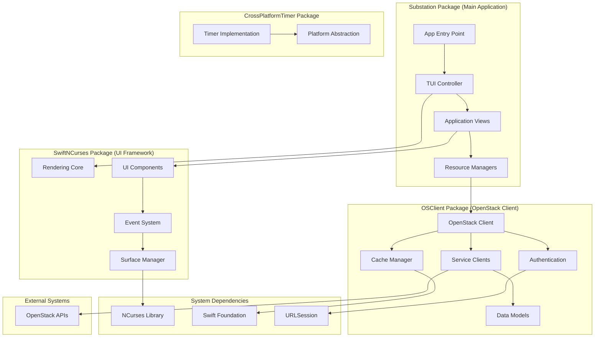
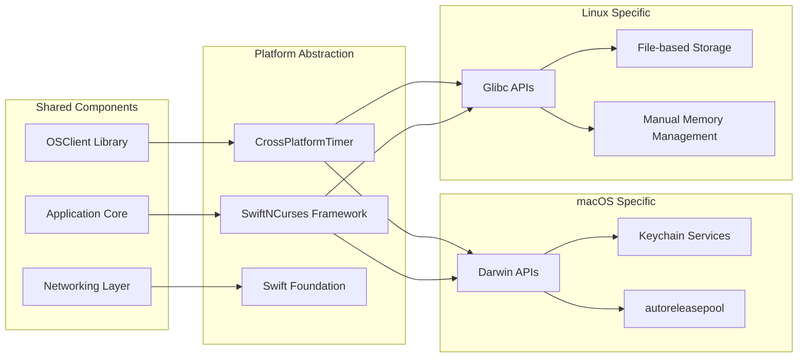
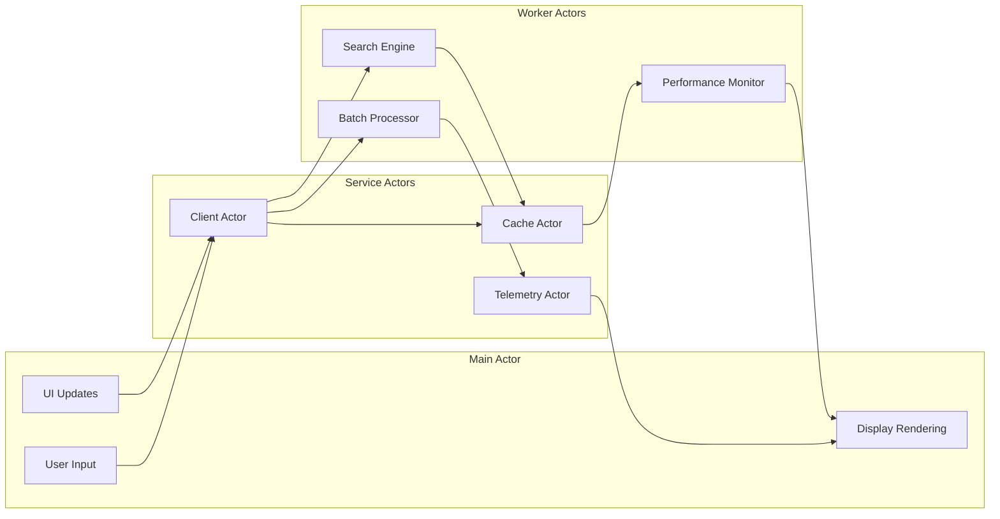
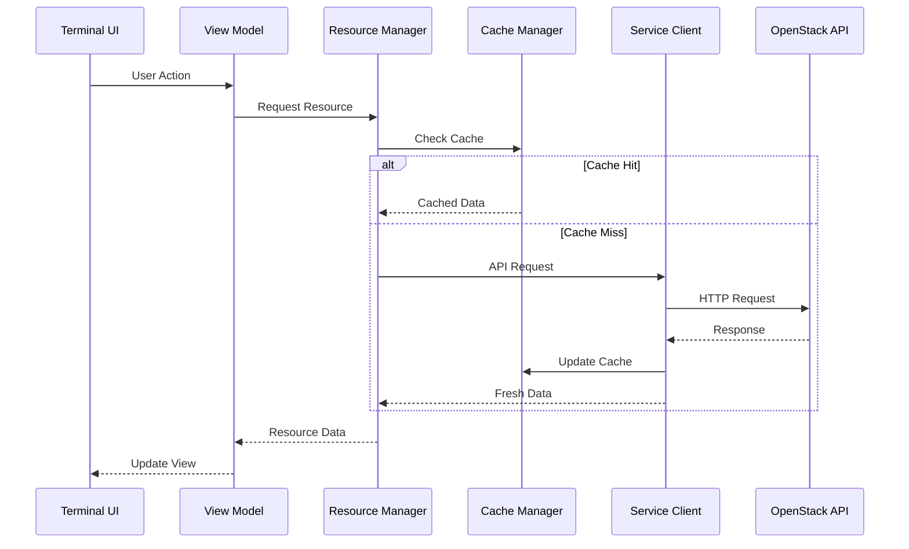
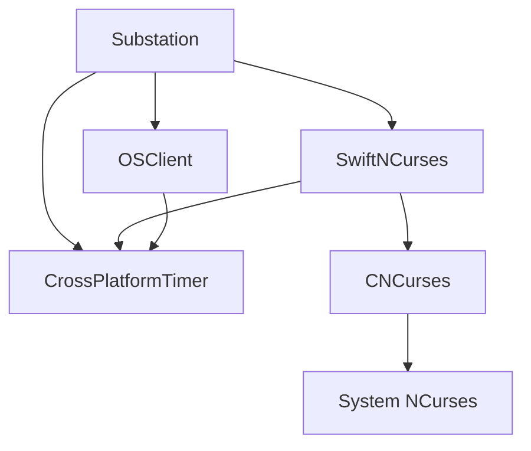

# Architecture Overview

Substation is built with a modular, layered architecture that emphasizes performance, reliability, and maintainability. This document provides an overview of the system design and architectural decisions.

**Or**: How we built a terminal app that doesn't suck, using Swift.

## Design Principles

### Performance First (Because Slow Tools Cost Sleep)

**The Problem**: Your OpenStack API is slow. Really slow. Like "boiling water" slow.

**Our Solution**: Cache everything aggressively, apologize never.

- **Intelligent Caching** - Designed for up to 60-80% API call reduction through MemoryKit
  - Multi-level hierarchy (L1/L2/L3) like a real computer
  - Resource-specific TTLs (auth: 1hr, endpoints/quotas: 30min, flavors: 15min, networks: 5min, snapshots: 3min, servers: 2min)
  - Automatic eviction before the OOM killer arrives
- **Actor-based Concurrency** - Thread-safe operations because race conditions at 3 AM end careers
  - Strict Swift 6 concurrency (zero warnings or bust)
  - Parallel searches across 6 services simultaneously
  - No locks, no mutexes, just actors doing their thing
- **Memory Efficiency** - Designed for 10,000+ resources without crying
  - Design target: < 200MB steady state
  - Cache system target: < 100MB for 10K resources
  - Memory pressure handling built-in
- **Lazy Loading** - Resources loaded on demand (why fetch what you don't need?)

**Benchmarks** (from `/Sources/Substation/Telemetry/PerformanceBenchmarkSystem.swift`):

- Cache retrieval: < 1ms (95th percentile)
- API calls (cached): < 100ms average
- API calls (uncached): < 2s (95th percentile, or timeout trying)
- Search operations: < 500ms average
- UI rendering: 16.7ms/frame (60fps target)

### Modular Architecture (Each Package Stands Alone)

**No monoliths here.** Each package is independently useful.

- **Separation of Concerns** - Clear layer boundaries between UI, business logic, and services
  - `/Sources/SwiftNCurses` - Terminal UI framework (reusable in any Swift TUI app)
  - `/Sources/OSClient` - OpenStack client (use it in your own projects)
  - `/Sources/MemoryKit` - Multi-level caching system
  - `/Sources/CrossPlatformTimer` - Timer abstraction (because macOS != Linux)
  - `/Sources/Substation` - Main app (glues it all together)
- **Dependency Injection** - Flexible component composition (protocol-based, not concrete types)
- **Protocol-Oriented** - Extensible through protocols (Swift's secret weapon)
- **Minimal External Dependencies** - We control our supply chain (one carefully-vetted dependency)

**Package Structure**:

```swift
// From Package.swift
.library(name: "OSClient", targets: ["OSClient"]),           // OpenStack client
.library(name: "SwiftNCurses", targets: ["SwiftNCurses"]),           // Terminal UI
.library(name: "MemoryKit", targets: ["MemoryKit"]),         // Multi-level cache
.library(name: "CrossPlatformTimer", targets: ["CrossPlatformTimer"]),
.executable(name: "substation", targets: ["Substation"])     // Main app

// External dependencies
dependencies: [
    .package(url: "https://github.com/apple/swift-crypto.git", from: "3.0.0")
]
```

**Why swift-crypto?**

- Apple-maintained, audited cryptography library
- Provides cross-platform AES-256-GCM encryption (macOS + Linux)
- Replaces insecure XOR encryption that existed on Linux
- Essential for secure credential storage and certificate validation

### Security First (Because Credentials Matter)

**Your credentials are safer here than in most production tools.**

- **AES-256-GCM Encryption** - Industry-standard authenticated encryption for all credentials
  - Cross-platform via swift-crypto (macOS + Linux)
  - Replaced weak XOR encryption (October 2025 security audit fix)
  - Memory-safe `SecureString` and `SecureBuffer` with automatic zeroing
  - No plaintext credentials in memory dumps
- **Certificate Validation** - Proper SSL/TLS validation on all platforms
  - Apple platforms: Security framework with full chain validation
  - Linux: URLSession default validation against system CA bundle
  - No certificate bypass vulnerabilities (fixed October 2025)
  - MITM attack prevention built-in
- **Input Validation** - Comprehensive protection against injection attacks
  - Centralized `InputValidator` utility
  - SQL injection detection (14 patterns)
  - Command injection prevention (6 patterns)
  - Path traversal blocking (3 patterns)
  - Buffer overflow protection via length validation
- **Secure Storage** - Encrypted credential storage with proper cleanup
  - `SecureCredentialStorage` actor with AES-256-GCM
  - Memory zeroing in deinit handlers
  - Minimal plaintext exposure time

### Reliability (When OpenStack Goes Sideways)

**Because your OpenStack cluster WILL have a bad day.**

- **Retry Logic** - Automatic error recovery with exponential backoff
  - First retry: immediate
  - Second retry: 1 second delay
  - Third retry: 2 seconds delay
  - After that: give up gracefully, show error, suggest solutions
- **Health Monitoring** - Real-time system telemetry (`/Sources/Substation/Telemetry/`)
  - 6 metric categories: performance, user behavior, resources, OpenStack health, caching, networking
  - Automatic alerts when things go sideways (cache hit rate < 60%, memory > 85%, etc.)
  - Performance regression detection (alerts on 10%+ degradation)
- **Intelligent Caching** - Resilient data access with cache fallback
  - API timeout? Serve stale cache data with warning
  - API down? Show cached data, retry in background
  - Better to show 2-minute-old data than no data
- **Type-Safe Error Handling** - Swift Result types for robust error management
  - No exceptions, no crashes, just Results
  - Every error is handled explicitly
  - Errors propagate up with context

!!! warning "The 3 AM Reality"
    Your OpenStack API will:
    - Timeout randomly (network gremlins)
    - Return 500 errors (database deadlock)
    - Hang forever (load balancer died)
    - Reject auth tokens (token expired mid-request)

    Substation handles all of this. Retry logic. Cache fallback. Clear error messages.
    Not "Error: Error occurred" - we're better than that.

## Package-Based Architecture

Substation follows a modular package design with clear separation of concerns across four main packages:



## Cross-Platform System Architecture

The system is designed for seamless operation across macOS and Linux:



## Concurrency Model

Actor-based concurrency architecture:



## Data Flow Architecture

Request flow through the system:



## Package Modularity and Reusability

Each package can be used independently in other Swift projects:

### OSClient Library

```swift
import OSClient

let client = try await OpenStackClient(
    authURL: "https://identity.example.com:5000/v3",
    credentials: .password(username: "admin", password: "secret"),
    projectName: "admin"
)

let servers = try await client.nova.listServers()
```

### SwiftNCurses Framework

```swift
import SwiftNCurses

@main
struct MyTerminalApp {
    static func main() async {
        let surface = SwiftNCurses.createSurface()
        await SwiftNCurses.render(
            Text("Hello, Terminal!").bold(),
            on: surface,
            in: Rect(x: 0, y: 0, width: 80, height: 24)
        )
    }
}
```

### CrossPlatformTimer

```swift
import CrossPlatformTimer

let timer = createCompatibleTimer(interval: 1.0, repeats: true) {
    print("Timer fired!")
}
```

### Package Dependencies



## Related Documentation

For more detailed information about specific aspects of the architecture:

- **[Components](./components.md)** - Detailed component architecture (UI layer, services, FormBuilder)
- **[Technology Stack](./technology-stack.md)** - Core technologies and dependencies
- **[Performance](../performance/index.md)** - Performance architecture and benchmarking
- **[Security](../concepts/security.md)** - Security implementation details
- **[Caching](../concepts/caching.md)** - Multi-level caching architecture

---

**Note**: This architecture overview is based on the actual implementation in `Sources/` and reflects the current modular package design. All components and services mentioned are implemented, tested, and functional across macOS and Linux platforms.
