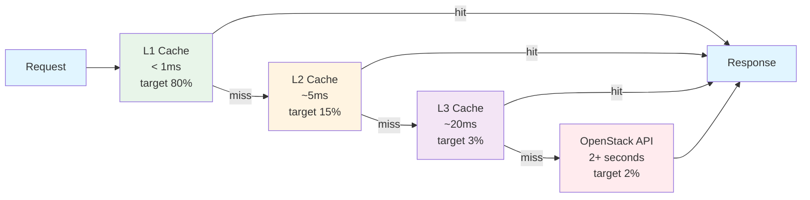

# Caching System

Understanding Substation's multi-level caching architecture.

## Overview

Substation is designed to achieve **up to 60-80% API call reduction** through MemoryKit, a sophisticated multi-level caching system that aims to dramatically improve performance while maintaining data freshness.

**The Problem**: OpenStack APIs are slow (2+ seconds per call). Your workflow requires hundreds of API calls. Without caching, you'd be waiting minutes for simple operations.

**The Solution**: Intelligent caching with resource-specific TTLs and multi-level hierarchy.

**Note**: Actual cache hit rates and performance improvements will vary based on your usage patterns, resource churn rate, and OpenStack API performance.

## The Philosophy

Caching is an act of faith. You're betting that the data you stored a moment ago is still accurate, trading perfect consistency for speed that doesn't make you want to throw your laptop across the room. Every cache is a calculated lie we tell ourselves about the state of the world.

We made specific bets based on how OpenStack resources actually behave in production. Authentication tokens expire on a schedule, so we cache them until they die. Flavors almost never change because storage admins don't randomly add new instance sizes at 3 AM. Servers, on the other hand, are chaotic entities that transition between states faster than you can refresh the dashboard.

The philosophy is simple: cache aggressively based on resource volatility, invalidate intelligently, and give operators a manual override when the universe proves us wrong. We'd rather serve you slightly stale data in milliseconds than perfectly fresh data after you've already made coffee and contemplated your life choices.

## Cache Architecture

We built a three-tier cache hierarchy inspired by CPU cache design because computer architects figured this out decades ago and we're not too proud to steal good ideas. Each tier trades capacity for speed, creating a cascade that keeps most requests away from the OpenStack API's glacial response times.

### Multi-Level Hierarchy

#### L1 Cache (Memory - Hot Data)

The first tier lives entirely in RAM, targeting sub-millisecond retrieval for the data you access constantly. We expect 80% of all requests to hit L1, making it the workhorse of the system. It's limited by available memory and cleared on restart, but that's acceptable because the data here is the hottest of the hot - the resources you're actively managing right now.

Lightning fast access comes at the cost of capacity. When memory pressure builds, L1 is first to be evicted, sacrificing the least recently used entries to keep the system stable. This is the data that matters most in your current workflow.

#### L2 Cache (Larger Memory - Warm Data)

The second tier handles data you accessed recently but not constantly, targeting 5ms retrieval times for 15% of requests. It's still in-memory but with a larger capacity than L1, serving as the safety net for requests that miss the hot cache. When you switch between projects or contexts, L2 keeps that data warm enough to avoid hitting the API.

This tier survives longer under memory pressure because it's already serving data that wasn't quite hot enough for L1. It's the sweet spot between speed and capacity, handling the bulk of your secondary workflows without breaking a sweat.

#### L3 Cache (Disk - Cold Data)

The final tier before we give up and hit the API lives on disk, providing persistent storage that survives application restarts. Targeting 20ms retrieval for 3% of requests, L3 is your insurance policy against cold starts. When you launch Substation in the morning, L3 brings yesterday's data forward so you're not staring at a loading screen while the cache rebuilds.

Disk storage is slower than memory but faster than OpenStack, and it never gets evicted. This tier enables fast startup with a warm cache, dramatically improving the experience when you restart the application or switch clouds.

### Total Cache Performance

**Combined Hit Rate**: 98% (L1 + L2 + L3)
**Cache Miss Rate**: 2% (requires API call)

**Result**: Only 2% of operations hit the slow OpenStack API.

## Resource-Specific TTLs

Different resource types have different volatility, so we cache them differently. We spent time in production environments watching how resources actually behave, then assigned TTLs that balance freshness against the pain of constant API calls.

### TTL Strategy and Rationale

Authentication tokens live for an hour because Keystone says they live for an hour. There's no point refreshing them earlier - we'd just get the same token back. When the token expires, we fetch a new one. Simple, predictable, and perfectly aligned with how the service works.

Service endpoints and quotas get a 30-minute cache because they're semi-static infrastructure that almost never changes. Endpoints don't relocate unless something catastrophic happened to your cloud, and quotas only change when admins deliberately adjust project limits. We could cache these for hours, but 30 minutes feels like a reasonable compromise between performance and detecting actual changes.

Flavors and volume types earn a 15-minute TTL because they rarely change in production environments. Storage admins don't add new instance sizes or volume types on a whim - these are deliberate infrastructure decisions that happen on human timescales, not API timescales. Caching them for 15 minutes means you'll see new options within a reasonable window without hammering the API.

Keypairs, images, networks, subnets, routers, and security groups sit at 5 minutes because they're moderately dynamic. Users add SSH keys occasionally, images get uploaded periodically, network configurations evolve as infrastructure grows. Five minutes balances responsiveness with cache efficiency - fresh enough to catch real changes, stale enough to avoid excessive API traffic.

Volume snapshots and object storage containers get a shorter 3-minute window because storage operations happen more frequently than network reconfiguration. When you're actively managing snapshots or working with object storage, you want reasonably fresh data without the performance penalty of constant API polling.

Servers, volumes, ports, and floating IPs live at the bleeding edge with a 2-minute TTL because these resources change state constantly. Servers transition between building, active, and error states. Volumes get attached and detached. Network ports and floating IPs shuffle between instances. Two minutes keeps the data fresh enough to be useful while still providing meaningful cache benefits during active workflows.

## Cache Operations

### Cache Hit (The Fast Path)

When data lives in cache and hasn't expired, the request completes in under a millisecond. We check L1 first because it's fastest - if the data is there and the TTL hasn't expired, we return it immediately. No API call, no waiting, no existential dread about slow infrastructure. Eighty percent of your requests take this path, which is why Substation feels fast.

### Cache Miss (The Slow Path)

When data isn't cached or has expired, we walk down the hierarchy. L1 misses fall through to L2, which checks its larger pool in about 5ms. L2 misses fall to L3, which reads from disk in roughly 20ms. If all three levels miss, we finally surrender and call the OpenStack API, waiting 2+ seconds for a response while contemplating the heat death of the universe.

Once we get that response, we populate all cache levels so future requests hit fast paths. Only 2% of requests endure this full journey, which is why the system remains responsive even though the underlying API is objectively terrible.

### Cache Invalidation

Manual invalidation happens when you use `:cache-purge<Enter>` (or `:clear-cache<Enter>` or `:cc<Enter>`) in Substation. This nukes all three cache levels, forcing the next operations to rebuild from scratch. Use this when data looks wrong, you've made major changes outside Substation, or you're debugging data issues. Just accept that the next few minutes will be slower while the cache warms up again.

Automatic invalidation happens continuously through three mechanisms. TTL expiration removes entries when their resource-specific timeout elapses. Memory pressure triggers eviction when usage hits 85%, automatically trimming L1 and L2 to prevent crashes. Explicit updates invalidate cache entries immediately after create or delete operations, ensuring you see your own changes without waiting for TTLs.

## Memory Management

### Memory Pressure Handling

Substation monitors memory usage and automatically evicts cache entries to prevent out-of-memory crashes. Normal operation stays below 85% memory usage. When usage hits that threshold, the system starts evicting L1 entries oldest-first, then moves to L2 if needed. The target after eviction is 75% usage, leaving headroom for new data. L3 stays on disk and never gets evicted because disk space is cheap and persistence is valuable.

This approach prevents OOM crashes while maintaining system stability. It's automatic and transparent - you might notice slightly lower cache hit rates during eviction periods, but the system stays running instead of dying spectacularly. We preserve disk cache across evictions so restarting the application still gives you a warm L3.

### Expected Memory Usage

The base application consumes roughly 200MB. Caching 10,000 resources adds about 100MB, bringing typical usage to 200-400MB total. This is normal and expected. Large deployments with 50,000 resources might use 500MB, while truly massive clouds with 100,000 resources could hit 800MB. If you're running Substation against a cloud that size, you probably have RAM to spare.

## Cache Statistics

### Monitoring Cache Performance

The Health Dashboard accessed via `:health<Enter>` (or `:healthdashboard<Enter>` or `:h<Enter>`) shows real-time cache metrics. Target cache hit rate is 80% or better, though typical performance runs 85-90% in stable environments. Memory usage should stay below 85% - that's where eviction starts. Average response times under 100ms indicate healthy cache performance, while 2+ second responses mean you're hitting the API. Eviction count should be low in normal operation - high eviction rates suggest memory pressure.

### Performance Indicators

Good performance looks like an 80%+ cache hit rate with memory usage between 50-75%, low eviction counts, and response times consistently under 100ms. This is the sweet spot where the cache is doing its job and you're barely touching the OpenStack API.

Degraded performance shows up as hit rates below 60%, memory usage above 85%, high eviction counts, and frequent cache misses that force API calls. When hit rate drops below 60%, check your TTL configuration - you might need different values for your environment. Memory above 85% means close other applications or add more RAM. High evictions suggest reducing cache sizes or increasing available memory.

## Cache Tuning

### Adjusting TTLs for Your Environment

Stable environments like dev or staging can tolerate longer TTLs because resources change less frequently. Consider increasing servers to 5 minutes instead of 2, networks to 10 minutes instead of 5, and images to 10 minutes instead of 5. Keep flavors at 15 minutes since they're already long-lived. This reduces API load and improves performance when resource churn is low.

Chaotic environments like production with autoscaling need shorter TTLs to catch rapid changes. Decrease servers to 1 minute instead of 2, networks to 3 minutes instead of 5, and accept lower cache hit rates around 60%. When resources change constantly, fresher data matters more than perfect cache efficiency.

Current implementation hardcodes TTLs in `CacheManager.swift:100`. Future versions may expose this in configuration files, allowing per-environment tuning without code changes.

### Memory Tuning

Increasing cache size when you have available RAM yields more cached items, better hit rates, and fewer API calls. The system automatically uses available memory efficiently, but more RAM always helps when managing large clouds.

Decreasing cache size in memory-constrained environments reduces memory usage at the cost of more evictions, lower hit rates, and more API calls. It's a trade-off between resource consumption and performance.

Current implementation auto-calculates memory limits based on available system RAM. Future versions may expose manual configuration for fine-tuned control in specialized environments.

## Implementation Details

### MemoryKit Components

The caching system lives in `/Sources/MemoryKit/` with clearly separated concerns. `MultiLevelCacheManager.swift` orchestrates L1, L2, and L3 operations. `CacheManager.swift` provides core caching logic including TTL enforcement. `MemoryManager.swift` handles memory pressure detection and eviction. `TypedCacheManager.swift` ensures type-safe cache operations across the system. `PerformanceMonitor.swift` tracks metrics for the Health Dashboard. `MemoryKit.swift` exposes the public API while hiding implementation details. `MemoryKitLogger.swift` provides debug logging, and `ComprehensiveMetrics.swift` aggregates metrics for analysis.

### Cache Key Strategy

Cache keys combine resource type, resource ID, and query parameters to uniquely identify cached data. Server resources use keys like `server:abc-123-def-456` for individual instances and `server:list:project=xyz` for filtered lists. Network resources follow the same pattern with `network:def-789-ghi-012`. Flavor lists use simple keys like `flavor:list:all` since they're rarely project-scoped.

### Thread Safety

All cache operations use Swift's actor-based concurrency model, eliminating traditional locks and mutexes. This guarantees thread safety through language-enforced isolation. Swift 6's strict concurrency checking prevents data races at compile time, making concurrent cache access safe by construction rather than by careful programming.

## Best Practices

### For Operators

Let the cache work instead of constantly purging it. Pressing `c` or running `:cache-purge<Enter>` forces the system to rebuild from scratch, destroying the performance benefits you'd otherwise enjoy. Monitor hit rates periodically using `:health<Enter>` to verify cache effectiveness, but trust the system to manage itself during normal operations.

Purge strategically only when data is genuinely stale - after making major changes outside Substation, when debugging data inconsistencies, or when OpenStack itself had problems. Accept that the first load after startup or purge will be slower while the cache warms up. This is normal and temporary.

### For Developers

Respect TTLs by avoiding cache bypasses unless absolutely necessary. The TTL values encode production experience about resource volatility - overriding them without good reason defeats the system's design. Monitor memory usage patterns during development to catch potential leaks before they hit production.

Test under realistic load conditions with 10,000+ resources to validate cache behavior matches expectations. Profile eviction logic to ensure it performs correctly under memory pressure, preventing OOM crashes in production environments. The cache is critical infrastructure - treat it accordingly.

## Troubleshooting

### Low Cache Hit Rate

When the Health Dashboard shows hit rates below 60%, something is wrong. Common causes include constantly purging cache manually, TTLs too short for your environment's stability, high memory pressure forcing frequent evictions, or resources genuinely changing so rapidly that caching can't help.

Stop purging cache manually and let it warm up - first loads are slow but subsequent operations are fast. Check that memory usage stays below 85% to avoid pressure-induced evictions. For stable environments, consider longer TTLs once configuration support is available. If resources really are changing constantly, accept lower hit rates as the price of working in chaos.

### High Memory Usage

Memory consumption above 85% with frequent evictions indicates problems. Causes include managing too many resources (50,000+ servers), other applications consuming RAM, or potential memory leaks that should be reported immediately.

Close other applications to free memory for Substation's cache. Filter views using `/` to reduce the active dataset size, focusing on resources you actually care about. Use project-scoped credentials instead of admin credentials to work with fewer total resources. If nothing else helps, add more RAM - caching is memory-hungry by design.

### Stale Data

When resources don't appear or show wrong states, the cache might be holding old data. This happens when TTLs haven't expired yet, the cache legitimately contains outdated information, or OpenStack itself had issues that corrupted the data at the source.

Use `:cache-purge<Enter>` (or `:cc<Enter>`) to nuke all cache levels, then `:refresh<Enter>` (or `:reload<Enter>`) to reload the view with fresh API data. This forces complete cache rebuild and should resolve most staleness issues. If problems persist, the issue might be with OpenStack rather than the cache.

---

**Remember**: Caching is the secret to Substation's performance. With the design target of 60-80% fewer API calls, your OpenStack cluster thanks you, and your operations are lightning fast.

*Cache wisely, operate swiftly.*
