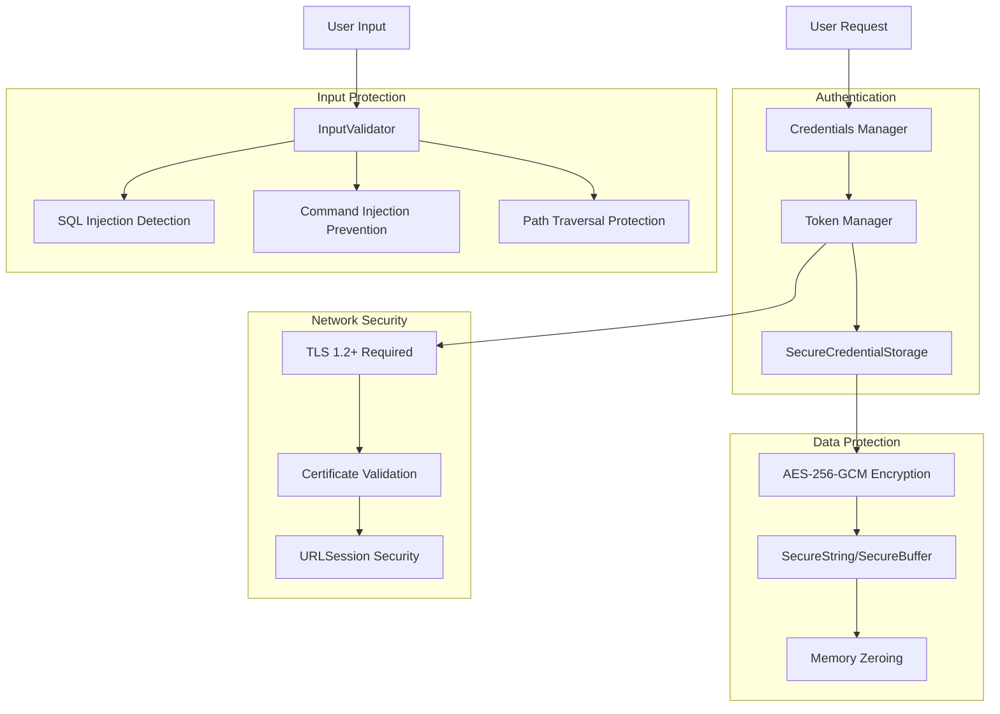
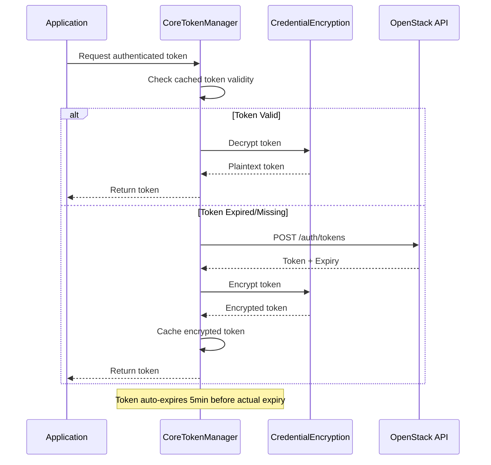
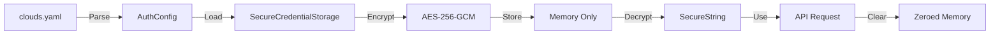

# Security Architecture

## Why Security Matters Here

Substation is fundamentally a credentials management tool. It stores your OpenStack usernames and passwords, maintains active authentication tokens, makes API calls on your behalf, and displays sensitive infrastructure data in the terminal. Every time you launch Substation, you're trusting it with the keys to your cloud infrastructure -- keys that could provision thousands of servers, delete production databases, or expose private network configurations.

We take this seriously because the consequences of getting it wrong are severe. A single credential leak could compromise an entire OpenStack deployment. A man-in-the-middle attack could expose authentication tokens. Injection vulnerabilities could lead to data exfiltration. This isn't theoretical risk -- these are real threats that production systems face every day.

This document outlines how we protect your credentials, what threats we defend against, and -- just as importantly -- what we don't protect against.

## Executive Summary

We encrypt all credentials using AES-256-GCM, the same encryption standard used by governments and financial institutions. We enforce proper SSL/TLS certificate validation without bypasses or escape hatches. We validate every piece of user input to prevent injection attacks. We handle credentials in memory-safe wrappers that automatically zero themselves on deallocation. And we never, ever write plaintext credentials to logs or disk.

## Our Security Philosophy

Security isn't about adding features -- it's about careful thinking at every layer. We call this "paranoia by design." Every credential that enters Substation is encrypted before storage. Every network connection is validated. Every user input is checked for malicious patterns. Every sensitive value in memory is cleared when no longer needed.

We don't believe in security through obscurity. This document describes exactly how we protect your data, what algorithms we use, and what limitations exist. Transparency allows security researchers to verify our claims and helps you make informed decisions about trust.

## Threat Model

### Assets We Protect

Substation handles three categories of sensitive data. First, OpenStack credentials themselves: username and password combinations, application credential secrets, authentication tokens, and API keys. These are the crown jewels -- unauthorized access to any of these could compromise your entire cloud infrastructure.

Second, configuration data: the contents of your clouds.yaml file, custom OpenStack endpoints, and project or tenant information. While less sensitive than credentials, this data reveals your infrastructure topology and could aid targeted attacks.

Third, session data: active authentication tokens, cached resource information, and API responses. These contain both authentication material and potentially sensitive infrastructure details like IP addresses, instance names, and network configurations.

### Threat Actors We Defend Against

Network attackers are our primary concern. An attacker positioned between Substation and your OpenStack endpoints could intercept credentials, steal authentication tokens, or modify API responses. We defend against this through mandatory TLS encryption and strict certificate validation.

Local attackers with access to the same system represent a different threat profile. They might attempt memory dumps to extract credentials, inspect running processes, or read files from disk. We address this through encryption at rest, memory-safe credential handling, and automatic zeroing of sensitive data.

Malicious input attacks attempt to exploit how we process user-provided data. SQL injection, command injection, and path traversal attacks could lead to data exfiltration or system compromise. We mitigate these through comprehensive input validation at every trust boundary.

Post-compromise scenarios assume an attacker has already gained some level of system access and is attempting to extract credentials for privilege escalation or lateral movement. We limit the damage through defense-in-depth: even if an attacker gains file system access, credentials remain encrypted. Even if they dump process memory, sensitive data has a limited lifetime and is automatically cleared.

## Security Architecture



### 1. Encryption

#### Why AES-256-GCM for Credential Storage

We chose AES-256-GCM (Advanced Encryption Standard in Galois/Counter Mode) for credential encryption because it provides authenticated encryption with associated data (AEAD) in a single algorithm. This matters because traditional encryption modes only provide confidentiality -- they prevent someone from reading your data, but they don't prevent them from modifying it. AES-GCM provides both confidentiality through 256-bit encryption and authenticity through built-in message authentication codes.

The 256-bit key size represents the maximum key length for AES and provides protection against both current and foreseeable cryptographic attacks. Even with quantum computing advances, 256-bit symmetric encryption is expected to remain secure for decades. The GCM mode offers performance advantages on modern hardware through hardware acceleration (AES-NI instructions on Intel/AMD processors), making encryption and decryption operations nearly free in terms of CPU time.

We generate encryption keys using cryptographically-secure random number generators (CSPRNG) that provide true randomness rather than pseudorandom patterns. Each application instance generates a unique 256-bit session key on startup. This key lives only in memory and is never persisted to disk. When the process exits, the key is gone forever. This means credentials encrypted in one session cannot be decrypted in another session -- a deliberate design choice that prioritizes security over convenience.

**Implementation**:

```swift
// CredentialEncryption class (OpenStackClientCore.swift)
public func encrypt(_ data: Data) throws -> Data {
    let symmetricKey = SymmetricKey(data: key)
    let sealedBox = try AES.GCM.seal(data, using: symmetricKey)
    return sealedBox.combined!
}
```

The implementation uses Apple's `swift-crypto` library, which provides cross-platform cryptographic primitives that work identically on macOS and Linux. This ensures consistent security properties regardless of deployment platform.

#### SecureString and SecureBuffer

The biggest challenge in credential handling isn't encryption -- it's preventing credentials from leaking through memory. Swift's String type is convenient but dangerous for passwords because strings are immutable and may be copied multiple times throughout their lifetime. Each copy persists in memory until garbage collection, potentially surviving long after the credential is no longer needed.

SecureString and SecureBuffer solve this problem by wrapping sensitive data in memory-safe containers that automatically zero themselves on deallocation. When a SecureString goes out of scope, its destructor explicitly overwrites the underlying memory with zeros before releasing it back to the system. This ensures that credentials don't linger in memory where they could be extracted by memory dumps or core files.

```swift
// SecureString (OpenStackClientCore.swift)
public struct SecureString: Sendable {
    private let buffer: SecureBuffer

    deinit {
        // Automatic memory zeroing
        buffer.clear()
    }
}
```

These wrappers also prevent accidental logging. Because SecureString doesn't implement CustomStringConvertible, attempting to log it produces only the type name, never the actual content. This makes it nearly impossible to accidentally write passwords to log files through string interpolation.

### 2. Certificate Validation

#### Apple Platforms (macOS)

On macOS, we leverage the Security framework's comprehensive certificate validation system. This isn't just checking that a certificate is signed -- it's verifying the entire chain of trust from the server certificate up through intermediate CAs to a trusted root, checking expiration dates, validating that the hostname in the certificate matches the hostname we're connecting to, and checking revocation status through OCSP (Online Certificate Status Protocol) and CRL (Certificate Revocation Lists).

```swift
let policy = SecPolicyCreateSSL(true, host as CFString)
SecTrustSetPolicies(serverTrust, policy)

var error: CFError?
let isValid = SecTrustEvaluateWithError(serverTrust, &error)
```

This validation happens on every HTTPS connection to OpenStack endpoints. There is no bypass, no "accept anyway" option, and no configuration setting to disable it. If the certificate doesn't validate, the connection fails. This is intentional. Certificate validation is the foundation of HTTPS security, and compromising it compromises everything else.

#### Linux Platforms

On Linux, we use URLSession's built-in validation, which delegates to the system's CA bundle (typically stored in /etc/ssl/certs or similar). This provides the same validation properties as macOS -- chain integrity, expiration checking, hostname verification, and standard X.509 validation rules -- but uses the platform-native trust store.

```swift
// Delegates to system CA bundle
completionHandler(.performDefaultHandling, nil)
```

This platform-specific approach ensures we're always using the most current and well-maintained certificate validation logic available on each platform.

### 3. Input Validation

Every piece of data that comes from outside Substation -- whether from user input, configuration files, or API responses -- is untrusted until proven otherwise. Our InputValidator utility implements centralized validation to protect against common injection attacks.

For SQL injection, we detect 14 distinct attack patterns including UNION SELECT attacks, INSERT/DELETE/DROP statements, comment-based injection using -- or # characters, and quote-based injection like '; DROP TABLE. While Substation doesn't directly execute SQL, these patterns could still be dangerous if user input flows into logging systems or external tools.

Command injection protection catches 6 patterns of shell metacharacters: semicolons for command chaining, pipes for command redirection, ampersands for background execution, dollar signs for variable expansion, backticks and $() for command substitution, and redirection operators. These prevent user-supplied server names or resource identifiers from executing arbitrary commands if they're ever passed to shell contexts.

Path traversal detection identifies ../ and ..\ sequences as well as URL-encoded variants like %2e%2e/. This prevents attackers from using relative paths to access files outside intended directories, particularly important for any file upload or configuration file handling.

Buffer overflow protection enforces configurable length limits (defaulting to 255 characters) on all user input fields. While Swift's memory safety prevents traditional buffer overflows, length limits still defend against memory exhaustion attacks and ensure input stays within reasonable bounds.

#### Example Usage

```swift
// Validate resource name
errors.append(contentsOf: InputValidator.validateNameField(name, maxLength: 255))

// Validate IP address
errors.append(contentsOf: InputValidator.validateIPAddress(ipAddress))

// Validate CIDR notation
errors.append(contentsOf: InputValidator.validateCIDR(cidr))
```

### 4. Secure Storage

#### SecureCredentialStorage Actor

The SecureCredentialStorage actor provides thread-safe encrypted credential storage using Swift's actor model for concurrency. All credentials are encrypted with AES-256-GCM before storage, ensuring that even if an attacker gains access to the in-memory data structures, they see only ciphertext.

```swift
public actor SecureCredentialStorage {
    private var credentials: [String: Data] = [:]  // AES-256-GCM encrypted
    private var encryptionKey: Data?

    deinit {
        // Secure cleanup - zero all memory
        for (_, var data) in credentials {
            data.withUnsafeMutableBytes { bytes in
                if let baseAddress = bytes.baseAddress {
                    memset(baseAddress, 0, bytes.count)
                }
            }
        }
        credentials.removeAll()
        encryptionKey = nil
    }
}
```

The deinit method ensures that when the storage actor is deallocated, all credential data is explicitly zeroed before memory is released. This prevents credentials from lingering in deallocated memory pages.

### 5. Authentication Flow

#### Token Management



Authentication tokens are encrypted at rest using the same AES-256-GCM encryption as credentials. Tokens automatically refresh before expiry (with a 5-minute safety margin), ensuring uninterrupted operation while minimizing the window of vulnerability if a token is compromised. Tokens never touch disk -- they exist only in encrypted form in memory and are cleared on process exit.

#### Credential Flow



## Cryptographic Decisions

We made deliberate choices about which cryptographic algorithms to use and why. For credential and token encryption, we use AES with 256-bit keys in GCM mode. We chose AES because it's the most thoroughly analyzed symmetric encryption algorithm in existence, with decades of cryptanalysis finding no practical attacks against the full algorithm. We chose 256-bit keys because they provide a comfortable security margin even against future attacks. We chose GCM mode because it provides authenticated encryption, ensuring that encrypted data hasn't been tampered with.

For random number generation, we use cryptographically-secure pseudorandom number generators (CSPRNG) with 256 bits of entropy. On macOS, this is `SecRandomCopyBytes` from the Security framework. On Linux, this is `arc4random_buf` from libc. Both provide cryptographically-strong randomness suitable for key generation.

For TLS and SSL, we delegate to the system's implementation rather than trying to implement our own. URLSession on both macOS and Linux uses platform-native TLS libraries (Secure Transport on macOS, OpenSSL or similar on Linux) that are actively maintained and receive security updates. The minimum supported version is TLS 1.2, with modern cipher suites preferred automatically.

The key insight is that we don't implement cryptography ourselves -- we use well-tested, widely-deployed libraries that have survived years of scrutiny. Custom cryptography is a recipe for disaster. We use Apple's CryptoKit and swift-crypto, which are based on the same BoringSSL/OpenSSL foundation used by millions of applications worldwide.

## Honest Limitations

Now let's talk about what we don't protect against, because understanding limitations is just as important as understanding capabilities.

**Physical Access to the Machine**: If an attacker has physical access to the computer running Substation, our security model breaks down. They could install keyloggers to capture credentials as you type them, use hardware debuggers to extract encryption keys from memory, or simply read the clouds.yaml file directly. Physical access is game over. Keep your machines physically secure.

**Malware on the System**: If your system is already compromised by malware, that malware can do everything Substation can do. It could hook system calls to intercept credentials, monitor memory to extract encryption keys, or inject code into the Substation process. We cannot protect against an attacker who has already gained code execution on your system. This is why keeping your OS and software updated matters.

**Users Who Share Credentials**: If you give someone your clouds.yaml file or tell them your password, no amount of encryption helps. Security requires that credentials remain confidential. Don't share passwords, don't send clouds.yaml files over unencrypted channels, and don't use the same password for multiple systems.

**Compromised OpenStack Endpoints**: We validate that we're talking to the server we think we're talking to (via certificate validation), but if that server itself is compromised, we can't detect it. If an attacker compromises your OpenStack identity service, they can intercept credentials regardless of what Substation does. Trust your infrastructure providers, use VPNs when accessing cloud APIs over untrusted networks, and monitor for unusual authentication patterns.

**Side-Channel Attacks**: We don't protect against timing attacks, power analysis, or other side-channel attacks. These are theoretical concerns for most users, but in high-security environments, you should consider additional controls like running Substation in isolated virtual machines or using hardware security modules for key storage.

**Memory Dumps from Privileged Processes**: While we zero memory on deallocation, a privileged process (running as root) could dump Substation's memory while credentials are in active use. The window is small -- credentials live in plaintext only during active authentication -- but it exists. Running Substation as a non-privileged user helps but doesn't eliminate this risk.

**Social Engineering**: We can't stop you from being tricked into running malicious commands or providing credentials to fake services. Always verify that you're connecting to legitimate OpenStack endpoints, be suspicious of unexpected authentication prompts, and never run commands from untrusted sources.

Understanding these limitations helps you make informed decisions about how to use Substation securely. Security is a system property, not a feature checkbox. It requires secure systems, informed users, and defense-in-depth.

## Security Best Practices

### For Users

Protecting your clouds.yaml file is the first line of defense. Set file permissions to 600 (readable and writable only by you) to prevent other users on the system from accessing it:

```bash
chmod 600 ~/.config/openstack/clouds.yaml
```

Prefer application credentials over passwords whenever possible. Application credentials can be scoped to specific projects, limited to specific operations, and set to expire automatically. If an application credential is compromised, you can revoke it without changing your password. Create application credentials through the OpenStack dashboard and use them in clouds.yaml.

Keep Substation updated. We release security patches promptly when vulnerabilities are discovered. Check GitHub releases regularly and update when new versions are available.

Always verify that your OpenStack endpoints use HTTPS, not HTTP. The auth_url in your clouds.yaml should always start with https://. If you see certificate warnings, investigate them rather than ignoring them. Certificate warnings indicate something is wrong -- either your OpenStack deployment has a misconfigured certificate (which needs to be fixed) or someone is attempting a man-in-the-middle attack (which needs to be stopped).

### For Developers

Never log credentials. This sounds obvious, but it's easy to accidentally log sensitive data through debug statements or error messages. Log the username if needed, but never the password or token:

```swift
// WRONG
logger.logInfo("Password: \(password)")

// CORRECT
logger.logInfo("Authenticating user: \(username)")
```

Use SecureString for passwords and other sensitive data. Swift's String type is convenient but dangerous for credentials because strings may be copied and persist in memory:

```swift
// WRONG
var password: String

// CORRECT
let password = SecureString(rawPassword)
defer { password.clear() }
```

Validate all input, even from trusted sources. Assume that any data from outside the application boundary is potentially malicious:

```swift
// WRONG
func createServer(name: String) { ... }

// CORRECT
func createServer(name: String) throws {
    let errors = InputValidator.validateNameField(name)
    guard errors.isEmpty else { throw ValidationError(errors) }
    ...
}
```

Clear sensitive data explicitly when you're done with it. While SecureString and SecureBuffer handle this automatically, raw Data objects need manual zeroing:

```swift
defer {
    sensitiveData.resetBytes(in: 0..<sensitiveData.count)
}
```

## Security Hardening

### Recommended System Configuration

Beyond what Substation does internally, you can improve security through system-level configuration. Set restrictive file permissions on the entire OpenStack configuration directory, not just clouds.yaml:

```bash
chmod 700 ~/.config/openstack
chmod 600 ~/.config/openstack/clouds.yaml
```

Configure firewall rules to allow only necessary connections. Substation needs outbound HTTPS (port 443) to OpenStack endpoints, but it doesn't need to accept inbound connections. Block unnecessary inbound connections and use a VPN when accessing OpenStack APIs over untrusted networks like public Wi-Fi.

Keep your operating system updated. OS updates include security patches for TLS libraries, certificate validation logic, and core system components that Substation depends on. Also update swift-crypto when new versions are available, and monitor security advisories for the dependencies we use.

Run Substation as a non-root user. There's no reason to run it with elevated privileges, and doing so expands the attack surface. Consider using a separate user account specifically for OpenStack management, and consider containerization (like Docker or systemd-nspawn) for additional process isolation.

### Network Security

Substation enforces a minimum of TLS 1.2 through URLSession's default configuration. Modern cipher suites are preferred automatically, with the system selecting the most secure mutually-supported option. Certificate validation is always enabled with no bypass mechanism.

Verify that your OpenStack endpoints have valid certificates. Self-signed certificates or certificates from unknown CAs will cause connection failures. This is correct behavior. If you're running a private OpenStack deployment, add your CA certificate to the system trust store rather than disabling validation.

Use internal networks when possible. If your OpenStack deployment is on a private network, connect to it through VPN rather than exposing APIs to the public internet. Consider mutual TLS (mTLS) for high-security environments where both client and server authenticate using certificates.

## Security Monitoring

### Logging

We log authentication attempts (username only, never passwords), API request failures, certificate validation failures, and input validation failures. This provides an audit trail for security-relevant events without logging sensitive data.

We explicitly do not log passwords or credentials, authentication tokens, sensitive API responses, or full stack traces that might contain data. Logs are safe to share with support or include in bug reports.

### Metrics

We track security-relevant metrics including authentication success and failure rates (to detect credential stuffing or brute force attacks), certificate validation failures (to detect man-in-the-middle attempts), input validation rejection rates (to detect injection attack attempts), and memory usage patterns (to detect memory leaks or abnormal resource consumption).

### Alerting

We automatically alert on repeated authentication failures (potential credential stuffing), certificate validation failures (potential MITM attacks), unusual memory usage patterns (potential memory leaks or attacks), and API error rate spikes (potential service issues or attacks).

## Conclusion

Substation implements defense-in-depth security with multiple layers working together. We encrypt all credentials with AES-256-GCM, validate certificates and input at every trust boundary, isolate sensitive data in memory-safe wrappers with automatic cleanup, and monitor security events for anomalies.

The result is a system that protects your OpenStack credentials against common attack vectors while being honest about limitations. Security is never finished -- it's an ongoing process of improvement, monitoring, and response. We continue to enhance Substation's security with each release, and we welcome security researchers to review our implementation and report vulnerabilities responsibly.

Your cloud credentials are valuable. We treat them that way.
