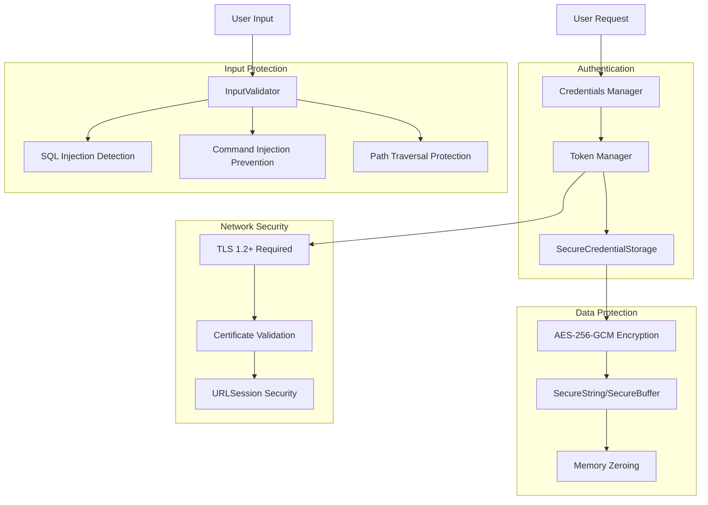
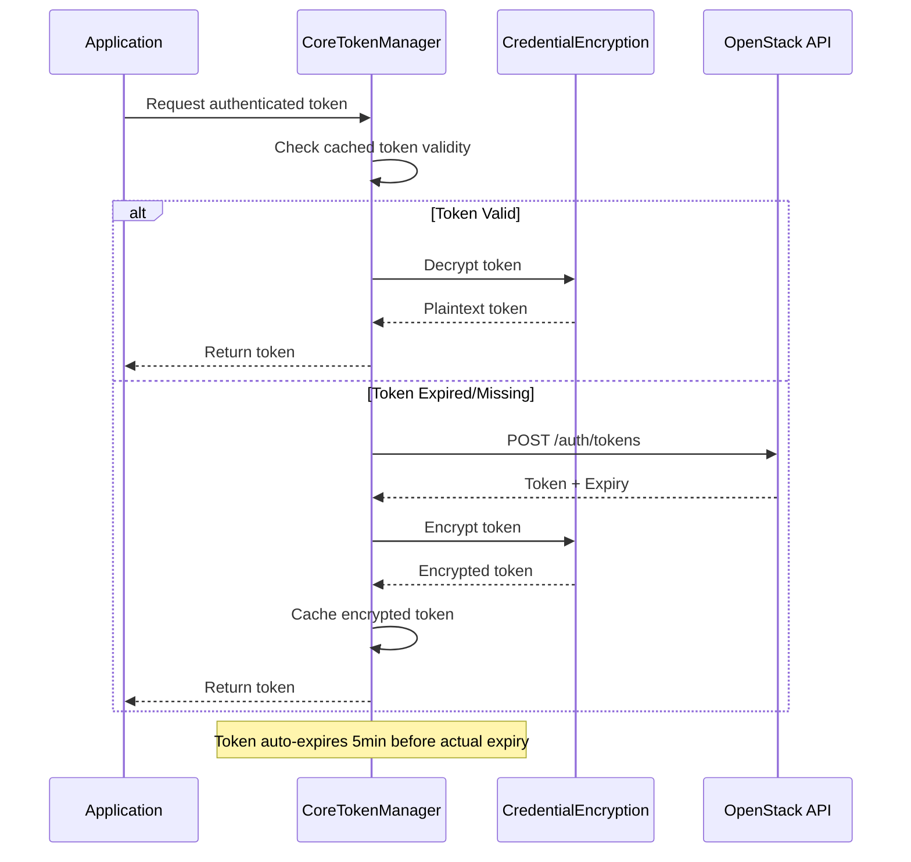
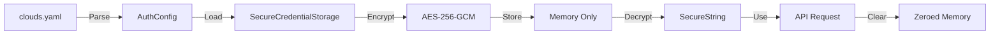

# Security Architecture

Substation takes security seriously. This document outlines the security measures, architecture, and best practices implemented to protect your OpenStack credentials and data.

## Executive Summary

- AES-256-GCM encryption for all credentials (cross-platform)
- Proper SSL/TLS certificate validation (no bypasses)
- Comprehensive input validation (injection attack prevention)
- Memory-safe credential handling with automatic zeroing
- Zero plaintext credentials in memory or logs

## Threat Model

### Assets Protected

1. **OpenStack Credentials**

   - Username/password combinations
   - Application credential secrets
   - Authentication tokens
   - API keys

2. **Configuration Data**

   - clouds.yaml contents
   - Custom OpenStack endpoints
   - Project/tenant information

3. **Session Data**

   - Active authentication tokens
   - Cached resource data
   - API responses

### Threat Actors

- **Network Attackers**: Man-in-the-middle attacks, packet sniffing
- **Local Attackers**: Memory dumps, process inspection, file access
- **Malicious Input**: Injection attacks via user-provided data
- **System Compromise**: Post-compromise credential extraction

## Security Architecture



### 1. Encryption

#### AES-256-GCM for Credential Storage

All sensitive credentials are encrypted using AES-256-GCM (Galois/Counter Mode), providing:

- **Confidentiality**: 256-bit encryption strength
- **Authenticity**: Built-in message authentication
- **Integrity**: Tamper detection via authentication tags
- **Performance**: Hardware-accelerated on modern CPUs

**Implementation**:

```swift
// CredentialEncryption class (OpenStackClientCore.swift)
public func encrypt(_ data: Data) throws -> Data {
    let symmetricKey = SymmetricKey(data: key)
    let sealedBox = try AES.GCM.seal(data, using: symmetricKey)
    return sealedBox.combined!
}
```

**Key Features**:

- Cross-platform via Apple's `swift-crypto` library
- Session-based encryption keys (256-bit random)
- Automatic key generation using cryptographically-secure RNG
- Keys never stored to disk

#### SecureString and SecureBuffer

Memory-safe wrappers for sensitive string data:

```swift
// SecureString (OpenStackClientCore.swift)
public struct SecureString: Sendable {
    private let buffer: SecureBuffer

    deinit {
        // Automatic memory zeroing
        buffer.clear()
    }
}
```

**Features**:

- Automatic memory zeroing on deallocation
- Limited lifetime in plaintext form
- No string copies or interpolation
- Prevents accidental logging

### 2. Certificate Validation

#### Apple Platforms (macOS)

Uses the Security framework for comprehensive validation:

```swift
let policy = SecPolicyCreateSSL(true, host as CFString)
SecTrustSetPolicies(serverTrust, policy)

var error: CFError?
let isValid = SecTrustEvaluateWithError(serverTrust, &error)
```

**Validates**:

- Certificate chain integrity
- Certificate expiration
- Hostname matching
- Trusted CA verification
- Revocation status (OCSP/CRL)

#### Linux Platforms

Uses URLSession's built-in validation:

```swift
// Delegates to system CA bundle
completionHandler(.performDefaultHandling, nil)
```

**Validates**:

- Certificate chain against system CA bundle
- Certificate expiration
- Hostname verification
- Standard X.509 validation rules

### 3. Input Validation

#### InputValidator Utility

Centralized validation protects against:

**SQL Injection** (14 patterns detected):

- `UNION SELECT` attacks
- `INSERT INTO` / `DELETE FROM` / `DROP TABLE`
- Comment-based injection (`--`, `#`)
- Quote-based injection (`'; DROP TABLE`)

**Command Injection** (6 patterns detected):

- Shell metacharacters (`;`, `|`, `&`, `$`)
- Command substitution (`` ` ``, `$()`)
- Redirection operators (`>`, `<`)

**Path Traversal** (3 patterns detected):

- Directory traversal (`../`, `..\\`)
- URL-encoded traversal (`%2e%2e/`)
- Mixed encoding attacks

**Buffer Overflow Protection**:

- Configurable length limits (default 255 characters)
- Enforced on all user input fields
- Prevents memory exhaustion attacks

#### Example Usage

```swift
// Validate resource name
errors.append(contentsOf: InputValidator.validateNameField(name, maxLength: 255))

// Validate IP address
errors.append(contentsOf: InputValidator.validateIPAddress(ipAddress))

// Validate CIDR notation
errors.append(contentsOf: InputValidator.validateCIDR(cidr))
```

### 4. Secure Storage

#### SecureCredentialStorage Actor

Thread-safe encrypted credential storage:

```swift
public actor SecureCredentialStorage {
    private var credentials: [String: Data] = [:]  // AES-256-GCM encrypted
    private var encryptionKey: Data?

    deinit {
        // Secure cleanup - zero all memory
        for (_, var data) in credentials {
            data.withUnsafeMutableBytes { bytes in
                if let baseAddress = bytes.baseAddress {
                    memset(baseAddress, 0, bytes.count)
                }
            }
        }
        credentials.removeAll()
        encryptionKey = nil
    }
}
```

**Features**:

- Actor-based concurrency (thread-safe)
- AES-256-GCM encryption for all stored data
- Automatic memory zeroing on deallocation
- No disk persistence (memory-only)

### 5. Authentication Flow

#### Token Management



**Security Features**:

- Tokens encrypted at rest (AES-256-GCM)
- Automatic refresh before expiry
- No disk storage of tokens
- Memory cleared on process exit

#### Credential Flow



## Security Best Practices

### For Users

1. **Protect clouds.yaml**

   ```bash
   chmod 600 ~/.config/openstack/clouds.yaml
   ```

2. **Use Application Credentials**
   - Prefer application credentials over passwords
   - Scope to specific projects
   - Set expiration dates

3. **Keep Substation Updated**
   - Security patches released promptly
   - Check GitHub releases regularly

4. **Verify HTTPS Endpoints**
   - Always use `https://` in auth_url
   - Verify certificate warnings
   - Don't disable certificate validation

### For Developers

1. **Never Log Credentials**

   ```swift
   // WRONG
   logger.logInfo("Password: \(password)")

   // CORRECT
   logger.logInfo("Authenticating user: \(username)")
   ```

2. **Use SecureString for Passwords**

   ```swift
   // WRONG
   var password: String

   // CORRECT
   let password = SecureString(rawPassword)
   defer { password.clear() }
   ```

3. **Validate All Input**

   ```swift
   // WRONG
   func createServer(name: String) { ... }

   // CORRECT
   func createServer(name: String) throws {
       let errors = InputValidator.validateNameField(name)
       guard errors.isEmpty else { throw ValidationError(errors) }
       ...
   }
   ```

4. **Clear Sensitive Data**

   ```swift
   defer {
       sensitiveData.resetBytes(in: 0..<sensitiveData.count)
   }
   ```

## Cryptographic Details

### Algorithms

| Purpose | Algorithm | Key Size | Mode |
|---------|-----------|----------|------|
| Credential Encryption | AES | 256-bit | GCM |
| Token Encryption | AES | 256-bit | GCM |
| Random Generation | CSPRNG | 256-bit | N/A |
| TLS/SSL | System | Varies | Default |

### Key Derivation

**Session Keys**:

- Generated using cryptographically-secure RNG
- 256 bits of entropy
- Unique per application instance
- Never persisted to disk
- Cleared on process exit

**Platform-Specific**:

- **macOS**: `SecRandomCopyBytes` (Security framework)
- **Linux**: `arc4random_buf` (libc)

### Encryption Modes

**AES-GCM Advantages**:

- Authenticated encryption (AEAD)
- Detects tampering automatically
- Single-pass operation (fast)
- Hardware acceleration (AES-NI)
- No padding oracle attacks

## Security Hardening

### Recommended System Configuration

1. **File Permissions**

   ```bash
   chmod 700 ~/.config/openstack
   chmod 600 ~/.config/openstack/clouds.yaml
   ```

2. **Firewall Rules**
   - Allow outbound HTTPS (443) to OpenStack endpoints
   - Block unnecessary inbound connections
   - Use VPN for untrusted networks

3. **System Updates**
   - Keep OS updated
   - Update swift-crypto when available
   - Monitor security advisories

4. **Process Isolation**
   - Run Substation as non-root user
   - Use separate user account if possible
   - Consider containerization for isolation

### Network Security

1. **TLS Configuration**
   - Minimum TLS 1.2 (enforced by URLSession)
   - Modern cipher suites preferred
   - Certificate validation always enabled

2. **Endpoint Verification**
   - Verify OpenStack endpoint certificates
   - Use internal networks when possible
   - Consider mutual TLS for high-security environments

## Security Monitoring

### Logging

**What is Logged**:

- Authentication attempts (username only)
- API request failures
- Certificate validation failures
- Input validation failures

**What is NOT Logged**:

- Passwords or credentials
- Authentication tokens
- Sensitive API responses
- Full stack traces with data

### Metrics

Security-relevant metrics tracked:

- Authentication success/failure rate
- Certificate validation failures
- Input validation rejection rate
- Memory usage patterns

### Alerting

Automatic alerts for:

- Repeated authentication failures
- Certificate validation failures
- Unusual memory usage patterns
- API error rate spikes

## Conclusion

Substation implements defense-in-depth security with multiple layers:

1. **Encryption**: AES-256-GCM for all credentials
2. **Validation**: Certificate and input validation
3. **Isolation**: Memory safety and secure cleanup
4. **Monitoring**: Security event tracking

**Result**: Your OpenStack credentials are protected against common attack vectors, with ongoing security improvements planned for future releases.
