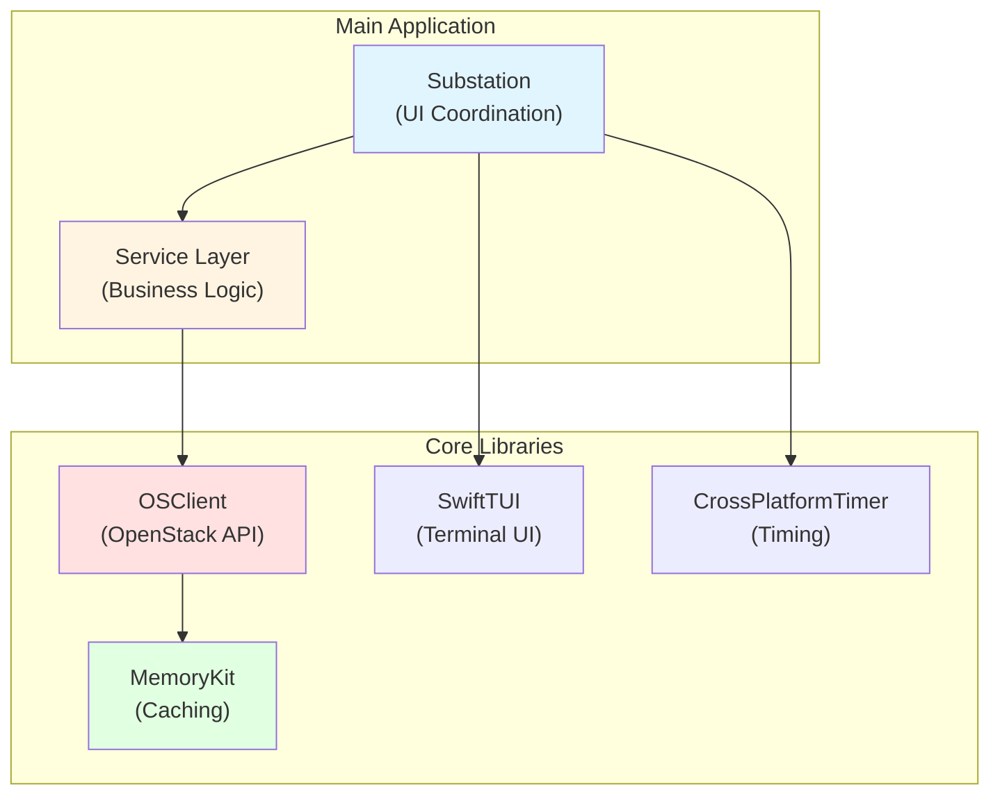
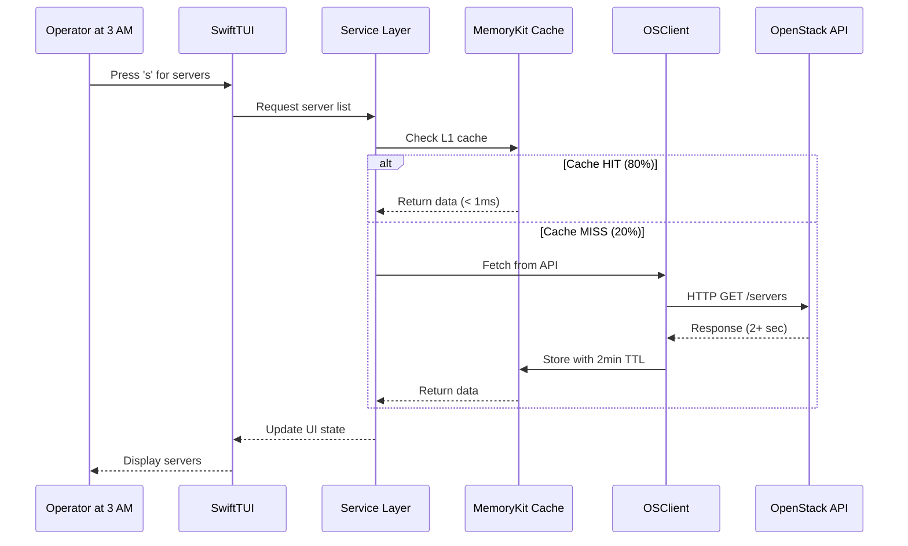
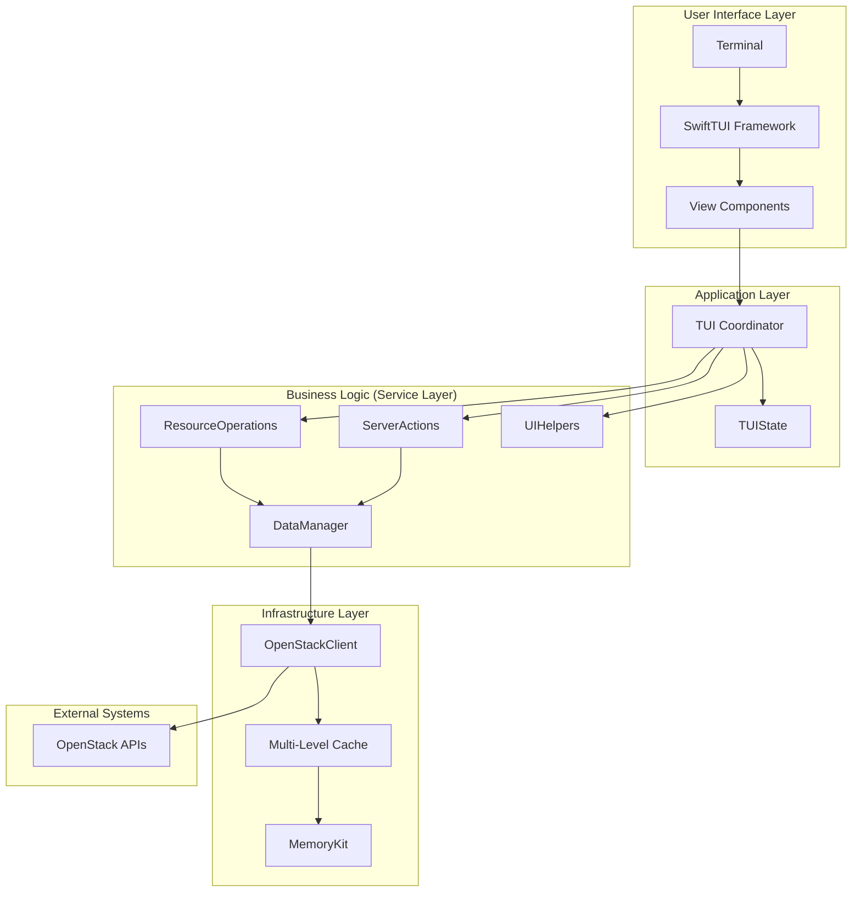
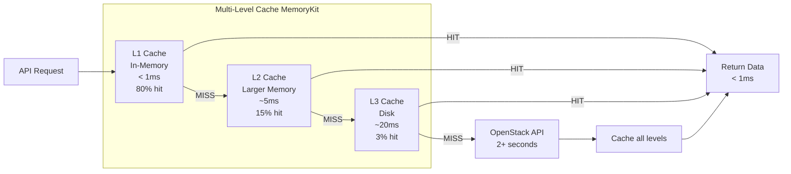

# Substation - OpenStack Terminal UI


## Terminal Interface for OpenStack Cloud Management

Substation is a comprehensive terminal user interface for OpenStack that provides operators with powerful, efficient, and intuitive cloud infrastructure management capabilities. Built with Swift 6.1, it combines high-performance architecture with features to deliver a superior operational experience.

**Translation**: It's a terminal app for managing OpenStack that doesn't make you want to rage-quit at 3 AM.

## Why Substation?


### The Real Talk

You've been there. 3:47 AM. PagerDuty going off. Your OpenStack CLI takes 45 seconds to list servers. The web UI times out. Again. Your coffee is cold. Your patience is gone. Your boss will ask questions in the morning.

**This is why Substation exists.**

### Performance First (Because Slow Tools Cost Sleep)

- **60-80% API call reduction** - Multi-level caching (L1/L2/L3) because your OpenStack API is slower than you think
  - L1 Cache (Memory): Lightning fast, gone when you restart. Like your motivation on Monday mornings.
  - L2 Cache (Larger Memory): Slightly slower, still quick. Your reliable friend.
  - L3 Cache (Disk): Survives restarts. The cockroach of caches.
- **Parallel search engine** - Search across 6 OpenStack services simultaneously (Nova, Neutron, Cinder, Glance, Keystone, Swift)
- **Comprehensive benchmarking** - Real-time performance monitoring with automatic regression detection
- **Actor-based concurrency** - Thread-safe operations because race conditions at 3 AM are career-limiting

**Real Performance Numbers**:

- Cache retrieval: < 1ms (95th percentile)
- Cached API calls: < 100ms average
- Cross-service search: < 500ms average
- Cache hit rate: 80%+ (your API will thank you)

### Operator Focused (Built By Operators Who've Been There)

- **Intuitive TUI** - Keyboard-driven navigation because your mouse is for the weak
- **Context-aware help** - Press `?` when you forget (we've all been there)
- **Multi-region support** - Because your cloud spans continents
- **Comprehensive error recovery** - Exponential backoff retry logic (hammering a dead API never helped anyone)
- **Cache purge button** - Press `c` when your data looks stale (happens more often than you'd like)

!!! warning "Production Horror Story"
    One operator tried to list 50,000 servers without caching in the Python CLI.
    The API timed out after 3 minutes. The monitoring alerted. PagerDuty called.
    The infrastructure team got pulled in. Incident report required.

    Don't be that operator. Use Substation.

## Key Features

### Resource Management

Complete lifecycle management for all the OpenStack services you love to hate:

- **Compute instances (Nova)** - Managing your VMs, flavors, keypairs, and server groups
- **Networks (Neutron)** - Networking chaos (subnets, routers, security groups, floating IPs, ports)
- **Volumes (Cinder)** - Managing where your data lives (hopefully)
- **Images (Glance)** - OS images and snapshots
- **Identity (Keystone)** - Auth tokens and user management
- **Secrets (Barbican)** - Keeping your secrets actually secret
- **Load Balancers (Octavia)** - Distributing traffic and pain
- **Object Storage (Swift)** - Blob storage (containers and objects galore)

### Advanced Capabilities (The Secret Sauce)

#### Performance & Reliability

**Because your 3 AM self deserves better:**

- **Performance Benchmarking** - Automated benchmark system that screams when performance degrades by 10%+
- **Real-time Metrics** - Low-overhead telemetry (6 metric categories: performance, user behavior, resources, OpenStack health, caching, networking)
- **Intelligent Caching** - Multi-level cache architecture with L1/L2/L3 hierarchy
  - Cache hit rate tracking (target: 80%+, reality: usually better)
  - Automatic eviction under memory pressure (before the OOM killer arrives)
  - Resource-specific TTLs (auth: 1hr, networks: 5min, servers: 2min)
- **Actor-Based Concurrency** - Thread-safe operations with strict Swift 6 concurrency (zero warnings or bust)

!!! tip "Operator Pro Tip"
    The benchmark system runs automatically every 5 minutes for cache performance,
    3 minutes for memory checks, and 10 minutes for system integration.
    If performance drops below 80% of targets, you'll know. Your cluster probably won't like it.

#### Search & Discovery (Finding Needles in OpenStack Haystacks)

**Cross-service search in under 500ms (usually):**

- **Parallel Search Engine** - Searches 6 services simultaneously
  - Max concurrent searches: 6 (one per service)
  - Search timeout: 5 seconds (with graceful degradation)
  - Service priority: Nova, Neutron, Cinder, Glance, Keystone, Swift
- **Query Optimization** - Intelligent field selection (name, id, status, and service-specific fields)
- **Result Aggregation** - Unified result merging with relevance scoring
- **Cross-service Discovery** - Smart resource relationship mapping (which server is on which network?)

!!! warning "Reality Check"
    If your search takes longer than 5 seconds, it's not us - your OpenStack API
    is having an existential crisis. Check your service endpoints. Check your network.
    Maybe restart things. You know the drill.

#### MemoryKit Architecture (The Caching Beast)

**Current Status**: 3,126 lines across 8 components (down from 5,616 - we deleted the cruft)

**Core Components** (`/Sources/MemoryKit/`):

- `MultiLevelCacheManager.swift` - L1/L2/L3 cache hierarchy, the main event
- `CacheManager.swift` - Primary cache engine with TTL management
- `MemoryManager.swift` - Memory pressure detection and cleanup
- `TypedCacheManager.swift` - Type-safe caching because we're not savages
- `PerformanceMonitor.swift` - Real-time metrics and alerts
- `MemoryKit.swift` - Public API surface
- `MemoryKitLogger.swift` - Structured logging
- `ComprehensiveMetrics.swift` - Metrics aggregation

**Cache Strategy**:

- L1 (Memory): Fast, ephemeral, your first stop
- L2 (Larger Memory): Slower but still quick, fallback option
- L3 (Disk): Survives restarts, last resort before hitting the API

**TTL Tuning** (from `CacheManager.swift:100`):

```swift
case .authentication: 3600.0              // 1 hour - security vs performance
case .network, .subnet, .router: 300.0    // 5 minutes - semi-stable
case .server, .volume: 120.0              // 2 minutes - highly dynamic
case .flavor, .image: 900.0               // 15 minutes - basically static
```

## Quick Start

### Basic Configuration

Create a `~/.config/openstack/clouds.yaml` file (the same one you've been using for years):

```yaml
clouds:
  production:
    auth:
      auth_url: https://openstack.example.com:5000/v3
      username: operator
      password: secret                    # Yes, plaintext. Welcome to OpenStack.
      project_name: operations
      project_domain_name: default        # Because one domain isn't enough
      user_domain_name: default           # Twice the domains, twice the fun
    region_name: RegionOne                # Or RegionTwo, RegionThree, etc.
```

!!! tip "Configuration Pro Tip"
    See [OpenStack Clouds Configuration Documentation](https://docs.openstack.org/python-openstackclient/latest/configuration/index.html#clouds-yaml) for additional details.

    Substation respects the same format as the Python OpenStack CLI. If it works there, it works here.
    Same file. Same structure. Same quirks.

!!! danger "Security Warning"
    Yes, your password is in plaintext. We know. You know. Everyone knows.
    This is the OpenStack way. Consider using application credentials instead
    (they're tokens, not passwords, which is... slightly better?).

    Or just make sure that `clouds.yaml` is chmod 600. You did do that, right?

### Running with Docker

This example command requires your OpenStack credentials to be stored in `~/.config/openstack`.

```bash
docker run --volume ~/.config/openstack:/root/.config/openstack \
           --interactive \
           --tty \
           --env TERM \
           --rm \
           ghcr.io/cloudnull/substation/substation:latest
```

### Building and running Substation

```bash
# Clone the repository
git clone https://github.com/cloudnull/substation.git
cd substation

# Build with Swift 6.1
~/.swiftly/bin/swift build -c release

# Run the application
.build/release/substation
```

### First Connection

```bash
# Connect to your cloud
substation --cloud production
```

## Navigation

**All keyboard-driven, because your mouse is for the weak.**

### Main Navigation (The Keys You'll Memorize at 3 AM)

| Key | View | When You'll Need It |
|-----|------|---------------------|
| `d` | Dashboard | First thing, every time. Start here. |
| `s` | Servers | "Why is prod down?" (37K lines of Nova) |
| `g` | Server Groups | Advanced anti-affinity wizardry |
| `n` | Networks | "Can you see me now?" (34K lines of Neutron) |
| `e` | Security Groups | Firewall archaeology and port spelunking |
| `v` | Volumes | "Where did my data go?" (Cinder storage) |
| `i` | Images | Finding that one CentOS 7 image from 2019 |
| `f` | Flavors | Size matters. Choose wisely. |
| `t` | Topology | Pretty network diagrams for presentations |
| `h` | Health Dashboard | "Is it us or them?" (usually them) |
| `u` | Subnets | CIDR math at 3 AM. Fun times. |
| `p` | Ports | MAC address detective work |
| `r` | Routers | Routing table archaeology |
| `l` | Floating IPs | The IPs that mysteriously float away |
| `b` | Barbican (Secrets) | Where secrets hide (17K lines) |
| `o` | Octavia (Load Balancers) | Distributing the pain (22K lines) |
| `j` | Swift (Object Storage) | Blob storage chaos (23K lines) |
| `z` | Advanced Search | Cross-service grep for your cloud |
| `c` | (Hidden) Cache Purge | The panic button. Clears ALL caches. |

### List Navigation (The Basics)

| Key | Action | Vim Users Note |
|-----|--------|----------------|
| `↑/↓` | Navigate lists | Or j/k because vim muscle memory |
| `Enter` | View details | Deep dive into a resource |
| `Space` | View details | Same as Enter, because options |
| `/` | Search/filter | Instant local filtering |
| `?` | Show help | When you forget (we've all been there) |
| `q` | Quit | Until the pager calls you back |

!!! tip "Hidden Gems"
    - Press `c` anywhere to purge ALL caches. Use when your OpenStack cluster
      returns stale data (happens more often than you'd like).
    - Press `?` for context-aware help. The help changes based on which view you're in.
    - Use `/` to filter lists instantly. No API calls, pure local filtering.

!!! warning "About That Cache Purge"
    Pressing `c` nukes ALL caches (L1, L2, L3). Everything. Gone.
    The next few operations will be slow while caches rebuild.
    But sometimes you need fresh data more than you need speed.

    Use it when:
    - Your OpenStack cluster just had a bad day (again)
    - Data looks stale and wrong
    - You just launched 50 servers and they're not showing up
    - You're debugging and need truth, not cached lies

## Architecture Overview

### High-Level System Architecture

Substation consists of 5 independent, reusable Swift packages working together:



### Data Flow Architecture

**How the magic happens (with actual timing):**



### Component Architecture



### Cache Hierarchy

**Multi-level caching for 60-80% API call reduction:**



**The Flow** (What Actually Happens):

1. You press `s` to view servers at 3:47 AM
2. SwiftTUI captures the keypress (< 1ms)
3. View Model requests server data from Manager
4. Manager checks MemoryKit cache (L1 -> L2 -> L3)
5. **80% of the time**: Cache HIT, data returned in < 1ms. You're happy.
6. **20% of the time**: Cache MISS, OSClient hits the OpenStack API
7. OSClient handles auth, retries, exponential backoff, all the fun stuff
8. API eventually responds (2 seconds if you're lucky, timeout if you're not)
9. Data gets cached with a 2-minute TTL (servers are dynamic)
10. UI updates, you see your servers, crisis averted

**Until the pager goes off again in 15 minutes.**

## System Requirements

**What you'll need:**

- **OS**: macOS 13+ or Linux (Windows users: we see you, we feel your pain, but... no)
- **Swift**: 6.1 or later (strict concurrency is non-negotiable)
- **Terminal**: Any terminal with ncurses support (basically any terminal made after 1990)
- **OpenStack**: Queens or later (if you're still on Mitaka... we're sorry)
- **Memory**: 200MB+ for the app (with 100MB cache for 10K resources)
- **CPU**: Anything made in the last decade (Swift is compiled, it's fast)
- **Patience**: Variable (depends on your OpenStack cluster's mood)

## Documentation Structure

**Everything you need to know (and some things you don't):**

- **[Getting Started](getting-started/index.md)** - Installation, configuration, and first steps (start here)
- **[Architecture](architecture/index.md)** - System design, component overview, and all the diagrams (for the nerds)
- **[User Guide](user-guide/index.md)** - Detailed usage instructions and keyboard shortcuts (for everyone)
- **[OpenStack Integration](openstack/index.md)** - API patterns, service details, and integration pain points
- **[API Reference](api/index.md)** - Developer documentation (use our libraries in your projects)
- **[Performance](performance/index.md)** - Optimization, benchmarks, and cache tuning (make it faster)
- **[Troubleshooting](troubleshooting/index.md)** - Common issues and solutions (when things go wrong)

## Support

**When you need help:**

- **GitHub Issues**: Report bugs and request features (we actually read them)
- **Documentation**: Comprehensive guides and references (you're reading them now)
- **Community**: Join discussions and share war stories (misery loves company)

## License

Substation is open-source software licensed under the MIT License.

**Translation**: Free as in beer and speech. Use it. Fork it. Break it. Fix it. Share it.

---

**Remember**: You're not alone. Every OpenStack operator has been woken up at 3 AM.
At least now you have a tool that doesn't make it worse.

*Built by operators who've been there. For operators who are there now.*
