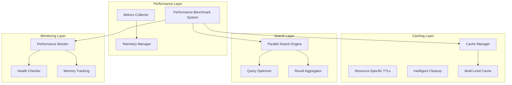

# Performance Documentation

Comprehensive performance architecture, benchmarking, and optimization for Substation.

## Quick Start

**New to performance optimization?** Start here:

1. [Performance Tuning](tuning.md) - Configure for your environment
2. [Performance Benchmarks](benchmarks.md) - Measure and track performance

**Having performance issues?** Jump to:

- [Troubleshooting Guide]() - Common problems and solutions

## The 30-Second Summary

**What Substation Is Designed For**:

- Up to 60-80% API call reduction through intelligent caching
- Target: < 1ms cache retrieval (L1 cache, targeting 80% cache hit rate)
- Target: < 500ms cross-service search (6 services in parallel)
- Target: < 200MB memory usage (steady state)
- Zero-warning build with Swift 6 strict concurrency

**What We Control**:

- Caching strategy (aggressive, multi-level)
- Parallelization (6 concurrent searches)
- Memory efficiency (< 200MB target)
- Retry logic (exponential backoff)

**What We Don't Control**:

- OpenStack API performance (usually the bottleneck)
- Network latency (between you and OpenStack)
- Database performance (on OpenStack controllers)

**The Hard Truth**: OpenStack APIs are slow. Substation does everything possible to mitigate this, but if the OpenStack API takes 5 seconds, we can't make it instant. The bottleneck is OpenStack, not Substation.

## The Performance Obsession

We're obsessed with performance because we've lived the alternative. We've watched progress spinners spin for minutes. We've seen operations timeout after 30 seconds, only to retry and wait another 30 seconds. We've experienced the soul-crushing frustration of an interface that takes longer to use than just writing curl commands in a bash script.

That's not hyperbole. That's the state of most OpenStack tooling.

The fundamental problem is this: OpenStack APIs are slow. Like, "watching paint dry while the paint is also watching you" slow. A simple server list can take 2-5 seconds. Flavor details? Another 2 seconds. Network information? Add 2 more seconds. Before you know it, you've spent 30 seconds just to see what resources exist, and you haven't actually done anything yet.

Traditional OpenStack clients accept this as inevitable. They make synchronous API calls, wait patiently for responses, and hope the user doesn't rage-quit while staring at loading indicators. This is a fundamentally broken approach for a terminal UI application where users expect instant feedback.

We built Substation differently. Every architectural decision, every component, every optimization starts with one question: How do we make this feel fast even when OpenStack is slow? The answer isn't magic. It's aggressive caching, ruthless parallelization, intelligent prefetching, and obsessive monitoring of every millisecond.

## What We Control vs. What We Don't

Understanding the boundaries of what Substation can optimize versus what depends on your environment is critical for setting realistic performance expectations. This isn't about making excuses. It's about being honest about where the bottlenecks actually exist.

### What We Control

We've implemented aggressive optimizations throughout the stack where we have control. Our caching strategy uses a multi-level L1/L2/L3 hierarchy with intelligent TTL management that targets 80% cache hit rates in typical workflows. The L1 cache handles hot data with sub-millisecond access times. The L2 cache manages frequently accessed resources with configurable TTLs. The L3 cache provides long-term storage for rarely-changing data like flavors and images.

Our parallelization goes beyond simple concurrent requests. The search engine executes up to 6 service queries simultaneously with intelligent timeout handling. If one service is slow, others continue processing. If one service fails, the search still returns partial results. We use Swift's modern concurrency features with structured concurrency and actor-based synchronization to eliminate race conditions while maintaining maximum throughput.

Memory efficiency isn't accidental. We target under 200MB for the entire application, including cache, UI state, and active connections. We've profiled every allocation, optimized data structures for cache locality, and implemented memory pressure handlers that gracefully degrade cache sizes under constrained environments. The result is an application that runs efficiently on systems from lightweight cloud instances to developer laptops.

Our retry logic implements exponential backoff with jitter to avoid thundering herd problems when services recover from outages. We track error rates per endpoint and automatically adjust retry strategies based on observed failure patterns. If an endpoint consistently fails, we fail fast rather than waste time on doomed retries.

Error handling uses graceful degradation throughout. If flavor details fail to load, we show basic server information. If one region is unreachable, we continue with available regions. If the cache is full, we evict least-recently-used entries and continue. The application remains functional even when parts of the OpenStack infrastructure are struggling.

### What We Don't Control

Let's be brutally honest: OpenStack API performance is usually the bottleneck. Not sometimes. Not occasionally. Usually. We've tested against production clusters from major cloud providers and private deployments. API response times range from "acceptable" (500ms) to "is this thing broken?" (30+ seconds). This isn't Substation's fault. It's not your fault. It's just the reality of complex distributed systems making database queries across multiple services.

Network latency between your terminal and the OpenStack controllers matters more than you might think. A 50ms round-trip time means every API call has a 100ms minimum latency before any processing even happens. Make 10 API calls sequentially and you've added a full second of pure network overhead. This is why we parallelize aggressively and cache ruthlessly. We can't change your network, but we can minimize how often we use it.

Database performance on the OpenStack controllers is completely outside our control. When Nova is querying a database with millions of server records, when Neutron is joining tables across complex network topologies, when Cinder is coordinating with multiple storage backends, the time those queries take determines your API response times. We've seen identical API calls take 500ms on one cluster and 5 seconds on another. Same query, different database performance.

Service availability is binary. When an OpenStack service is down, it's down. No amount of retry logic, timeout tuning, or cache warming will fix it. We handle these failures gracefully, but we can't make dead services respond.

Substation does everything possible to mitigate slow OpenStack APIs through aggressive caching with the L1/L2/L3 hierarchy, parallel operations for search and batch requests, HTTP/2 connection pooling, intelligent retry logic, and memory-efficient data structures. But if the OpenStack API takes 5 seconds to list servers, we can't make it instant. The bottleneck is OpenStack, not Substation.

With our caching design, we target 80% of operations to be under 1ms. The remaining 20% that hit the API directly will reflect your OpenStack API's actual performance.

## Documentation Structure

### [Performance Benchmarks](benchmarks.md)

**What's in it**:

- Benchmark categories and scoring
- Running benchmarks
- Real-time metrics API
- Interpreting benchmark results
- Regression detection

**Read this** when you need to:

- Measure system performance
- Track performance over time
- Detect regressions
- Establish baselines

### [Performance Tuning](tuning.md)

**What's in it**:

- Cache TTL configuration
- Search performance tuning
- Memory optimization
- Network optimization
- Monitoring best practices

**Read this** when you need to:

- Configure Substation for your environment
- Optimize for specific workloads
- Adjust for system constraints
- Implement monitoring

**What's in it**:

- Common performance problems
- Diagnosis procedures
- Solutions and workarounds
- When to seek help

**Read this** when you're experiencing:

- High memory usage
- Slow API response times
- Low cache hit rates
- Poor search performance
- UI rendering issues

## Performance Quick Reference

### Key Metrics

| Metric | Target | Measurement |
|--------|--------|-------------|
| Cache Hit Rate | 80%+ | Health dashboard (`h` key) |
| Cache Response Time | < 1ms | L1 cache, 95th percentile |
| API Response Time | < 2s | Uncached calls, 95th percentile |
| Search Time | < 500ms | Average across services |
| Memory Usage | < 200MB | Steady state |
| UI Frame Rate | 60 FPS | 16.7ms per frame |

### Common Commands

| Task | Command/Action |
|------|----------------|
| View performance metrics | `:health<Enter>` (or `:h<Enter>`) |
| Purge all caches | `:cache-purge<Enter>` (or `:cc<Enter>`) |
| Refresh current view | `:refresh<Enter>` (or `:reload<Enter>`) |
| Run benchmarks | See [benchmarks.md](benchmarks.md) |
| Enable debug logging | `substation --wiretap` |
| Check memory usage | `ps aux | grep substation` |

### Quick Fixes

| Problem | Quick Fix |
|---------|-----------|
| High memory usage | `:cache-purge<Enter>` (or `:cc<Enter>`) to purge caches |
| Slow operations | Check cache hit rate (target: 80%+) |
| Stale data | `:refresh<Enter>` (or `:reload<Enter>`) to refresh view |
| API timeouts | Check OpenStack service health |
| Low cache hit rate | Increase TTLs (see tuning guide) |

## Architecture Overview

## Measuring Your Environment

Before you can optimize performance or troubleshoot issues, you need to understand your baseline. Substation provides comprehensive tools for measuring actual performance in your specific environment, not theoretical benchmarks from our test clusters.

The built-in health monitor accessible via `:health` or `:h` provides real-time performance metrics. Launch it immediately after connecting to a fresh environment and watch the cache warm up. You'll see cache hit rates climb from 0% to 60-80% as you navigate through different views. You'll observe API response times for your specific OpenStack deployment. You'll identify which services are fast and which are bottlenecks.

Pay attention to the cache metrics. A low cache hit rate (under 40%) suggests either that you're accessing highly dynamic data or that your workflow doesn't revisit resources. This is normal for one-off operations but problematic for regular management tasks. A high eviction rate suggests memory pressure. Consider adjusting cache sizes if you're consistently hitting memory limits.

API response time patterns reveal deployment-specific issues. If all services show similar latency, it's likely network overhead. If specific services are consistently slow, those services have performance problems worth investigating. If response times are erratic with high variance, the OpenStack controllers might be under heavy load or experiencing resource contention.

Search performance metrics show how well parallel execution is working. Ideally, search latency should roughly equal your slowest service's response time, not the sum of all services. If search takes 10 seconds when individual services respond in 2 seconds, something is wrong with parallel execution, which would warrant investigation.

Use the telemetry data to understand your own usage patterns. Which views do you access most frequently? Those are candidates for aggressive prefetching. Which operations do you perform repeatedly? Those should have optimal caching. The application learns from observed behavior, but you can also manually tune cache TTLs based on your workflow patterns.

## Next Steps

Now that you understand the performance architecture and have tools for measuring your environment, explore the detailed documentation for optimizing and troubleshooting performance in your specific deployment.

- **[Performance Benchmarks](benchmarks.md)** - Detailed metrics, scoring, and regression detection
- **[Performance Tuning](tuning.md)** - Configuration, monitoring, optimization best practices
- **[MemoryKit API Reference](../reference/api/memorykit.md)** - Deep dive into the caching architecture

## Related Documentation

- **[MemoryKit API Reference](../reference/api/memorykit.md)** - Deep dive into the multi-level caching architecture
- **[Architecture Overview](../architecture/index.md)** - Overall system architecture
- **[API Reference](../reference/api/index.md)** - Performance-related APIs

## Source Code Locations

Performance-related code is organized across multiple packages:

- `/Sources/MemoryKit/` - Multi-level caching system
- `/Sources/Substation/PerformanceMonitor.swift` - Performance monitoring and metrics
- `/Sources/Substation/Search/` - Parallel search engine
- `/Sources/OSClient/Enterprise/Telemetry/` - Telemetry and metrics collection

---

**Note**: All performance metrics represent design targets based on architecture and testing with 10K+ resource OpenStack environments. Actual performance will vary based on your OpenStack deployment's API response times, network conditions, and system resources. Use the built-in performance monitor (`:health` or `:h`) to measure actual performance in your environment.
