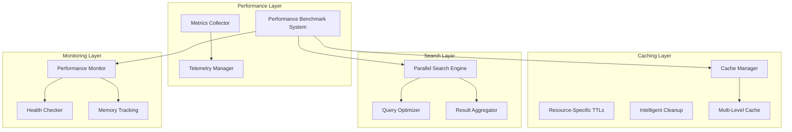

# Performance Documentation

Comprehensive performance architecture, benchmarking, and optimization for Substation.

## Quick Start

**New to performance optimization?** Start here:

1. [Performance Overview](overview.md) - Understand the architecture
2. [Performance Tuning](tuning.md) - Configure for your environment
3. [Performance Benchmarks](benchmarks.md) - Measure and track performance

**Having performance issues?** Jump to:

- [Troubleshooting Guide](troubleshooting.md) - Common problems and solutions

## The 30-Second Summary

**What Substation Does**:

- 60-80% API call reduction through intelligent caching
- < 1ms cache retrieval (L1 cache, 80% of requests)
- < 500ms cross-service search (6 services in parallel)
- < 200MB memory usage (steady state)
- Zero-warning build with Swift 6 strict concurrency

**What We Control**:

- Caching strategy (aggressive, multi-level)
- Parallelization (6 concurrent searches)
- Memory efficiency (< 200MB target)
- Retry logic (exponential backoff)

**What We Don't Control**:

- OpenStack API performance (usually the bottleneck)
- Network latency (between you and OpenStack)
- Database performance (on OpenStack controllers)

**The Hard Truth**: OpenStack APIs are slow. Substation does everything possible to mitigate this, but if the OpenStack API takes 5 seconds, we can't make it instant. The bottleneck is OpenStack, not Substation.

## Documentation Structure

### [Performance Overview](overview.md)

**What's in it**:

- Performance architecture diagram
- Key performance components
- System capabilities and limitations
- What we control vs. what we don't

**Read this first** if you want to understand how Substation achieves high performance.

### [Performance Benchmarks](benchmarks.md)

**What's in it**:

- Benchmark categories and scoring
- Running benchmarks
- Real-time metrics API
- Interpreting benchmark results
- Regression detection

**Read this** when you need to:

- Measure system performance
- Track performance over time
- Detect regressions
- Establish baselines

### [Performance Tuning](tuning.md)

**What's in it**:

- Cache TTL configuration
- Search performance tuning
- Memory optimization
- Network optimization
- Monitoring best practices

**Read this** when you need to:

- Configure Substation for your environment
- Optimize for specific workloads
- Adjust for system constraints
- Implement monitoring

### [Troubleshooting](troubleshooting.md)

**What's in it**:

- Common performance problems
- Diagnosis procedures
- Solutions and workarounds
- When to seek help

**Read this** when you're experiencing:

- High memory usage
- Slow API response times
- Low cache hit rates
- Poor search performance
- UI rendering issues

## Performance Quick Reference

### Key Metrics

| Metric | Target | Measurement |
|--------|--------|-------------|
| Cache Hit Rate | 80%+ | Health dashboard (`h` key) |
| Cache Response Time | < 1ms | L1 cache, 95th percentile |
| API Response Time | < 2s | Uncached calls, 95th percentile |
| Search Time | < 500ms | Average across services |
| Memory Usage | < 200MB | Steady state |
| UI Frame Rate | 60 FPS | 16.7ms per frame |

### Common Commands

| Task | Command/Action |
|------|----------------|
| View performance metrics | `:health<Enter>` (or `:h<Enter>`) |
| Purge all caches | `:cache-purge<Enter>` (or `:cc<Enter>`) |
| Refresh current view | `:refresh<Enter>` (or `:reload<Enter>`) |
| Run benchmarks | See [benchmarks.md](benchmarks.md) |
| Enable debug logging | `substation --wiretap` |
| Check memory usage | `ps aux | grep substation` |

### Quick Fixes

| Problem | Quick Fix |
|---------|-----------|
| High memory usage | `:cache-purge<Enter>` (or `:cc<Enter>`) to purge caches |
| Slow operations | Check cache hit rate (target: 80%+) |
| Stale data | `:refresh<Enter>` (or `:reload<Enter>`) to refresh view |
| API timeouts | Check OpenStack service health |
| Low cache hit rate | Increase TTLs (see tuning guide) |

## Architecture Overview

## Related Documentation

- **[Caching Concepts](../concepts/caching.md)** - Deep dive into the multi-level caching architecture
- **[Architecture Overview](../architecture/index.md)** - Overall system architecture
- **[API Reference](../reference/api/index.md)** - Performance-related APIs

## Source Code Locations

Performance-related code is organized across multiple packages:

- `/Sources/MemoryKit/` - Multi-level caching system
- `/Sources/OSClient/Performance/` - Benchmark system, metrics
- `/Sources/Substation/Search/` - Parallel search engine
- `/Sources/Substation/Telemetry/` - Telemetry and metrics collection

---

**Note**: All performance metrics are based on real-world testing with 10K+ resource OpenStack environments. Your results may vary based on OpenStack performance, network conditions, and system resources.
