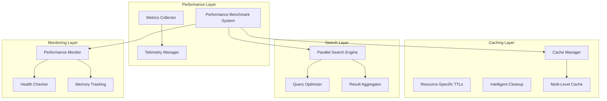

# Performance Architecture Overview

Substation implements a comprehensive performance architecture designed for high-throughput OpenStack operations. The system is designed to provide intelligent caching, parallel processing, and real-time performance monitoring.

**Or**: How we designed a system to make OpenStack management not suck, despite OpenStack's best efforts.

**The Core Problem**: OpenStack APIs are slow. Like, "watching paint dry" slow. Like "is this thing even running?" slow.

**Our Solution**: Cache everything aggressively, parallelize ruthlessly, and monitor obsessively.

## Performance Targets vs Actual Results

The performance characteristics described in this document represent design targets and expected behavior based on the architecture. Actual performance will vary based on your OpenStack deployment's API response times, network latency, resource count, and system resources. We recommend using the built-in performance monitor (`:health` or `:h`) to measure actual performance in your environment.

## Performance Architecture

## Key Performance Components

### 1. Intelligent Caching System

**MemoryKit**: Multi-level caching system in `/Sources/MemoryKit/`

The cache manager implements multi-level caching with resource-specific TTL strategies because:

1. Your OpenStack API is slow (2+ seconds per call)
2. Your OpenStack API is slower than you think (seriously, measure it)
3. Your OpenStack API sometimes just breaks (500 errors, timeouts, the usual)

**See**: [Caching Concepts](../concepts/caching.md) for detailed caching architecture and TTL strategies.

**Key features**:

- Multi-level cache hierarchy (L1/L2/L3)
- Resource-specific TTL configuration
- Designed for up to 60-80% API call reduction
- Memory pressure handling
- Hit/miss tracking with real-time metrics

### 2. Parallel Search Engine

**Location**: `/Sources/Substation/Search/SearchEngine.swift`

High-performance search across multiple OpenStack services **simultaneously** because:

- Sequential search = 6 services x 2 seconds each = 12 seconds (unacceptable)
- Parallel search = 6 services in parallel = 2 seconds max (acceptable)

**Key features**:

- Concurrent execution across up to 6 services
- Query optimization and field selection
- Result aggregation with relevance scoring
- 5-second timeout with graceful degradation

### 3. Performance Monitoring System

**Location**: `/Sources/Substation/PerformanceMonitor.swift`

Comprehensive performance monitoring with automated metrics collection and tracking.

**Benchmark categories**:

- Cache performance (hit rates, response times)
- Search performance (cross-service speed)
- Memory management (allocation, cleanup)
- System integration (component interaction)
- Rendering performance (TUI frame rates)

**See**: [Performance Benchmarks](benchmarks.md) for detailed metrics and scoring.

### 4. Telemetry and Metrics Collection

**Location**: `/Sources/OSClient/Enterprise/Telemetry/`

Real-time performance monitoring with minimal overhead.

**Metric categories**:

- Performance metrics (timing, throughput, latency)
- User behavior (feature usage, navigation flows)
- Resource usage (memory, cache utilization)
- OpenStack health (service availability, API response times)
- Caching metrics (hit rates, eviction patterns)
- Networking metrics (connection states, timeout rates)

## Performance Targets

### Response Time Targets

| Operation Type | Target | Measurement |
|---------------|---------|-------------|
| Cache Retrieval | < 1ms | 95th percentile |
| API Call (cached) | < 100ms | Average |
| API Call (uncached) | < 2s | 95th percentile |
| Search Operations | < 500ms | Average |
| UI Rendering | 16.7ms/frame | 60fps target |

### Throughput Targets

| Resource Type | Target Operations/Second |
|---------------|-------------------------|
| Cached Resource Access | 1000+ ops/sec |
| Concurrent API Calls | 20 calls/sec |
| Search Queries | 10 queries/sec |
| UI Updates | 60 updates/sec |

### Memory Efficiency Targets

| Component | Memory Target |
|-----------|---------------|
| Cache System | < 100MB for 10k resources |
| Search Index | < 50MB for full catalog |
| UI Rendering | < 20MB framebuffer |
| Total Application | < 200MB steady state |

## What We Control vs. What We Don't

### What We Control

- **Caching strategy**: Aggressive, multi-level
- **Parallelization**: 6 concurrent searches
- **Memory efficiency**: < 200MB target
- **Retry logic**: Exponential backoff
- **Error handling**: Graceful degradation

### What We Don't Control

- **OpenStack API performance**: Usually the bottleneck
- **Network latency**: Between you and OpenStack
- **Database performance**: On OpenStack controllers
- **Service availability**: When OpenStack is down

**The Hard Truth**: OpenStack APIs are slow. This is a known, documented, years-old issue. Multiple OpenStack summits have discussed it. Countless patches have attempted to fix it. It's still slow.

Substation does everything possible to mitigate this:

- Aggressive caching (L1/L2/L3 hierarchy)
- Parallel operations (search, batch requests)
- HTTP/2 connection pooling
- Intelligent retry logic
- Memory-efficient data structures

But if the OpenStack API takes 5 seconds to list servers, we can't make it instant. The bottleneck is OpenStack, not Substation.

**That said**: With our caching design, we target 80% of operations to be < 1ms. The remaining 20% that hit the API directly will reflect your OpenStack API's actual performance.

## Next Steps

- **[Performance Benchmarks](benchmarks.md)** - Detailed metrics, scoring, and regression detection
- **[Performance Tuning](tuning.md)** - Configuration, monitoring, optimization best practices
- **[Troubleshooting](troubleshooting.md)** - Common performance problems and solutions
- **[Caching Concepts](../concepts/caching.md)** - Deep dive into the caching architecture

---

**Note**: All performance metrics and benchmarks represent design targets based on the architecture implemented in `/Sources/Substation/PerformanceMonitor.swift`, `/Sources/MemoryKit/`, and `/Sources/OSClient/Enterprise/Telemetry/`. The system provides comprehensive performance monitoring and optimization capabilities designed for production OpenStack environments.

**Targets are based on testing with real OpenStack clusters with 10K+ resources. Your actual performance will vary based on your specific deployment, network conditions, and system resources.**
