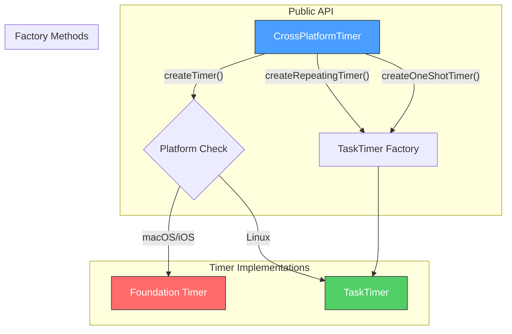
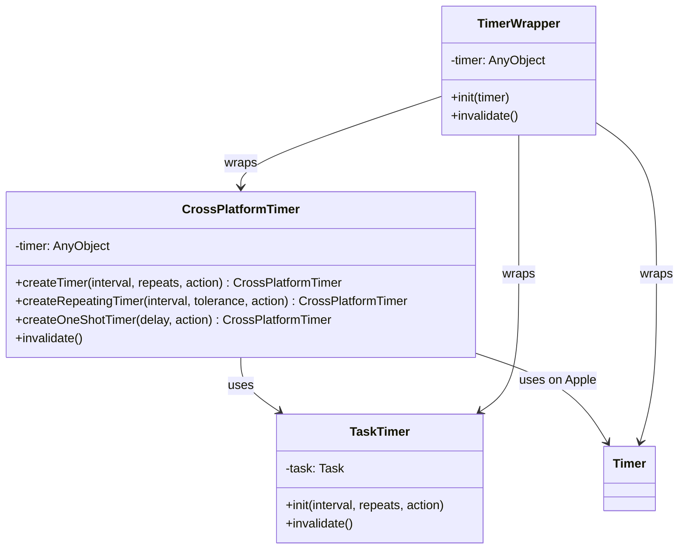
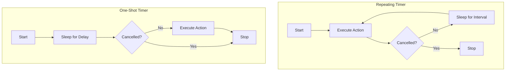
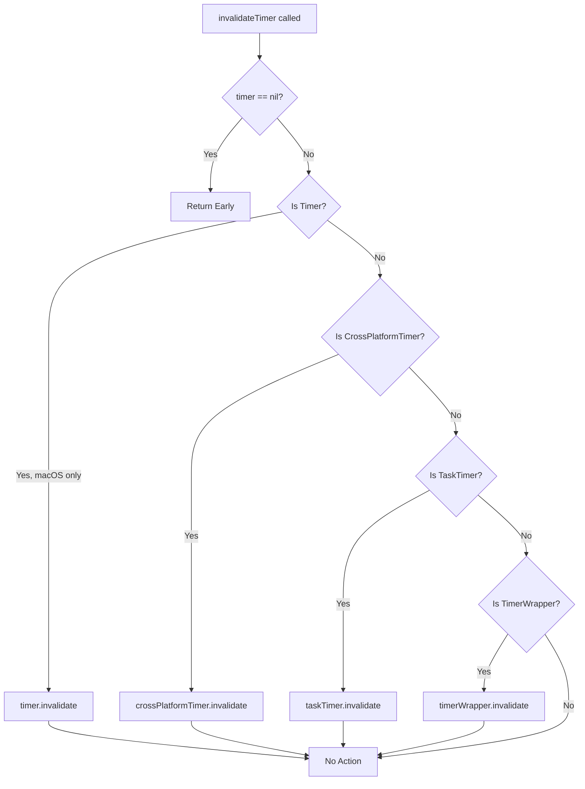
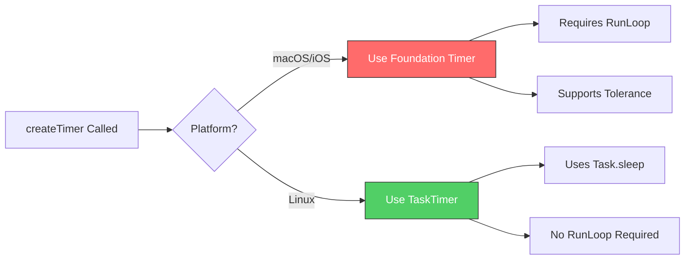
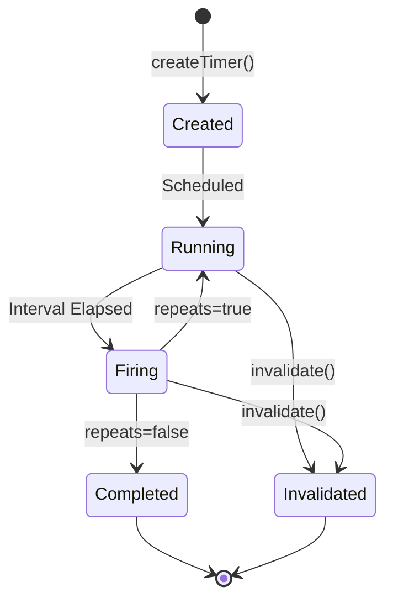

# CrossPlatformTimer API Reference

## Overview

CrossPlatformTimer is a lightweight timer abstraction library that provides consistent timer functionality across macOS, iOS, and Linux platforms. It automatically selects the appropriate timer implementation based on the platform: Foundation `Timer` on Apple platforms and Swift Concurrency `Task`-based timers on Linux.

### Key Features

- **Cross-Platform Compatibility**: Works seamlessly on macOS, iOS, and Linux
- **Thread-Safe**: All timer classes are `Sendable` for safe use with Swift Concurrency
- **Multiple Timer Types**: Support for repeating timers, one-shot timers, and custom intervals
- **Automatic Platform Detection**: Uses the optimal timer implementation for each platform
- **Legacy Support**: Wrapper classes for integrating with existing codebases
- **Easy Cancellation**: Simple invalidation API for all timer types

## Installation and Integration

### Swift Package Manager

Add CrossPlatformTimer as a dependency in your `Package.swift`:

```swift
dependencies: [
    .package(path: "path/to/substation")
],
targets: [
    .target(
        name: "YourTarget",
        dependencies: [
            .product(name: "CrossPlatformTimer", package: "substation")
        ]
    )
]
```

### Basic Import

```swift
import CrossPlatformTimer
```

## Architecture

CrossPlatformTimer provides a unified API that abstracts platform-specific timer implementations:



### Class Hierarchy



### Platform Selection

| Platform | Timer Implementation |
|----------|---------------------|
| macOS | Foundation `Timer.scheduledTimer` |
| iOS | Foundation `Timer.scheduledTimer` |
| Linux | `TaskTimer` (Swift Concurrency) |

## API Reference

### CrossPlatformTimer

The primary class for creating cross-platform timers.

#### Class Definition

```swift
public final class CrossPlatformTimer: @unchecked Sendable
```

#### Factory Methods

##### createTimer

Creates a cross-platform timer with the specified interval and repeat behavior.

```swift
public static func createTimer(
    interval: TimeInterval,
    repeats: Bool,
    action: @escaping @Sendable () -> Void
) -> CrossPlatformTimer
```

**Parameters:**

| Parameter | Type | Description |
|-----------|------|-------------|
| `interval` | `TimeInterval` | The time interval between timer firings (in seconds) |
| `repeats` | `Bool` | Whether the timer should repeat after firing |
| `action` | `@escaping @Sendable () -> Void` | The closure to execute when the timer fires |

**Returns:** A `CrossPlatformTimer` instance

**Example:**

```swift
// Create a repeating timer that fires every 5 seconds
let timer = CrossPlatformTimer.createTimer(
    interval: 5.0,
    repeats: true
) {
    print("Timer fired!")
}

// Later, invalidate the timer
timer.invalidate()
```

##### createRepeatingTimer

Creates a repeating timer using Swift Concurrency (TaskTimer) on all platforms.

```swift
public static func createRepeatingTimer(
    interval: TimeInterval,
    tolerance: TimeInterval = 0.1,
    action: @escaping @Sendable () -> Void
) -> CrossPlatformTimer
```

**Parameters:**

| Parameter | Type | Default | Description |
|-----------|------|---------|-------------|
| `interval` | `TimeInterval` | - | The time interval between timer firings |
| `tolerance` | `TimeInterval` | `0.1` | Timing tolerance (currently ignored on Linux) |
| `action` | `@escaping @Sendable () -> Void` | - | The closure to execute when the timer fires |

**Returns:** A `CrossPlatformTimer` instance

**Example:**

```swift
// Create a repeating timer with tolerance
let refreshTimer = CrossPlatformTimer.createRepeatingTimer(
    interval: 60.0,
    tolerance: 1.0
) {
    await refreshData()
}
```

##### createOneShotTimer

Creates a one-shot timer that fires once after the specified delay.

```swift
public static func createOneShotTimer(
    delay: TimeInterval,
    action: @escaping @Sendable () -> Void
) -> CrossPlatformTimer
```

**Parameters:**

| Parameter | Type | Description |
|-----------|------|-------------|
| `delay` | `TimeInterval` | The delay before the timer fires |
| `action` | `@escaping @Sendable () -> Void` | The closure to execute when the timer fires |

**Returns:** A `CrossPlatformTimer` instance

**Example:**

```swift
// Create a one-shot timer that fires after 10 seconds
let delayedAction = CrossPlatformTimer.createOneShotTimer(delay: 10.0) {
    print("Delayed action executed!")
}

// Can be cancelled before it fires
delayedAction.invalidate()
```

#### Instance Methods

##### invalidate

Cancels the timer and prevents any future firings.

```swift
public func invalidate()
```

**Example:**

```swift
let timer = CrossPlatformTimer.createTimer(interval: 1.0, repeats: true) {
    print("Tick")
}

// Stop the timer
timer.invalidate()
```

### TaskTimer

A Task-based timer implementation for cross-platform compatibility. This class is used internally by `CrossPlatformTimer` on Linux and can be used directly when Task-based timers are preferred.

#### Class Definition

```swift
public final class TaskTimer: @unchecked Sendable
```

#### Initialization

```swift
public init(
    interval: TimeInterval,
    repeats: Bool,
    action: @escaping @Sendable () -> Void
)
```

**Parameters:**

| Parameter | Type | Description |
|-----------|------|-------------|
| `interval` | `TimeInterval` | The time interval between timer firings |
| `repeats` | `Bool` | Whether the timer should repeat after firing |
| `action` | `@escaping @Sendable () -> Void` | The closure to execute when the timer fires |

**Example:**

```swift
// Create a TaskTimer directly
let taskTimer = TaskTimer(interval: 2.0, repeats: true) {
    print("TaskTimer fired!")
}

// Cancel the timer
taskTimer.invalidate()
```

#### Instance Methods

##### invalidate

Cancels the underlying Task, stopping the timer.

```swift
public func invalidate()
```

#### Behavior Notes

- **Repeating Timers**: Execute the action first, then sleep for the interval
- **One-Shot Timers**: Sleep for the interval first, then execute the action
- **Cancellation**: Respects `Task.isCancelled` to stop gracefully
- **Cleanup**: Automatically cancels the task in `deinit`

#### Timer Execution Flow



### TimerWrapper

A wrapper class that provides a unified interface for different timer types. Useful for legacy code integration.

#### Class Definition

```swift
public final class TimerWrapper: @unchecked Sendable
```

#### Initialization

```swift
public init(timer: AnyObject)
```

**Parameters:**

| Parameter | Type | Description |
|-----------|------|-------------|
| `timer` | `AnyObject` | Any timer object (Timer, TaskTimer, or CrossPlatformTimer) |

#### Instance Methods

##### invalidate

Invalidates the wrapped timer regardless of its underlying type.

```swift
public func invalidate()
```

**Supported Timer Types:**

- Foundation `Timer` (macOS/iOS only)
- `TaskTimer`
- `CrossPlatformTimer`

**Example:**

```swift
// Wrap any timer type
let timer = CrossPlatformTimer.createTimer(interval: 1.0, repeats: true) { }
let wrapper = TimerWrapper(timer: timer)

// Later, invalidate through the wrapper
wrapper.invalidate()
```

### Helper Functions

#### createCompatibleTimer

Creates a cross-platform timer and returns it as `AnyObject` for compatibility with legacy APIs.

```swift
public func createCompatibleTimer(
    interval: TimeInterval,
    repeats: Bool,
    action: @escaping @Sendable () -> Void
) -> AnyObject
```

**Parameters:**

| Parameter | Type | Description |
|-----------|------|-------------|
| `interval` | `TimeInterval` | The time interval between timer firings |
| `repeats` | `Bool` | Whether the timer should repeat |
| `action` | `@escaping @Sendable () -> Void` | The closure to execute when the timer fires |

**Returns:** An `AnyObject` timer that can be invalidated with `invalidateTimer()`

**Example:**

```swift
// Create a timer as AnyObject
var timer: AnyObject? = createCompatibleTimer(
    interval: 5.0,
    repeats: true
) {
    print("Compatible timer fired!")
}

// Invalidate using the helper function
invalidateTimer(timer)
timer = nil
```

#### invalidateTimer

Safely invalidates any timer object, handling all supported timer types.

```swift
public func invalidateTimer(_ timer: AnyObject?)
```

**Parameters:**

| Parameter | Type | Description |
|-----------|------|-------------|
| `timer` | `AnyObject?` | The timer to invalidate (optional, nil is safely ignored) |

**Supported Timer Types:**

- Foundation `Timer` (macOS/iOS only)
- `CrossPlatformTimer`
- `TaskTimer`
- `TimerWrapper`

**Type Resolution Flow:**



**Example:**

```swift
var timer: AnyObject? = createCompatibleTimer(interval: 1.0, repeats: true) { }

// Safe to call with nil
invalidateTimer(nil)

// Invalidate the timer
invalidateTimer(timer)
timer = nil
```

## Usage Examples

### Basic Repeating Timer

```swift
import CrossPlatformTimer

class DataRefresher {
    private var refreshTimer: CrossPlatformTimer?

    func startRefreshing() {
        refreshTimer = CrossPlatformTimer.createTimer(
            interval: 30.0,
            repeats: true
        ) { [weak self] in
            self?.refreshData()
        }
    }

    func stopRefreshing() {
        refreshTimer?.invalidate()
        refreshTimer = nil
    }

    private func refreshData() {
        print("Refreshing data...")
    }
}
```

### Delayed Action

```swift
import CrossPlatformTimer

func showDelayedMessage() {
    let timer = CrossPlatformTimer.createOneShotTimer(delay: 3.0) {
        print("This message appears after 3 seconds!")
    }

    // Store timer reference to prevent deallocation
    // Timer will fire automatically after delay
}
```

### Auto-Save Feature

```swift
import CrossPlatformTimer

class Document {
    private var autoSaveTimer: CrossPlatformTimer?
    private var hasUnsavedChanges = false

    func contentDidChange() {
        hasUnsavedChanges = true
        scheduleAutoSave()
    }

    private func scheduleAutoSave() {
        // Cancel any pending auto-save
        autoSaveTimer?.invalidate()

        // Schedule new auto-save after 5 seconds of inactivity
        autoSaveTimer = CrossPlatformTimer.createOneShotTimer(delay: 5.0) { [weak self] in
            self?.performAutoSave()
        }
    }

    private func performAutoSave() {
        guard hasUnsavedChanges else { return }
        print("Auto-saving document...")
        hasUnsavedChanges = false
    }

    deinit {
        autoSaveTimer?.invalidate()
    }
}
```

### Polling with TaskTimer

```swift
import CrossPlatformTimer

class StatusPoller {
    private var pollTimer: TaskTimer?

    func startPolling() {
        pollTimer = TaskTimer(interval: 10.0, repeats: true) { [weak self] in
            self?.checkStatus()
        }
    }

    func stopPolling() {
        pollTimer?.invalidate()
        pollTimer = nil
    }

    private func checkStatus() {
        print("Checking status...")
    }
}
```

### Legacy Code Integration

```swift
import CrossPlatformTimer

class LegacyTimerManager {
    private var timers: [String: AnyObject] = [:]

    func addTimer(name: String, interval: TimeInterval, action: @escaping @Sendable () -> Void) {
        // Remove existing timer with same name
        removeTimer(name: name)

        // Create new timer
        timers[name] = createCompatibleTimer(
            interval: interval,
            repeats: true,
            action: action
        )
    }

    func removeTimer(name: String) {
        if let timer = timers[name] {
            invalidateTimer(timer)
            timers.removeValue(forKey: name)
        }
    }

    func removeAllTimers() {
        for timer in timers.values {
            invalidateTimer(timer)
        }
        timers.removeAll()
    }
}
```

### Timeout Pattern

```swift
import CrossPlatformTimer

class NetworkRequest {
    private var timeoutTimer: CrossPlatformTimer?

    func execute(timeout: TimeInterval, completion: @escaping (Result<Data, Error>) -> Void) {
        // Set up timeout
        timeoutTimer = CrossPlatformTimer.createOneShotTimer(delay: timeout) { [weak self] in
            self?.handleTimeout(completion: completion)
        }

        // Perform request...
        performRequest { [weak self] result in
            // Cancel timeout on completion
            self?.timeoutTimer?.invalidate()
            self?.timeoutTimer = nil
            completion(result)
        }
    }

    private func handleTimeout(completion: @escaping (Result<Data, Error>) -> Void) {
        completion(.failure(NetworkError.timeout))
    }

    private func performRequest(completion: @escaping (Result<Data, Error>) -> Void) {
        // Actual network request implementation
    }
}

enum NetworkError: Error {
    case timeout
}
```

## Platform-Specific Behavior

### Platform Decision Flow



### macOS and iOS

On Apple platforms, `CrossPlatformTimer.createTimer()` uses Foundation's `Timer.scheduledTimer`:

- Runs on the current RunLoop
- Supports tolerance for power efficiency
- Requires an active RunLoop to fire

### Linux

On Linux, all timers use `TaskTimer`:

- Uses Swift Concurrency (`Task.sleep`)
- Does not require a RunLoop
- Works in any async context

### Behavior Differences

| Feature | macOS/iOS | Linux |
|---------|-----------|-------|
| RunLoop Required | Yes (for createTimer) | No |
| Tolerance Support | Yes | Ignored |
| Thread Safety | Via RunLoop | Via Task |
| Precision | High | Depends on Task scheduler |

## Best Practices

### 1. Always Store Timer References

```swift
// Good - timer reference is stored
class MyClass {
    private var timer: CrossPlatformTimer?

    func start() {
        timer = CrossPlatformTimer.createTimer(interval: 1.0, repeats: true) { }
    }
}

// Bad - timer may be deallocated immediately
func badExample() {
    CrossPlatformTimer.createTimer(interval: 1.0, repeats: true) { }
    // Timer might be garbage collected!
}
```

### 2. Invalidate Timers in Cleanup

```swift
class MyClass {
    private var timer: CrossPlatformTimer?

    deinit {
        timer?.invalidate()
    }

    func cleanup() {
        timer?.invalidate()
        timer = nil
    }
}
```

### 3. Use Weak Self in Closures

```swift
timer = CrossPlatformTimer.createTimer(interval: 1.0, repeats: true) { [weak self] in
    self?.handleTimer()
}
```

### 4. Prefer createRepeatingTimer for Consistency

When you need consistent behavior across all platforms, use `createRepeatingTimer` which always uses `TaskTimer`:

```swift
// Consistent behavior on all platforms
let timer = CrossPlatformTimer.createRepeatingTimer(interval: 1.0) {
    print("Consistent across platforms")
}
```

### 5. Handle Timer State Properly

```swift
class TimerController {
    private var timer: CrossPlatformTimer?
    private var isRunning = false

    func start() {
        guard !isRunning else { return }

        timer = CrossPlatformTimer.createTimer(interval: 1.0, repeats: true) { [weak self] in
            self?.tick()
        }
        isRunning = true
    }

    func stop() {
        timer?.invalidate()
        timer = nil
        isRunning = false
    }

    private func tick() {
        print("Tick")
    }
}
```

## Thread Safety

All CrossPlatformTimer classes are marked as `@unchecked Sendable`:

- `CrossPlatformTimer` - Safe to pass between isolation domains
- `TaskTimer` - Uses Task for thread-safe execution
- `TimerWrapper` - Safe wrapper for any timer type

### Timer Lifecycle States



The action closures must also be `@Sendable` to ensure thread safety:

```swift
// Correct - closure is @Sendable
CrossPlatformTimer.createTimer(interval: 1.0, repeats: true) {
    // This closure can safely capture Sendable values
    print("Timer fired")
}
```

## Performance Considerations

### Timer Overhead

| Timer Type | Memory Overhead | CPU Overhead |
|------------|-----------------|--------------|
| Foundation Timer | ~100 bytes | Minimal (RunLoop) |
| TaskTimer | ~200 bytes | Task scheduling |

### Recommendations

- Use one-shot timers for delayed actions instead of repeating timers with early invalidation
- Avoid creating many short-interval timers (< 100ms)
- Prefer longer intervals with tolerance on Apple platforms for power efficiency

## Troubleshooting

### Timer Not Firing (macOS/iOS)

**Symptom:** Timer created with `createTimer` doesn't fire

**Cause:** No active RunLoop

**Solution:** Ensure code runs on a thread with an active RunLoop, or use `createRepeatingTimer` instead

### Timer Fires Immediately on Repeat

**Symptom:** Repeating TaskTimer fires action before first sleep

**Cause:** This is expected behavior - TaskTimer executes action first, then sleeps

**Solution:** If you need the delay first, use a one-shot timer to start, then create the repeating timer

### Memory Leak from Retained Self

**Symptom:** Object not deallocated when expected

**Cause:** Strong reference cycle in timer closure

**Solution:** Use `[weak self]` in closure

```swift
// Fix memory leak
timer = CrossPlatformTimer.createTimer(interval: 1.0, repeats: true) { [weak self] in
    self?.handleTimer()
}
```

## Related Documentation

- [MemoryKit API Reference](./memorykit.md) - For caching with timer-based cleanup
- [SwiftNCurses API Reference](./SwiftNCurses.md) - For UI refresh timers
- [Swift Concurrency Documentation](https://docs.swift.org/swift-book/LanguageGuide/Concurrency.html)

## Module Metadata

| Property | Value |
|----------|-------|
| **Module Name** | CrossPlatformTimer |
| **Version** | 1.0.0 |
| **Swift Version** | 6.1 |
| **Platforms** | macOS, iOS, Linux |
| **Dependencies** | Foundation |
| **Thread Safety** | Sendable |
