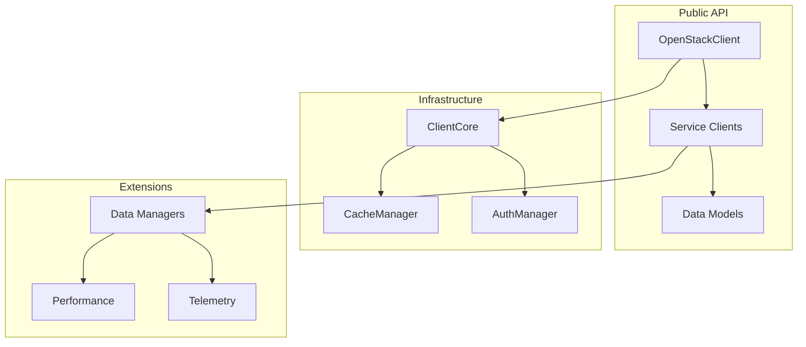

# API Reference

This is the complete API reference for Substation's packages: OSClient, SwiftNCurses, and CrossPlatformTimer. If you're looking for how-to guidance, start with the integration guide. This is the dry technical stuff.

## Quick Reference

### Package Overview

| Package | Purpose | When to Use |
|---------|---------|-------------|
| **OSClient** | OpenStack API client | Interacting with OpenStack services |
| **SwiftNCurses** | Terminal UI framework | Building terminal UIs |
| **CrossPlatformTimer** | Timer utilities | Periodic tasks, animations |

### Quick Start

```swift
import OSClient
import SwiftNCurses
import CrossPlatformTimer

// Connect to OpenStack
let client = try await OpenStackClient.connect(
    config: OpenStackConfig(authUrl: "https://keystone.example.com:5000/v3"),
    credentials: OpenStackCredentials(
        username: "admin",
        password: "secret",
        projectName: "admin"
    )
)

// Initialize terminal UI
let screen = SwiftNCurses.initializeScreen()
defer { SwiftNCurses.cleanup(screen) }

// Create auto-refresh timer
let timer = createCompatibleTimer(interval: 5.0, repeats: true) {
    Task {
        await refreshData()
    }
}
```

## Detailed Documentation

### [OSClient - OpenStack API Library](osclient.md)

**What's in it**:

- OpenStackClient initialization and configuration
- Service clients (Nova, Neutron, Cinder, Glance, etc.)
- Data models (Server, Network, Volume, etc.)
- Cache management
- Error handling and recovery
- Data managers for complex operations
- Performance monitoring

**Read this** when you need to:

- Connect to OpenStack
- Manage OpenStack resources
- Configure caching behavior
- Handle OpenStack errors
- Monitor API performance

### [SwiftNCurses - Terminal UI Framework](swiftncurses.md)

**What's in it**:

- Core rendering components
- UI components (Text, List, Table, Form)
- Color system
- Layout system
- Event handling
- Performance optimization
- Cross-platform considerations

**Read this** when you need to:

- Build terminal UIs
- Render lists and tables
- Handle keyboard input
- Create forms
- Optimize rendering performance

### [Integration Guide](integration.md)

**What's in it**:

- CrossPlatformTimer API
- Complete application examples
- Common integration patterns
- Best practices
- Testing strategies
- Troubleshooting

**Read this** when you need to:

- Build complete applications
- Integrate OSClient with SwiftNCurses
- Implement auto-refresh
- Create multi-view applications
- Handle timers and periodic tasks

## Common Operations Quick Reference

### OpenStack Operations

```swift
// List servers
let servers = try await client.nova.servers.list()

// Create server
let server = try await client.nova.servers.create(
    name: "my-server",
    flavorRef: flavorId,
    imageRef: imageId
)

// Delete server
try await client.nova.servers.delete(serverId)

// Get cache statistics
let stats = await client.cacheManager.statistics()
print("Cache hit rate: \(stats.hitRate * 100)%")
```

### Terminal UI Operations

```swift
// Render text
await SwiftNCurses.render(
    Text("Hello, World!").bold().color(.blue),
    on: surface,
    in: bounds
)

// Render list
let list = List(items: items)
    .selectedIndex(0)
    .scrollable(true)
await SwiftNCurses.render(list, on: surface, in: bounds)

// Handle input
let key = SwiftNCurses.getInput(screen)
switch key {
case KEY_UP: moveUp()
case KEY_DOWN: moveDown()
case KEY_ENTER: select()
default: break
}

// Refresh screen
SwiftNCurses.refresh(screen)
```

### Timer Operations

```swift
// Create repeating timer
let timer = createCompatibleTimer(interval: 5.0, repeats: true) {
    print("Timer fired!")
}

// Create one-shot timer
let oneShot = createCompatibleTimer(interval: 5.0, repeats: false) {
    print("One-time action")
}

// Clean up
timer.invalidate()
```

## API Design Principles

### 1. Type Safety

All APIs use Swift's strong type system for compile-time safety:

```swift
// Compile-time type checking
let server: Server = try await client.nova.servers.get(id)
let status: ServerStatus = server.status  // Enum, not string

// Invalid: Won't compile
// let status: String = server.status
```

### 2. Actor-Based Concurrency

All service clients use @MainActor for thread safety:

```swift
@MainActor
public final class OpenStackClient: @unchecked Sendable { }
public actor NovaService { }
public actor ServerManager { }

// Safe concurrent access
Task {
    let servers1 = try await client.nova.servers.list()
}
Task {
    let servers2 = try await client.nova.servers.list()
}
```

### 3. Async/Await Throughout

All I/O operations use async/await:

```swift
// All async
let servers = try await client.nova.servers.list()
let networks = try await client.neutron.networks.list()

// No callbacks or completion handlers
```

### 4. Comprehensive Error Handling

Typed errors with recovery strategies:

```swift
do {
    let server = try await client.nova.servers.create(...)
} catch OpenStackError.quotaExceeded(let message) {
    // Handle quota error
} catch OpenStackError.conflict(let message) {
    // Handle conflict
} catch {
    // Handle other errors
}
```

### 5. Performance by Default

Intelligent caching enabled by default:

```swift
// First call: API request
let servers1 = try await client.nova.servers.list()  // 2 seconds

// Second call: Cache hit
let servers2 = try await client.nova.servers.list()  // < 1ms
```

## Architecture Overview



## Key Concepts

### Caching

Intelligent multi-level caching designed for up to 60-80% API call reduction:

- **L1 Cache**: In-memory, target < 1ms retrieval
- **L2 Cache**: Session-persistent
- **L3 Cache**: Disk-backed, survives restarts

See: [Caching Concepts](../../concepts/caching.md)

### Resource-Specific TTLs

Different cache lifetimes for different resource types:

| Resource | TTL | Why |
|----------|-----|-----|
| Auth tokens | 1 hour | Keystone token lifetime |
| Service Endpoints, Quotas | 30 minutes | Semi-static infrastructure |
| Flavors, Volume Types | 15 minutes | Rarely change |
| Keypairs, Images, Networks | 5 minutes | Moderately dynamic |
| Volume Snapshots, Object Storage | 3 minutes | Dynamic storage resources |
| Servers, Volumes, Ports, Floating IPs | 2 minutes | Highly dynamic |

See: [Performance Tuning](../../performance/tuning.md)

### Error Recovery

Automatic retry with exponential backoff:

- Attempt 1: Immediate
- Attempt 2: 1 second delay
- Attempt 3: 2 seconds delay
- Attempt 4: 4 seconds delay

See: [Error Handling](osclient.md#error-handling)

## Source Code Locations

API implementation is organized across multiple packages:

- `/Sources/OSClient/` - OpenStack client library
- `/Sources/SwiftNCurses/` - Terminal UI framework
- `/Sources/CrossPlatformTimer/` - Timer utilities
- `/Sources/MemoryKit/` - Multi-level caching
- `/Sources/Substation/` - Substation application

## Migration Guides

### From Python OpenStack SDK

**Python**:

```python
from openstack import connection
conn = connection.Connection(auth_url="...", username="...", password="...")
servers = conn.compute.servers()
```

**Swift**:

```swift
import OSClient
let client = try await OpenStackClient.connect(config: ..., credentials: ...)
let servers = try await client.nova.servers.list()
```

### From NCurses

**C (NCurses)**:

```c
initscr();
printw("Hello, World!");
refresh();
endwin();
```

**Swift (SwiftNCurses)**:

```swift
let screen = SwiftNCurses.initializeScreen()
defer { SwiftNCurses.cleanup(screen) }
await SwiftNCurses.render(Text("Hello, World!"), on: surface, in: bounds)
SwiftNCurses.refresh(screen)
```

## Best Practices

### 1. Use Async/Await

```swift
// Good: Using async/await
let servers = try await client.nova.servers.list()

// Avoid: Blocking calls (don't exist in this API)
```

### 2. Handle Errors Properly

```swift
do {
    let server = try await client.nova.servers.create(...)
} catch OpenStackError.quotaExceeded(let message) {
    // Handle quota error specifically
} catch {
    // Handle other errors
}
```

### 3. Use Data Managers for Complex Operations

```swift
// Use data manager for detailed info (single call)
let details = try await client.serverDataManager.getDetailed(serverId)

// Instead of multiple calls
// let server = try await client.nova.servers.get(serverId)
// let volumes = try await client.cinder.volumes.list(...)
```

### 4. Configure Caching Appropriately

```swift
// Configure for your environment
await client.cacheManager.configure(
    maxSize: 100_000_000,  // 100MB
    defaultTTL: 300,       // 5 minutes
    resourceTTLs: [
        .servers: 60,
        .networks: 300,
        .images: 3600
    ]
)
```

### 5. Clean Up Resources

```swift
// Always use defer for cleanup
let screen = SwiftNCurses.initializeScreen()
defer { SwiftNCurses.cleanup(screen) }

let timer = createCompatibleTimer(...)
defer { timer.invalidate() }
```

## Related Documentation

- **[Performance Documentation](../../performance/index.md)** - Benchmarking, tuning, troubleshooting
- **[Caching Concepts](../../concepts/caching.md)** - Deep dive into caching architecture
- **[Architecture Overview](../../architecture/index.md)** - Overall system architecture
- **[Developer Guides](../../reference/developers/index.md)** - Building forms and components

---

**Note**: All APIs are documented with real-world usage examples. See individual pages for detailed documentation and code samples.
