# MemoryKit API Reference

## Overview

MemoryKit is a high-performance, thread-safe memory management and caching framework for Swift applications. Built with Swift actors and modern concurrency patterns, it provides intelligent resource management, multi-level caching, and real-time performance monitoring capabilities specifically designed for the Substation OpenStack TUI.

### Key Features
- **Thread-Safe Architecture**: Built on Swift actors for guaranteed thread safety
- **Multi-Level Cache Hierarchy**: L1 (memory), L2 (compressed memory), and L3 (disk) caching
- **Intelligent Eviction Policies**: LRU, LFU, FIFO, TTL, and adaptive strategies
- **Performance Monitoring**: Real-time metrics and alerting
- **Memory Pressure Management**: Automatic cleanup and resource optimization
- **Type-Safe APIs**: Generic implementations with full type safety
- **Cross-Platform Support**: Works on macOS and Linux
- **Flexible Logging**: Configurable logging with console and file output support

## Installation and Integration

### Swift Package Manager

Add MemoryKit as a dependency in your `Package.swift`:

```swift
dependencies: [
    .package(path: "path/to/substation")
],
targets: [
    .target(
        name: "YourTarget",
        dependencies: [
            .product(name: "MemoryKit", package: "substation")
        ]
    )
]
```

### Basic Setup

```swift
import MemoryKit

// Initialize MemoryKit with default configuration
let memoryKit = await MemoryKit()

// Or with custom configuration
let config = MemoryKit.Configuration(
    memoryManagerConfig: MemoryManager.Configuration(
        maxCacheSize: 5000,
        maxMemoryBudget: 100 * 1024 * 1024, // 100MB
        cleanupInterval: 600.0 // 10 minutes
    )
)
let memoryKit = await MemoryKit(configuration: config)
```

## Architecture

MemoryKit is structured as a modular system with the following components:

### Core Components

1. **MemoryKit** - Main orchestrator providing unified access
2. **MemoryManager** - Core memory management with automatic cleanup
3. **CacheManager** - Generic cache with eviction policies
4. **TypedCacheManager** - Type-safe cache manager for specific data types
5. **MultiLevelCacheManager** - Three-tier cache hierarchy
6. **PerformanceMonitor** - Real-time monitoring and alerting
7. **ResourcePool** - Pool for expensive object reuse
8. **ComprehensiveCacheMetrics** - Cross-cache metrics collection

### Component Architecture

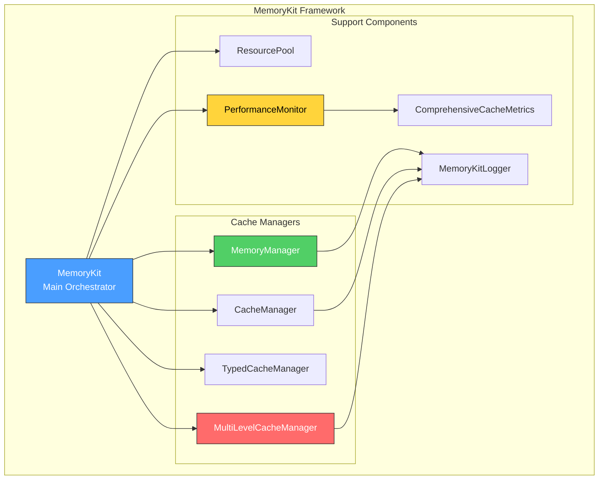

### Class Hierarchy

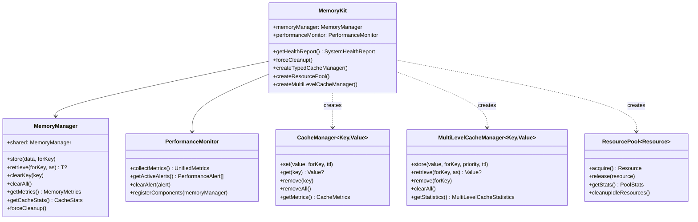

### Cache Hierarchy

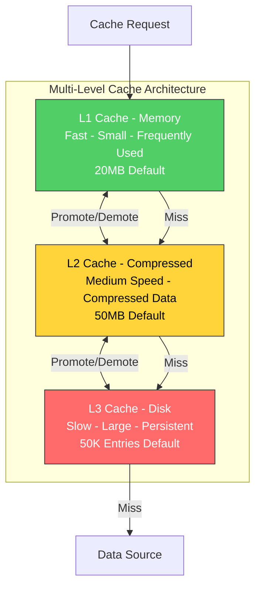

### Cache Lookup Flow

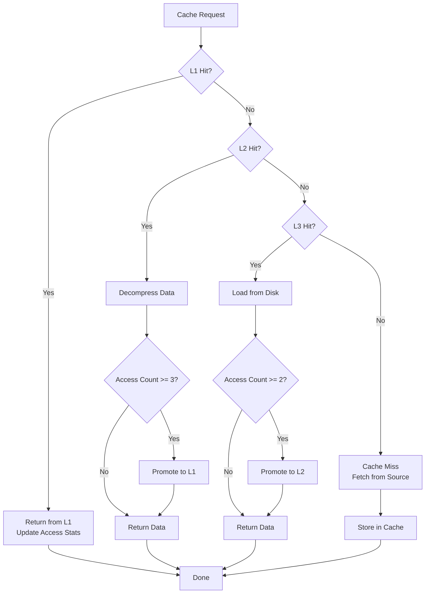

## API Reference

### MemoryKit (Main Interface)

The primary entry point for all MemoryKit functionality.

#### Initialization

```swift
public actor MemoryKit {
    public init(configuration: Configuration = Configuration()) async
}
```

#### Configuration

```swift
public struct Configuration: Sendable {
    public let memoryManagerConfig: MemoryManager.Configuration
    public let performanceMonitorConfig: PerformanceMonitor.Configuration

    public init(
        memoryManagerConfig: MemoryManager.Configuration = MemoryManager.Configuration(),
        performanceMonitorConfig: PerformanceMonitor.Configuration = PerformanceMonitor.Configuration()
    )
}
```

#### Properties

| Property | Type | Description |
|----------|------|-------------|
| `memoryManager` | `MemoryManager` | Advanced memory manager with cache and resource management |
| `performanceMonitor` | `PerformanceMonitor` | Performance monitor for real-time metrics and alerting |

#### Methods

| Method | Description | Parameters | Returns |
|--------|-------------|------------|---------|
| `getHealthReport()` | Get comprehensive system health report | None | `SystemHealthReport` |
| `forceCleanup()` | Force comprehensive cleanup of all components | None | `Void` |
| `createTypedCacheManager<K,V>()` | Create a specialized cache manager | `keyType`, `valueType`, `configuration` | `CacheManager<K,V>` |
| `createResourcePool<R>()` | Create a resource pool | `resourceType`, `configuration`, `factory`, `cleanup`, `validator` | `ResourcePool<R>` |
| `createMultiLevelCacheManager<K,V>()` | Create multi-level cache | `keyType`, `valueType`, `configuration`, `logger` | `MultiLevelCacheManager<K,V>` |

#### System Health Types

```swift
public struct SystemHealthReport: Sendable {
    public let timestamp: Date
    public let memoryStats: CacheStats
    public let performanceMetrics: PerformanceMonitor.UnifiedMetrics
    public let activeAlerts: [PerformanceMonitor.PerformanceAlert]
    public let overallHealth: SystemHealth

    public var summary: String
}

public enum SystemHealth: String, Sendable {
    case excellent = "Excellent"
    case good = "Good"
    case fair = "Fair"
    case poor = "Poor"
    case critical = "Critical"

    public var description: String
    public var color: String
}
```

### MemoryManager

Provides thread-safe memory management with automatic cleanup.

#### Singleton Access

```swift
let manager = MemoryManager.shared
```

#### Configuration

```swift
public struct Configuration: Sendable {
    public let maxCacheSize: Int              // Maximum number of entries
    public let maxMemoryBudget: Int           // Maximum memory in bytes
    public let cleanupInterval: TimeInterval  // Automatic cleanup interval
    public let pressureThreshold: Double      // Memory pressure threshold (0.0-1.0)
    public let enableMetrics: Bool            // Enable metrics collection
    public let enableLeakDetection: Bool      // Enable leak detection
    public let logger: any MemoryKitLogger    // Logger instance

    public init(
        maxCacheSize: Int = 1000,
        maxMemoryBudget: Int = 100 * 1024 * 1024, // 100MB
        cleanupInterval: TimeInterval = 600.0,    // 10 minutes
        pressureThreshold: Double = 0.8,
        enableMetrics: Bool = true,
        enableLeakDetection: Bool = true,
        logger: any MemoryKitLogger = MemoryKitLoggerFactory.defaultLogger()
    )
}
```

#### Methods

| Method | Description | Parameters | Returns |
|--------|-------------|------------|---------|
| `store<T>(_ data: T, forKey: String)` | Store data in cache | `data: Sendable`, `key: String` | `Void` |
| `retrieve<T>(forKey: String, as: T.Type)` | Retrieve data from cache | `key: String`, `type: T.Type` | `T?` |
| `clearKey(_ key: String)` | Clear specific key | `key: String` | `Void` |
| `clearAll()` | Clear all cached data | None | `Void` |
| `getMetrics()` | Get memory metrics | None | `MemoryMetrics` |
| `getCacheStats()` | Get cache statistics | None | `CacheStats` |
| `forceCleanup()` | Force memory cleanup | None | `Void` |
| `isUnderMemoryPressure()` | Check memory pressure | None | `Bool` |
| `start()` | Start background tasks | None | `Void` |

#### Memory Metrics

```swift
public struct MemoryMetrics: Sendable {
    public private(set) var cacheHits: Int
    public private(set) var cacheMisses: Int
    public private(set) var cacheEvictions: Int
    public private(set) var bytesWritten: Int
    public private(set) var bytesRead: Int
    public private(set) var cleanupOperations: Int
    public private(set) var aggressiveCleanups: Int
    public private(set) var lastCleanupTime: Date?

    public var hitRate: Double
    public var efficiency: Double
}
```

#### Cache Statistics

```swift
public struct CacheStats: Sendable {
    public let entryCount: Int
    public let totalSize: Int
    public let hitRate: Double
    public let averageAge: TimeInterval
    public let memoryPressure: Double

    public var description: String
}
```

### CacheManager<Key, Value>

Generic cache manager with intelligent eviction policies.

#### Configuration

```swift
public struct Configuration: Sendable {
    public let maxSize: Int                    // Maximum entries
    public let maxMemoryUsage: Int             // Maximum memory bytes
    public let defaultTTL: TimeInterval        // Default time-to-live
    public let enableTTL: Bool                 // Enable TTL tracking
    public let evictionPolicy: EvictionPolicy  // Eviction strategy
    public let compressionEnabled: Bool        // Enable compression
    public let enableMetrics: Bool             // Enable metrics

    public init(
        maxSize: Int = 1000,
        maxMemoryUsage: Int = 50 * 1024 * 1024, // 50MB
        defaultTTL: TimeInterval = 300,
        enableTTL: Bool = true,
        evictionPolicy: EvictionPolicy = .lru,
        compressionEnabled: Bool = true,
        enableMetrics: Bool = true
    )
}
```

#### Eviction Policies

```swift
public enum EvictionPolicy: Sendable {
    case lru      // Least Recently Used
    case lfu      // Least Frequently Used
    case fifo     // First In, First Out
    case random   // Random eviction
    case ttl      // Time To Live based
    case adaptive // Adaptive based on access patterns
}
```

#### Eviction Policy Comparison

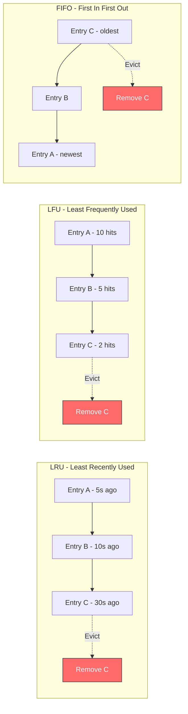

#### Methods

| Method | Description | Parameters | Returns |
|--------|-------------|------------|---------|
| `set(_ value: Value, forKey: Key, ttl: TimeInterval?)` | Store value | `value`, `key`, optional `ttl` | `Void` |
| `get(_ key: Key)` | Retrieve value | `key` | `Value?` |
| `remove(_ key: Key)` | Remove entry | `key` | `Void` |
| `removeAll()` | Clear all entries | None | `Void` |
| `count()` | Get entry count | None | `Int` |
| `memoryUsage()` | Get memory usage | None | `Int` |
| `getMetrics()` | Get cache metrics | None | `CacheMetrics` |
| `evictToSize(_ targetSize: Int)` | Force eviction | `targetSize` | `Void` |
| `contains(_ key: Key)` | Check key existence | `key` | `Bool` |
| `getAllKeys()` | Get all keys | None | `[Key]` |
| `start()` | Start cleanup tasks | None | `Void` |

#### Cache Metrics

```swift
public struct CacheMetrics: Sendable {
    public private(set) var hits: Int
    public private(set) var misses: Int
    public private(set) var writes: Int
    public private(set) var evictions: Int
    public private(set) var expirations: Int
    public private(set) var bytesStored: Int
    public private(set) var bytesEvicted: Int

    public var hitRate: Double
    public var evictionRate: Double
}
```

### TypedCacheManager<Key, Value>

A type-safe cache manager that provides specialized caching for specific types.

#### Configuration

```swift
public struct Configuration: Sendable {
    public let maxSize: Int
    public let ttl: TimeInterval
    public let evictionPolicy: EvictionPolicy
    public let enableStatistics: Bool

    public init(
        maxSize: Int = 1000,
        ttl: TimeInterval = 300.0,
        evictionPolicy: EvictionPolicy = .leastRecentlyUsed,
        enableStatistics: Bool = true
    )
}

public enum EvictionPolicy: Sendable {
    case leastRecentlyUsed
    case leastFrequentlyUsed
    case timeToLive
    case fifo
}
```

#### Methods

| Method | Description | Parameters | Returns |
|--------|-------------|------------|---------|
| `store(_ value: Value, forKey: Key)` | Store a value | `value`, `key` | `Void` |
| `retrieve(forKey: Key)` | Retrieve a value | `key` | `Value?` |
| `remove(forKey: Key)` | Remove a specific key | `key` | `Void` |
| `clear()` | Clear all cached values | None | `Void` |
| `getStatistics()` | Get cache statistics | None | `CacheStatistics` |

#### Cache Statistics

```swift
public struct CacheStatistics: Sendable {
    public var hits: Int
    public var misses: Int
    public var writes: Int
    public var evictions: Int
    public var expiries: Int
    public var cleanups: Int
    public var currentSize: Int
    public var maxSize: Int

    public var hitRate: Double
    public var hitCount: Int
    public var accessCount: Int
}
```

### MultiLevelCacheManager<Key, Value>

Three-tier cache with intelligent promotion and demotion.

#### Configuration

```swift
public struct Configuration: Sendable {
    public let l1MaxSize: Int          // L1 max entries
    public let l1MaxMemory: Int        // L1 max memory (bytes)
    public let l2MaxSize: Int          // L2 max entries
    public let l2MaxMemory: Int        // L2 max memory (bytes)
    public let l3MaxSize: Int          // L3 max entries
    public let l3CacheDirectory: URL?  // L3 disk location
    public let defaultTTL: TimeInterval // Default TTL
    public let enableCompression: Bool  // Enable compression
    public let enableMetrics: Bool      // Enable metrics

    public init(
        l1MaxSize: Int = 1000,
        l1MaxMemory: Int = 20 * 1024 * 1024,   // 20 MB for L1
        l2MaxSize: Int = 5000,
        l2MaxMemory: Int = 50 * 1024 * 1024,   // 50 MB for L2
        l3MaxSize: Int = 50000,                 // 50k entries on disk
        l3CacheDirectory: URL? = nil,
        defaultTTL: TimeInterval = 300.0,       // 5 minutes
        enableCompression: Bool = true,
        enableMetrics: Bool = true
    )
}
```

#### Cache Priority

```swift
public enum CachePriority: Int, CaseIterable, Sendable {
    case critical = 4  // Auth tokens, service endpoints
    case high = 3      // Active servers, current projects
    case normal = 2    // General resources
    case low = 1       // Historical data, rarely accessed

    public var weight: Double
    public var ttlMultiplier: Double
}
```

#### Methods

| Method | Description | Parameters | Returns |
|--------|-------------|------------|---------|
| `store(_ value: Value, forKey: Key, priority: CachePriority, customTTL: TimeInterval?)` | Store with priority | `value`, `key`, `priority`, optional `ttl` | `Void` |
| `retrieve(forKey: Key, as: Value.Type)` | Retrieve with promotion | `key`, `type` | `Value?` |
| `remove(forKey: Key)` | Remove from all levels | `key` | `Void` |
| `clearAll()` | Clear all cache levels | None | `Void` |
| `getStatistics()` | Get comprehensive stats | None | `MultiLevelCacheStatistics` |
| `start()` | Start maintenance tasks | None | `Void` |

#### Multi-Level Cache Statistics

```swift
public struct MultiLevelCacheStatistics: Sendable {
    public let l1Stats: CacheTierStatistics
    public let l2Stats: CacheTierStatistics
    public let l3Stats: CacheTierStatistics
    public let overallHitRate: Double
    public let totalMisses: Int
    public let compressionStats: CompressionStats

    public var description: String
}

public struct CacheTierStatistics: Sendable {
    public let entries: Int
    public let maxEntries: Int
    public let memoryUsage: Int
    public let maxMemory: Int
    public let hitCount: Int
    public let hitRate: Double
}

public struct CompressionStats: Sendable {
    public var totalCompressions: Int
    public var totalOriginalBytes: Int
    public var totalCompressedBytes: Int
    public var averageCompressionTime: TimeInterval
    public var averageDecompressionTime: TimeInterval

    public var averageCompressionRatio: Double
}
```

#### Error Types

```swift
public enum MultiLevelCacheError: Error, LocalizedError {
    case compressionFailed
    case decompressionFailed

    public var errorDescription: String?
    public var failureReason: String?
    public var recoverySuggestion: String?
}
```

### ResourcePool<Resource>

Thread-safe pool for expensive-to-create objects.

#### Resource Pool Lifecycle

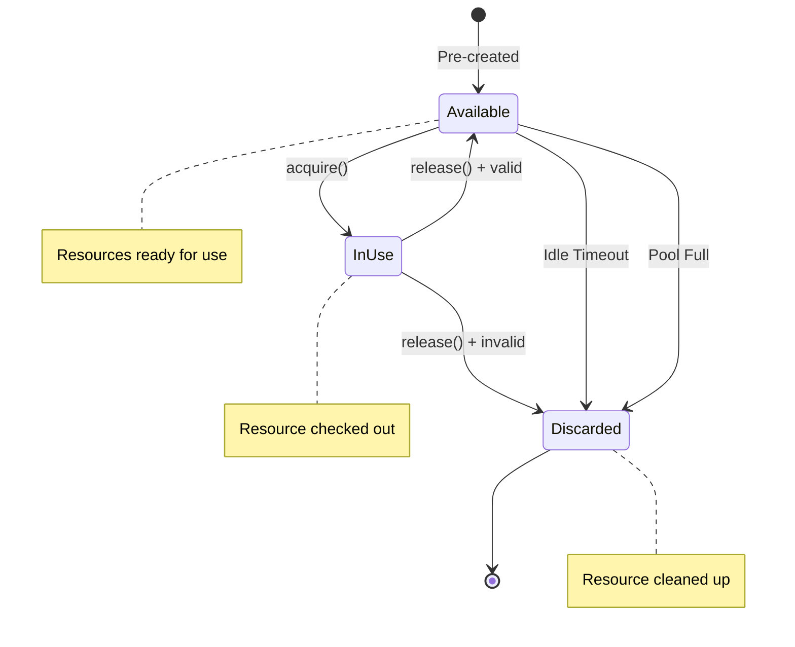

#### Acquire/Release Flow

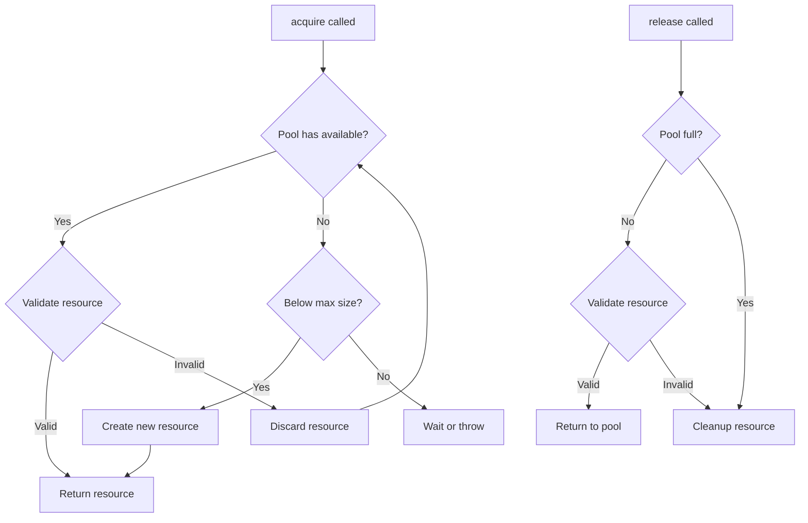

#### Configuration

```swift
public struct Configuration: Sendable {
    public let maxPoolSize: Int           // Maximum pool size
    public let minPoolSize: Int           // Minimum pool size
    public let idleTimeout: TimeInterval  // Idle resource timeout
    public let enableMetrics: Bool        // Enable metrics

    public init(
        maxPoolSize: Int = 10,
        minPoolSize: Int = 2,
        idleTimeout: TimeInterval = 300,
        enableMetrics: Bool = true
    )
}
```

#### Initialization

```swift
public init(
    configuration: Configuration = Configuration(),
    factory: @escaping @Sendable () async throws -> Resource,
    cleanup: @escaping @Sendable (Resource) async -> Void = { _ in },
    validator: @escaping @Sendable (Resource) async -> Bool = { _ in true }
)
```

#### Methods

| Method | Description | Parameters | Returns |
|--------|-------------|------------|---------|
| `acquire()` | Acquire resource from pool | None | `Resource` (throws) |
| `release(_ resource: Resource)` | Return resource to pool | `resource` | `Void` |
| `getStats()` | Get pool statistics | None | `PoolStats` |
| `cleanupIdleResources()` | Cleanup idle resources | None | `Void` |
| `start()` | Start cleanup tasks | None | `Void` |

#### Pool Statistics

```swift
public struct PoolMetrics: Sendable {
    public private(set) var acquisitionsFromPool: Int
    public private(set) var acquisitionsCreated: Int
    public private(set) var releasesToPool: Int
    public private(set) var releasesDiscarded: Int
    public private(set) var validationFailures: Int
    public private(set) var idleCleanups: Int
    public private(set) var preCreations: Int

    public var poolHitRate: Double
}

public struct PoolStats: Sendable {
    public let availableCount: Int
    public let inUseCount: Int
    public let maxPoolSize: Int
    public let metrics: PoolMetrics

    public var utilization: Double
    public var description: String
}
```

### PerformanceMonitor

Real-time performance monitoring and alerting.

#### Monitoring Architecture

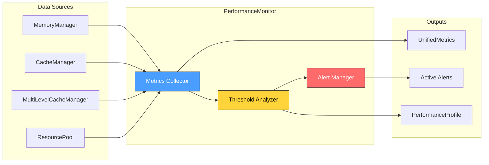

#### Alert Flow

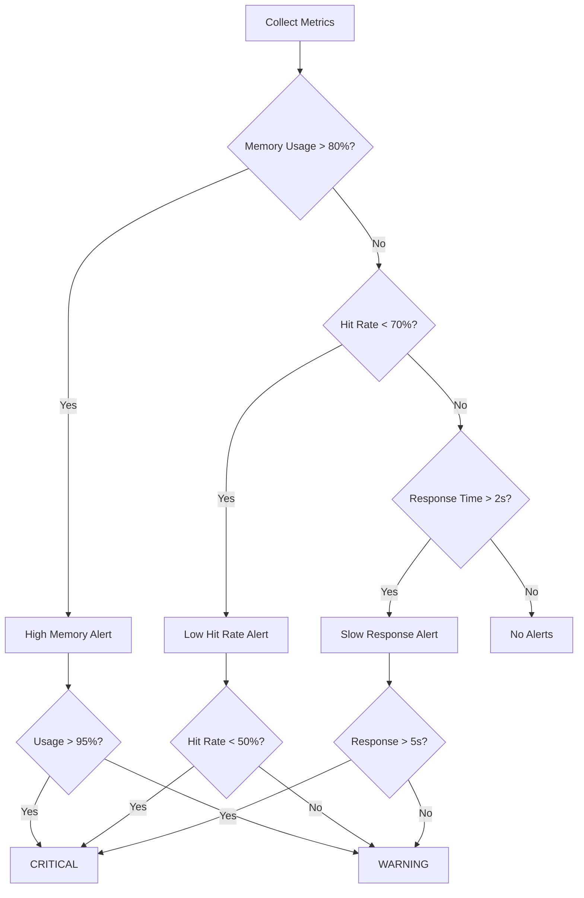

#### Configuration

```swift
public struct Configuration: Sendable {
    public let enableMonitoring: Bool
    public let metricsCollectionInterval: TimeInterval
    public let alertThresholds: AlertThresholds

    public init(
        enableMonitoring: Bool = true,
        metricsCollectionInterval: TimeInterval = 300.0,
        alertThresholds: AlertThresholds = AlertThresholds()
    )
}

public struct AlertThresholds: Sendable {
    public let memoryUsageThreshold: Double
    public let cacheHitRateThreshold: Double
    public let responseTimeThreshold: TimeInterval

    public init(
        memoryUsageThreshold: Double = 0.8,
        cacheHitRateThreshold: Double = 0.7,
        responseTimeThreshold: TimeInterval = 2.0
    )
}
```

#### Alert Types

```swift
public enum PerformanceAlert: Sendable {
    case highMemoryUsage(current: Double, threshold: Double)
    case lowCacheHitRate(current: Double, threshold: Double)
    case slowResponseTime(current: TimeInterval, threshold: TimeInterval)

    public var severity: AlertSeverity
    public var description: String
}

public enum AlertSeverity: String, Sendable {
    case info = "INFO"
    case warning = "WARNING"
    case critical = "CRITICAL"
}
```

#### Unified Metrics

```swift
public struct UnifiedMetrics: Sendable {
    public let timestamp: Date
    public let memoryMetrics: MemoryMetrics
    public let cacheMetrics: CacheMetrics
    public let systemMetrics: SystemMetrics
    public let performanceProfile: PerformanceProfile

    public var summary: String
}

public struct SystemMetrics: Sendable {
    public let memoryUsage: Double
    public let cpuUsage: Double
    public let timestamp: Date
}

public struct PerformanceProfile: Sendable {
    public let averageResponseTime: TimeInterval
    public let cacheEfficiency: Double
    public let systemLoad: Double

    public var grade: PerformanceGrade
}

public enum PerformanceGrade: String, Sendable {
    case excellent = "A+"
    case good = "A"
    case fair = "B"
    case poor = "C"
    case critical = "F"

    public var description: String
}
```

#### Methods

| Method | Description | Parameters | Returns |
|--------|-------------|------------|---------|
| `collectMetrics()` | Collect current metrics | None | `UnifiedMetrics` |
| `getActiveAlerts()` | Get active alerts | None | `[PerformanceAlert]` |
| `clearAlert(_ alert:)` | Clear a specific alert | `alert` | `Void` |
| `registerComponents(memoryManager:)` | Register components | `memoryManager` | `Void` |

### ComprehensiveCacheMetrics

Collects metrics across multiple cache managers.

#### Initialization

```swift
public init(logger: any MemoryKitLogger, enablePeriodicReporting: Bool = false)
```

#### Methods

| Method | Description | Parameters | Returns |
|--------|-------------|------------|---------|
| `collectMetrics(cacheManagers:typedCacheManagers:)` | Collect metrics from all managers | `cacheManagers`, `typedCacheManagers` | `ComprehensiveMetrics` |

#### Metrics Types

```swift
public struct ComprehensiveMetrics: Sendable {
    public let timestamp: Date
    public let cacheManagers: [String: CacheMetrics]
    public let typedCacheManagers: [String: CacheStatistics]

    public var overallStats: OverallCacheStats
}

public struct OverallCacheStats: Sendable {
    public let totalEntries: Int
    public let totalSize: Int
    public let hitRate: Double

    public var description: String
}
```

#### Protocols

```swift
public protocol CacheManagerProtocol: Actor {
    func getMetrics() async -> CacheMetrics
}

public protocol TypedCacheManagerProtocol: Actor {
    func getStatistics() async -> CacheStatistics
}
```

### Logging System

MemoryKit provides a flexible logging system for debugging and monitoring.

#### Logging Architecture

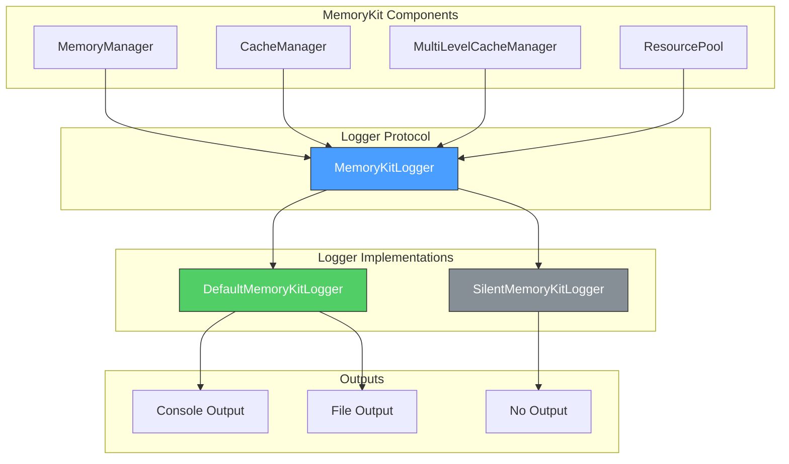

#### MemoryKitLogger Protocol

```swift
public protocol MemoryKitLogger: Sendable {
    func logDebug(_ message: String, context: [String: Any])
    func logInfo(_ message: String, context: [String: Any])
    func logWarning(_ message: String, context: [String: Any])
    func logError(_ message: String, context: [String: Any])
}
```

#### Logger Implementations

**DefaultMemoryKitLogger** - Console and file logging:

```swift
public struct DefaultMemoryKitLogger: MemoryKitLogger {
    public init(prefix: String = "[MemoryKit]")
    public init(prefix: String = "[MemoryKit]", logToFile: Bool)
    public init(prefix: String = "[MemoryKit]", logFileURL: URL)
    public init(prefix: String = "[MemoryKit]", logFilePath: String)
}
```

**SilentMemoryKitLogger** - No-op logger for testing or disabled logging:

```swift
public struct SilentMemoryKitLogger: MemoryKitLogger {
    public init()
}
```

#### MemoryKitLoggerFactory

```swift
public enum MemoryKitLoggerFactory {
    public static func fileLogger(logFilePath: String, prefix: String = "[MemoryKit]") -> any MemoryKitLogger
    public static func fileLogger(logFileURL: URL, prefix: String = "[MemoryKit]") -> any MemoryKitLogger
    public static func consoleLogger(prefix: String = "[MemoryKit]") -> any MemoryKitLogger
    public static func silentLogger() -> any MemoryKitLogger
    public static func defaultLogger() -> any MemoryKitLogger  // Returns SilentMemoryKitLogger
}
```

## Usage Examples

### Basic Cache Operations

```swift
// Store and retrieve simple data
let memoryManager = MemoryManager.shared
await memoryManager.start()

// Store data
await memoryManager.store("Hello, World!", forKey: "greeting")
await memoryManager.store(userData, forKey: "user_123")

// Retrieve data
if let greeting = await memoryManager.retrieve(forKey: "greeting", as: String.self) {
    print(greeting) // "Hello, World!"
}

// Check cache stats
let stats = await memoryManager.getCacheStats()
print("Cache hit rate: \(stats.hitRate * 100)%")
```

### Typed Cache Manager

```swift
// Create a typed cache for specific data types
let userCache = TypedCacheManager<String, User>(
    configuration: TypedCacheManager<String, User>.Configuration(
        maxSize: 1000,
        ttl: 300,
        evictionPolicy: .leastRecentlyUsed
    )
)

// Store user data
let user = User(id: "123", name: "John Doe")
await userCache.store(user, forKey: "user_123")

// Retrieve user data
if let cachedUser = await userCache.retrieve(forKey: "user_123") {
    print("Found user: \(cachedUser.name)")
}

// Get statistics
let stats = await userCache.getStatistics()
print("Hit rate: \(stats.hitRate * 100)%")
```

### Generic Cache Manager

```swift
// Create a cache with custom eviction policy
let cache = CacheManager<String, Server>(
    configuration: CacheManager<String, Server>.Configuration(
        maxSize: 500,
        defaultTTL: 600,
        evictionPolicy: .adaptive
    )
)
await cache.start()

// Store with custom TTL
await cache.set(server, forKey: "server_123", ttl: 1800)

// Retrieve
if let cached = await cache.get("server_123") {
    print("Server: \(cached.name)")
}

// Check metrics
let metrics = await cache.getMetrics()
print("Eviction rate: \(metrics.evictionRate * 100)%")
```

### Multi-Level Cache

```swift
// Create multi-level cache for OpenStack resources
let resourceCache = MultiLevelCacheManager<String, Server>(
    configuration: MultiLevelCacheManager<String, Server>.Configuration(
        l1MaxSize: 100,      // Keep 100 hot items in memory
        l2MaxSize: 500,      // Keep 500 compressed items
        l3MaxSize: 10000,    // Keep 10k items on disk
        defaultTTL: 3600     // 1 hour TTL
    )
)
await resourceCache.start()

// Store server with priority
let server = Server(id: "srv-123", name: "production-web-01")
await resourceCache.store(
    server,
    forKey: server.id,
    priority: .high,     // High priority for production servers
    customTTL: 7200      // 2 hour TTL
)

// Retrieve (automatically promotes between levels)
if let cachedServer = await resourceCache.retrieve(
    forKey: "srv-123",
    as: Server.self
) {
    print("Server: \(cachedServer.name)")
}

// Get statistics
let stats = await resourceCache.getStatistics()
print(stats.description)
```

### Resource Pool

```swift
// Create a pool for expensive database connections
let dbPool = ResourcePool<DatabaseConnection>(
    configuration: ResourcePool<DatabaseConnection>.Configuration(
        maxPoolSize: 10,
        minPoolSize: 2,
        idleTimeout: 300
    ),
    factory: {
        // Create new connection
        return try await DatabaseConnection.create()
    },
    cleanup: { connection in
        // Clean up connection
        await connection.close()
    },
    validator: { connection in
        // Validate connection is still alive
        return await connection.isAlive()
    }
)
await dbPool.start()

// Use pooled resource
let connection = try await dbPool.acquire()
defer {
    Task {
        await dbPool.release(connection)
    }
}
// Use connection...
```

### Custom Logging

```swift
// Create a file logger for debugging
let fileLogger = MemoryKitLoggerFactory.fileLogger(
    logFilePath: "/var/log/memorykit.log",
    prefix: "[MyApp]"
)

let memoryManager = MemoryManager(configuration: MemoryManager.Configuration(
    maxCacheSize: 5000,
    logger: fileLogger
))

// Or use console logging
let consoleLogger = MemoryKitLoggerFactory.consoleLogger(prefix: "[Debug]")

// For production, use silent logger (default)
let silentLogger = MemoryKitLoggerFactory.silentLogger()
```

## Configuration Guide

### Memory Manager Configuration

```swift
let config = MemoryManager.Configuration(
    maxCacheSize: 5000,              // Entries before eviction
    maxMemoryBudget: 150_000_000,    // 150MB budget
    cleanupInterval: 600.0,          // Clean every 10 minutes
    pressureThreshold: 0.8,          // Trigger at 80% usage
    enableMetrics: true,             // Track performance
    enableLeakDetection: true,       // Detect memory leaks
    logger: CustomLogger()           // Custom logging
)
```

### Cache Manager Eviction Policies

- **LRU**: Best for general-purpose caching
- **LFU**: Good when access patterns are stable
- **FIFO**: Simple, predictable eviction
- **TTL**: When data has natural expiration
- **Adaptive**: Balances multiple factors
- **Random**: Low overhead, unpredictable

### Multi-Level Cache Tuning

```swift
// For read-heavy workloads
let readOptimized = MultiLevelCacheManager.Configuration(
    l1MaxSize: 2000,      // Large L1 for fast reads
    l1MaxMemory: 50_000_000,
    l2MaxSize: 10000,     // Large L2 backup
    l2MaxMemory: 100_000_000,
    l3MaxSize: 100000     // Massive L3 for historical data
)

// For write-heavy workloads
let writeOptimized = MultiLevelCacheManager.Configuration(
    l1MaxSize: 500,       // Small L1 to reduce write pressure
    l1MaxMemory: 10_000_000,
    l2MaxSize: 2000,      // Medium L2
    l2MaxMemory: 30_000_000,
    l3MaxSize: 50000,     // Large L3 for persistence
    enableCompression: true // Compress to reduce I/O
)
```

## Performance Considerations

### Memory Pressure

MemoryKit automatically manages memory pressure through:
- Periodic cleanup cycles
- Pressure-triggered eviction
- Adaptive scoring for cache entries
- Automatic tier demotion

#### Memory Pressure Response Flow

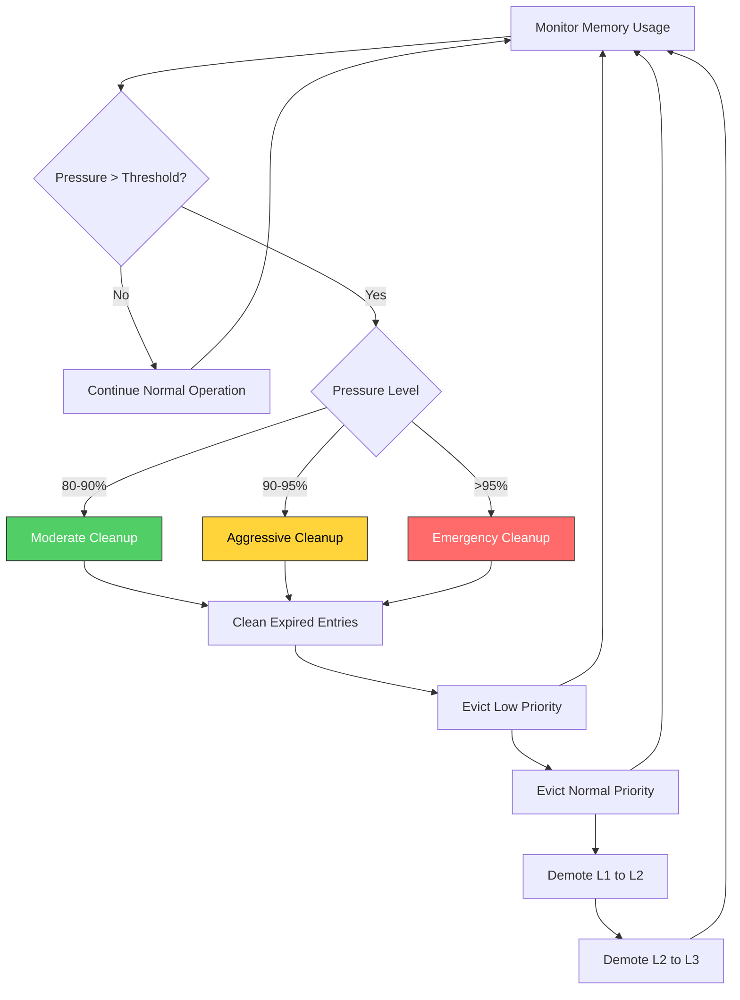

### Eviction Strategies

| Policy | CPU Cost | Memory Efficiency | Best Use Case |
|--------|----------|-------------------|---------------|
| LRU | Low | High | General caching |
| LFU | Medium | High | Stable patterns |
| FIFO | Very Low | Medium | Queue-like data |
| TTL | Low | Medium | Time-sensitive data |
| Adaptive | High | Very High | Mixed workloads |

### Compression Trade-offs

- **L2 Compression**: Reduces memory by 50-80% for JSON data
- **L3 Compression**: Reduces disk I/O but increases CPU usage
- **Compression overhead**: ~0.5ms for 10KB JSON data
- **Platform Support**: Uses LZFSE on macOS, no compression on Linux

## Best Practices

### 1. Choose the Right Cache Level

```swift
// Critical, frequently accessed data -> L1
await cache.store(authToken, forKey: "auth", priority: .critical)

// Important but less frequent -> L2
await cache.store(userProfile, forKey: "user", priority: .high)

// Historical or archival -> L3
await cache.store(auditLog, forKey: "audit", priority: .low)
```

### 2. Set Appropriate TTLs

```swift
// Short TTL for volatile data
await cache.set(marketPrice, forKey: "price", ttl: 60) // 1 minute

// Medium TTL for semi-static data
await cache.set(userSession, forKey: "session", ttl: 3600) // 1 hour

// Long TTL for stable data
await cache.set(configuration, forKey: "config", ttl: 86400) // 1 day
```

### 3. Monitor Performance

```swift
// Regular health checks
let health = await memoryKit.getHealthReport()
if health.overallHealth == .poor {
    await memoryKit.forceCleanup()
}

// Track cache efficiency
let stats = await cache.getMetrics()
if stats.hitRate < 0.7 {
    // Consider adjusting cache size or TTL
}
```

### 4. Handle Memory Warnings

```swift
// Check memory pressure
if await memoryManager.isUnderMemoryPressure() {
    // Reduce cache usage or force cleanup
    await memoryManager.forceCleanup()
}
```

### 5. Use Resource Pools for Expensive Objects

```swift
// Pool expensive resources instead of creating new ones
let pool = ResourcePool<ExpensiveResource>(
    configuration: ResourcePool.Configuration(
        maxPoolSize: 20,
        minPoolSize: 5
    ),
    factory: { try await ExpensiveResource.create() }
)
```

## Migration Guide

### From Array-Based Caching

**Before (Legacy):**
```swift
class TUI {
    var cachedServers: [Server] = []

    func refreshServers() {
        cachedServers = fetchServers()
    }
}
```

**After (MemoryKit):**
```swift
class TUI {
    let cache = MemoryManager.shared

    func refreshServers() async {
        let servers = await fetchServers()
        await cache.store(servers, forKey: "servers")
    }

    func getServers() async -> [Server] {
        return await cache.retrieve(forKey: "servers", as: [Server].self) ?? []
    }
}
```

### From Dictionary Caching

**Before:**
```swift
var cache: [String: Any] = [:]
cache["user_123"] = user
```

**After:**
```swift
let cache = TypedCacheManager<String, User>(
    configuration: TypedCacheManager.Configuration()
)
await cache.store(user, forKey: "user_123")
```

### Adding MemoryKit to Existing Project

1. Add MemoryKit as dependency
2. Initialize in app startup:
   ```swift
   let memoryKit = await MemoryKit()
   ```
3. Replace existing caches gradually
4. Monitor performance improvements
5. Tune configuration based on metrics

## Troubleshooting

### High Memory Usage

```swift
// Check current usage
let stats = await memoryManager.getCacheStats()
print("Memory pressure: \(stats.memoryPressure * 100)%")

// Force cleanup if needed
if stats.memoryPressure > 0.9 {
    await memoryManager.forceCleanup()
}
```

### Low Cache Hit Rate

```swift
// Analyze cache metrics
let metrics = await cache.getMetrics()
print("Hit rate: \(metrics.hitRate)")
print("Eviction rate: \(metrics.evictionRate)")

// Adjust configuration
// Increase cache size or TTL if eviction rate is high
```

### Debugging Cache Misses

```swift
// Enable detailed logging
let logger = MemoryKitLoggerFactory.fileLogger(
    logFilePath: "/tmp/memorykit-debug.log",
    prefix: "[Debug]"
)
let cache = CacheManager<String, MyType>(
    configuration: CacheManager.Configuration(),
    logger: logger
)
```

### Compression Issues

```swift
// Handle compression errors gracefully
do {
    let value = await multiLevelCache.retrieve(forKey: "key", as: MyType.self)
} catch MultiLevelCacheError.decompressionFailed {
    // Entry was corrupted, it will be removed automatically
    // Fetch fresh data
}
```

## Thread Safety

All MemoryKit components are thread-safe through Swift actors:

```swift
// Safe to call from any thread/task
Task {
    await cache.set(data1, forKey: "key1")
}
Task {
    await cache.set(data2, forKey: "key2")
}
// No race conditions or data corruption
```

## Error Handling

MemoryKit operations are designed to be resilient:

```swift
// Safe retrieval with fallback
let data = await cache.retrieve(forKey: "key", as: MyType.self) ?? defaultValue

// Resource pool with error handling
do {
    let resource = try await pool.acquire()
    // Use resource
    await pool.release(resource)
} catch {
    print("Failed to acquire resource: \(error)")
}
```

## Performance Benchmarks

Typical performance metrics on modern hardware:

| Operation | Time | Throughput |
|-----------|------|------------|
| L1 Cache Hit | <1us | >1M ops/sec |
| L2 Cache Hit | ~100us | ~10K ops/sec |
| L3 Cache Hit | ~1ms | ~1K ops/sec |
| Cache Miss | ~10us | ~100K ops/sec |
| Compression (10KB) | ~500us | ~2K ops/sec |
| Eviction (1K items) | ~10ms | ~100 ops/sec |

## Support and Contributing

MemoryKit is maintained as part of the Substation project. For issues or contributions:

1. Check existing implementation in `/Sources/MemoryKit/`
2. Follow Swift 6.1 syntax requirements
3. Ensure all code is ASCII-only (no Unicode)
4. Add SwiftDoc comments for public APIs
5. Test with both macOS and Linux targets
