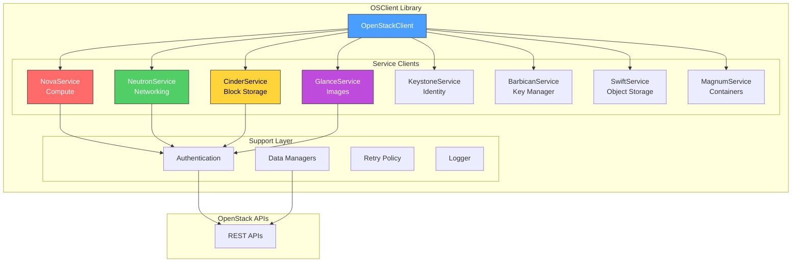
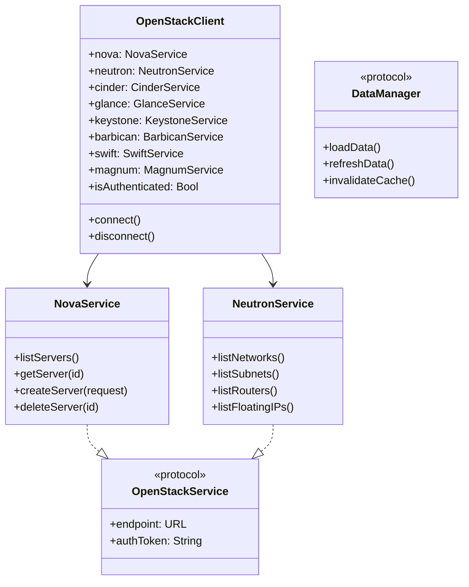
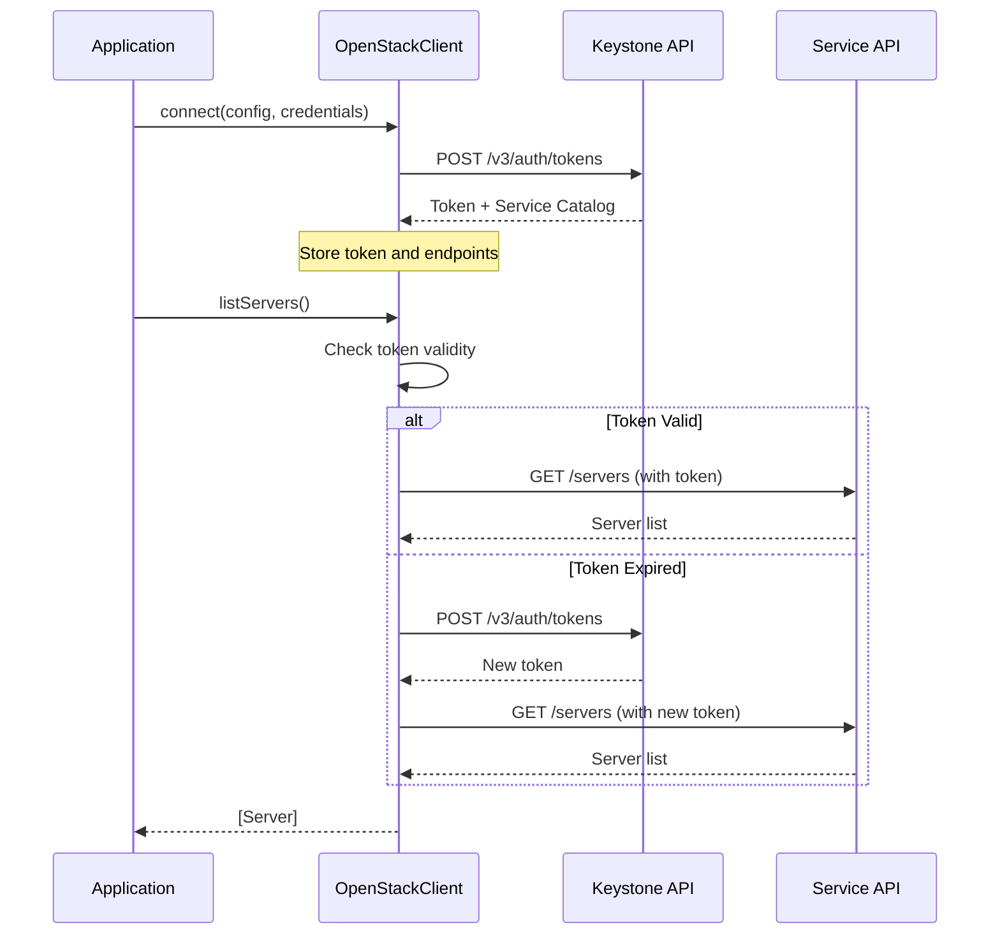
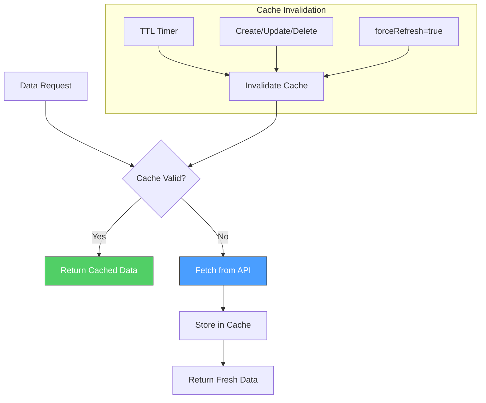
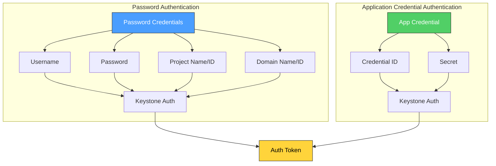
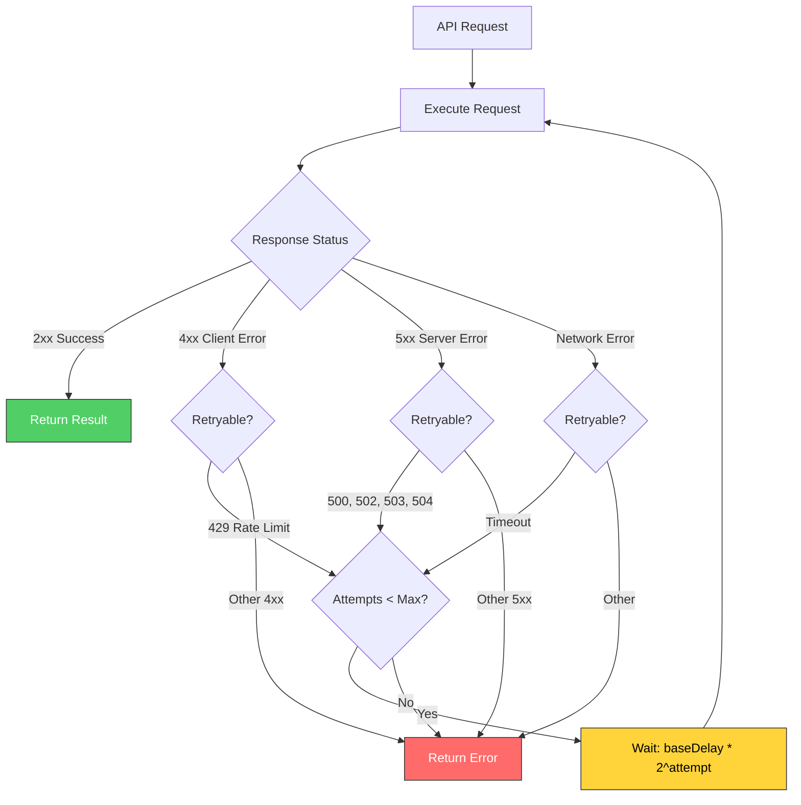
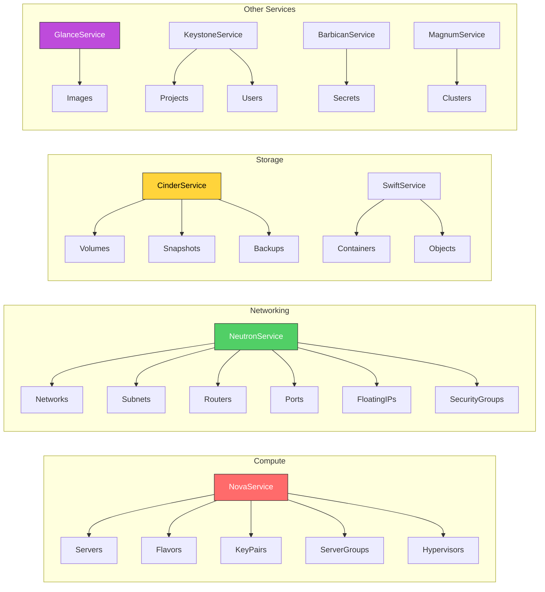
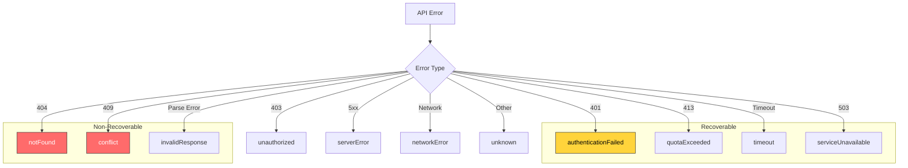

# OSClient API Reference

This is the API reference for OSClient. If you're looking for how-to guidance, check the integration guide first. This covers the complete OpenStackClient library API, service clients, and data models.

## Package Overview

The OSClient library provides a comprehensive Swift API for interacting with OpenStack services with:

- **Type-safe API** using Swift's strong type system
- **Actor-based concurrency** for thread safety
- **Intelligent caching** designed for up to 60-80% API call reduction
- **Comprehensive error handling** with configurable retry policies
- **Cross-platform compatibility** (macOS and Linux)
- **SSL verification control** for development environments

### Architecture Overview



### Class Hierarchy



## OpenStackClient

The main entry point for all OpenStack operations.

### Initialization

```swift
@MainActor
public final class OpenStackClient: @unchecked Sendable {
    /// Connect to OpenStack with configuration and credentials
    public static func connect(
        config: OpenStackConfig,
        credentials: OpenStackCredentials,
        logger: any OpenStackClientLogger = ConsoleLogger(),
        enablePerformanceEnhancements: Bool = true
    ) async throws -> OpenStackClient

    /// Convenience initializer for logger-only initialization
    public convenience init(logger: any OpenStackClientLogger)
}
```

**Example**:

```swift
import OSClient

let config = OpenStackConfig(
    authURL: URL(string: "https://keystone.example.com:5000/v3")!,
    region: "RegionOne",
    verifySSL: true  // Set to false for self-signed certificates
)

let credentials = OpenStackCredentials.password(
    username: "operator",
    password: "secret",
    projectName: "myproject",
    userDomainName: "default",
    projectDomainName: "default"
)

let client = try await OpenStackClient.connect(
    config: config,
    credentials: credentials
)
```

### Connection Management

#### Authentication Flow



```swift
extension OpenStackClient {
    /// Manually trigger connection/authentication
    public func connect() async

    /// Disconnect and clear authentication state
    public func disconnect()

    /// Clear authentication cache (forces re-authentication)
    public func clearAuthCache() async
}
```

### UI State Properties

```swift
extension OpenStackClient {
    /// Whether the client is currently authenticated
    public private(set) var isAuthenticated: Bool

    /// Any authentication error that occurred
    public private(set) var authenticationError: (any Error)?

    /// Whether a connection attempt is in progress
    public private(set) var isConnecting: Bool

    /// Time until the current token expires
    public private(set) var timeUntilTokenExpiration: TimeInterval?

    /// Add an observer for state changes
    public func addObserver(_ observer: @escaping () -> Void)
}
```

### Service Access

Service properties are async to support lazy initialization:

```swift
extension OpenStackClient {
    /// Access to Nova (Compute) service
    public var nova: NovaService { get async }

    /// Access to Neutron (Network) service
    public var neutron: NeutronService { get async }

    /// Access to Cinder (Block Storage) service
    public var cinder: CinderService { get async }

    /// Access to Glance (Image) service
    public var glance: GlanceService { get async }

    /// Access to Keystone (Identity) service
    public var keystone: KeystoneService { get async }

    /// Access to Barbican (Key Management) service
    public var barbican: BarbicanService { get async }

    /// Access to Swift (Object Storage) service
    public var swift: SwiftService { get async }

    /// Access to Magnum (Container Infrastructure) service
    public var magnum: MagnumService { get async }
}
```

**Example**:

```swift
// Access a service (async)
let nova = await client.nova
let servers = try await nova.listServers()

// Or use convenience methods directly on client
let servers = try await client.listServers()
```

### Data Manager Access

Data managers provide caching and incremental loading for frequently accessed resources:

#### Data Manager Caching Flow



```swift
extension OpenStackClient {
    /// Access to the data manager factory
    public var dataManagerFactory: ServiceDataManagerFactory { get async }

    /// Access to server data manager with caching
    public var serverDataManager: ServerDataManager { get async }

    /// Access to network data manager with caching
    public var networkDataManager: NetworkDataManager { get async }

    /// Access to volume data manager with caching
    public var volumeDataManager: VolumeDataManager { get async }

    /// Access to image data manager with caching
    public var imageDataManager: ImageDataManager { get async }
}
```

### Configuration Properties

```swift
extension OpenStackClient {
    /// The configured region for this client
    public var region: String { get async }

    /// The configured project domain name
    public var projectDomainName: String { get async }

    /// The project name (from credentials or token)
    public var projectName: String? { get async }

    /// The project ID (if available from token)
    public var projectID: String? { get async }

    /// The project identifier (name or ID)
    public var project: String { get async }
}
```

### Configuration

```swift
/// OpenStack configuration containing connection settings
public struct OpenStackConfig: Sendable {
    /// The authentication URL for the OpenStack Identity (Keystone) service
    public let authURL: URL

    /// The region name ("auto-detect" for automatic detection)
    public let region: String

    /// The interface type ("public", "internal", "admin")
    public let interface: String

    /// The domain name for user authentication
    public let userDomainName: String

    /// The domain name for project scope
    public let projectDomainName: String

    /// The timeout interval for API requests in seconds
    public let timeout: TimeInterval

    /// The retry policy for failed API requests
    public let retryPolicy: RetryPolicy

    /// Whether to verify SSL/TLS certificates
    /// Set to false for self-signed certificates (development only)
    public let verifySSL: Bool

    public init(
        authURL: URL,
        region: String = "auto-detect",
        userDomainName: String = "default",
        projectDomainName: String = "default",
        timeout: TimeInterval = 30.0,
        retryPolicy: RetryPolicy = RetryPolicy(),
        verifySSL: Bool = true,
        interface: String = "public"
    )
}
```

### Credentials

#### Authentication Methods



```swift
/// OpenStack authentication credentials
public enum OpenStackCredentials: Sendable {
    /// Username/password authentication
    case password(
        username: String,
        password: String,
        projectName: String?,
        projectID: String? = nil,
        userDomainName: String? = nil,
        userDomainID: String? = nil,
        projectDomainName: String? = nil,
        projectDomainID: String? = nil
    )

    /// Application credential authentication
    case applicationCredential(
        id: String,
        secret: String,
        projectName: String?,
        projectID: String? = nil
    )
}
```

**Example**:

```swift
// Password authentication
let passwordCreds = OpenStackCredentials.password(
    username: "admin",
    password: "secret",
    projectName: "admin",
    userDomainName: "default",
    projectDomainName: "default"
)

// Application credential authentication
let appCreds = OpenStackCredentials.applicationCredential(
    id: "app-cred-id",
    secret: "app-cred-secret",
    projectName: nil  // Project is encoded in the app credential
)
```

### Retry Policy

#### Retry Flow with Exponential Backoff



```swift
/// Configuration for automatic request retries
public struct RetryPolicy: Sendable {
    /// Maximum number of retry attempts
    public let maxAttempts: Int

    /// Base delay between retries (exponential backoff)
    public let baseDelay: TimeInterval

    /// Maximum delay cap for retries
    public let maxDelay: TimeInterval

    /// HTTP status codes that trigger a retry
    public let retryStatusCodes: Set<Int>

    public init(
        maxAttempts: Int = 3,
        baseDelay: TimeInterval = 1.0,
        maxDelay: TimeInterval = 60.0,
        retryStatusCodes: Set<Int> = [429, 500, 502, 503, 504]
    )
}
```

## Service Clients

### Service Relationships



### NovaService (Compute)

Compute service for managing servers, flavors, keypairs, server groups, and hypervisors.

```swift
public actor NovaService: OpenStackService {
    // Server operations
    /// List servers with optional pagination
    public func listServers(
        options: PaginationOptions = PaginationOptions(),
        forceRefresh: Bool = false
    ) async throws -> ServerListResponse

    /// Get server details
    public func getServer(
        id: String,
        forceRefresh: Bool = false
    ) async throws -> Server

    /// Create a new server
    public func createServer(
        request: CreateServerRequest
    ) async throws -> Server

    /// Delete a server
    public func deleteServer(id: String) async throws

    /// Server actions
    public func startServer(_ id: String) async throws
    public func stopServer(_ id: String) async throws
    public func rebootServer(
        id: String,
        type: RebootType = .soft
    ) async throws
    public func resizeServer(
        id: String,
        flavorRef: String
    ) async throws
    public func confirmResize(id: String) async throws
    public func revertResize(id: String) async throws

    /// Console access
    public func getConsoleOutput(
        id: String,
        length: Int? = nil
    ) async throws -> String
    public func getRemoteConsole(
        id: String,
        protocol: String = "vnc",
        type: String = "novnc"
    ) async throws -> RemoteConsole

    /// Create server snapshot
    public func createServerSnapshot(
        serverId: String,
        name: String,
        metadata: [String: String]? = nil
    ) async throws -> String

    // Flavor operations
    /// List available flavors
    public func listFlavors(
        includePublic: Bool = true,
        options: PaginationOptions = PaginationOptions(),
        forceRefresh: Bool = false
    ) async throws -> [Flavor]

    /// Get flavor details
    public func getFlavor(
        id: String,
        forceRefresh: Bool = false
    ) async throws -> Flavor

    // Key pair operations
    /// List key pairs
    public func listKeyPairs(
        forceRefresh: Bool = false
    ) async throws -> [KeyPair]

    /// Create a key pair
    public func createKeyPair(
        name: String,
        publicKey: String? = nil
    ) async throws -> KeyPair

    /// Delete a key pair
    public func deleteKeyPair(name: String) async throws

    // Server group operations
    /// List server groups
    public func listServerGroups(
        forceRefresh: Bool = false
    ) async throws -> [ServerGroup]

    /// Create a server group
    public func createServerGroup(
        name: String,
        policies: [String]
    ) async throws -> ServerGroup

    /// Delete a server group
    public func deleteServerGroup(id: String) async throws

    // Hypervisor operations (admin only)
    /// List hypervisors
    public func listHypervisors(
        forceRefresh: Bool = false
    ) async throws -> [Hypervisor]

    /// Get hypervisor details
    public func getHypervisor(
        id: String,
        forceRefresh: Bool = false
    ) async throws -> Hypervisor

    /// List servers on a hypervisor
    public func listHypervisorServers(
        hypervisorId: String
    ) async throws -> [HypervisorServer]
}
```

### NeutronService (Networking)

Networking service for managing networks, subnets, routers, ports, security groups, and floating IPs.

```swift
public actor NeutronService: OpenStackService {
    // Network operations
    /// List networks
    public func listNetworks(
        options: PaginationOptions = PaginationOptions(),
        forceRefresh: Bool = false
    ) async throws -> [Network]

    /// Get network details
    public func getNetwork(
        id: String,
        forceRefresh: Bool = false
    ) async throws -> Network

    /// Create network
    public func createNetwork(
        request: CreateNetworkRequest
    ) async throws -> Network

    /// Update network
    public func updateNetwork(
        id: String,
        request: UpdateNetworkRequest
    ) async throws -> Network

    /// Delete network
    public func deleteNetwork(id: String) async throws

    // Subnet operations
    /// List subnets
    public func listSubnets(
        networkId: String? = nil,
        options: PaginationOptions = PaginationOptions(),
        forceRefresh: Bool = false
    ) async throws -> [Subnet]

    /// Get subnet details
    public func getSubnet(
        id: String,
        forceRefresh: Bool = false
    ) async throws -> Subnet

    /// Create subnet
    public func createSubnet(
        request: CreateSubnetRequest
    ) async throws -> Subnet

    /// Update subnet
    public func updateSubnet(
        id: String,
        request: UpdateSubnetRequest
    ) async throws -> Subnet

    /// Delete subnet
    public func deleteSubnet(id: String) async throws

    // Port operations
    /// List ports
    public func listPorts(
        networkId: String? = nil,
        deviceId: String? = nil,
        options: PaginationOptions = PaginationOptions(),
        forceRefresh: Bool = false
    ) async throws -> [Port]

    /// Get port details
    public func getPort(
        id: String,
        forceRefresh: Bool = false
    ) async throws -> Port

    /// Create port
    public func createPort(
        request: CreatePortRequest
    ) async throws -> Port

    /// Update port
    public func updatePort(
        id: String,
        request: UpdatePortRequest
    ) async throws -> Port

    /// Delete port
    public func deletePort(id: String) async throws

    // Router operations
    /// List routers
    public func listRouters(
        options: PaginationOptions = PaginationOptions(),
        forceRefresh: Bool = false
    ) async throws -> [Router]

    /// Get router details
    public func getRouter(
        id: String,
        forceRefresh: Bool = false
    ) async throws -> Router

    /// Create router
    public func createRouter(
        request: CreateRouterRequest
    ) async throws -> Router

    /// Update router
    public func updateRouter(
        id: String,
        request: UpdateRouterRequest
    ) async throws -> Router

    /// Delete router
    public func deleteRouter(id: String) async throws

    /// Add interface to router
    public func addRouterInterface(
        routerId: String,
        subnetId: String? = nil,
        portId: String? = nil
    ) async throws -> RouterInterface

    /// Remove interface from router
    public func removeRouterInterface(
        routerId: String,
        subnetId: String? = nil,
        portId: String? = nil
    ) async throws

    // Security group operations
    /// List security groups
    public func listSecurityGroups(
        options: PaginationOptions = PaginationOptions(),
        forceRefresh: Bool = false
    ) async throws -> [SecurityGroup]

    /// Get security group details
    public func getSecurityGroup(id: String) async throws -> SecurityGroup

    /// Create security group
    public func createSecurityGroup(
        request: CreateSecurityGroupRequest
    ) async throws -> SecurityGroup

    /// Delete security group
    public func deleteSecurityGroup(id: String) async throws

    /// Create security group rule
    public func createSecurityGroupRule(
        request: CreateSecurityGroupRuleRequest
    ) async throws -> SecurityGroupRule

    /// Delete security group rule
    public func deleteSecurityGroupRule(id: String) async throws

    // Floating IP operations
    /// List floating IPs
    public func listFloatingIPs(
        options: PaginationOptions = PaginationOptions(),
        forceRefresh: Bool = false
    ) async throws -> [FloatingIP]

    /// Get floating IP details
    public func getFloatingIP(id: String) async throws -> FloatingIP

    /// Create floating IP
    public func createFloatingIP(
        networkID: String,
        portID: String? = nil,
        subnetID: String? = nil,
        description: String? = nil
    ) async throws -> FloatingIP

    /// Update floating IP (associate/disassociate)
    public func updateFloatingIP(
        id: String,
        portID: String? = nil,
        fixedIP: String? = nil
    ) async throws -> FloatingIP

    /// Delete floating IP
    public func deleteFloatingIP(id: String) async throws
}
```

### CinderService (Block Storage)

Block storage service for managing volumes, snapshots, and backups.

```swift
public actor CinderService: OpenStackService {
    // Volume operations
    /// List volumes
    public func listVolumes(
        options: PaginationOptions = PaginationOptions()
    ) async throws -> [Volume]

    /// Get volume details
    public func getVolume(id: String) async throws -> Volume

    /// Create volume
    public func createVolume(
        request: CreateVolumeRequest
    ) async throws -> Volume

    /// Update volume
    public func updateVolume(
        id: String,
        request: UpdateVolumeRequest
    ) async throws -> Volume

    /// Delete volume
    public func deleteVolume(id: String) async throws

    /// Extend volume size
    public func extendVolume(
        id: String,
        newSize: Int
    ) async throws

    /// Attach volume to server
    public func attachVolume(
        id: String,
        serverId: String,
        device: String? = nil
    ) async throws

    /// Detach volume from server
    public func detachVolume(id: String) async throws

    // Volume type operations
    /// List volume types
    public func listVolumeTypes() async throws -> [VolumeType]

    /// Get volume type details
    public func getVolumeType(id: String) async throws -> VolumeType

    // Snapshot operations
    /// List volume snapshots
    public func listSnapshots(
        volumeId: String? = nil,
        options: PaginationOptions = PaginationOptions()
    ) async throws -> [VolumeSnapshot]

    /// Get snapshot details
    public func getSnapshot(id: String) async throws -> VolumeSnapshot

    /// Create snapshot
    public func createSnapshot(
        request: CreateSnapshotRequest
    ) async throws -> VolumeSnapshot

    /// Delete snapshot
    public func deleteSnapshot(id: String) async throws

    // Backup operations
    /// List volume backups
    public func listBackups(
        volumeId: String? = nil,
        options: PaginationOptions = PaginationOptions()
    ) async throws -> [VolumeBackup]

    /// Get backup details
    public func getBackup(id: String) async throws -> VolumeBackup

    /// Create backup
    public func createBackup(
        request: CreateBackupRequest
    ) async throws -> VolumeBackup

    /// Delete backup
    public func deleteBackup(id: String) async throws

    /// Restore backup
    public func restoreBackup(
        id: String,
        volumeId: String? = nil
    ) async throws -> VolumeBackupRestore
}
```

### GlanceService (Image)

Image service for managing virtual machine images.

```swift
public actor GlanceService: OpenStackService {
    // Image operations
    /// List images
    public func listImages(
        options: PaginationOptions = PaginationOptions()
    ) async throws -> [Image]

    /// Get image details
    public func getImage(id: String) async throws -> Image

    /// Create image (metadata only)
    public func createImage(
        request: CreateImageRequest
    ) async throws -> Image

    /// Update image metadata
    public func updateImage(
        id: String,
        request: UpdateImageRequest
    ) async throws -> Image

    /// Delete image
    public func deleteImage(id: String) async throws

    /// Upload image data
    public func uploadImageData(
        id: String,
        data: Data
    ) async throws

    /// Download image data
    public func downloadImageData(id: String) async throws -> Data

    /// Add tag to image
    public func addImageTag(
        id: String,
        tag: String
    ) async throws

    /// Remove tag from image
    public func removeImageTag(
        id: String,
        tag: String
    ) async throws
}
```

### KeystoneService (Identity)

Identity service for managing projects, users, roles, and domains.

```swift
public actor KeystoneService: OpenStackService {
    // Project operations
    /// List projects
    public func listProjects(
        options: PaginationOptions = PaginationOptions()
    ) async throws -> [Project]

    /// Get project details
    public func getProject(id: String) async throws -> Project

    /// Create project
    public func createProject(
        request: CreateProjectRequest
    ) async throws -> Project

    /// Update project
    public func updateProject(
        id: String,
        request: UpdateProjectRequest
    ) async throws -> Project

    /// Delete project
    public func deleteProject(id: String) async throws

    // User operations
    /// List users
    public func listUsers(
        domainId: String? = nil,
        options: PaginationOptions = PaginationOptions()
    ) async throws -> [User]

    /// Get user details
    public func getUser(id: String) async throws -> User

    /// Create user
    public func createUser(
        request: CreateUserRequest
    ) async throws -> User

    /// Update user
    public func updateUser(
        id: String,
        request: UpdateUserRequest
    ) async throws -> User

    /// Delete user
    public func deleteUser(id: String) async throws

    // Role operations
    /// List roles
    public func listRoles(
        options: PaginationOptions = PaginationOptions()
    ) async throws -> [Role]

    /// Grant role to user on project
    public func grantRoleToUserOnProject(
        userId: String,
        projectId: String,
        roleId: String
    ) async throws

    /// Revoke role from user on project
    public func revokeRoleFromUserOnProject(
        userId: String,
        projectId: String,
        roleId: String
    ) async throws

    // Domain operations
    /// List domains
    public func listDomains(
        options: PaginationOptions = PaginationOptions()
    ) async throws -> [Domain]

    /// Get domain details
    public func getDomain(id: String) async throws -> Domain
}
```

### BarbicanService (Key Management)

Key management service for secrets, certificates, and encryption keys.

```swift
public actor BarbicanService: OpenStackService {
    // Secret operations
    /// List secrets
    public func listSecrets(
        options: PaginationOptions = PaginationOptions()
    ) async throws -> [Secret]

    /// Get secret details
    public func getSecret(id: String) async throws -> SecretDetailResponse

    /// Create secret
    public func createSecret(
        request: CreateSecretRequest
    ) async throws -> SecretRef

    /// Delete secret
    public func deleteSecret(id: String) async throws

    /// Get secret payload
    public func getSecretPayload(
        id: String,
        payloadContentType: String? = nil
    ) async throws -> Data

    /// Store secret payload
    public func storeSecretPayload(
        id: String,
        payload: Data,
        contentType: String
    ) async throws

    // Container operations
    /// List containers
    public func listContainers(
        options: PaginationOptions = PaginationOptions()
    ) async throws -> [BarbicanContainer]

    /// Get container details
    public func getContainer(id: String) async throws -> BarbicanContainer

    /// Create container
    public func createContainer(
        request: BarbicanCreateContainerRequest
    ) async throws -> ContainerRef

    /// Delete container
    public func deleteContainer(id: String) async throws
}
```

### SwiftService (Object Storage)

Object storage service for managing containers and objects.

```swift
public actor SwiftService: OpenStackService {
    // Container operations
    /// List containers
    public func listContainers(
        limit: Int? = nil,
        marker: String? = nil,
        prefix: String? = nil
    ) async throws -> [SwiftContainer]

    /// Get container metadata
    public func getContainerMetadata(
        containerName: String
    ) async throws -> SwiftContainerMetadataResponse

    /// Create container
    public func createContainer(
        request: CreateSwiftContainerRequest
    ) async throws

    /// Update container metadata
    public func updateContainerMetadata(
        containerName: String,
        request: UpdateSwiftContainerMetadataRequest
    ) async throws

    /// Delete container
    public func deleteContainer(
        containerName: String
    ) async throws

    // Object operations
    /// List objects in container
    public func listObjects(
        containerName: String,
        limit: Int? = nil,
        marker: String? = nil,
        prefix: String? = nil,
        delimiter: String? = nil
    ) async throws -> [SwiftObject]

    /// Get object metadata
    public func getObjectMetadata(
        containerName: String,
        objectName: String
    ) async throws -> SwiftObjectMetadataResponse

    /// Upload object
    public func uploadObject(
        request: UploadSwiftObjectRequest
    ) async throws

    /// Download object
    public func downloadObject(
        containerName: String,
        objectName: String
    ) async throws -> Data

    /// Copy object
    public func copyObject(
        request: CopySwiftObjectRequest
    ) async throws

    /// Delete object
    public func deleteObject(
        containerName: String,
        objectName: String
    ) async throws

    // Bulk operations
    /// Bulk delete objects
    public func bulkDelete(
        request: BulkDeleteRequest
    ) async throws -> BulkDeleteResponse

    // Account operations
    /// Get account information
    public func getAccountInfo() async throws -> SwiftAccountInfo
}
```

### MagnumService (Container Infrastructure)

Container infrastructure service for managing Kubernetes and other COE clusters.

```swift
public actor MagnumService: OpenStackService {
    // Cluster operations
    /// List all clusters
    public func listClusters() async throws -> [Cluster]

    /// Get cluster details
    public func getCluster(id: String) async throws -> Cluster

    /// Create a new cluster
    public func createCluster(
        request: ClusterCreateRequest
    ) async throws -> Cluster

    /// Delete a cluster
    public func deleteCluster(id: String) async throws

    /// Resize a cluster (change node count)
    public func resizeCluster(
        id: String,
        nodeCount: Int
    ) async throws

    /// Get kubeconfig for a cluster
    public func getKubeconfig(id: String) async throws -> String

    // Cluster template operations
    /// List all cluster templates
    public func listClusterTemplates() async throws -> [ClusterTemplate]

    /// Get cluster template details
    public func getClusterTemplate(id: String) async throws -> ClusterTemplate

    /// Create a cluster template
    public func createClusterTemplate(
        request: ClusterTemplateCreateRequest
    ) async throws -> ClusterTemplate

    /// Delete a cluster template
    public func deleteClusterTemplate(id: String) async throws
}
```

## Data Models

### Server Model

```swift
public struct Server: Codable, Sendable, ResourceIdentifiable, Timestamped {
    public let id: String
    public let name: String?
    public let status: String?
    public let taskState: String?
    public let vmState: String?
    public let powerState: Int?
    public let flavor: Flavor?
    public let image: ServerImage?
    public let addresses: [String: [ServerAddress]]?
    public let created: Date?
    public let updated: Date?
    public let metadata: [String: String]?
    public let securityGroups: [ServerSecurityGroup]?
    public let volumesAttached: [ServerVolumeAttachment]?
    public let keyName: String?
    public let availabilityZone: String?
    public let hostId: String?
    public let tenantId: String?
    public let userId: String?
}
```

### Network Model

```swift
public struct Network: Codable, Sendable, ResourceIdentifiable, Timestamped {
    public let id: String
    public let name: String?
    public let status: String?
    public let shared: Bool?
    public let external: Bool?
    public let subnets: [String]?
    public let adminStateUp: Bool?
    public let mtu: Int?
    public let portSecurityEnabled: Bool?
    public let providerNetworkType: String?
    public let providerSegmentationId: Int?
    public let createdAt: Date?
    public let updatedAt: Date?
}
```

### Volume Model

```swift
public struct Volume: Codable, Sendable, ResourceIdentifiable, Timestamped {
    public let id: String
    public let name: String?
    public let description: String?
    public let status: String?
    public let size: Int?
    public let volumeType: String?
    public let bootable: String?
    public let encrypted: Bool?
    public let multiattach: Bool?
    public let attachments: [VolumeAttachment]?
    public let availabilityZone: String?
    public let snapshotId: String?
    public let sourceVolid: String?
    public let createdAt: Date?
    public let updatedAt: Date?
}
```

### Cluster Model (Magnum)

```swift
public struct Cluster: Codable, Sendable, ResourceIdentifiable, Timestamped {
    public let uuid: String
    public let name: String?
    public let status: String?
    public let statusReason: String?
    public let clusterTemplateId: String
    public let keypair: String?
    public let masterCount: Int?
    public let nodeCount: Int?
    public let masterAddresses: [String]?
    public let nodeAddresses: [String]?
    public let apiAddress: String?
    public let coeVersion: String?
    public let floatingIpEnabled: Bool?
    public let masterLbEnabled: Bool?
    public let labels: [String: String]?
    public let createdAt: Date?
    public let updatedAt: Date?

    // ResourceIdentifiable conformance
    public var id: String { uuid }
}
```

### ClusterTemplate Model (Magnum)

```swift
public struct ClusterTemplate: Codable, Sendable, ResourceIdentifiable {
    public let uuid: String
    public let name: String?
    public let coe: String?
    public let imageId: String?
    public let keypairId: String?
    public let externalNetworkId: String?
    public let fixedNetwork: String?
    public let fixedSubnet: String?
    public let flavorId: String?
    public let masterFlavorId: String?
    public let volumeDriver: String?
    public let dockerVolumeSize: Int?
    public let networkDriver: String?
    public let dnsNameserver: String?
    public let floatingIpEnabled: Bool?
    public let masterLbEnabled: Bool?
    public let labels: [String: String]?

    // ResourceIdentifiable conformance
    public var id: String { uuid }
}
```

### Hypervisor Model

```swift
public struct Hypervisor: Codable, Sendable, ResourceIdentifiable {
    public let id: String
    public let hypervisorHostname: String?
    public let hypervisorType: String?
    public let hypervisorVersion: Int?
    public let hostIp: String?
    public let state: String?
    public let status: String?
    public let vcpus: Int?
    public let vcpusUsed: Int?
    public let memoryMb: Int?
    public let memoryMbUsed: Int?
    public let localGb: Int?
    public let localGbUsed: Int?
    public let runningVms: Int?
    public let currentWorkload: Int?
    public let freeDiskGb: Int?
    public let freeRamMb: Int?
}
```

## Error Handling

### Error Classification



```swift
public enum OpenStackError: Error, Sendable {
    case authenticationFailed
    case unauthorized
    case notFound(String)
    case conflict(String)
    case serverError(String)
    case networkError(String)
    case configurationError(String)
    case invalidResponse(String)
    case quotaExceeded(String)
    case serviceUnavailable(String)
    case timeout
    case unknown(String)
}
```

**Example**:

```swift
do {
    let server = try await client.getServer(id: "nonexistent")
} catch OpenStackError.notFound(let message) {
    print("Server not found: \(message)")
} catch OpenStackError.authenticationFailed {
    print("Need to re-authenticate")
} catch {
    print("Unexpected error: \(error)")
}
```

## Logging

```swift
/// Protocol for custom logging implementations
public protocol OpenStackClientLogger: Sendable {
    func logError(_ message: String, context: [String: any Sendable])
    func logInfo(_ message: String, context: [String: any Sendable])
    func logDebug(_ message: String, context: [String: any Sendable])
    func logAPICall(_ method: String, url: String, statusCode: Int?, duration: TimeInterval?)
}

/// Default console logger implementation
public struct ConsoleLogger: OpenStackClientLogger {
    public init()
}
```

**Custom Logger Example**:

```swift
struct MyLogger: OpenStackClientLogger {
    func logError(_ message: String, context: [String: any Sendable]) {
        // Log to your logging system
    }

    func logInfo(_ message: String, context: [String: any Sendable]) {
        // Log informational messages
    }

    func logDebug(_ message: String, context: [String: any Sendable]) {
        // Log debug messages
    }

    func logAPICall(_ method: String, url: String, statusCode: Int?, duration: TimeInterval?) {
        // Log API calls for monitoring
    }
}

let client = try await OpenStackClient.connect(
    config: config,
    credentials: credentials,
    logger: MyLogger()
)
```

## Best Practices

### 1. Use Convenience Methods When Possible

```swift
// Convenience method on client
let servers = try await client.listServers()

// Equivalent service access (more verbose)
let nova = await client.nova
let response = try await nova.listServers()
let servers = response.servers
```

### 2. Handle Authentication Expiration

```swift
// The client automatically refreshes tokens
// But you can monitor expiration if needed
if let expiration = client.timeUntilTokenExpiration, expiration < 60 {
    // Token expires soon, might want to warn user
}
```

### 3. Use Force Refresh Sparingly

```swift
// Default: Uses cache when available
let servers = try await client.listServers()

// Force API call (ignores cache)
let freshServers = try await client.listServers(forceRefresh: true)
```

### 4. Configure SSL for Development

```swift
// For self-signed certificates in development
let config = OpenStackConfig(
    authURL: URL(string: "https://dev-keystone:5000/v3")!,
    verifySSL: false  // WARNING: Only for development
)
```

### 5. Use Data Managers for UI Applications

```swift
// Data managers provide caching and incremental loading
let serverManager = await client.serverDataManager
let servers = try await serverManager.loadServers()
```

---

**See Also**:

- [SwiftNCurses API](SwiftNCurses.md) - Terminal UI framework
- [MemoryKit API](memorykit.md) - Memory and cache management
- [Integration Guide](integration.md) - Integration examples
- [API Reference Index](index.md) - Quick reference and navigation
