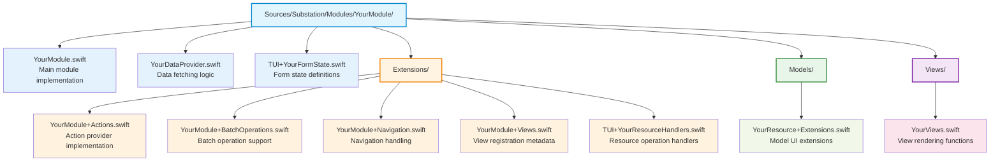

# OpenStack Module Development Guide

## Introduction

This guide provides comprehensive instructions for developing new OpenStack modules in the Substation project. Modules in Substation are self-contained units that provide functionality for specific OpenStack services (e.g., Nova, Neutron, Barbican).

### Prerequisites

Before developing a module, ensure you understand:
- Swift 6.1 programming fundamentals
- OpenStack service APIs and concepts
- SwiftNCurses for Terminal UI development
- The Substation project structure and conventions

### Module Architecture Overview

Each module implements the `OpenStackModule` protocol and typically consists of:
- Main module class implementing core functionality
- DataProvider for API data fetching
- Views for UI rendering
- Form handlers for user input
- Extensions for navigation, actions, and batch operations
- Model extensions for UI formatting

## Module Structure

A typical module directory layout:



## Step-by-Step Guide

### Step 1: Create the Module Directory

Create your module directory structure:

```bash
mkdir -p Sources/Substation/Modules/YourModule/{Extensions,Models,Views}
```

### Step 2: Implement the Module Class

Create the main module file `YourModule.swift`:

```swift
// Sources/Substation/Modules/YourModule/YourModule.swift
import Foundation
import OSClient
import SwiftNCurses

/// YourModule implementation for OpenStack service management
///
/// This module provides comprehensive resource management capabilities including:
/// - Resource listing and browsing
/// - Detailed resource inspection
/// - Resource creation and modification
/// - Batch operations support
@MainActor
final class YourModule: OpenStackModule {
    // MARK: - OpenStackModule Protocol Properties

    /// Unique identifier for the module
    let identifier: String = "yourmodule"

    /// Display name shown in the UI
    let displayName: String = "Your Service Name"

    /// Semantic version for compatibility tracking
    let version: String = "1.0.0"

    /// Module dependencies (empty if none)
    let dependencies: [String] = []

    /// View modes handled by this module
    var handledViewModes: Set<ViewMode> {
        return [.yourResourceList, .yourResourceDetail, .yourResourceCreate]
    }

    // MARK: - Internal Properties

    /// Weak reference to TUI to prevent retain cycles
    internal weak var tui: TUI?

    /// Form state container for this module
    internal var formState = YourFormState()

    /// Module health tracking
    private var lastHealthCheck: Date?
    private var healthErrors: [String] = []

    // MARK: - Initialization

    /// Initialize the module with TUI context
    required init(tui: TUI) {
        self.tui = tui
        Logger.shared.logInfo("YourModule initialized", context: [
            "version": version,
            "identifier": identifier
        ])
    }

    // MARK: - Configuration

    /// Configure the module after initialization
    func configure() async throws {
        guard let tuiInstance = tui else {
            throw ModuleError.invalidState("TUI reference is nil during configuration")
        }

        Logger.shared.logInfo("YourModule configuration started", context: [:])

        // Register as batch operation provider (if applicable)
        BatchOperationRegistry.shared.register(self)

        // Register as action provider
        ActionProviderRegistry.shared.register(
            self,
            listViewMode: .yourResourceList,
            detailViewMode: .yourResourceDetail
        )

        // Register data provider
        let dataProvider = YourDataProvider(module: self, tui: tuiInstance)
        DataProviderRegistry.shared.register(dataProvider, from: identifier)

        // Register enhanced views with metadata
        let viewMetadata = registerViewsEnhanced()
        ViewRegistry.shared.register(metadataList: viewMetadata)

        Logger.shared.logInfo("YourModule configuration completed", context: [:])
        lastHealthCheck = Date()
    }

    // MARK: - View Registration

    func registerViews() -> [ModuleViewRegistration] {
        guard let tui = tui else {
            Logger.shared.logError("Cannot register views - TUI reference is nil", context: [:])
            return []
        }

        var registrations: [ModuleViewRegistration] = []

        // Register resource list view
        registrations.append(ModuleViewRegistration(
            viewMode: .yourResourceList,
            title: "Your Resources",
            renderHandler: { [weak tui] screen, startRow, startCol, width, height in
                guard let tui = tui else { return }

                await YourViews.drawResourceList(
                    screen: screen,
                    startRow: startRow,
                    startCol: startCol,
                    width: width,
                    height: height,
                    resources: tui.cacheManager.cachedYourResources,
                    searchQuery: tui.searchQuery,
                    scrollOffset: tui.viewCoordinator.scrollOffset,
                    selectedIndex: tui.viewCoordinator.selectedIndex,
                    multiSelectMode: tui.selectionManager.multiSelectMode,
                    selectedItems: tui.selectionManager.multiSelectedResourceIDs
                )
            },
            inputHandler: nil, // Use default input handling
            category: .management // Choose appropriate category
        ))

        return registrations
    }

    // MARK: - Form Handler Registration

    func registerFormHandlers() -> [ModuleFormHandlerRegistration] {
        guard let tui = tui else { return [] }

        var handlers: [ModuleFormHandlerRegistration] = []

        // Register create form handler
        handlers.append(ModuleFormHandlerRegistration(
            viewMode: .yourResourceCreate,
            handler: { [weak tui] ch, screen in
                guard let tui = tui else { return }
                await tui.inputHandler.handleInput(ch, screen: screen)
            },
            formValidation: { [weak tui] in
                guard let tui = tui else { return false }
                return tui.yourResourceCreateForm.validate().isEmpty
            }
        ))

        return handlers
    }

    // MARK: - Data Refresh Registration

    func registerDataRefreshHandlers() -> [ModuleDataRefreshRegistration] {
        guard let tui = tui else { return [] }

        var handlers: [ModuleDataRefreshRegistration] = []

        handlers.append(ModuleDataRefreshRegistration(
            identifier: "yourmodule.resources",
            refreshHandler: { [weak tui] in
                guard let tui = tui else { return }
                await tui.dataManager.refreshAllData()
            },
            cacheKey: "yourresources",
            refreshInterval: 60.0 // Refresh every 60 seconds
        ))

        return handlers
    }

    // MARK: - Cleanup

    func cleanup() async {
        healthErrors.removeAll()
        lastHealthCheck = nil
    }

    // MARK: - Health Check

    func healthCheck() async -> ModuleHealthStatus {
        var errors: [String] = []
        var metrics: [String: Any] = [:]

        guard let tui = tui else {
            errors.append("TUI reference is nil")
            return ModuleHealthStatus(
                isHealthy: false,
                lastCheck: Date(),
                errors: errors,
                metrics: metrics
            )
        }

        // Add module-specific health checks
        metrics["resourceCount"] = tui.cacheManager.cachedYourResources.count

        lastHealthCheck = Date()
        healthErrors = errors

        return ModuleHealthStatus(
            isHealthy: errors.isEmpty,
            lastCheck: lastHealthCheck!,
            errors: errors,
            metrics: metrics
        )
    }
}
```

### Step 3: Create the DataProvider

Implement data fetching logic in `YourDataProvider.swift`:

```swift
// Sources/Substation/Modules/YourModule/YourDataProvider.swift
import Foundation
import OSClient

/// Data provider implementation for YourModule
@MainActor
final class YourDataProvider: DataProvider {
    // MARK: - Properties

    private weak var module: YourModule?
    private weak var tui: TUI?
    private(set) var lastRefreshTime: Date?

    // MARK: - DataProvider Protocol

    let resourceType: String = "yourresources"

    var currentItemCount: Int {
        return tui?.cacheManager.cachedYourResources.count ?? 0
    }

    var supportsPagination: Bool {
        return true
    }

    // MARK: - Initialization

    init(module: YourModule, tui: TUI) {
        self.module = module
        self.tui = tui
    }

    // MARK: - Data Fetching

    func fetchData(priority: DataFetchPriority, forceRefresh: Bool) async -> DataFetchResult {
        guard let tui = tui else {
            return DataFetchResult(
                itemCount: 0,
                duration: 0,
                error: ModuleError.invalidState("TUI reference is nil")
            )
        }

        let startTime = Date()

        do {
            Logger.shared.logDebug("YourDataProvider - Fetching resources", context: [
                "priority": priority.rawValue,
                "forceRefresh": forceRefresh
            ])

            // Determine timeout based on priority
            let timeoutSeconds = timeoutForPriority(priority)

            // Fetch resources with timeout
            let resources: [YourResource]
            if timeoutSeconds > 0 {
                resources = try await withTimeout(seconds: timeoutSeconds) {
                    try await tui.client.yourService.listResources()
                }
            } else {
                resources = try await tui.client.yourService.listResources()
            }

            // Update cache
            await tui.cacheManager.update(yourResources: resources)

            lastRefreshTime = Date()
            let duration = Date().timeIntervalSince(startTime)

            Logger.shared.logInfo("YourDataProvider - Fetch completed", context: [
                "count": resources.count,
                "duration": String(format: "%.2f", duration)
            ])

            return DataFetchResult(
                itemCount: resources.count,
                duration: duration
            )

        } catch {
            Logger.shared.logError("YourDataProvider - Fetch failed", context: [
                "error": String(describing: error)
            ])

            return DataFetchResult(
                itemCount: currentItemCount,
                duration: Date().timeIntervalSince(startTime),
                fromCache: true,
                error: error
            )
        }
    }

    func clearCache() async {
        guard let tui = tui else { return }
        await tui.cacheManager.clearYourResources()
        lastRefreshTime = nil
    }

    private func timeoutForPriority(_ priority: DataFetchPriority) -> Double {
        switch priority {
        case .critical: return 5.0
        case .secondary: return 10.0
        case .background: return 30.0
        case .onDemand: return 15.0
        case .fast: return 3.0
        }
    }
}
```

### Step 4: Build Views

Create view rendering functions in `Views/YourViews.swift`:

```swift
// Sources/Substation/Modules/YourModule/Views/YourViews.swift
import Foundation
import OSClient
import SwiftNCurses

/// View rendering functions for YourModule resources
@MainActor
struct YourViews {

    /// Draw the resource list view
    static func drawResourceList(
        screen: OpaquePointer?,
        startRow: Int32,
        startCol: Int32,
        width: Int32,
        height: Int32,
        resources: [YourResource],
        searchQuery: String?,
        scrollOffset: Int,
        selectedIndex: Int,
        multiSelectMode: Bool = false,
        selectedItems: Set<String> = []
    ) async {
        // Filter resources based on search query
        let filteredResources = filterResources(resources, searchQuery: searchQuery)

        // Calculate visible range with scrolling
        let visibleCount = Int(height) - 2 // Account for header
        let startIndex = scrollOffset
        let endIndex = min(startIndex + visibleCount, filteredResources.count)

        // Draw header
        var currentRow = startRow
        Screen.move(to: (currentRow, startCol))
        Screen.addString("NAME", withAttributes: [.bold])
        Screen.move(to: (currentRow, startCol + 40))
        Screen.addString("STATUS", withAttributes: [.bold])
        Screen.move(to: (currentRow, startCol + 55))
        Screen.addString("CREATED", withAttributes: [.bold])

        currentRow += 1

        // Draw separator line
        Screen.move(to: (currentRow, startCol))
        Screen.addString(String(repeating: "-", count: Int(width)))
        currentRow += 1

        // Draw resources
        for index in startIndex..<endIndex {
            let resource = filteredResources[index]
            let isSelected = index == selectedIndex
            let isMultiSelected = selectedItems.contains(resource.id)

            // Determine attributes
            var attributes: [Attribute] = []
            if isSelected {
                attributes.append(.reverse)
            }
            if isMultiSelected {
                attributes.append(.bold)
            }

            // Draw row
            Screen.move(to: (currentRow, startCol))

            // Multi-select indicator
            if multiSelectMode {
                Screen.addString(isMultiSelected ? "[X] " : "[ ] ")
            }

            // Resource name
            let name = String(resource.name.prefix(35))
            Screen.addString(name, withAttributes: attributes)

            // Status
            Screen.move(to: (currentRow, startCol + 40))
            let statusColor = colorForStatus(resource.status)
            Screen.addString(resource.status, withColor: statusColor)

            // Created date
            Screen.move(to: (currentRow, startCol + 55))
            let dateStr = formatDate(resource.createdAt)
            Screen.addString(dateStr, withAttributes: attributes)

            currentRow += 1
        }
    }

    /// Draw detailed view of a resource
    static func drawResourceDetail(
        screen: OpaquePointer?,
        startRow: Int32,
        startCol: Int32,
        width: Int32,
        height: Int32,
        resource: YourResource,
        scrollOffset: Int
    ) async {
        var currentRow = startRow - Int32(scrollOffset)

        // Title
        Screen.move(to: (currentRow, startCol))
        Screen.addString("Resource Details", withAttributes: [.bold, .underline])
        currentRow += 2

        // Resource properties
        drawDetailRow(&currentRow, startCol: startCol, label: "Name:", value: resource.name)
        drawDetailRow(&currentRow, startCol: startCol, label: "ID:", value: resource.id)
        drawDetailRow(&currentRow, startCol: startCol, label: "Status:", value: resource.status)
        drawDetailRow(&currentRow, startCol: startCol, label: "Created:", value: formatDate(resource.createdAt))

        // Add more resource-specific details
    }

    // MARK: - Helper Functions

    private static func filterResources(_ resources: [YourResource], searchQuery: String?) -> [YourResource] {
        guard let query = searchQuery, !query.isEmpty else {
            return resources
        }

        let lowercasedQuery = query.lowercased()
        return resources.filter { resource in
            resource.name.lowercased().contains(lowercasedQuery) ||
            resource.id.lowercased().contains(lowercasedQuery)
        }
    }

    private static func colorForStatus(_ status: String) -> Color {
        switch status.lowercased() {
        case "active", "available":
            return .green
        case "error", "failed":
            return .red
        case "building", "creating":
            return .yellow
        default:
            return .white
        }
    }

    private static func formatDate(_ date: Date?) -> String {
        guard let date = date else { return "N/A" }
        return DateFormatter.openStackFormatter.string(from: date)
    }

    private static func drawDetailRow(_ row: inout Int32, startCol: Int32, label: String, value: String) {
        Screen.move(to: (row, startCol))
        Screen.addString(label, withAttributes: [.bold])
        Screen.move(to: (row, startCol + 20))
        Screen.addString(value)
        row += 1
    }
}
```

### Step 5: Implement Form Handlers

Create form state and handlers in `TUI+YourFormState.swift`:

```swift
// Sources/Substation/Modules/YourModule/TUI+YourFormState.swift
import Foundation

/// Form state container for YourModule
@MainActor
struct YourFormState {
    /// Create resource form state
    var createResourceFormState = FormBuilderState()

    /// Edit resource form state
    var editResourceFormState = FormBuilderState()

    /// Reset all form states
    mutating func resetAll() {
        createResourceFormState = FormBuilderState()
        editResourceFormState = FormBuilderState()
    }
}

// Extension for TUI to include module form state
extension TUI {
    /// Access YourModule form state
    var yourModuleFormState: YourFormState {
        get {
            if let module = ModuleRegistry.shared.module(for: "yourmodule") as? YourModule {
                return module.formState
            }
            return YourFormState()
        }
        set {
            if let module = ModuleRegistry.shared.module(for: "yourmodule") as? YourModule {
                module.formState = newValue
            }
        }
    }
}
```

### Step 6: Add Batch Operations (Optional)

If your module supports batch operations, extend it in `Extensions/YourModule+BatchOperations.swift`:

```swift
// Sources/Substation/Modules/YourModule/Extensions/YourModule+BatchOperations.swift
import Foundation
import OSClient

/// Batch operation support for YourModule
extension YourModule: BatchOperationProvider {

    var supportedBatchOperationTypes: Set<String> {
        return ["delete", "update"]
    }

    func executeBatchDelete(
        resourceIDs: [String],
        client: OSClient
    ) async -> [BatchOperationResult] {
        var results: [BatchOperationResult] = []

        for id in resourceIDs {
            do {
                try await client.yourService.deleteResource(id: id)
                results.append(BatchOperationResult(
                    resourceID: id,
                    success: true,
                    message: "Resource deleted successfully"
                ))
            } catch {
                results.append(BatchOperationResult(
                    resourceID: id,
                    success: false,
                    message: "Failed to delete: \(error.localizedDescription)",
                    error: error
                ))
            }
        }

        return results
    }

    func executeBatchOperation(
        operationType: String,
        resourceIDs: [String],
        parameters: [String: Any]?,
        client: OSClient
    ) async -> [BatchOperationResult] {
        switch operationType {
        case "delete":
            return await executeBatchDelete(resourceIDs: resourceIDs, client: client)
        case "update":
            return await executeBatchUpdate(resourceIDs: resourceIDs, parameters: parameters, client: client)
        default:
            return resourceIDs.map { id in
                BatchOperationResult(
                    resourceID: id,
                    success: false,
                    message: "Unsupported operation: \(operationType)"
                )
            }
        }
    }

    private func executeBatchUpdate(
        resourceIDs: [String],
        parameters: [String: Any]?,
        client: OSClient
    ) async -> [BatchOperationResult] {
        // Implement batch update logic
        var results: [BatchOperationResult] = []

        for id in resourceIDs {
            // Update logic here
            results.append(BatchOperationResult(
                resourceID: id,
                success: true,
                message: "Resource updated"
            ))
        }

        return results
    }
}
```

### Step 7: Register the Module

Add your module to the module registry loading in `ModuleRegistry.swift`:

```swift
// In ModuleRegistry.swift loadCoreModules() method:

// Add to appropriate phase based on dependencies
if enabledModules.contains("yourmodule") {
    let module = YourModule(tui: tui)
    try await register(module)
}
```

Also add your module identifier to the feature flags:

```swift
// In FeatureFlags.swift:
static var enabledModules: Set<String> {
    // Add "yourmodule" to the set
}
```

## Protocol Requirements

### OpenStackModule Protocol

All modules must implement these required methods:

```swift
protocol OpenStackModule {
    /// Unique identifier (e.g., "servers", "networks")
    var identifier: String { get }

    /// Display name for UI (e.g., "Servers (Nova)")
    var displayName: String { get }

    /// Semantic version string
    var version: String { get }

    /// Array of module identifiers this module depends on
    var dependencies: [String] { get }

    /// Set of ViewMode cases handled by this module
    var handledViewModes: Set<ViewMode> { get }

    /// Initialize with TUI context
    init(tui: TUI)

    /// Configure module after initialization
    func configure() async throws

    /// Register views with TUI system
    func registerViews() -> [ModuleViewRegistration]

    /// Register form handlers
    func registerFormHandlers() -> [ModuleFormHandlerRegistration]

    /// Register data refresh handlers
    func registerDataRefreshHandlers() -> [ModuleDataRefreshRegistration]

    /// Cleanup when module is unloaded
    func cleanup() async

    /// Health check for monitoring
    func healthCheck() async -> ModuleHealthStatus
}
```

### DataProvider Protocol

Data providers must implement:

```swift
protocol DataProvider {
    /// Resource type identifier
    var resourceType: String { get }

    /// Fetch data for this resource type
    func fetchData(priority: DataFetchPriority, forceRefresh: Bool) async -> DataFetchResult

    /// Clear cached data
    func clearCache() async

    /// Last refresh timestamp
    var lastRefreshTime: Date? { get }

    /// Current item count
    var currentItemCount: Int { get }
}
```

## Best Practices

### Performance Optimization

1. **Use Weak References**: Always use weak references to TUI to prevent retain cycles
2. **Implement Caching**: Use the CacheManager for storing fetched data
3. **Timeout Management**: Implement appropriate timeouts based on fetch priority
4. **Lazy Loading**: Load detailed data only when needed
5. **Virtual Scrolling**: Use VirtualScrollManager for large lists

### Error Handling

1. **Graceful Degradation**: Handle service unavailability gracefully
2. **User Feedback**: Provide clear error messages to users
3. **Logging**: Use Logger.shared for consistent logging
4. **Retry Logic**: Implement intelligent retry for transient failures

### Testing Your Module

1. **Unit Tests**: Test individual components in isolation
2. **Integration Tests**: Test module integration with TUI
3. **API Mocking**: Use mock clients for testing without real API calls
4. **Health Checks**: Verify health check implementation

### Code Organization

1. **Extension Files**: Separate concerns into extension files
2. **Protocol Conformance**: Group protocol implementations
3. **Documentation**: Use SwiftDoc comments for all public APIs
4. **Consistent Naming**: Follow project naming conventions

## Complete Example

Here's a minimal working module for a hypothetical DNS service:

```swift
// Sources/Substation/Modules/DNS/DNSModule.swift
import Foundation
import OSClient
import SwiftNCurses

@MainActor
final class DNSModule: OpenStackModule {
    let identifier: String = "dns"
    let displayName: String = "DNS (Designate)"
    let version: String = "1.0.0"
    let dependencies: [String] = []

    var handledViewModes: Set<ViewMode> {
        return [.dnszones, .dnszoneDetail]
    }

    internal weak var tui: TUI?
    internal var formState = DNSFormState()

    required init(tui: TUI) {
        self.tui = tui
    }

    func configure() async throws {
        guard let tuiInstance = tui else {
            throw ModuleError.invalidState("TUI reference is nil")
        }

        // Register data provider
        let dataProvider = DNSDataProvider(module: self, tui: tuiInstance)
        DataProviderRegistry.shared.register(dataProvider, from: identifier)

        // Register views
        let viewMetadata = registerViewsEnhanced()
        ViewRegistry.shared.register(metadataList: viewMetadata)
    }

    func registerViews() -> [ModuleViewRegistration] {
        guard let tui = tui else { return [] }

        return [
            ModuleViewRegistration(
                viewMode: .dnszones,
                title: "DNS Zones",
                renderHandler: { [weak tui] screen, startRow, startCol, width, height in
                    guard let tui = tui else { return }
                    await DNSViews.drawZoneList(
                        screen: screen,
                        startRow: startRow,
                        startCol: startCol,
                        width: width,
                        height: height,
                        zones: tui.cacheManager.cachedDNSZones,
                        selectedIndex: tui.viewCoordinator.selectedIndex
                    )
                },
                inputHandler: nil,
                category: .network
            )
        ]
    }

    func registerFormHandlers() -> [ModuleFormHandlerRegistration] {
        return []
    }

    func registerDataRefreshHandlers() -> [ModuleDataRefreshRegistration] {
        return []
    }

    func cleanup() async {
        // Cleanup logic
    }

    func healthCheck() async -> ModuleHealthStatus {
        return ModuleHealthStatus(
            isHealthy: true,
            lastCheck: Date(),
            errors: [],
            metrics: ["status": "operational"]
        )
    }
}
```

## Testing Your Module

### Manual Testing

1. Build the project:
   ```bash
   ~/.swiftly/bin/swift build 2>&1 | tee .build/build.log
   ```

2. Run the application:
   ```bash
   .build/debug/Substation
   ```

3. Navigate to your module's views and test:
   - List view rendering and navigation
   - Detail view information display
   - Form submission and validation
   - Batch operations (if implemented)
   - Error handling scenarios

### Automated Testing

Create test files in `Tests/SubstationTests/Modules/YourModule/`:

```swift
import XCTest
@testable import Substation

final class YourModuleTests: XCTestCase {
    func testModuleInitialization() async throws {
        let tui = MockTUI()
        let module = YourModule(tui: tui)

        XCTAssertEqual(module.identifier, "yourmodule")
        XCTAssertEqual(module.version, "1.0.0")
    }

    func testViewRegistration() async throws {
        let tui = MockTUI()
        let module = YourModule(tui: tui)

        let views = module.registerViews()
        XCTAssertFalse(views.isEmpty)
    }
}
```

## Troubleshooting

### Common Issues and Solutions

1. **Module Not Loading**
   - Verify module is added to `enabledModules` in FeatureFlags
   - Check dependencies are loaded first
   - Review logs for configuration errors

2. **Views Not Rendering**
   - Ensure view registration is successful
   - Verify ViewMode enum includes your cases
   - Check render handler implementation

3. **Data Not Fetching**
   - Verify DataProvider is registered correctly
   - Check API client implementation
   - Review timeout settings

4. **Form Validation Failing**
   - Ensure form state is properly initialized
   - Verify validation logic in form handler
   - Check UniversalFormInputHandler integration

5. **Batch Operations Not Working**
   - Confirm BatchOperationProvider conformance
   - Verify operation type registration
   - Check client permissions for operations

### Debug Logging

Enable debug logging to troubleshoot issues:

```swift
Logger.shared.logDebug("YourModule - Debug message", context: [
    "key": "value",
    "count": itemCount
])
```

### Performance Issues

If experiencing performance problems:

1. Profile data fetching with timestamps
2. Implement pagination for large datasets
3. Use caching effectively
4. Optimize view rendering logic
5. Consider background fetching for non-critical data

## Additional Resources

- Review existing modules for patterns:
  - `ServersModule` - Complex module with full features
  - `NetworksModule` - Medium complexity with dependencies
  - `BarbicanModule` - Simple module without dependencies

- Key files to reference:
  - `/Sources/Substation/Modules/Core/OpenStackModule.swift` - Protocol definition
  - `/Sources/Substation/Modules/Core/DataProvider.swift` - Data provider protocol
  - `/Sources/Substation/Framework/UniversalFormInputHandler.swift` - Form handling
  - `/Sources/Substation/Components/` - UI components to use

## Summary

Developing a new OpenStack module involves:

1. Creating the module structure
2. Implementing the OpenStackModule protocol
3. Creating a DataProvider for API integration
4. Building views for UI rendering
5. Implementing form handlers for user input
6. Adding optional features (batch operations, actions)
7. Registering the module with the system
8. Testing thoroughly

Follow the patterns established by existing modules, use the provided protocols and base classes, and ensure all code follows the project's Swift 6.1 conventions and ASCII-only requirement.