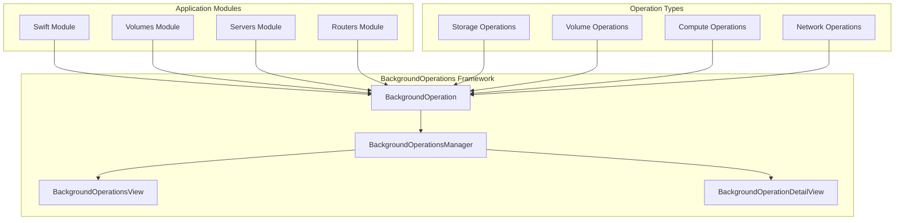
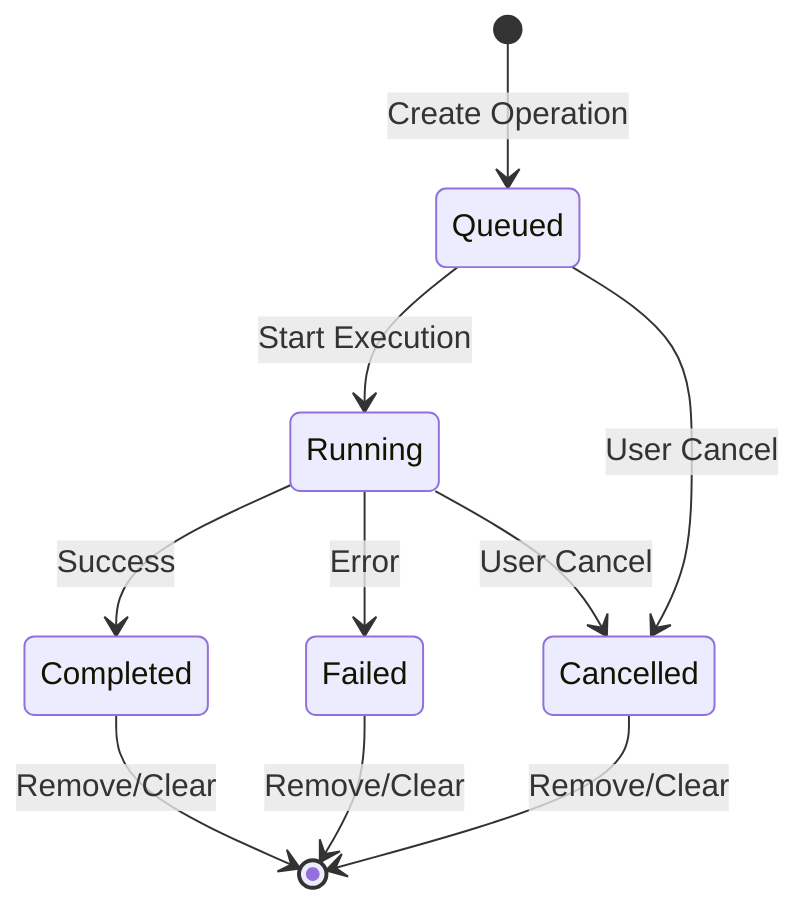
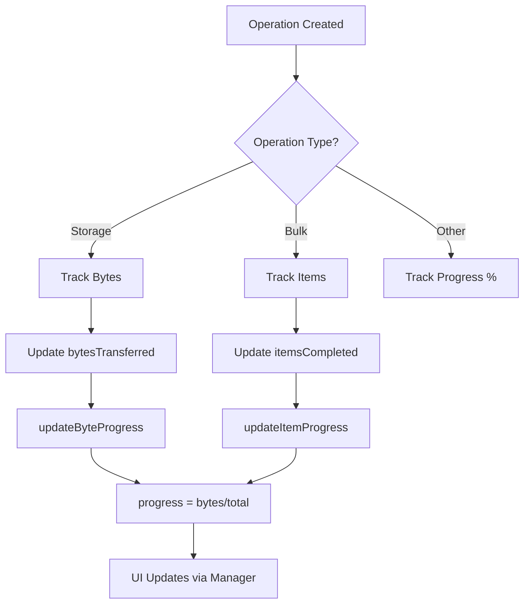

# Background Operations

## Overview

The BackgroundOperations framework provides a generic, centralized system for tracking and managing long-running asynchronous operations across the application. It supports various operation types including storage transfers, bulk operations, volume management, server operations, and more.

**Location:** `Sources/Substation/Framework/BackgroundOperations/`

## Architecture



## Files

| File | Description |
|------|-------------|
| `BackgroundOperation.swift` | Core operation model and manager |
| `BackgroundOperationsView.swift` | List view for displaying operations |
| `BackgroundOperationDetailView.swift` | Detailed view for a single operation |

## Core Types

### BackgroundOperationType

Defines the types of operations that can be tracked:

```swift
public enum BackgroundOperationType: Sendable {
    // Storage operations
    case upload
    case download
    case delete

    // Bulk operations
    case bulkDelete
    case bulkCreate
    case bulkUpdate

    // Volume operations
    case volumeCreate
    case volumeDelete
    case cascadingDelete
    case volumeAttach
    case volumeDetach

    // Server operations
    case serverCreate
    case serverDelete
    case serverReboot

    // Network operations
    case networkCreate
    case routerCreate
    case floatingIPAssign

    // Image operations
    case imageUpload
    case imageDownload

    // Generic
    case custom(String)
}
```

#### Operation Type Properties

| Property | Type | Description |
|----------|------|-------------|
| `displayName` | `String` | Human-readable name for the operation |
| `category` | `OperationCategory` | Category for grouping operations |
| `tracksBytes` | `Bool` | Whether operation tracks byte-level progress |
| `tracksItems` | `Bool` | Whether operation tracks item counts |

### OperationCategory

Categories for grouping and filtering operations:

```swift
public enum OperationCategory: String, CaseIterable, Sendable {
    case storage = "Storage"
    case compute = "Compute"
    case network = "Network"
    case volume = "Volume"
    case image = "Image"
    case general = "General"
}
```

### BackgroundOperationStatus

Status states for operations:

```swift
public enum BackgroundOperationStatus: Sendable {
    case queued      // Waiting to start
    case running     // Currently executing
    case completed   // Finished successfully
    case failed      // Encountered an error
    case cancelled   // Cancelled by user
}
```

#### Status Properties

| Property | Type | Description |
|----------|------|-------------|
| `displayName` | `String` | Human-readable status name |
| `isActive` | `Bool` | True if queued or running |
| `isSuccess` | `Bool` | True if completed |

## BackgroundOperation Class

The main model for tracking individual operations.

```swift
@MainActor
public final class BackgroundOperation: Identifiable {
    // Core Properties
    public let id: UUID
    public let type: BackgroundOperationType
    public let startTime: Date
    public var status: BackgroundOperationStatus
    public var progress: Double  // 0.0 to 1.0
    public var error: String?

    // Resource Information
    public let resourceName: String
    public let resourceType: String?
    public let resourceContext: String?

    // Byte Transfer Tracking
    public var bytesTransferred: Int64
    public var totalBytes: Int64

    // Item Tracking
    public var itemsTotal: Int
    public var itemsCompleted: Int
    public var itemsFailed: Int
    public var itemsSkipped: Int

    // File Tracking
    public var filesTotal: Int
    public var filesCompleted: Int
    public var filesSkipped: Int

    // Task Management
    public var task: Task<Void, Never>?
    public var secondaryTask: Task<Void, Never>?
}
```

### Initializers

#### Storage Operations

```swift
public init(
    type: BackgroundOperationType,
    resourceName: String,
    resourceContext: String? = nil,
    totalBytes: Int64 = 0
)
```

#### Bulk/Resource Operations

```swift
public init(
    type: BackgroundOperationType,
    resourceType: String,
    resourceName: String,
    itemsTotal: Int
)
```

### Computed Properties

| Property | Type | Description |
|----------|------|-------------|
| `displayName` | `String` | Combined resource type and name |
| `progressPercentage` | `Int` | Progress as 0-100 |
| `elapsedTime` | `TimeInterval` | Time since operation started |
| `formattedElapsedTime` | `String` | Elapsed time as "M:SS" |
| `transferRate` | `Double` | Transfer rate in MB/s |
| `formattedTransferRate` | `String` | Transfer rate as "X.XX MB/s" |
| `formattedBytesTransferred` | `String` | Bytes as "X.XX MB" |
| `formattedTotalBytes` | `String` | Total bytes as "X.XX MB" |
| `itemsSummary` | `String` | Items progress summary |

### State Management Methods

```swift
/// Cancel the operation and its tasks
public func cancel()

/// Mark operation as completed successfully
public func markCompleted()

/// Mark operation as failed with error message
public func markFailed(error: String)

/// Update progress based on items completed
public func updateItemProgress()

/// Update progress based on bytes transferred
public func updateByteProgress()
```

## BackgroundOperationsManager Class

Centralized manager for tracking all background operations.

```swift
@MainActor
public final class BackgroundOperationsManager {
    /// Add a new operation to be tracked
    public func addOperation(_ operation: BackgroundOperation)

    /// Remove an operation from tracking
    public func removeOperation(id: UUID)

    /// Get a specific operation by ID
    public func getOperation(id: UUID) -> BackgroundOperation?

    /// Get all operations sorted by start time (newest first)
    public func getAllOperations() -> [BackgroundOperation]

    /// Get only active (queued or running) operations
    public func getActiveOperations() -> [BackgroundOperation]

    /// Get only completed operations
    public func getCompletedOperations() -> [BackgroundOperation]

    /// Get operations filtered by category
    public func getOperations(category: OperationCategory) -> [BackgroundOperation]

    /// Remove all completed operations
    public func clearCompleted()

    /// Cancel all active operations
    public func cancelAll()
}
```

### Manager Properties

| Property | Type | Description |
|----------|------|-------------|
| `activeCount` | `Int` | Number of active operations |
| `completedCount` | `Int` | Number of completed operations |
| `totalCount` | `Int` | Total tracked operations |
| `failedCount` | `Int` | Number of failed operations |

## Operation Lifecycle



## Progress Tracking Flow



## Usage Examples

### Creating a Storage Upload Operation

```swift
// Create operation for file upload
let operation = BackgroundOperation(
    type: .upload,
    resourceName: "document.pdf",
    resourceContext: "my-container",
    totalBytes: fileSize
)

// Add to manager
tui.swiftBackgroundOps.addOperation(operation)
operation.status = .running

// Start background task
operation.task = Task { @MainActor in
    do {
        // Perform upload with progress updates
        for chunk in chunks {
            try await uploadChunk(chunk)
            operation.bytesTransferred += Int64(chunk.count)
            operation.updateByteProgress()
        }
        operation.markCompleted()
    } catch {
        operation.markFailed(error: error.localizedDescription)
    }
}
```

### Creating a Cascading Delete Operation

```swift
// Create operation for volume with snapshots
let operation = BackgroundOperation(
    type: .cascadingDelete,
    resourceType: "Volume",
    resourceName: volumeName,
    itemsTotal: snapshotCount + 1  // snapshots + volume
)

tui.swiftBackgroundOps.addOperation(operation)
operation.status = .running

// Start background task
operation.task = Task { @MainActor in
    // Delete snapshots
    for snapshot in snapshots {
        try await deleteSnapshot(snapshot)
        operation.itemsCompleted += 1
        operation.updateItemProgress()
    }

    // Delete volume
    try await deleteVolume(volume)
    operation.itemsCompleted += 1
    operation.markCompleted()
}
```

### Creating a Bulk Delete Operation

```swift
let operation = BackgroundOperation(
    type: .bulkDelete,
    resourceType: "Servers",
    resourceName: "Bulk Delete",
    itemsTotal: selectedServers.count
)

tui.swiftBackgroundOps.addOperation(operation)
operation.status = .running

operation.task = Task { @MainActor in
    for server in selectedServers {
        do {
            try await deleteServer(server)
            operation.itemsCompleted += 1
        } catch {
            operation.itemsFailed += 1
        }
        operation.updateItemProgress()
    }

    if operation.itemsFailed > 0 {
        operation.markFailed(error: "\(operation.itemsFailed) items failed")
    } else {
        operation.markCompleted()
    }
}
```

### Querying Operations

```swift
// Get all active operations
let active = manager.getActiveOperations()

// Get operations by category
let volumeOps = manager.getOperations(category: .volume)

// Check for failures
if manager.failedCount > 0 {
    showFailureNotification()
}

// Clear completed operations
manager.clearCompleted()
```

## Views

### BackgroundOperationsView

Displays a list of all background operations with columns for:

- Type
- Status (color-coded)
- Resource name
- Context
- Progress
- Size/Failed count
- Transfer rate
- Elapsed time

### BackgroundOperationDetailView

Displays detailed information about a single operation including:

- Basic Information (ID, Type, Category, Status)
- Resource Information (Name, Type, Context)
- Progress Information (percentage, bytes/items, rate)
- Timing Information (start time, elapsed, duration)
- Error Information (if failed)

## Backwards Compatibility

Type aliases are provided for backwards compatibility with existing code:

```swift
public typealias SwiftBackgroundOperation = BackgroundOperation
public typealias SwiftBackgroundOperationsManager = BackgroundOperationsManager
```

Legacy convenience initializers and properties are also available in `Sources/Substation/Modules/Swift/Models/SwiftBackgroundOperation.swift`.

## Best Practices

1. **Always set status to `.running`** after adding the operation to the manager
2. **Store the task reference** in `operation.task` for cancellation support
3. **Update progress incrementally** during long operations for responsive UI
4. **Use appropriate operation types** to enable correct progress tracking
5. **Call `markCompleted()` or `markFailed()`** when operation finishes
6. **Use `resourceType`** for bulk operations to provide context
7. **Handle cancellation** by checking `Task.isCancelled` in long loops

## Integration with TUI

The BackgroundOperationsManager is accessed through TUI:

```swift
// Access the manager
tui.swiftBackgroundOps.addOperation(operation)

// Get operations for display
let operations = tui.swiftBackgroundOps.getAllOperations()
```

## Related Documentation

- [Refresh Manager](./refresh-manager.md)
- [Cache Manager](./cache-manager.md)
- [View System](./view-system.md)
- [Module System](./module-system.md)
