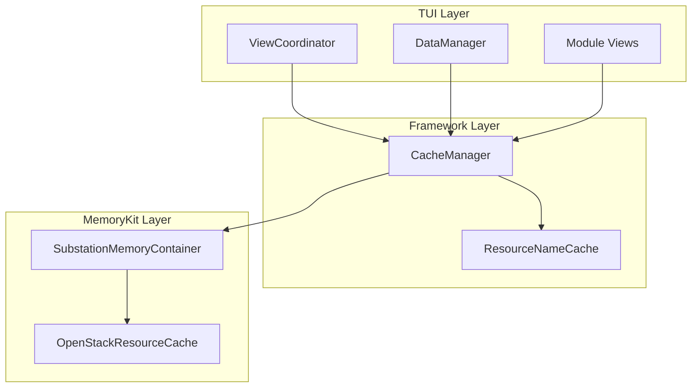
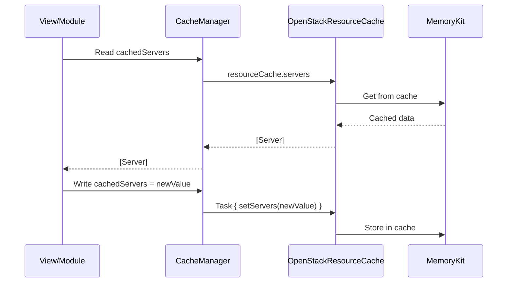
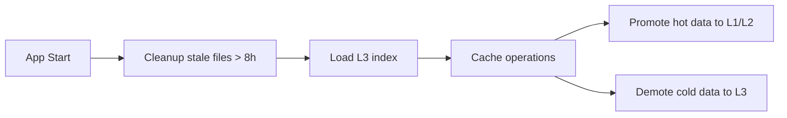

# Cache Manager

## Overview

The CacheManager provides centralized resource caching for OpenStack resources, backed by the MemoryKit framework. It serves as the interface layer between the TUI and the underlying MemoryKit-backed storage, providing computed property accessors and cache invalidation for all resource types.

**Location:** `Sources/Substation/Framework/CacheManager.swift`

## Architecture



## Class Definition

```swift
@MainActor
final class CacheManager {
    // Dependencies
    private let memoryContainer: SubstationMemoryContainer
    internal var resourceCache: OpenStackResourceCache
    internal let resourceNameCache: ResourceNameCache
    internal weak var swiftNavState: SwiftNavigationState?

    // Initialization
    init(memoryContainer: SubstationMemoryContainer, resourceNameCache: ResourceNameCache)
}
```

## Cached Resource Types

### Compute Resources

| Property | Type | Service |
|----------|------|---------|
| `cachedServers` | `[Server]` | Nova |
| `cachedServerGroups` | `[ServerGroup]` | Nova |
| `cachedFlavors` | `[Flavor]` | Nova |
| `cachedKeyPairs` | `[KeyPair]` | Nova |
| `cachedAvailabilityZones` | `[String]` | Nova |
| `cachedHypervisors` | `[Hypervisor]` | Nova |
| `cachedComputeServices` | `[ComputeService]` | Nova |

### Network Resources

| Property | Type | Service |
|----------|------|---------|
| `cachedNetworks` | `[Network]` | Neutron |
| `cachedPorts` | `[Port]` | Neutron |
| `cachedRouters` | `[Router]` | Neutron |
| `cachedFloatingIPs` | `[FloatingIP]` | Neutron |
| `cachedSubnets` | `[Subnet]` | Neutron |
| `cachedSecurityGroups` | `[SecurityGroup]` | Neutron |
| `cachedQoSPolicies` | `[QoSPolicy]` | Neutron |

### Block Storage Resources

| Property | Type | Service |
|----------|------|---------|
| `cachedVolumes` | `[Volume]` | Cinder |
| `cachedVolumeTypes` | `[VolumeType]` | Cinder |
| `cachedVolumeSnapshots` | `[VolumeSnapshot]` | Cinder |
| `cachedVolumeBackups` | `[VolumeBackup]` | Cinder |

### Image Resources

| Property | Type | Service |
|----------|------|---------|
| `cachedImages` | `[Image]` | Glance |

### Key Management Resources

| Property | Type | Service |
|----------|------|---------|
| `cachedSecrets` | `[Secret]` | Barbican |

### Container Infrastructure Resources

| Property | Type | Service |
|----------|------|---------|
| `cachedClusters` | `[Cluster]` | Magnum |
| `cachedClusterTemplates` | `[ClusterTemplate]` | Magnum |
| `cachedNodegroups` | `[Nodegroup]` | Magnum |

### Object Storage Resources

| Property | Type | Service |
|----------|------|---------|
| `cachedSwiftContainers` | `[SwiftContainer]` | Swift |
| `cachedSwiftObjects` | `[SwiftObject]?` | Swift |

### Quota Data

| Property | Type | Service |
|----------|------|---------|
| `cachedComputeQuotas` | `ComputeQuotaSet?` | Nova |
| `cachedNetworkQuotas` | `NetworkQuotaSet?` | Neutron |
| `cachedVolumeQuotas` | `VolumeQuotaSet?` | Cinder |
| `cachedComputeLimits` | `ComputeQuotaSet?` | Nova |

## Cache Flow



## Swift Object Storage Methods

The CacheManager provides specialized methods for Swift object storage due to its container-based structure:

### Container Cache Methods

```swift
/// Check if the container list cache is fresh
func isSwiftContainersCacheFresh(maxAge: TimeInterval = 30) -> Bool

/// Get the cache timestamp for the container list
func getSwiftContainersCacheTime() -> Date
```

### Object Cache Methods

```swift
/// Clear cached Swift objects for a specific container
func clearSwiftObjects(forContainer containerName: String)

/// Check if the cache for a container's objects is fresh
func isSwiftObjectsCacheFresh(forContainer containerName: String, maxAge: TimeInterval = 30) -> Bool

/// Get the cache timestamp for a container's objects
func getSwiftObjectsCacheTime(forContainer containerName: String) -> Date?

/// Add objects to the cache for a container (optimistic update)
func addSwiftObjects(_ objects: [SwiftObject], forContainer containerName: String) async

/// Remove objects from the cache for a container (optimistic update)
func removeSwiftObjects(withNames objectNames: Set<String>, forContainer containerName: String) async

/// Remove a single object from the cache for a container
func removeSwiftObject(withName objectName: String, forContainer containerName: String) async
```

## Cache Operations

### Clear All Caches

```swift
/// Clear all caches - resets all cached resources to empty states
func clearAllCaches() async
```

### Cache Statistics

```swift
/// Get cache statistics for monitoring and debugging
func getCacheStatistics() async -> OpenStackCacheStatistics
```

## Flavor Recommendations

The CacheManager also manages flavor recommendations for workload optimization:

```swift
/// Cached flavor recommendations for all workload types
var cachedFlavorRecommendations: [WorkloadType: [FlavorRecommendation]]

/// Timestamp of last recommendations refresh
var lastRecommendationsRefresh: Date
```

## Usage Examples

### Reading Cached Resources

```swift
// Access cached servers
let servers = cacheManager.cachedServers

// Access cached networks
let networks = cacheManager.cachedNetworks

// Check Swift container cache freshness
if cacheManager.isSwiftContainersCacheFresh(maxAge: 60) {
    // Use cached data
} else {
    // Refresh from API
}
```

### Writing to Cache

```swift
// Update cached servers
cacheManager.cachedServers = newServers

// Clear Swift objects after deletion
await cacheManager.removeSwiftObject(withName: "deleted-file.txt", forContainer: "my-container")
```

### Cache Statistics

```swift
let stats = await cacheManager.getCacheStatistics()
print("Total cached resources: \(stats.totalItems)")
```

## Thread Safety

The CacheManager is marked with `@MainActor` to ensure thread-safe access from the TUI. All write operations to the underlying cache are performed asynchronously using `Task` blocks to prevent blocking the main thread.

## L3 Disk Cache and Cloud-Specific Storage

The underlying MemoryKit multi-level cache stores persistent data on disk (L3 tier) in cloud-specific directories:

```
~/.config/substation/multi-level-cache/<cloudName>/
```

### Key Features

- **Cloud Isolation**: Each OpenStack cloud has its own cache directory, preventing data mixing between clouds
- **Consistent Filenames**: Cache files use hash-based naming (`cache_<hash>.dat`) for deterministic caching across restarts
- **Automatic Cleanup**: Stale cache files (older than 8 hours) are automatically removed at application startup

### Cache File Lifecycle



For detailed information about the multi-level cache implementation, see [MemoryKit API Reference](../api/memorykit.md#cloud-specific-caching).

## Dependencies

- **SubstationMemoryContainer**: Provides the MemoryKit integration
- **OpenStackResourceCache**: The underlying cache storage
- **ResourceNameCache**: Cache for resource display name lookups
- **SwiftNavigationState**: Reference for container-specific object caching

## Related Documentation

- [MemoryKit API Reference](../api/memorykit.md)
- [View Coordinator](./view-system.md)
- [Module System](./module-system.md)
