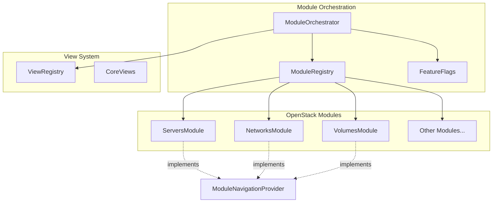
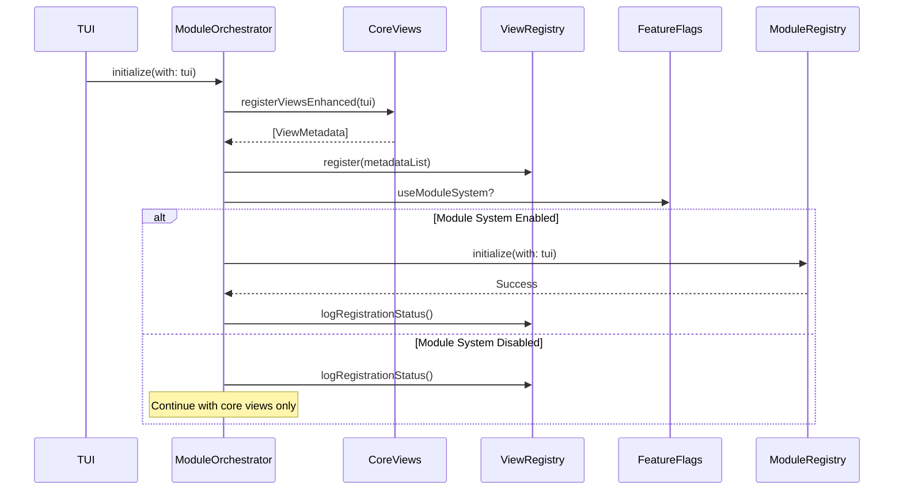
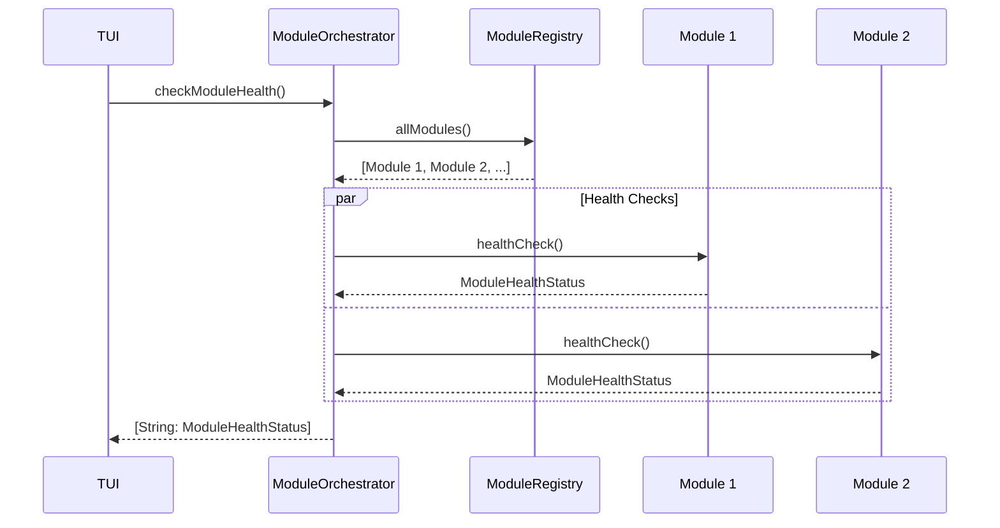
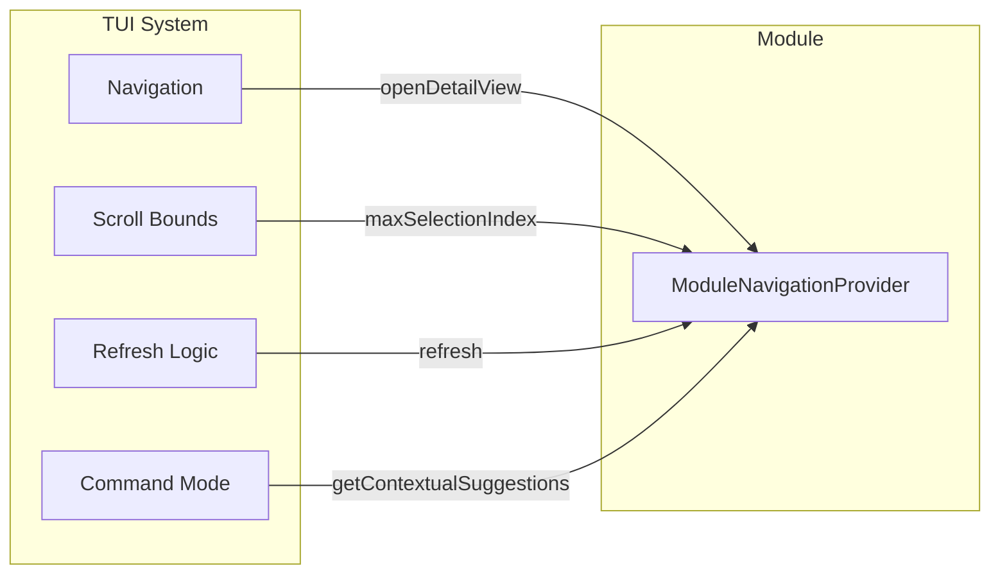
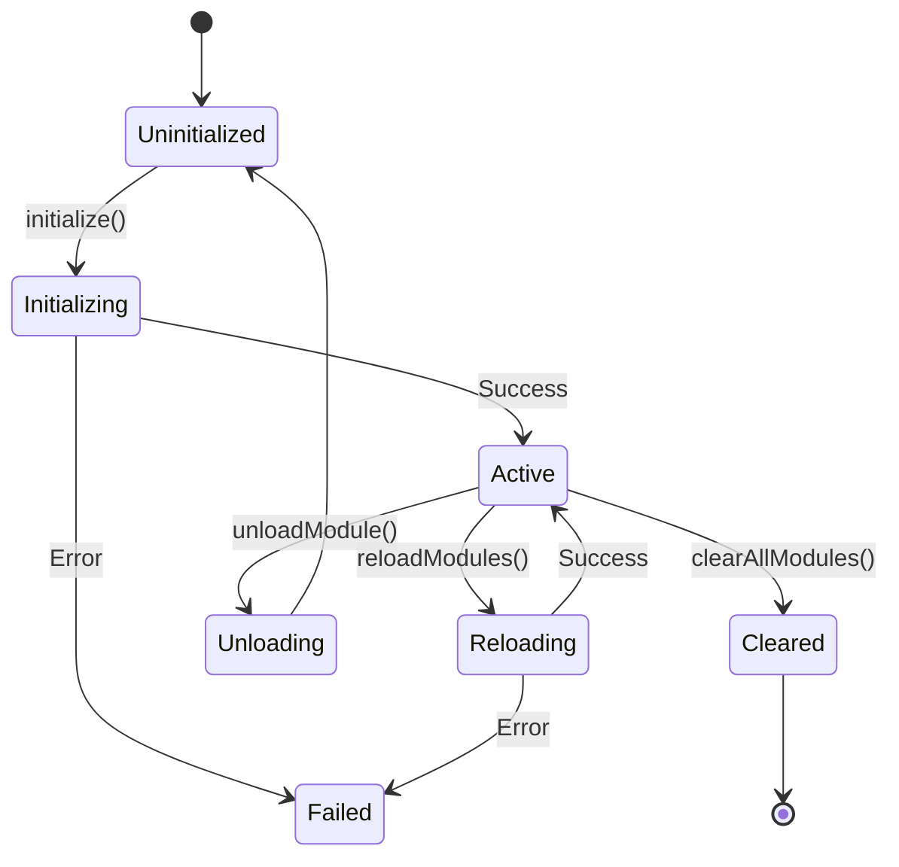

# Module System

## Overview

The Module System provides a modular architecture for organizing OpenStack service functionality in Substation. It consists of two main components:

- **ModuleOrchestrator**: Manages the module system lifecycle, including registration, initialization, and health checking
- **ModuleNavigationProvider**: Protocol that modules implement to provide navigation-related functionality

**Location:** `Sources/Substation/Framework/`

## Architecture



## ModuleOrchestrator

The ModuleOrchestrator manages the entire module system lifecycle.

### Class Definition

```swift
@MainActor
final class ModuleOrchestrator {
    /// The module registry (nil if module system failed to initialize)
    private(set) var moduleRegistry: ModuleRegistry?

    /// Whether the module system is enabled and loaded
    var isModuleSystemActive: Bool

    /// Get module count
    var moduleCount: Int
}
```

### Initialization

```swift
/// Initialize the module system with a TUI reference
/// - Parameter tui: The TUI instance to initialize with
/// - Throws: ModuleError if initialization fails
func initialize(with tui: TUI) async throws
```

The initialization process:



### Module Access Methods

```swift
/// Get all loaded modules
func allModules() -> [any OpenStackModule]

/// Get a specific module by identifier
func module(identifier: String) -> (any OpenStackModule)?
```

### Module Operations

```swift
/// Reload all modules
func reloadModules(with tui: TUI) async throws

/// Check module health for all loaded modules
func checkModuleHealth() async -> [String: ModuleHealthStatus]

/// Unload a specific module
func unloadModule(identifier: String) async

/// Clear all modules from the registry
func clearAllModules()
```

### Health Check Flow



## ModuleNavigationProvider

Protocol that modules implement to provide navigation-related functionality to the TUI system.

### Protocol Definition

```swift
@MainActor
protocol ModuleNavigationProvider {
    /// Number of items in the current view
    var itemCount: Int { get }

    /// Maximum selection index for bounds checking
    var maxSelectionIndex: Int { get }

    /// Refresh data for this module
    func refresh() async throws

    /// Get contextual command suggestions for the current view
    func getContextualSuggestions() -> [String]

    /// Open detail view for the currently selected resource
    func openDetailView(tui: TUI) -> Bool

    /// Ensure data is loaded for the current view
    func ensureDataLoaded(tui: TUI) async
}
```

### Protocol Purpose



### Default Implementations

The protocol provides default implementations for optional functionality:

```swift
extension ModuleNavigationProvider {
    /// Default: itemCount - 1
    var maxSelectionIndex: Int {
        return max(0, itemCount - 1)
    }

    /// Default: empty array (no suggestions)
    func getContextualSuggestions() -> [String] {
        return []
    }

    /// Default: false (not handled by module)
    func openDetailView(tui: TUI) -> Bool {
        return false
    }

    /// Default: no-op (no lazy loading)
    func ensureDataLoaded(tui: TUI) async {
        // Default: no lazy loading needed
    }
}
```

### Method Details

#### itemCount

Returns the total count of items currently displayed by the module. Used for scroll calculations and empty state detection.

#### maxSelectionIndex

Returns the maximum valid selection index for the current view. Typically `itemCount - 1`, but may differ for views with headers or non-selectable elements.

#### refresh()

Clears cached data and fetches fresh data from the server. Called when:
- User triggers manual refresh
- Automatic refresh interval expires

#### getContextualSuggestions()

Returns an array of command strings relevant to the current module state. Displayed in command mode to help users discover navigation options.

#### openDetailView(tui:)

Handles navigation to the detail view for the currently selected item. Returns `true` if the module handled the navigation, `false` to fall back to TUI's built-in navigation.

#### ensureDataLoaded(tui:)

Called when entering a view to perform lazy loading. Used by modules that only load data on first access (e.g., Barbican secrets, Swift objects).

## Module Lifecycle



## Usage Examples

### Initializing the Module System

```swift
let orchestrator = ModuleOrchestrator()
try await orchestrator.initialize(with: tui)

if orchestrator.isModuleSystemActive {
    print("Module system active with \(orchestrator.moduleCount) modules")
}
```

### Accessing Modules

```swift
// Get all modules
let modules = orchestrator.allModules()

// Get specific module
if let serversModule = orchestrator.module(identifier: "servers") {
    // Use the module
}
```

### Health Checking

```swift
let healthStatus = await orchestrator.checkModuleHealth()
for (moduleId, status) in healthStatus {
    print("\(moduleId): \(status)")
}
```

### Implementing ModuleNavigationProvider

```swift
extension ServersModule: ModuleNavigationProvider {
    var itemCount: Int {
        return servers.count
    }

    func refresh() async throws {
        servers = try await client.listServers()
    }

    func getContextualSuggestions() -> [String] {
        return ["servers", "server-create", "server-console"]
    }

    func openDetailView(tui: TUI) -> Bool {
        guard let selected = selectedServer else { return false }
        tui.viewCoordinator.selectedResource = selected
        tui.viewCoordinator.changeView(to: .serverDetail)
        return true
    }
}
```

## Feature Flags

The module system is controlled by `FeatureFlags.useModuleSystem`. When disabled:
- Core system views are still registered
- Module-specific views are not available
- `isModuleSystemActive` returns `false`

## Error Handling

Module initialization errors are logged but do not prevent the application from running. The system continues with core views only when module initialization fails.

## Related Documentation

- [View System](./view-system.md)
- [Registries](./registries.md)
- [Cache Manager](./cache-manager.md)
