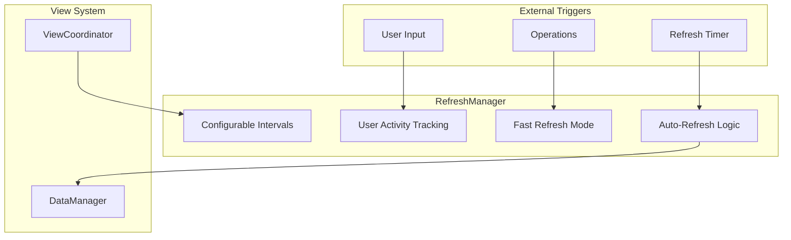
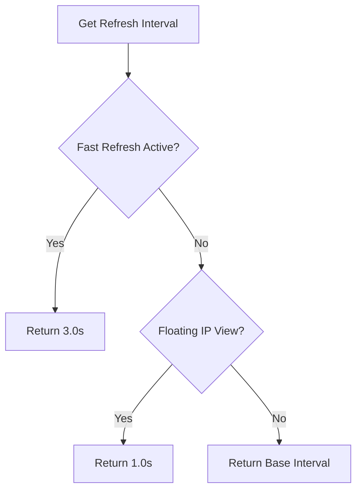
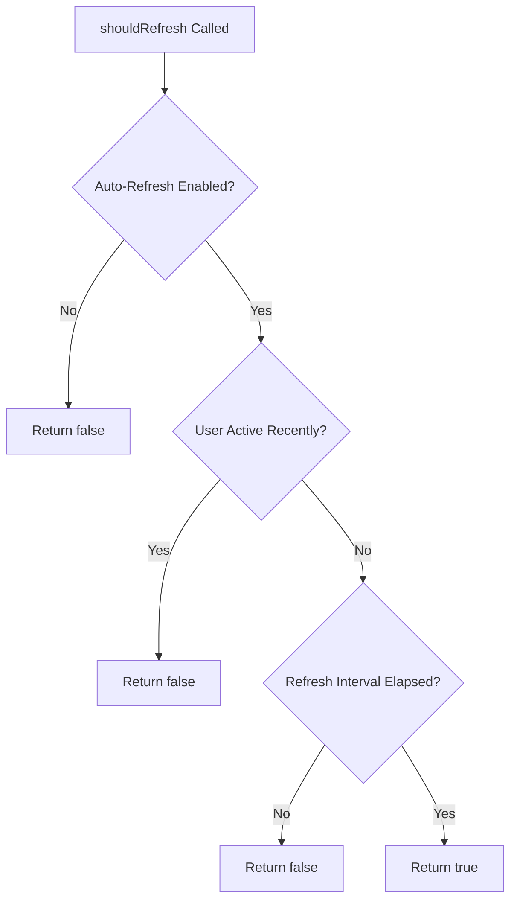
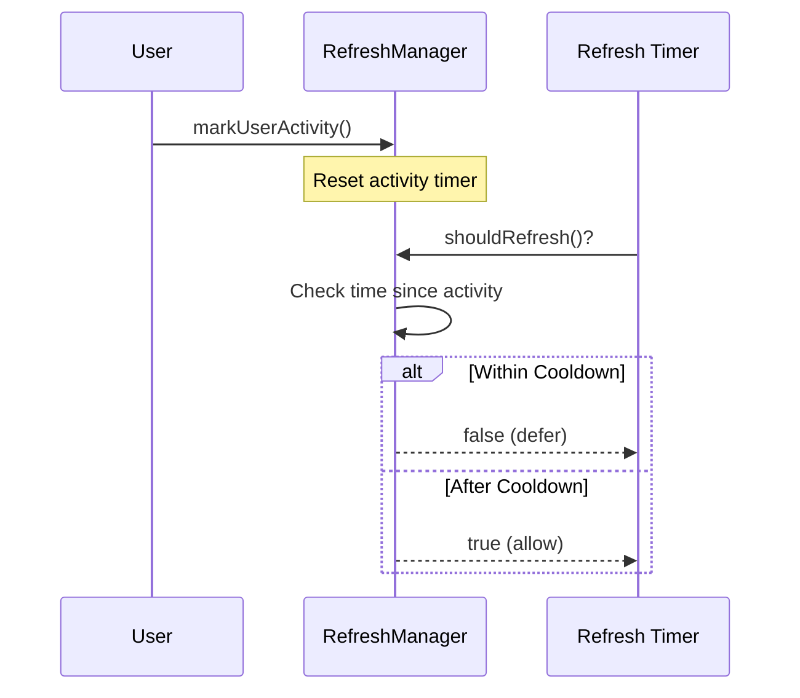
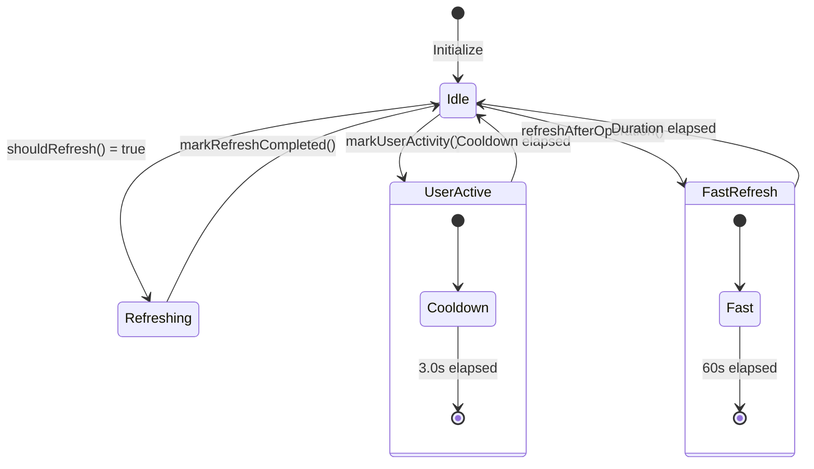

# Refresh Manager

## Overview

The RefreshManager handles intelligent auto-refresh timing and user activity tracking for the TUI. It provides a sophisticated refresh system that defers updates during user activity, enables fast refresh after operations, and supports view-specific refresh intervals.

**Location:** `Sources/Substation/Framework/RefreshManager.swift`

## Architecture



## Class Definition

```swift
@MainActor
final class RefreshManager {
    // Configuration
    var autoRefresh: Bool = true
    var baseRefreshInterval: TimeInterval

    // Timing State
    var lastRefresh: Date
    var lastUserActivityTime: Date

    // View State Reference
    var getCurrentView: (() -> ViewMode)?

    // Initialization
    init(baseRefreshInterval: TimeInterval = 10.0)
}
```

## Refresh Interval System

### Available Intervals

The RefreshManager supports cycling through predefined refresh intervals:

| Interval | Use Case |
|----------|----------|
| 3.0s | Fast refresh after operations |
| 5.0s | Quick updates |
| 7.0s | Moderate refresh |
| 10.0s | Default interval |
| 15.0s | Reduced refresh |
| 30.0s | Low refresh rate |

### View-Specific Intervals

Some views automatically use faster refresh intervals:

| View | Interval | Reason |
|------|----------|--------|
| Floating IPs | 1.0s | Real-time status monitoring |
| Default | Base interval | Configurable by user |

### Interval Priority



## Refresh Decision Flow



## User Activity Tracking

The RefreshManager tracks user activity to defer auto-refresh during interaction, preventing UI disruption.

### Activity Cooldown

- **Cooldown Period:** 3.0 seconds
- **Behavior:** Auto-refresh is deferred while user is active
- **Reset:** Timer resets on each user interaction



## Fast Refresh Mode

After operations (server start/stop, volume attach, etc.), fast refresh mode provides rapid updates to show state transitions.

### Fast Refresh Activation

```swift
/// Enable fast refresh for a duration after an operation
func enableFastRefresh(duration: TimeInterval = 60.0)

/// Trigger immediate refresh and enable fast mode
func refreshAfterOperation()
```

### Fast Refresh Timeline

```mermaid
gantt
    title Fast Refresh After Operation
    dateFormat X
    axisFormat %s

    section Refresh Rate
    Operation Triggered    :milestone, 0, 0
    Fast Refresh (3s)     :active, 0, 60
    Normal Refresh        :60, 120
```



## API Reference

### Configuration Properties

| Property | Type | Default | Description |
|----------|------|---------|-------------|
| `autoRefresh` | `Bool` | `true` | Enable/disable auto-refresh |
| `baseRefreshInterval` | `TimeInterval` | `10.0` | Base interval for refresh |

### Computed Properties

| Property | Type | Description |
|----------|------|-------------|
| `refreshInterval` | `TimeInterval` | Current effective interval |

### Methods

#### shouldRefresh()

```swift
/// Check if it's time to refresh
/// Returns false if:
/// - Auto-refresh is disabled
/// - User activity occurred within cooldown period
/// - Refresh interval has not elapsed
func shouldRefresh() -> Bool
```

#### markUserActivity()

```swift
/// Mark that user activity occurred
/// Resets the activity timer and defers auto-refresh
func markUserActivity()
```

#### markRefreshCompleted()

```swift
/// Mark that a refresh occurred
/// Updates the last refresh timestamp
func markRefreshCompleted()
```

#### cycleRefreshInterval()

```swift
/// Cycle through available refresh intervals
/// Returns a formatted string describing the new interval
func cycleRefreshInterval() -> String
```

#### enableFastRefresh(duration:)

```swift
/// Enable fast refresh for a duration after an operation
/// - Parameter duration: How long to use fast refresh (default 60s)
func enableFastRefresh(duration: TimeInterval = 60.0)
```

#### refreshAfterOperation()

```swift
/// Trigger immediate refresh after an operation
/// Forces immediate refresh check and enables fast refresh mode
func refreshAfterOperation()
```

#### toggleAutoRefresh()

```swift
/// Toggle auto-refresh on/off
/// Returns the new state of auto-refresh
func toggleAutoRefresh() -> Bool
```

#### Time Query Methods

```swift
/// Get time since last user activity
func timeSinceActivity() -> TimeInterval

/// Get time since last refresh
func timeSinceRefresh() -> TimeInterval

/// Check if user is currently active (within cooldown period)
func isUserActive() -> Bool
```

## Usage Examples

### Basic Usage

```swift
let refreshManager = RefreshManager(baseRefreshInterval: 10.0)

// In main loop
if refreshManager.shouldRefresh() {
    await dataManager.refreshData()
    refreshManager.markRefreshCompleted()
}
```

### Handling User Input

```swift
func handleKeyPress(_ key: Int32) {
    refreshManager.markUserActivity()
    // Process key...
}
```

### After Operations

```swift
func deleteServer(_ server: Server) async throws {
    try await client.deleteServer(server.id)
    refreshManager.refreshAfterOperation() // Enable fast refresh
}
```

### Cycling Intervals

```swift
func handleIntervalCycleKey() {
    let message = refreshManager.cycleRefreshInterval()
    statusMessage = message // e.g., "Auto-refresh: 15s"
}
```

### Toggling Auto-Refresh

```swift
func handleToggleAutoRefresh() {
    let isEnabled = refreshManager.toggleAutoRefresh()
    statusMessage = isEnabled ? "Auto-refresh enabled" : "Auto-refresh disabled"
}
```

## State Diagram



## Integration with TUI

The RefreshManager integrates with the TUI through a view callback:

```swift
refreshManager.getCurrentView = { [weak self] in
    return self?.viewCoordinator.currentView ?? .loading
}
```

This allows the RefreshManager to adjust intervals based on the current view.

## Best Practices

1. **Always mark user activity** when processing input
2. **Call refreshAfterOperation()** after state-changing operations
3. **Check shouldRefresh()** before triggering data fetches
4. **Use cycleRefreshInterval()** to let users adjust refresh rate

## Related Documentation

- [Cache Manager](./cache-manager.md)
- [Render Coordinator](./render-coordinator.md)
- [View System](./view-system.md)
