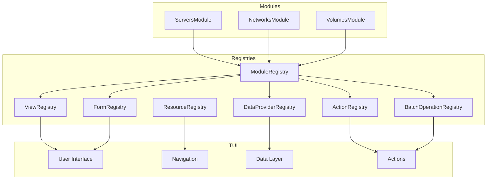
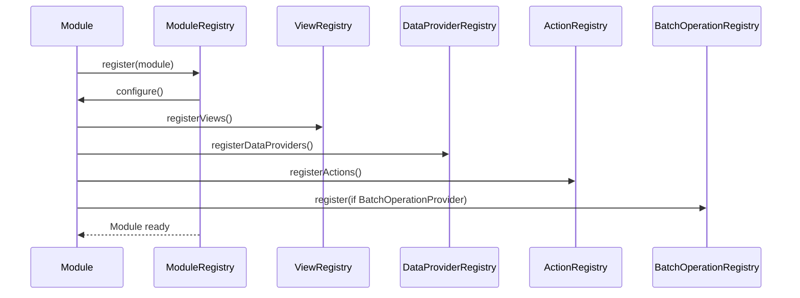
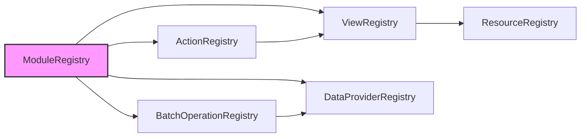

# Framework Registries Reference

## Overview

The Substation framework uses the Registry pattern to enable a modular, decentralized architecture. Registries act as central coordination points where modules register their capabilities, allowing the TUI to discover and utilize functionality dynamically without hardcoded dependencies.

### Purpose of the Registry Pattern

The registry pattern provides:
- **Decoupled Architecture**: Modules can be added or removed without modifying core code
- **Dynamic Discovery**: The TUI discovers available functionality at runtime
- **Centralized Access**: Single point of access for each type of functionality
- **Module Independence**: Modules don't need to know about each other

### Registry Lifecycle

1. **Initialization**: Registries are created as singletons at application startup
2. **Registration**: Modules register their components during module loading
3. **Discovery**: The TUI queries registries to find available functionality
4. **Execution**: The TUI invokes functionality through registry lookups
5. **Cleanup**: Registries can be cleared for testing or module unloading

## Architecture



## ModuleRegistry

### Purpose
Central registry for managing all loaded OpenStack modules. Controls module lifecycle, dependency resolution, and component integration.

### Key Features
- Module loading in dependency order
- Configuration management per module
- Hot-reload support for development
- Health check coordination

### Registration Process
```swift
// Module registers itself with dependencies
let module = ServersModule(tui: tui)
try await ModuleRegistry.shared.register(module)
```

### Module Integration Flow
1. Validate module dependencies
2. Load module configuration
3. Call module.configure()
4. Register module components with other registries
5. Track module for lifecycle management

### Usage Examples
```swift
// Get navigation provider for current view
if let provider = ModuleRegistry.shared.navigationProvider(for: .servers) {
    // Use provider for navigation
}

// Health check all modules
let healthStatus = await ModuleRegistry.shared.healthCheckAll()

// Hot reload a module
let result = await ModuleRegistry.shared.reloadModule("servers")
```

## ViewRegistry

### Purpose
Manages all view handlers and metadata, enabling dynamic view registration and discovery.

### View Metadata Structure
- **identifier**: Unique view ID
- **title**: Display title
- **category**: View category for organization
- **parentViewId**: Navigation hierarchy
- **supportsMultiSelect**: Bulk selection capability
- **isDetailView**: Whether this is a detail view

### Registration Process
```swift
// Register view with metadata
let metadata = ViewMetadata(
    identifier: ServersViewIdentifier(),
    title: "Servers",
    category: .compute,
    renderHandler: { screen, context in
        // Render implementation
    }
)
ViewRegistry.shared.register(metadata: metadata)
```

### Usage Examples
```swift
// Get metadata for a view
if let metadata = ViewRegistry.shared.metadata(forId: "servers") {
    // Use metadata for rendering
}

// Get views by category
let computeViews = ViewRegistry.shared.metadata(in: .compute)

// Check if view supports multi-select
let supportsMulti = ViewRegistry.shared.supportsMultiSelect(id: "servers")
```

## DataProviderRegistry

### Purpose
Coordinates data fetching across modules with caching, pagination, and phased loading support.

### Provider Protocol
Each provider implements:
- **resourceType**: Unique identifier for the data type
- **fetchData**: Async data fetching with priority support
- **clearCache**: Cache invalidation
- **supportsPagination**: Whether paginated fetching is supported
- **needsRefresh**: Staleness checking

### Phased Data Loading
The registry supports three phases for optimal performance:
1. **Critical** (Phase 1): Essential UI data (servers, networks, flavors)
2. **Secondary** (Phase 2): Important but not critical (volumes, subnets, keypairs)
3. **Expensive** (Phase 3): Background operations (ports, routers, quotas)

### Registration Process
```swift
// Module registers its data provider
let provider = ServersDataProvider()
DataProviderRegistry.shared.register(provider, from: "servers")
```

### Usage Examples
```swift
// Fetch data for a resource type
if let result = await DataProviderRegistry.shared.fetchData(
    for: "servers",
    priority: .critical,
    forceRefresh: false
) {
    // Process data
}

// Fetch multiple resources concurrently
let results = await DataProviderRegistry.shared.fetchMultiple(
    resourceTypes: ["servers", "networks", "volumes"],
    priority: .secondary
)

// Perform phased refresh
await DataProviderRegistry.shared.performPhasedRefresh()
```

## ActionRegistry

### Purpose
Manages keyboard shortcuts and actions across all views, enabling modules to register context-aware actions.

### Action Structure
- **identifier**: Unique action ID
- **title**: Display name
- **keybinding**: Optional keyboard shortcut
- **viewModes**: Views where action is available
- **handler**: Async execution handler
- **category**: Action category for organization
- **requiresConfirmation**: Safety flag

### Action Categories
- **General**: Common operations
- **Lifecycle**: Start, stop, restart
- **Network**: Network-related actions
- **Storage**: Volume and snapshot operations
- **Security**: Permission and access control
- **Management**: Administrative tasks

### Registration Process
```swift
// Register an action
let action = ModuleActionRegistration(
    identifier: "server.start",
    title: "Start Server",
    keybinding: "s",
    viewModes: [.servers],
    handler: { screen in
        // Start server implementation
    },
    category: .lifecycle
)
ActionRegistry.shared.register(action)
```

### Usage Examples
```swift
// Execute action by key in current view
let executed = await ActionRegistry.shared.execute(
    key: "s",
    in: .servers,
    screen: screen
)

// Get all actions for a view
let actions = ActionRegistry.shared.actions(for: .servers)

// Get help text for view actions
let helpText = ActionRegistry.shared.helpText(for: .servers)
```

## BatchOperationRegistry

### Purpose
Coordinates bulk operations across modules with dependency resolution and parallel execution.

### Provider Protocol
Modules implementing `BatchOperationProvider` must provide:
- **supportedBatchOperationTypes**: Set of operation types (delete, start, stop)
- **executeBatchDelete**: Batch deletion implementation
- **validateBatchOperation**: Pre-flight validation
- **deletionPriority**: Order for dependency-aware deletion

### Deletion Priority System
Resources are deleted in priority order to respect dependencies:
- **Priority 1-3**: Independent resources (floating IPs, security groups)
- **Priority 4-6**: Mid-level resources (ports, servers)
- **Priority 7-9**: Base resources (networks, volumes)

### Registration Process
```swift
// Module registers as batch operation provider
extension ServersModule: BatchOperationProvider {
    var deletionPriority: Int { 4 }

    func executeBatchDelete(
        resourceIDs: [String],
        client: OSClient
    ) async -> [IndividualOperationResult] {
        // Implementation
    }
}
BatchOperationRegistry.shared.register(serversModule)
```

### Usage Examples
```swift
// Check if module supports batch operations
if BatchOperationRegistry.shared.supportsBatchOperations("servers") {
    let provider = BatchOperationRegistry.shared.provider(for: "servers")
    // Use provider for batch operations
}

// Get providers in deletion order
let providers = BatchOperationRegistry.shared.allProvidersSortedByDeletionPriority()
```

## FormRegistry

### Purpose
Manages form handlers for resource creation and editing across modules.

### Form Handler Structure
- **viewMode**: View where form is used
- **formType**: Create, edit, or custom
- **fields**: Form field definitions
- **validator**: Field validation logic
- **submitHandler**: Form submission processing

### Registration Process
```swift
// Register a form handler
let formHandler = ModuleFormHandlerRegistration(
    viewMode: .servers,
    formType: .create,
    handler: { context in
        // Form handling implementation
    }
)
FormRegistry.shared.register(formHandler)
```

### Usage Examples
```swift
// Get form handler for a view
if let handler = FormRegistry.shared.handler(for: .servers) {
    // Use handler for form display
}
```

## DataRefreshRegistry

### Purpose
Coordinates data refresh operations across modules for consistent cache invalidation.

### Refresh Handler Structure
- **identifier**: Unique refresh handler ID
- **refreshHandler**: Async refresh implementation
- **priority**: Refresh priority
- **dependencies**: Other handlers that must refresh first

### Registration Process
```swift
// Register refresh handler
let refreshHandler = ModuleDataRefreshRegistration(
    identifier: "servers.refresh",
    refreshHandler: {
        // Refresh implementation
    }
)
DataRefreshRegistry.shared.register(refreshHandler)
```

### Usage Examples
```swift
// Refresh all registered handlers
await DataRefreshRegistry.shared.refreshAll()

// Get specific handler
if let handler = DataRefreshRegistry.shared.handler(for: "servers.refresh") {
    try await handler.refreshHandler()
}
```

## ResourceRegistry

### Purpose
Maps command-line navigation commands to view modes and actions, enabling natural language navigation.

### Command Categories
- **Navigation Commands**: Navigate to specific views (servers, networks, volumes)
- **Action Commands**: Perform operations (create, delete, refresh)
- **Configuration Commands**: System settings
- **Discovery Commands**: Help and tutorial commands

### Command Resolution
```swift
// Resolve navigation command
if let viewMode = ResourceRegistry.shared.resolve("servers") {
    // Navigate to servers view
}

// Resolve action command
if let actionType = ResourceRegistry.shared.resolveAction("delete") {
    // Execute delete action
}

// Fuzzy match for typo correction
if let suggestion = ResourceRegistry.shared.fuzzyMatch("srvrs") {
    // Suggest "servers"
}
```

### Usage Examples
```swift
// Get command suggestions
let suggestions = ResourceRegistry.shared.suggestions(for: "ser", limit: 5)

// Get ranked matches for search
let matches = ResourceRegistry.shared.rankedMatches(for: "net", limit: 10)

// Get help text for command
if let help = ResourceRegistry.shared.helpText(for: "servers") {
    // Display help
}
```

## Module Registration Pattern

### Standard Registration Flow

When a module is loaded, it follows this registration sequence:



### Example Module Implementation

```swift
class ServersModule: OpenStackModule {
    let identifier = "servers"
    let displayName = "Compute Servers"
    let dependencies = ["networks", "images", "flavors"]

    func configure() async throws {
        // Module-specific configuration
    }

    func registerViews() -> [ModuleViewRegistration] {
        return [
            ModuleViewRegistration(
                viewMode: .servers,
                title: "Servers",
                category: .compute,
                renderHandler: renderServerList
            )
        ]
    }

    func registerDataProviders() -> [any DataProvider] {
        return [ServersDataProvider()]
    }

    func registerActions() -> [ModuleActionRegistration] {
        return [
            ModuleActionRegistration(
                identifier: "server.start",
                title: "Start Server",
                keybinding: "s",
                viewModes: [.servers],
                handler: startServer
            )
        ]
    }
}
```

## Best Practices

### When to Use Each Registry

1. **ViewRegistry**: When adding new views or modifying view behavior
2. **DataProviderRegistry**: When adding new data sources or modifying fetch logic
3. **ActionRegistry**: When adding keyboard shortcuts or context actions
4. **BatchOperationRegistry**: When implementing bulk operations
5. **FormRegistry**: When adding create/edit forms
6. **DataRefreshRegistry**: When coordinating cache invalidation
7. **ResourceRegistry**: When adding navigation commands

### Performance Considerations

1. **Lazy Loading**: Registries use lazy initialization where appropriate
2. **Concurrent Access**: All registries are thread-safe using @MainActor
3. **Caching**: Command lookups are cached in ResourceRegistry
4. **Phased Loading**: DataProviderRegistry supports prioritized data fetching
5. **Batch Limits**: BatchOperationManager respects system capabilities

### Error Handling

1. **Registration Failures**: Log errors but don't crash
2. **Missing Providers**: Return nil or empty results gracefully
3. **Circular Dependencies**: Detected during module registration
4. **Invalid Configuration**: Validated before module activation
5. **Runtime Failures**: Isolated to individual operations

### Testing Strategies

1. **Clear Methods**: All registries provide `clear()` for test isolation
2. **Mock Providers**: Test with mock implementations
3. **Dependency Injection**: Registries support injection for testing
4. **Health Checks**: Built-in diagnostics for validation
5. **Registration Status**: Methods to verify registration state

## Registry Interactions

### Cross-Registry Dependencies



### Data Flow Example

1. User types `:servers` command
2. ResourceRegistry resolves to ViewMode.servers
3. ViewRegistry provides view metadata
4. DataProviderRegistry fetches server data
5. ActionRegistry provides available actions
6. TUI renders view with data and actions

## Advanced Topics

### Hot Reload Support

The ModuleRegistry supports hot reloading for development:

```swift
// Reload a specific module
let result = await ModuleRegistry.shared.reloadModule("servers")

// Reload all modules
let results = await ModuleRegistry.shared.reloadAll()

// Check reload capability
if ModuleRegistry.shared.canReload("servers") {
    // Module supports hot reload
}
```

### Registry Diagnostics

```swift
// ViewRegistry diagnostics
let unregistered = ViewRegistry.shared.unregisteredViews()
ViewRegistry.shared.logRegistrationStatus()

// DataProviderRegistry statistics
let stats = DataProviderRegistry.shared.getProviderStatistics()

// ModuleRegistry health check
let health = await ModuleRegistry.shared.healthCheckAll()
```

### Custom Registry Implementation

To create a custom registry:

1. Define as @MainActor final class with singleton
2. Implement register/unregister methods
3. Provide lookup methods
4. Add clear() for testing
5. Consider thread safety and performance

Example template:
```swift
@MainActor
final class CustomRegistry {
    static let shared = CustomRegistry()
    private var items: [String: CustomType] = [:]

    private init() {}

    func register(_ item: CustomType, id: String) {
        items[id] = item
    }

    func get(_ id: String) -> CustomType? {
        return items[id]
    }

    func clear() {
        items.removeAll()
    }
}
```

## Summary

The registry pattern is fundamental to Substation's modular architecture. By centralizing component registration while decentralizing implementation, the framework achieves:

- **Flexibility**: Add/remove modules without core changes
- **Maintainability**: Clear separation of concerns
- **Testability**: Isolated components with clear interfaces
- **Performance**: Optimized lookup and caching strategies
- **Extensibility**: Easy to add new registries or extend existing ones

Each registry serves a specific purpose in the overall architecture, working together to provide a cohesive, modular system for managing OpenStack resources through a terminal interface.