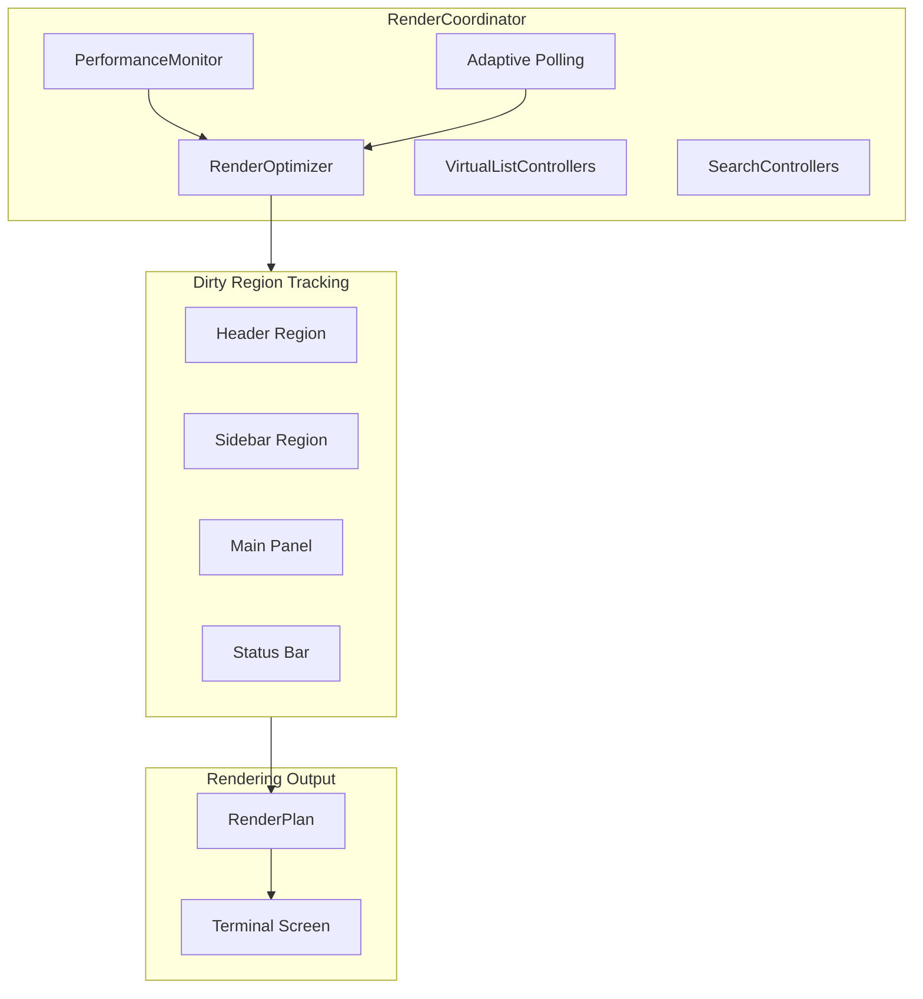
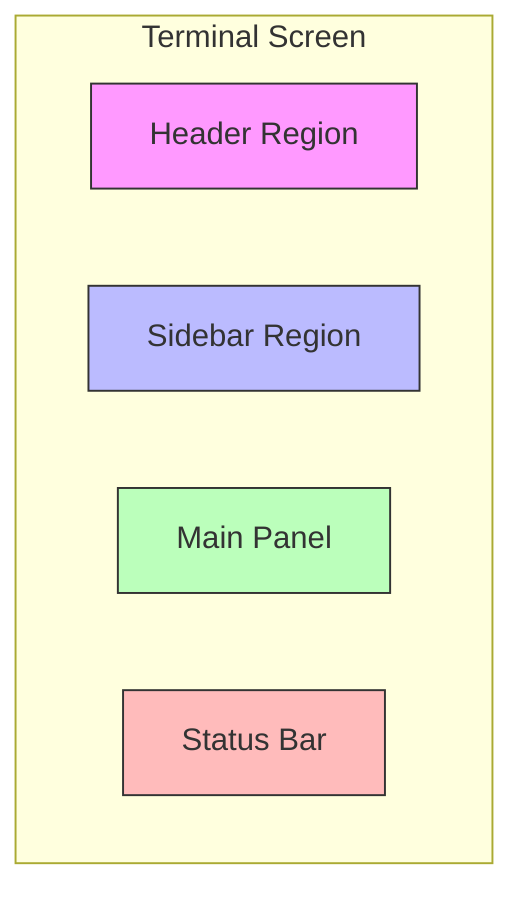
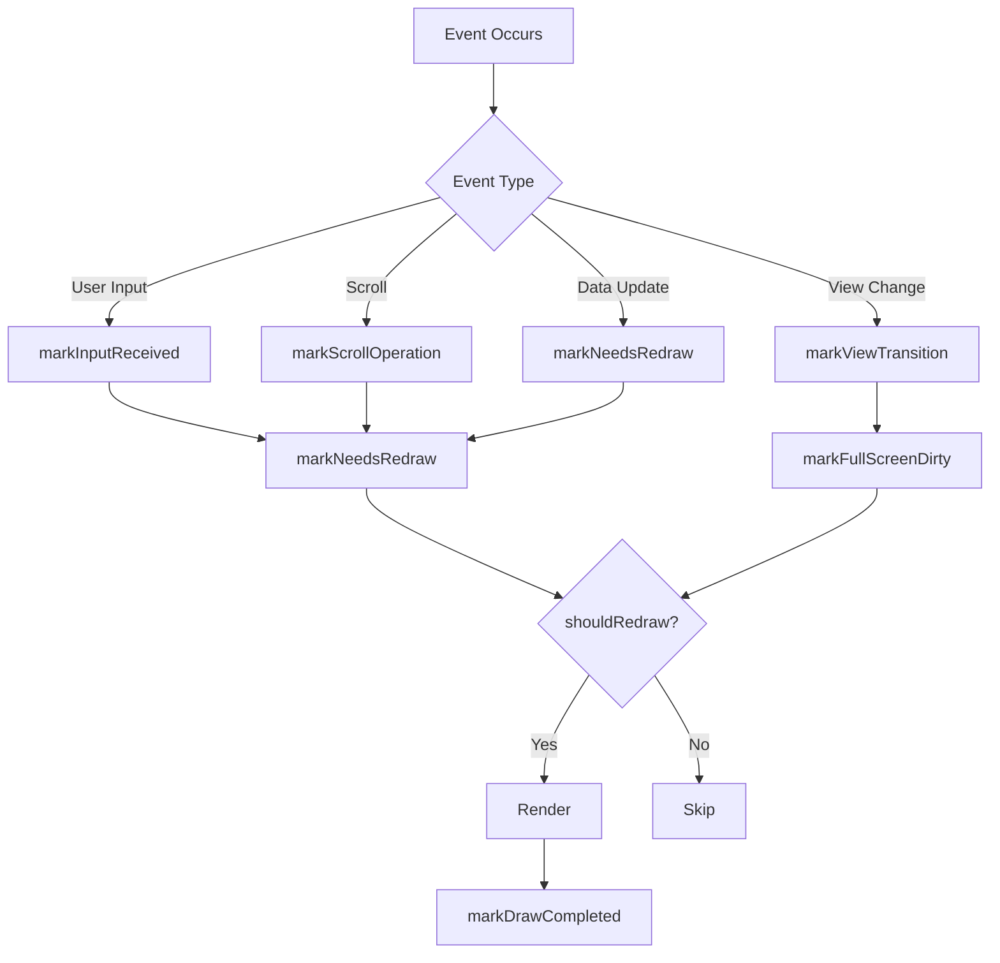
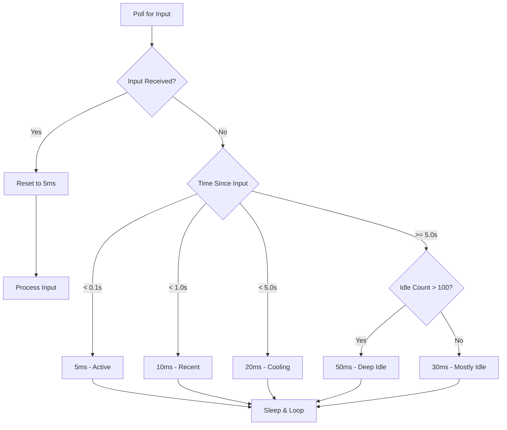
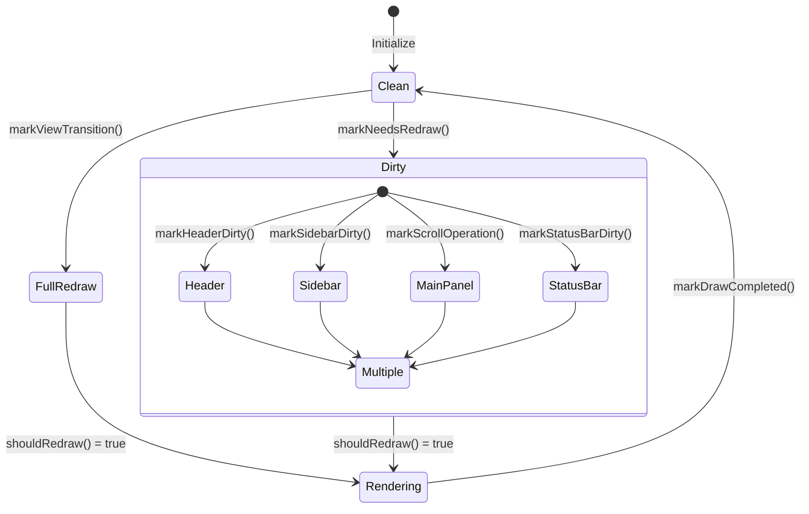

# Render Coordinator

## Overview

The RenderCoordinator manages rendering optimization and dirty region tracking for the TUI. It coordinates performance monitoring, adaptive input polling, UI caching, and partial screen updates to maintain smooth 30fps rendering while minimizing CPU usage during idle periods.

**Location:** `Sources/Substation/Framework/RenderCoordinator.swift`

## Architecture



## Class Definition

```swift
@MainActor
final class RenderCoordinator {
    // Render State
    var needsRedraw: Bool = true
    var lastDrawTime: Date
    var redrawThrottleInterval: TimeInterval = 0.032  // ~30fps

    // Performance Tracking
    var lastPerformanceLog: Date
    var performanceLogInterval: TimeInterval = 30.0
    var previousScrollOffset: Int
    var lastScrollTime: Date
    var scrollEventCount: Int
    var scrollBatchTimer: Timer?

    // Dependencies
    let renderOptimizer: RenderOptimizer
    let performanceMonitor: PerformanceMonitor
    var virtualListControllers: [String: VirtualListController]
    var searchControllers: [String: ListSearchController]
}
```

## Dirty Region System

The RenderCoordinator tracks which parts of the screen need redrawing to minimize unnecessary updates.

### Screen Regions



### Marking Regions Dirty

```swift
/// Mark header region as dirty
func markHeaderDirty()

/// Mark sidebar region as dirty
func markSidebarDirty()

/// Mark status bar region as dirty
func markStatusBarDirty()

/// Mark that a scroll operation occurred
func markScrollOperation()

/// Mark that a view transition occurred (full screen redraw)
func markViewTransition()
```

## Redraw Management

### Redraw Flow



### Redraw Methods

```swift
/// Mark that the screen needs redraw
func markNeedsRedraw()

/// Check if we should redraw (respecting throttle)
func shouldRedraw() -> Bool

/// Force immediate redraw (for important updates)
func forceRedraw()

/// Mark that the screen was drawn
func markDrawCompleted()
```

## Adaptive Polling

The RenderCoordinator implements adaptive polling to balance responsiveness and CPU efficiency.

### Polling Intervals

| State | Interval | Description |
|-------|----------|-------------|
| Active Input | 5ms | Immediate responsiveness |
| Recent Input | 10ms | Short idle period |
| Cooling Down | 20ms | Medium idle |
| Mostly Idle | 30ms | Longer idle |
| Deep Idle | 50ms | Maximum efficiency |

### Adaptive Polling Flow



### Polling Methods

```swift
/// Mark that input was received - resets adaptive polling
func markInputReceived()

/// Get adaptive sleep interval for polling based on activity
func getAdaptiveSleepInterval() -> UInt64

/// Calculate and update sleep interval based on idle polling state
func updateAdaptiveSleepInterval()

/// Increment the idle poll counter
func incrementIdlePolls()
```

## Render Plan

The RenderCoordinator generates a RenderPlan that specifies which regions to redraw.

```swift
/// Get the current render plan
func getRenderPlan(screenRows: Int32, screenCols: Int32) -> RenderPlan
```

The RenderPlan contains information about:
- Which regions need updating
- Screen dimensions
- Dirty region bounds

## UI Cache Management

The RenderCoordinator manages view-specific caches:

### Virtual List Controllers

```swift
var virtualListControllers: [String: VirtualListController]
```

Virtual list controllers handle efficient rendering of large lists by only rendering visible items.

### Search Controllers

```swift
var searchControllers: [String: ListSearchController]
```

Search controllers manage search state and filtering for list views.

### Cache Clearing

```swift
/// Clear UI caches when view changes
func handleUICacheClearing()
```

## Performance Optimization

### Animation Frequency

```swift
/// Reduce animation frequency for performance
func reduceAnimationFrequency()

/// Optimize rendering frequency
func optimizeRenderingFrequency()

/// Reset rendering frequency to default
func resetRenderingFrequency()
```

### Scroll Batching

The coordinator tracks scroll events to batch rapid scroll operations:

```swift
var lastScrollTime: Date
var scrollEventCount: Int
var scrollBatchTimer: Timer?
```

## State Diagram



## Usage Examples

### Basic Render Loop

```swift
while running {
    // Check for input with adaptive sleep
    if let key = getInput() {
        renderCoordinator.markInputReceived()
        processInput(key)
    }

    // Render if needed
    if renderCoordinator.shouldRedraw() {
        let plan = renderCoordinator.getRenderPlan(
            screenRows: rows,
            screenCols: cols
        )
        render(with: plan)
        renderCoordinator.markDrawCompleted()
    }

    // Adaptive sleep
    let sleepInterval = renderCoordinator.getAdaptiveSleepInterval()
    try await Task.sleep(nanoseconds: sleepInterval)
}
```

### Handling View Transitions

```swift
func changeView(to newView: ViewMode) {
    viewCoordinator.currentView = newView
    renderCoordinator.markViewTransition()
    renderCoordinator.handleUICacheClearing()
}
```

### Scroll Handling

```swift
func handleScroll(direction: ScrollDirection) {
    viewCoordinator.scrollOffset += direction.delta
    renderCoordinator.markScrollOperation()
}
```

### Forcing Redraw

```swift
func handleCriticalUpdate() {
    // Data has changed significantly
    renderCoordinator.forceRedraw()
}
```

## Performance Metrics

The RenderCoordinator tracks performance metrics through the PerformanceMonitor:

- Frame time
- Render frequency
- Idle poll counts
- Sleep interval distribution

Performance logs are output every 30 seconds (configurable via `performanceLogInterval`).

## Integration Points

### RenderOptimizer

Handles low-level dirty region tracking and render throttling.

### PerformanceMonitor

Collects and reports performance metrics.

### VirtualListController

Manages efficient rendering of large lists.

### ListSearchController

Manages search state for list filtering.

## Best Practices

1. **Always mark dirty regions** specifically rather than full screen when possible
2. **Use markViewTransition()** only for actual view changes
3. **Let adaptive polling manage sleep intervals** automatically
4. **Clear UI caches** when views change to prevent stale state
5. **Use forceRedraw()** sparingly for critical updates

## Related Documentation

- [Refresh Manager](./refresh-manager.md)
- [View System](./view-system.md)
- [Selection Manager](./selection-manager.md)
