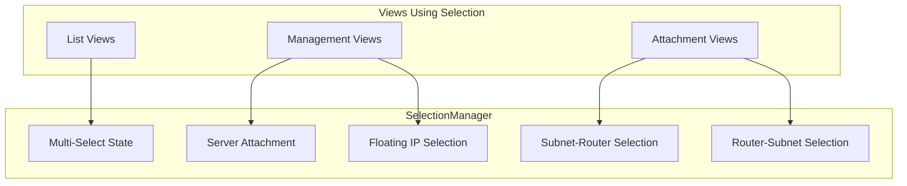
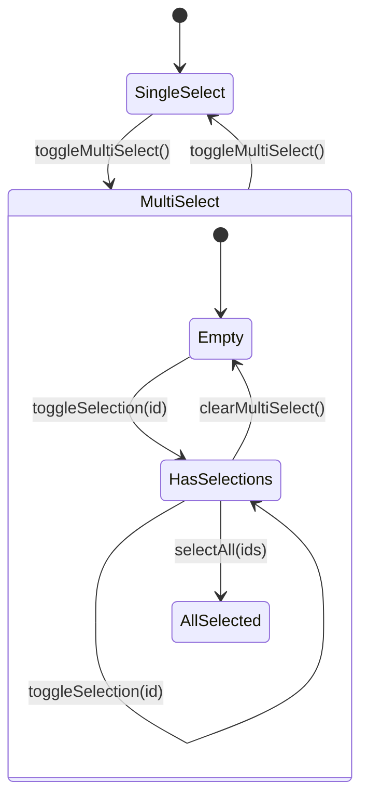
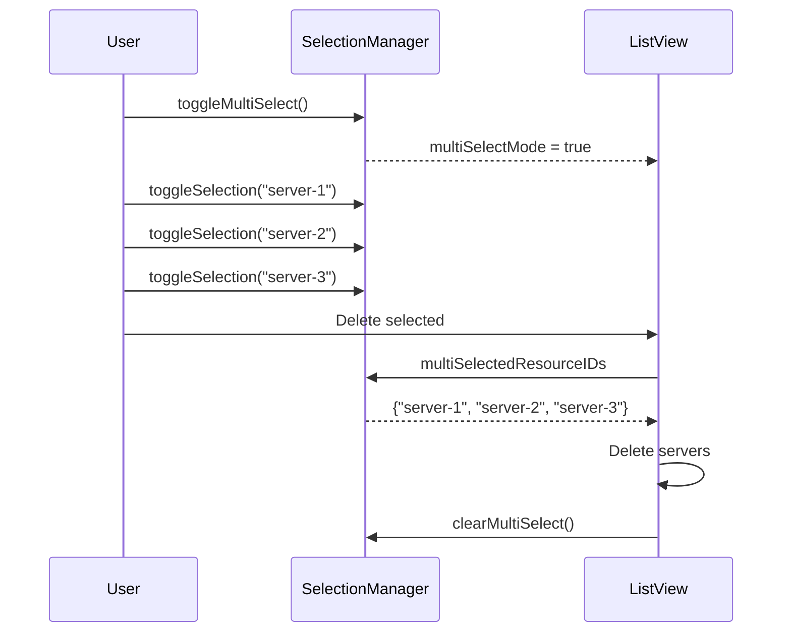
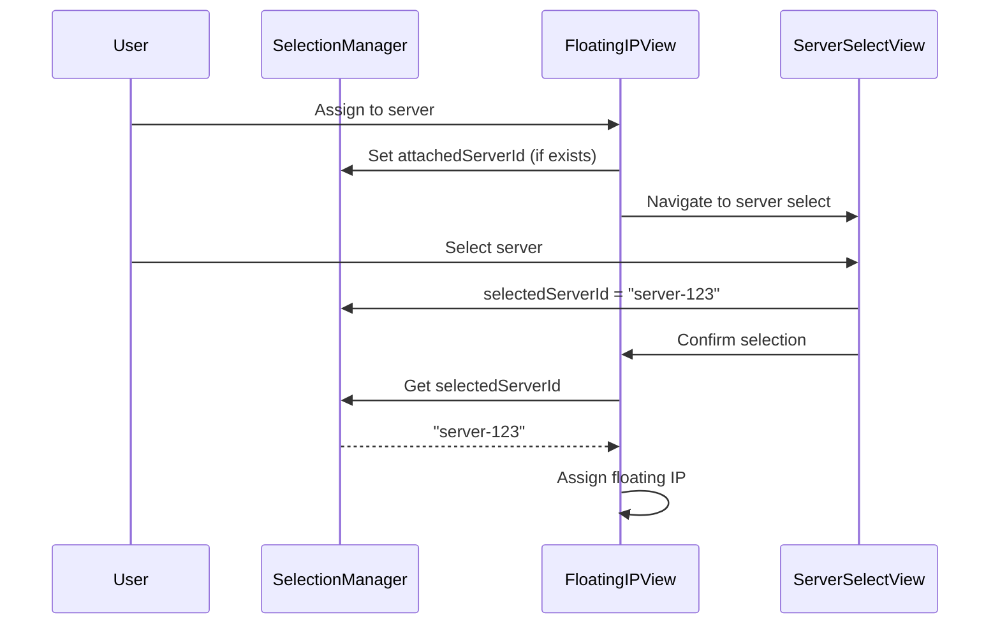
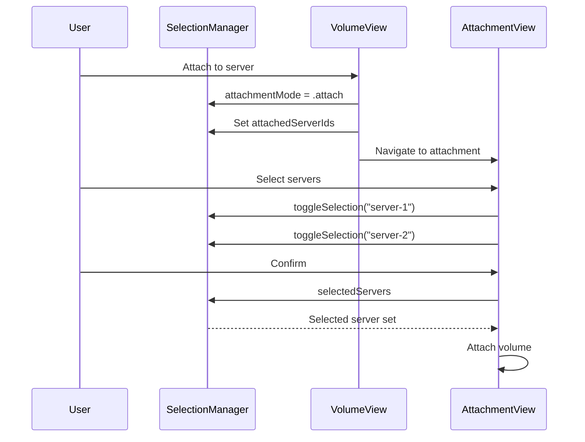
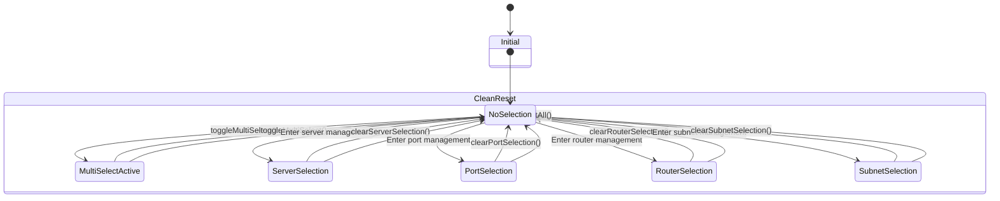

# Selection Manager

## Overview

The SelectionManager handles multi-select and attachment selection state for TUI operations. It manages resource selection across different contexts including server, port, router, and subnet selection modes for resource management operations.

**Location:** `Sources/Substation/Framework/SelectionManager.swift`

## Architecture



## Class Definition

```swift
@MainActor
final class SelectionManager {
    // Multi-Select State
    var multiSelectMode: Bool = false
    var multiSelectedResourceIDs: Set<String> = []

    // Server Attachment Selection
    var selectedServers: Set<String> = []
    var attachedServerIds: Set<String> = []
    var attachmentMode: AttachmentMode = .attach

    // Floating IP Management
    var selectedServerId: String?
    var attachedServerId: String?
    var selectedPortId: String?
    var attachedPortId: String?

    // Subnet Router Management
    var selectedRouterId: String?
    var attachedRouterIds: Set<String> = []

    // Router Subnet Management
    var selectedSubnetId: String?
    var attachedSubnetIds: Set<String> = []
}
```

## Selection Types

### Multi-Select Mode

For batch operations on multiple resources in list views.



### Server Attachment Selection

For volume and network attachment operations.

| Property | Type | Description |
|----------|------|-------------|
| `selectedServers` | `Set<String>` | Servers selected for batch operations |
| `attachedServerIds` | `Set<String>` | Servers already with attachments |
| `attachmentMode` | `AttachmentMode` | Current mode (attach/detach) |

### Floating IP Selection

For floating IP association to servers and ports.

| Property | Type | Description |
|----------|------|-------------|
| `selectedServerId` | `String?` | Server to assign floating IP |
| `attachedServerId` | `String?` | Server currently with floating IP |
| `selectedPortId` | `String?` | Port to assign floating IP |
| `attachedPortId` | `String?` | Port currently with floating IP |

### Subnet-Router Selection

For managing router attachments to subnets.

| Property | Type | Description |
|----------|------|-------------|
| `selectedRouterId` | `String?` | Router selected for attachment |
| `attachedRouterIds` | `Set<String>` | Routers already attached to subnet |

### Router-Subnet Selection

For managing subnet interfaces on routers.

| Property | Type | Description |
|----------|------|-------------|
| `selectedSubnetId` | `String?` | Subnet selected for attachment |
| `attachedSubnetIds` | `Set<String>` | Subnets already attached to router |

## API Reference

### Multi-Select Methods

```swift
/// Toggle multi-select mode on or off
/// When disabled, clears all multi-select selections
func toggleMultiSelect()

/// Clear all multi-select selections without disabling multi-select mode
func clearMultiSelect()

/// Toggle selection of a resource by ID
func toggleSelection(id: String)

/// Check if a resource is currently selected
func isSelected(id: String) -> Bool

/// Select all provided resource IDs
func selectAll(ids: [String])
```

### Clear Methods

```swift
/// Clear server selection state
/// Resets selectedServers, selectedServerId, and attachedServerId
func clearServerSelection()

/// Clear port selection state
/// Resets selectedPortId and attachedPortId
func clearPortSelection()

/// Clear router selection state
/// Resets selectedRouterId and attachedRouterIds
func clearRouterSelection()

/// Clear subnet selection state
/// Resets selectedSubnetId and attachedSubnetIds
func clearSubnetSelection()

/// Reset all selection state to initial values
func resetAll()
```

## Selection Flow Examples

### Multi-Select for Batch Delete



### Floating IP Assignment



### Volume-Server Attachment



## Usage Examples

### Multi-Select Operations

```swift
// Enable multi-select mode
selectionManager.toggleMultiSelect()

// Select resources
selectionManager.toggleSelection(id: "server-1")
selectionManager.toggleSelection(id: "server-2")

// Check selection
if selectionManager.isSelected(id: "server-1") {
    print("Server 1 is selected")
}

// Get all selected
let selected = selectionManager.multiSelectedResourceIDs

// Select all
selectionManager.selectAll(ids: allServerIds)

// Clear selections
selectionManager.clearMultiSelect()

// Disable multi-select mode
selectionManager.toggleMultiSelect()
```

### Floating IP Assignment

```swift
// Store current attachment state
selectionManager.attachedServerId = floatingIP.serverId
selectionManager.attachedPortId = floatingIP.portId

// After user selects new server
selectionManager.selectedServerId = newServerId

// Perform assignment
let targetServer = selectionManager.selectedServerId
await assignFloatingIP(to: targetServer)

// Clear state
selectionManager.clearServerSelection()
```

### Router Interface Management

```swift
// Store existing attachments
selectionManager.attachedSubnetIds = Set(router.attachedSubnets)

// User selects subnet
selectionManager.selectedSubnetId = "subnet-123"

// Add interface
if let subnetId = selectionManager.selectedSubnetId {
    await addRouterInterface(routerId: router.id, subnetId: subnetId)
}

// Clear state
selectionManager.clearSubnetSelection()
```

### Complete Reset

```swift
// Reset all selection state when leaving management views
func exitManagementView() {
    selectionManager.resetAll()
    viewCoordinator.changeView(to: previousView)
}
```

## Visual Selection Indicators

When rendering list views, use selection state to show visual indicators:

```swift
func renderServerRow(_ server: Server, isHighlighted: Bool) {
    let prefix: String
    if selectionManager.multiSelectMode {
        if selectionManager.isSelected(id: server.id) {
            prefix = "[X]"  // Selected
        } else {
            prefix = "[ ]"  // Not selected
        }
    } else {
        prefix = isHighlighted ? ">" : " "
    }
    print("\(prefix) \(server.name)")
}
```

## State Diagram



## Best Practices

1. **Clear selection state** when leaving management views
2. **Store attached IDs** before entering selection mode for visual indicators
3. **Use resetAll()** when transitioning to unrelated views
4. **Check multiSelectMode** before interpreting selection state
5. **Use toggleSelection()** rather than directly modifying the set

## Related Documentation

- [View System](./view-system.md)
- [Render Coordinator](./render-coordinator.md)
- [Cache Manager](./cache-manager.md)
