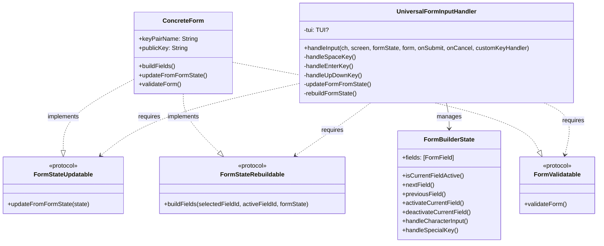

# UniversalFormInputHandler Reference

## Overview

The `UniversalFormInputHandler` is a centralized, type-safe input handling system that replaces over 40 individual form handlers with a single, reusable implementation. This pattern eliminates approximately 7,000 lines of duplicate code while providing consistent input behavior across all forms in the Substation application.

### Purpose

- **Unified Input Handling**: Single source of truth for form input logic
- **Type Safety**: Leverages Swift's type system with protocol constraints
- **Code Reduction**: Reduces form handler implementations from ~133 lines to ~53 lines
- **Consistency**: Ensures uniform keyboard navigation and interaction patterns
- **Maintainability**: Changes to input behavior only need to be made in one place

### Benefits Over Legacy Handlers

1. **Elimination of Code Duplication**: Legacy handlers repeated the same key handling logic across every form
2. **Protocol-Based Design**: Forms only need to conform to three simple protocols
3. **Extensibility**: Custom key handlers allow form-specific behavior without duplicating core logic
4. **Actor Safety**: Properly handles Swift concurrency with @MainActor isolation
5. **Validation Integration**: Built-in form validation support with error display

## Architecture

The UniversalFormInputHandler follows a delegation pattern with protocol-based constraints:

```mermaid
flowchart TD
    subgraph "User Interaction"
        Input[Keyboard Input]
    end

    subgraph "Universal Handler"
        Handler[UniversalFormInputHandler]
        CustomHandler[Custom Key Handler]
        Handler --> CustomHandler
    end

    subgraph "Form State Management"
        FormState[FormBuilderState]
        Handler --> FormState
    end

    subgraph "Form Protocols"
        Updatable[FormStateUpdatable]
        Rebuildable[FormStateRebuildable]
        Validatable[FormValidatable]
    end

    subgraph "Actions"
        Navigate[Field Navigation]
        Edit[Field Editing]
        Validate[Validation]
        Submit[API Submission]
    end

    Input --> Handler
    FormState --> Updatable
    FormState --> Rebuildable
    Handler --> Navigate
    Handler --> Edit
    Handler --> Validate
    Validate --> Submit

    style Handler fill:#4a5568
    style FormState fill:#2d3748
    style Submit fill:#38a169
```



### Component Relationships



## API Reference

### UniversalFormInputHandler

#### Main Method

```swift
@MainActor
func handleInput<Form: FormStateUpdatable & FormStateRebuildable & FormValidatable>(
    _ ch: Int32,
    screen: OpaquePointer?,
    formState: inout FormBuilderState,
    form: inout Form,
    onSubmit: @MainActor @escaping (FormBuilderState, Form) async -> Void,
    onCancel: @escaping () -> Void,
    customKeyHandler: (@MainActor @Sendable (Int32, inout FormBuilderState, inout Form, OpaquePointer?) async -> Bool)? = nil
) async
```

#### Parameters

| Parameter | Type | Description |
|-----------|------|-------------|
| `ch` | `Int32` | The input character code from ncurses |
| `screen` | `OpaquePointer?` | The ncurses screen pointer |
| `formState` | `inout FormBuilderState` | The form's state object (mutable) |
| `form` | `inout Form` | The form instance (mutable) |
| `onSubmit` | `async closure` | Executed when form is submitted (ENTER on inactive field) |
| `onCancel` | `closure` | Executed when form is cancelled (ESC on inactive field) |
| `customKeyHandler` | `optional async closure` | Custom key handler for form-specific behavior |

### Required Protocols

#### FormStateUpdatable

```swift
protocol FormStateUpdatable {
    mutating func updateFromFormState(_ state: FormBuilderState)
}
```

Updates the form's properties from the current FormBuilderState. This synchronizes field values from the state back to the form model.

#### FormStateRebuildable

```swift
protocol FormStateRebuildable {
    func buildFields(
        selectedFieldId: String?,
        activeFieldId: String?,
        formState: FormBuilderState
    ) -> [FormField]
}
```

Rebuilds the form's field array. Used for dynamic forms where field visibility or options change based on other field values.

#### FormValidatable

```swift
protocol FormValidatable {
    func validateForm() -> [String]
}
```

Validates the form and returns an array of error messages. Empty array indicates successful validation.

## Implementation Guide

### Step 1: Define Your Form Model

Create a struct that holds your form's data:

```swift
struct MyResourceCreateForm {
    // Form data
    var resourceName: String = ""
    var resourceType: ResourceType = .standard
    var isEnabled: Bool = false
    var selectedNetworkID: String?

    // Optional: Custom validation
    func validateName() -> String? {
        if resourceName.isEmpty {
            return "Name is required"
        }
        if resourceName.count < 3 {
            return "Name must be at least 3 characters"
        }
        return nil
    }
}
```

### Step 2: Implement Required Protocols

#### buildFields Implementation

```swift
extension MyResourceCreateForm {
    func buildFields(
        selectedFieldId: String?,
        activeFieldId: String? = nil,
        formState: FormBuilderState
    ) -> [FormField] {
        var fields: [FormField] = []

        // Text field
        fields.append(.text(FormFieldText(
            id: "name",
            label: "Resource Name",
            value: resourceName,
            placeholder: "my-resource",
            isRequired: true,
            isVisible: true,
            isSelected: selectedFieldId == "name",
            isActive: activeFieldId == "name",
            cursorPosition: formState.getTextFieldCursorPosition("name"),
            validationError: validateName()
        )))

        // Select field for enum
        fields.append(.select(FormFieldSelect(
            id: "type",
            label: "Resource Type",
            value: resourceType,
            options: ResourceType.allCases,
            isRequired: true,
            isVisible: true,
            isSelected: selectedFieldId == "type",
            isActive: activeFieldId == "type"
        )))

        // Toggle field
        fields.append(.toggle(FormFieldToggle(
            id: "enabled",
            label: "Enable Resource",
            value: isEnabled,
            isVisible: true,
            isSelected: selectedFieldId == "enabled"
        )))

        // Selector for complex selection
        if let networks = formState.availableNetworks {
            fields.append(.selector(FormFieldSelector(
                id: "network",
                label: "Network",
                items: networks,
                selectedItemId: selectedNetworkID,
                isRequired: false,
                isVisible: true,
                isSelected: selectedFieldId == "network",
                isActive: activeFieldId == "network",
                columns: [
                    SelectorColumn(header: "Name", width: 30),
                    SelectorColumn(header: "CIDR", width: 18)
                ]
            )))
        }

        return fields
    }
}
```

#### updateFromFormState Implementation

```swift
extension MyResourceCreateForm: FormStateUpdatable {
    mutating func updateFromFormState(_ formState: FormBuilderState) {
        // Update text fields
        if let name = formState.getTextValue("name") {
            resourceName = name
        }

        // Update select fields
        if let typeValue = formState.getSelectValue("type") as? ResourceType {
            resourceType = typeValue
        }

        // Update toggle fields
        isEnabled = formState.getToggleValue("enabled") ?? false

        // Update selector fields
        if let state = formState.selectorStates["network"] {
            selectedNetworkID = state.selectedItemId
        }
    }
}
```

#### validateForm Implementation

```swift
extension MyResourceCreateForm: FormValidatable {
    func validateForm() -> [String] {
        var errors: [String] = []

        if let nameError = validateName() {
            errors.append(nameError)
        }

        if resourceType == .advanced && selectedNetworkID == nil {
            errors.append("Network is required for advanced resources")
        }

        return errors
    }
}
```

### Step 3: Add Protocol Conformance

```swift
extension MyResourceCreateForm: FormStateUpdatable, FormStateRebuildable, FormValidatable {}
```

### Step 4: Create Input Handler in TUI Extension

```swift
@MainActor
extension TUI {
    internal func handleMyResourceCreateInput(_ ch: Int32, screen: OpaquePointer?) async {
        // Get local copies to avoid actor isolation issues
        var localFormState = myResourceCreateFormState
        var localForm = myResourceCreateForm

        // Optional: Define custom key handler
        let customHandler: @MainActor @Sendable (Int32, inout FormBuilderState, inout MyResourceCreateForm, OpaquePointer?) async -> Bool = { ch, formState, form, screen in
            // Handle form-specific keys (e.g., F-keys, special shortcuts)
            if ch == KEY_F(5) { // F5 for refresh
                await self.refreshNetworkList()
                return true // Handled
            }
            return false // Let universal handler process
        }

        // Call universal handler
        await universalFormInputHandler.handleInput(
            ch,
            screen: screen,
            formState: &localFormState,
            form: &localForm,
            onSubmit: { formState, form in
                // Sync state before submission
                self.myResourceCreateFormState = formState
                self.myResourceCreateForm = form

                // Call module's submit method
                if let module = ModuleRegistry.shared.module(for: "myresource") as? MyResourceModule {
                    await module.submitResourceCreation(screen: screen)
                }
            },
            onCancel: {
                self.changeView(to: .myResourceList, resetSelection: false)
            },
            customKeyHandler: customHandler
        )

        // Update actor-isolated properties
        myResourceCreateFormState = localFormState
        myResourceCreateForm = localForm
    }
}
```

## Form Field Types

### Text Fields

Standard text input with cursor navigation:

```swift
.text(FormFieldText(
    id: "fieldId",
    label: "Field Label",
    value: currentValue,
    placeholder: "hint text",
    isRequired: true,
    isVisible: true,
    isSelected: isCurrentlySelected,
    isActive: isCurrentlyActive,
    cursorPosition: cursorPos,
    validationError: errorMessage
))
```

**Key Behavior:**
- SPACE: Activate field or add space character (when active)
- Arrow keys: Move cursor within text
- Backspace/Delete: Remove characters
- ESC: Exit edit mode

### Number Fields

Numeric input with validation:

```swift
.number(FormFieldNumber(
    id: "port",
    label: "Port Number",
    value: 8080,
    min: 1,
    max: 65535,
    isRequired: true,
    isVisible: true,
    isSelected: isCurrentlySelected,
    isActive: isCurrentlyActive,
    validationError: errorMessage
))
```

**Key Behavior:**
- Only accepts numeric characters
- Validates against min/max constraints

### Toggle Fields

Boolean on/off switch:

```swift
.toggle(FormFieldToggle(
    id: "enabled",
    label: "Enable Feature",
    value: isEnabled,
    isVisible: true,
    isSelected: isCurrentlySelected
))
```

**Key Behavior:**
- SPACE: Toggle immediately (no activation needed)
- No edit mode required

### Checkbox Fields

Multi-value boolean selection:

```swift
.checkbox(FormFieldCheckbox(
    id: "options",
    label: "Select Options",
    value: isChecked,
    isVisible: true,
    isSelected: isCurrentlySelected
))
```

**Key Behavior:**
- SPACE: Toggle check state immediately
- No edit mode required

### Select Fields

Enum-like single selection:

```swift
.select(FormFieldSelect(
    id: "type",
    label: "Resource Type",
    value: currentEnum,
    options: EnumType.allCases,
    isRequired: true,
    isVisible: true,
    isSelected: isCurrentlySelected,
    isActive: isCurrentlyActive
))
```

**Key Behavior:**
- SPACE: Cycle through options immediately
- No edit mode required

### Selector Fields

Complex list selection with search and columns:

```swift
.selector(FormFieldSelector(
    id: "resource",
    label: "Select Resource",
    items: availableItems,
    selectedItemId: currentSelectionId,
    isRequired: false,
    isVisible: true,
    isSelected: isCurrentlySelected,
    isActive: isCurrentlyActive,
    columns: [
        SelectorColumn(header: "Name", width: 30),
        SelectorColumn(header: "Status", width: 10)
    ],
    emptyMessage: "No resources available"
))
```

**Key Behavior:**
- SPACE: Activate selector or toggle selection (when active)
- Arrow keys: Navigate items (when active)
- Character input: Search filtering (when active)
- ESC: Exit selector mode

### MultiSelect Fields

Multiple item selection:

```swift
.multiSelect(FormFieldMultiSelect(
    id: "tags",
    label: "Select Tags",
    items: availableTags,
    selectedItemIds: selectedTagIds,
    isRequired: false,
    isVisible: true,
    isSelected: isCurrentlySelected,
    isActive: isCurrentlyActive
))
```

**Key Behavior:**
- SPACE: Toggle item selection (when active)
- Arrow keys: Navigate items
- ESC: Exit selection mode

## Migration Guide

### Identifying Legacy Handlers

Legacy handlers typically have this structure:

```swift
// LEGACY PATTERN - DO NOT USE
internal func handleMyFormInput(_ ch: Int32, screen: OpaquePointer?) async {
    let isFieldActive = myFormState.isCurrentFieldActive()

    switch ch {
    case Int32(9): // TAB
        if !isFieldActive {
            myFormState.nextField()
            myForm.updateFromFormState(myFormState)
            await draw(screen: screen)
        }
    // ... 100+ more lines of repeated key handling ...
    }
}
```

### Migration Steps

1. **Remove Legacy Handler Code**: Delete the entire switch statement and key handling logic

2. **Add Protocol Conformance**:
```swift
extension MyForm: FormStateUpdatable, FormStateRebuildable, FormValidatable {}
```

3. **Implement Required Methods**: Ensure your form has:
   - `buildFields()` method
   - `updateFromFormState()` method
   - `validateForm()` method

4. **Update Handler to Use Universal Pattern**:
```swift
internal func handleMyFormInput(_ ch: Int32, screen: OpaquePointer?) async {
    var localFormState = myFormState
    var localForm = myForm

    await universalFormInputHandler.handleInput(
        ch,
        screen: screen,
        formState: &localFormState,
        form: &localForm,
        onSubmit: { formState, form in
            self.myFormState = formState
            self.myForm = form
            await self.submitMyForm()
        },
        onCancel: {
            self.changeView(to: .previousView, resetSelection: false)
        }
    )

    myFormState = localFormState
    myForm = localForm
}
```

### Common Patterns to Update

#### Pattern 1: Custom TAB Behavior

If your form needs special TAB handling (e.g., mode switching):

```swift
let customHandler: @MainActor @Sendable (Int32, inout FormBuilderState, inout MyForm, OpaquePointer?) async -> Bool = { ch, formState, form, screen in
    if ch == Int32(9) && formState.isCurrentFieldActive() {
        if let field = formState.getCurrentField(),
           case .selector(let selector) = field,
           selector.id == "special-field" {
            // Custom TAB behavior
            form.toggleMode()
            return true // Handled
        }
    }
    return false
}
```

#### Pattern 2: Field Dependencies

For forms where field visibility depends on other fields:

```swift
let customHandler: @MainActor @Sendable (Int32, inout FormBuilderState, inout MyForm, OpaquePointer?) async -> Bool = { ch, formState, form, screen in
    // After toggle changes, rebuild form
    if ch == Int32(32) { // SPACE
        if let field = formState.getCurrentField(),
           case .toggle(let toggle) = field,
           toggle.id == "enable-advanced" {
            // Let universal handler process the toggle
            // Then rebuild to show/hide dependent fields
            formState = FormBuilderState(
                fields: form.buildFields(
                    selectedFieldId: formState.getCurrentFieldId(),
                    activeFieldId: formState.getActiveFieldId(),
                    formState: formState
                )
            )
        }
    }
    return false
}
```

## Examples

### Simple Form: KeyPair Creation

A basic form with text input and file loading:

```swift
@MainActor
extension TUI {
    internal func handleKeyPairCreateInput(_ ch: Int32, screen: OpaquePointer?) async {
        var localFormState = keyPairCreateFormState
        var localForm = keyPairCreateForm

        // Custom handler for file loading
        let customHandler: @MainActor @Sendable (Int32, inout FormBuilderState, inout KeyPairCreateForm, OpaquePointer?) async -> Bool = { ch, formState, form, screen in
            if ch == Int32(10) || ch == Int32(13) { // ENTER
                if formState.isCurrentFieldActive(),
                   let field = formState.getCurrentField(),
                   case .text(let textField) = field,
                   textField.id == "publicKeyFilePath" {
                    // Load public key from file
                    if let error = form.loadPublicKeyFromFile() {
                        self.statusMessage = "Error: \(error)"
                    } else {
                        self.statusMessage = "Public key loaded"
                    }
                    return false // Continue with normal ENTER behavior
                }
            }
            return false
        }

        await universalFormInputHandler.handleInput(
            ch,
            screen: screen,
            formState: &localFormState,
            form: &localForm,
            onSubmit: { formState, form in
                self.keyPairCreateFormState = formState
                self.keyPairCreateForm = form
                if let module = ModuleRegistry.shared.module(for: "keypairs") as? KeyPairsModule {
                    await module.submitKeyPairCreation(screen: screen)
                }
            },
            onCancel: {
                self.changeView(to: .keyPairs, resetSelection: false)
            },
            customKeyHandler: customHandler
        )

        keyPairCreateFormState = localFormState
        keyPairCreateForm = localForm
    }
}
```

### Complex Form: Server Creation

A sophisticated form with mode switching and dynamic fields:

```swift
@MainActor
extension TUI {
    internal func handleServerCreateInput(_ ch: Int32, screen: OpaquePointer?) async {
        var localFormState = serverCreateFormState
        var localForm = serverCreateForm

        let customHandler: @MainActor @Sendable (Int32, inout FormBuilderState, inout ServerCreateForm, OpaquePointer?) async -> Bool = { ch, formState, form, screen in
            // TAB switches boot source mode
            if ch == Int32(9) && formState.isCurrentFieldActive() {
                if let field = formState.getCurrentField(),
                   case .selector(let selector) = field,
                   selector.id == "source" {
                    form.toggleBootSource()
                    // Rebuild form to reflect mode change
                    formState = FormBuilderState(
                        fields: form.buildFields(
                            selectedFieldId: formState.getCurrentFieldId(),
                            activeFieldId: formState.getActiveFieldId(),
                            formState: formState
                        )
                    )
                    await self.draw(screen: screen)
                    return true
                }
            }

            // ESC in flavor detail view goes back to category list
            if ch == Int32(27) && formState.isCurrentFieldActive() {
                if let field = formState.getCurrentField(),
                   case .selector(let selector) = field,
                   selector.id == "flavor",
                   form.flavorSelectionMode == .workloadBased,
                   form.selectedCategoryIndex != nil {
                    form.selectedCategoryIndex = nil
                    await self.draw(screen: screen)
                    return true
                }
            }

            return false
        }

        await universalFormInputHandler.handleInput(
            ch,
            screen: screen,
            formState: &localFormState,
            form: &localForm,
            onSubmit: { formState, form in
                self.serverCreateFormState = formState
                self.serverCreateForm = form
                await self.createServer()
            },
            onCancel: {
                self.viewCoordinator.currentView = .servers
                self.serverCreateForm.reset()
            },
            customKeyHandler: customHandler
        )

        // Always rebuild after handler to reflect changes
        localFormState = FormBuilderState(
            fields: localForm.buildFields(
                selectedFieldId: localFormState.getCurrentFieldId(),
                activeFieldId: localFormState.getActiveFieldId(),
                formState: localFormState
            ),
            preservingStateFrom: localFormState
        )

        serverCreateFormState = localFormState
        serverCreateForm = localForm
    }
}
```

### Form with Dynamic Selectors

Forms that load data and update selectors:

```swift
@MainActor
extension TUI {
    internal func handleNetworkAttachInput(_ ch: Int32, screen: OpaquePointer?) async {
        var localFormState = networkAttachFormState
        var localForm = networkAttachForm

        // Load networks if not loaded
        if localForm.networks.isEmpty {
            await loadAvailableNetworks()
            localForm.networks = availableNetworks
            localFormState = FormBuilderState(
                fields: localForm.buildFields(
                    selectedFieldId: nil,
                    activeFieldId: nil,
                    formState: localFormState
                )
            )
        }

        await universalFormInputHandler.handleInput(
            ch,
            screen: screen,
            formState: &localFormState,
            form: &localForm,
            onSubmit: { formState, form in
                self.networkAttachFormState = formState
                self.networkAttachForm = form
                await self.attachNetwork()
            },
            onCancel: {
                self.changeView(to: .networkList, resetSelection: false)
            }
        )

        networkAttachFormState = localFormState
        networkAttachForm = localForm
    }
}
```

## Best Practices

### 1. Actor Isolation

Always use local copies to avoid Swift concurrency issues:

```swift
// Good
var localFormState = myFormState
var localForm = myForm
await universalFormInputHandler.handleInput(...)
myFormState = localFormState
myForm = localForm

// Bad - will cause compilation errors
await universalFormInputHandler.handleInput(
    formState: &myFormState,  // Actor-isolated property
    form: &myForm              // Actor-isolated property
)
```

### 2. Custom Key Handlers

Return `true` only if you've fully handled the key:

```swift
let customHandler: ... = { ch, formState, form, screen in
    if ch == SPECIAL_KEY {
        // Handle special key
        await self.doSomething()
        return true  // Prevent universal handler from processing
    }
    return false  // Let universal handler process
}
```

### 3. Form Rebuilding

Rebuild form state when field visibility changes:

```swift
if fieldVisibilityChanged {
    formState = FormBuilderState(
        fields: form.buildFields(
            selectedFieldId: formState.getCurrentFieldId(),
            activeFieldId: formState.getActiveFieldId(),
            formState: formState
        ),
        preservingStateFrom: formState  // Preserves field values
    )
}
```

### 4. Validation Messages

Return clear, actionable error messages:

```swift
func validateForm() -> [String] {
    var errors: [String] = []

    // Good: Clear and specific
    if name.isEmpty {
        errors.append("Server name is required")
    }
    if ram < 512 {
        errors.append("RAM must be at least 512 MB")
    }

    // Bad: Vague or technical
    // errors.append("Invalid input")
    // errors.append("Constraint violation")

    return errors
}
```

### 5. Submit Handlers

Always sync state before API calls:

```swift
onSubmit: { formState, form in
    // Sync state first
    self.myFormState = formState
    self.myForm = form

    // Then submit
    if let module = ModuleRegistry.shared.module(for: "mymodule") as? MyModule {
        await module.submitForm(screen: screen)
    }
}
```

## Troubleshooting

### Common Issues

#### Issue: Form doesn't update after key press

**Solution**: Ensure you're updating actor-isolated properties after the handler:
```swift
myFormState = localFormState
myForm = localForm
```

#### Issue: Custom keys not working

**Solution**: Check your custom handler returns `false` for keys you want the universal handler to process:
```swift
if ch == MY_KEY && shouldHandle {
    // handle
    return true
}
return false  // Important!
```

#### Issue: Validation errors not showing

**Solution**: Ensure your form implements `FormValidatable` correctly and returns non-empty array for errors:
```swift
func validateForm() -> [String] {
    var errors: [String] = []
    // Add validation logic
    return errors  // Must return array, even if empty
}
```

#### Issue: Fields not rebuilding dynamically

**Solution**: Manually rebuild FormBuilderState after changes that affect field visibility:
```swift
formState = FormBuilderState(
    fields: form.buildFields(
        selectedFieldId: formState.getCurrentFieldId(),
        activeFieldId: formState.getActiveFieldId(),
        formState: formState
    ),
    preservingStateFrom: formState
)
```

## See Also

- [FormBuilder Component](/docs/reference/components/form-builder.md)
- [FormBuilderState](/docs/reference/framework/form-builder-state.md)
- [Module Development Guide](/docs/development/modules.md)
- [SwiftNCurses Framework](/docs/reference/swiftncurses/README.md)