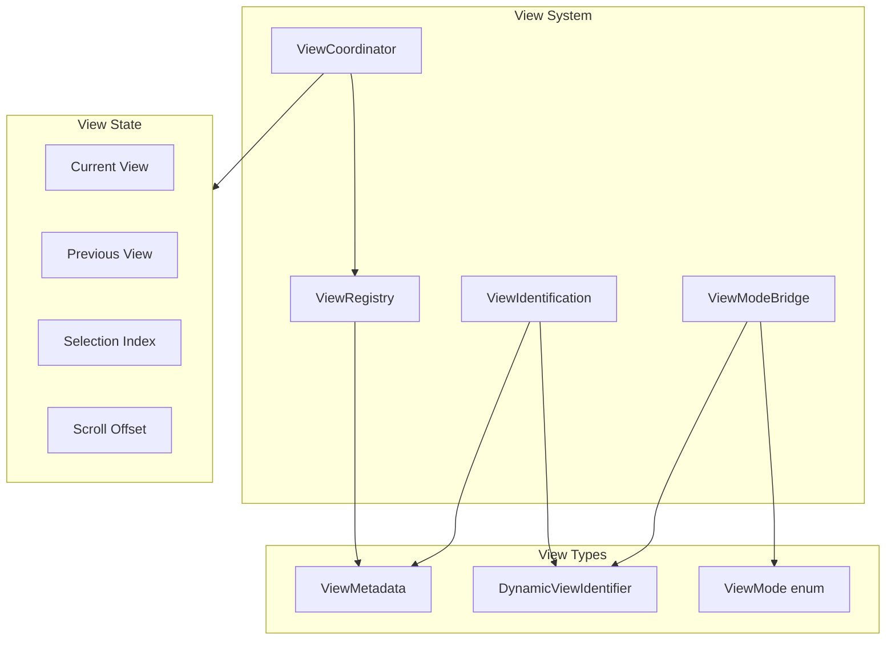
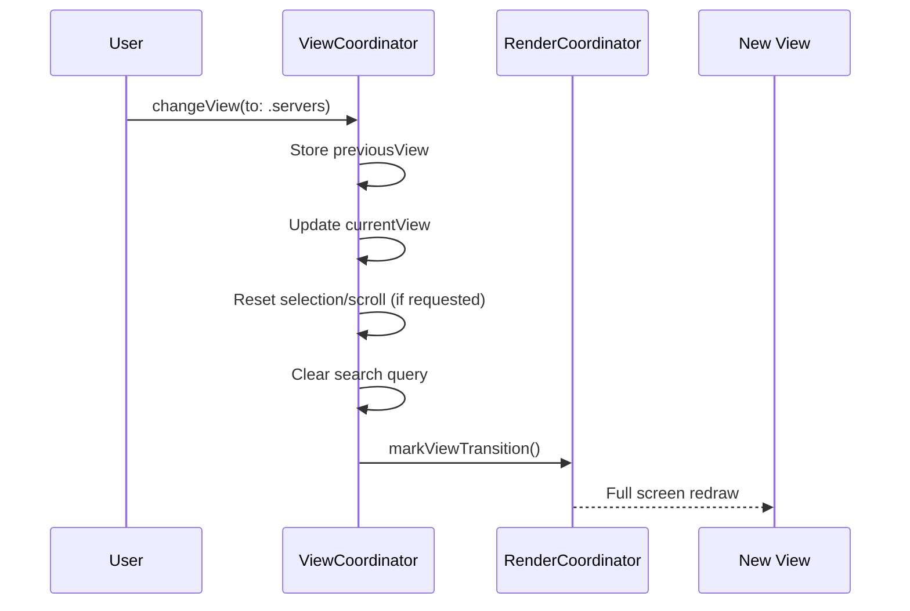
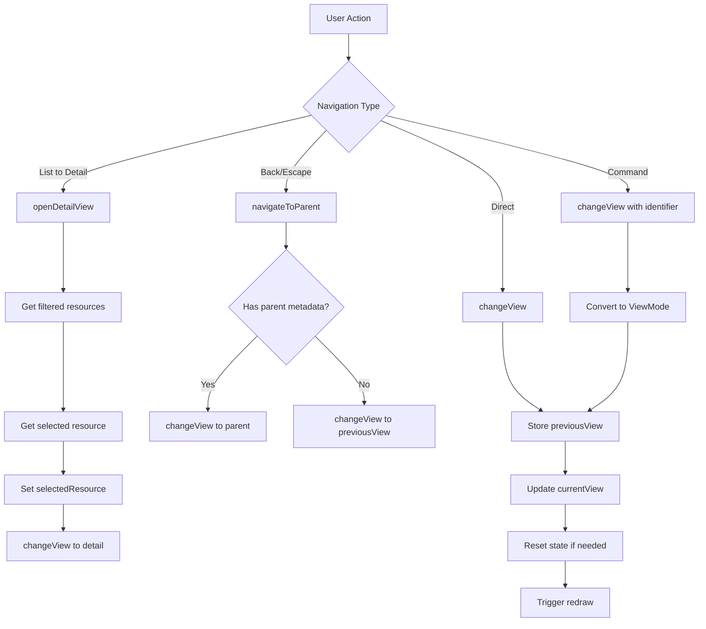
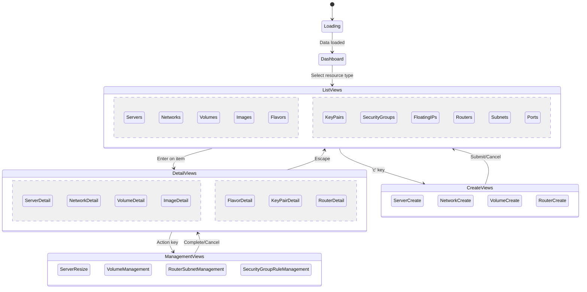
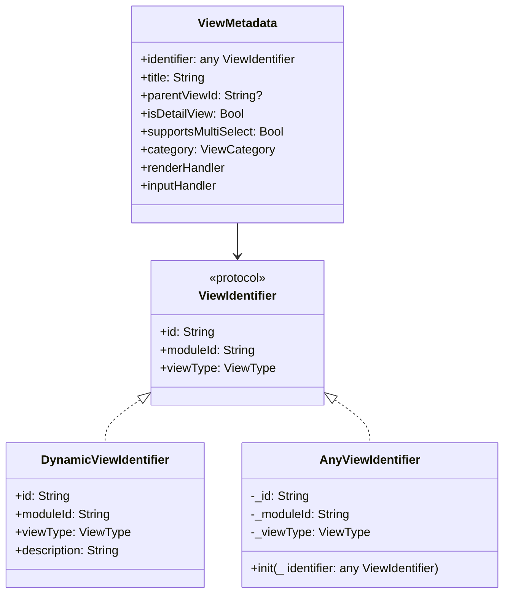

# View System

## Overview

The View System provides view state management, navigation, and identification for the TUI. It consists of three main components:

- **ViewCoordinator**: Manages view state, navigation, and selection
- **ViewIdentification**: Provides type-safe view identification with ViewIdentifier protocol
- **ViewModeBridge**: Bridge between legacy ViewMode enum and new ViewIdentifier system

**Location:** `Sources/Substation/Framework/`

## Architecture



## ViewCoordinator

The ViewCoordinator centralizes all view transition logic, scroll offsets, and selection indices.

### Class Definition

```swift
@MainActor
final class ViewCoordinator {
    // View State
    var currentView: ViewMode
    var previousView: ViewMode

    // Selection State
    var selectedIndex: Int
    var selectedResource: Any?
    var previousSelectedResourceName: String?

    // Scroll State
    var scrollOffset: Int
    var helpScrollOffset: Int
    var detailScrollOffset: Int
    var quotaScrollOffset: Int

    // Search State
    var searchSelectedResourceId: String?

    // Navigation States
    var healthDashboardNavState: HealthDashboardView.NavigationState
    var swiftNavState: SwiftNavigationState

    // Loading States
    var isLoadingSwiftObjects: Bool

    // Callbacks
    var markNeedsRedraw: (() -> Void)?
    var markViewTransition: (() -> Void)?
    var getStatusMessage: (() -> String?)?
    var setStatusMessage: ((String?) -> Void)?
    var getSearchQuery: (() -> String?)?
    var setSearchQuery: ((String?) -> Void)?
}
```

### View Transition



### Navigation Methods

```swift
/// Change to a new view with optional selection reset and status preservation
func changeView(to newView: ViewMode, resetSelection: Bool = true, preserveStatus: Bool = false)

/// Change to a new view using a ViewIdentifier
func changeView(to identifier: any ViewIdentifier, resetSelection: Bool = true, preserveStatus: Bool = false)

/// Navigate to parent view using metadata
func navigateToParent()
```

### Selection Index Methods

```swift
/// Get the maximum selection index for the current view
func getMaxSelectionIndex(
    cacheManager: CacheManager,
    searchQuery: String?,
    resourceResolver: ResourceResolver
) -> Int

/// Get the maximum index for the current view based on cached resource counts
func getMaxIndexForCurrentView(cacheManager: CacheManager) -> Int
```

### Scroll Offset Methods

```swift
/// Calculate the maximum scroll offset for detail views
func calculateMaxDetailScrollOffset() -> Int

/// Calculate the maximum scroll offset for quota panel on dashboard
func calculateMaxQuotaScrollOffset(
    screenCols: Int32,
    screenRows: Int32,
    cachedComputeLimits: ComputeQuotaSet?,
    cachedNetworkQuotas: NetworkQuotaSet?,
    cachedVolumeQuotas: VolumeQuotaSet?
) -> Int
```

### Detail View Methods

```swift
/// Get the currently selected image based on selection index and search filter
func getSelectedImage(cachedImages: [Image], searchQuery: String?) -> Image?

/// Open a detail view for the currently selected resource
func openDetailView(
    cacheManager: CacheManager,
    searchQuery: String?,
    dataManager: DataManager
)
```

## ViewIdentification

Provides type-safe view identification for the module system.

### ViewType Enum

```swift
/// Standard view types for consistent behavior classification
enum ViewType: String, Sendable {
    case list           // Primary resource list
    case detail         // Resource detail view
    case create         // Creation form
    case edit           // Edit form
    case management     // Management/action view
    case dashboard      // Dashboard/overview
    case help           // Help/documentation
    case console        // Console/terminal view
    case selection      // Selection/picker view
}
```

### ViewIdentifier Protocol

```swift
/// Protocol for view identification in the module system
protocol ViewIdentifier: Hashable, CustomStringConvertible, Sendable {
    /// Unique identifier for the view (e.g., "servers.list", "servers.detail")
    var id: String { get }

    /// Module that owns this view
    var moduleId: String { get }

    /// View type classification
    var viewType: ViewType { get }
}
```

### DynamicViewIdentifier

```swift
/// Concrete implementation for dynamic view registration
struct DynamicViewIdentifier: ViewIdentifier {
    let id: String
    let moduleId: String
    let viewType: ViewType

    var description: String { id }
}
```

### ViewMetadata

```swift
/// Complete metadata for a registered view
struct ViewMetadata: @unchecked Sendable {
    let identifier: any ViewIdentifier
    let title: String
    let parentViewId: String?
    let isDetailView: Bool
    let supportsMultiSelect: Bool
    let category: ViewCategory
    let renderHandler: @MainActor (OpaquePointer?, Int32, Int32, Int32, Int32) async -> Void
    let inputHandler: (@MainActor (Int32, OpaquePointer?) async -> Bool)?
}
```

### AnyViewIdentifier

```swift
/// Type-erased wrapper for ViewIdentifier to enable storage in collections
struct AnyViewIdentifier: ViewIdentifier {
    var id: String
    var moduleId: String
    var viewType: ViewType
    var description: String

    init(_ identifier: any ViewIdentifier)
}
```

## ViewModeBridge

Bridge for backward compatibility between ViewMode enum and ViewIdentifier system.

### ViewMode Extension

```swift
extension ViewMode {
    /// Convert ViewMode to a view identifier string
    var viewIdentifierId: String

    /// Create a DynamicViewIdentifier from this ViewMode
    var toViewIdentifier: DynamicViewIdentifier
}
```

### View Identifier Mapping

| ViewMode | Identifier String |
|----------|------------------|
| `.servers` | `"servers.list"` |
| `.serverDetail` | `"servers.detail"` |
| `.serverCreate` | `"servers.create"` |
| `.networks` | `"networks.list"` |
| `.volumes` | `"volumes.list"` |
| `.images` | `"images.list"` |
| `.dashboard` | `"core.dashboard"` |
| `.help` | `"core.help"` |
| ... | ... |

### ViewIdentifier Extension

```swift
extension ViewIdentifier {
    /// Try to convert a ViewIdentifier to the legacy ViewMode
    var toViewMode: ViewMode?
}
```

### ViewModeBridge Enum

```swift
enum ViewModeBridge {
    /// Get ViewMode for a view identifier string
    static func viewModeForId(_ id: String) -> ViewMode?

    /// Get ViewMode for a ViewIdentifier
    static func viewMode(for identifier: any ViewIdentifier) -> ViewMode?
}
```

## View Navigation Flow



## View State Diagram



## Usage Examples

### Basic Navigation

```swift
// Change to servers list
viewCoordinator.changeView(to: .servers)

// Open detail view for selected item
viewCoordinator.openDetailView(
    cacheManager: cacheManager,
    searchQuery: searchQuery,
    dataManager: dataManager
)

// Navigate back
viewCoordinator.navigateToParent()
```

### Using ViewIdentifier

```swift
// Create a view identifier
let identifier = DynamicViewIdentifier(
    id: "servers.list",
    moduleId: "servers",
    viewType: .list
)

// Navigate using identifier
viewCoordinator.changeView(to: identifier)

// Get current view as identifier
let currentId = viewCoordinator.currentViewIdentifier
```

### Preserving State

```swift
// Change view but preserve scroll position
viewCoordinator.changeView(to: .serverDetail, resetSelection: false)

// Change view but keep status message
viewCoordinator.changeView(to: .servers, preserveStatus: true)
```

### Getting Selection Bounds

```swift
let maxIndex = viewCoordinator.getMaxSelectionIndex(
    cacheManager: cacheManager,
    searchQuery: searchQuery,
    resourceResolver: resourceResolver
)

// Clamp selection to valid range
viewCoordinator.selectedIndex = min(viewCoordinator.selectedIndex, maxIndex)
```

### Working with ViewMetadata

```swift
// Get metadata for current view
if let metadata = viewCoordinator.currentViewMetadata {
    print("Current view: \(metadata.title)")
    print("Is detail view: \(metadata.isDetailView)")
    print("Parent: \(metadata.parentViewId ?? "none")")
}
```

## ViewIdentifier Hierarchy



## Migration Path

The ViewModeBridge provides a migration path from the static ViewMode enum to the dynamic ViewIdentifier system:

1. **Current State**: ViewMode enum with all view cases
2. **Bridge Layer**: ViewModeBridge maps between ViewMode and ViewIdentifier
3. **Future State**: Pure ViewIdentifier-based routing with ViewRegistry

During migration, both systems work together:

```swift
// Old way (still supported)
viewCoordinator.changeView(to: .servers)

// New way (preferred)
viewCoordinator.changeView(to: ServerViews.list)

// Bridge conversion
let viewMode = identifier.toViewMode
let identifier = viewMode.toViewIdentifier
```

## Best Practices

1. **Use changeView()** for all view transitions to ensure proper state management
2. **Prefer ViewIdentifier** over ViewMode for new code
3. **Reset selection** when navigating to new list views
4. **Preserve status** only when the message is still relevant
5. **Use navigateToParent()** for back navigation to leverage metadata

## Related Documentation

- [Registries](./registries.md)
- [Module System](./module-system.md)
- [Selection Manager](./selection-manager.md)
- [Render Coordinator](./render-coordinator.md)
