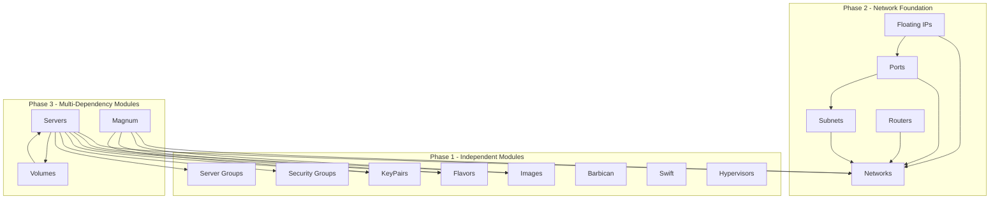

# Substation Module Catalog

## Introduction

We built Substation around a fundamental principle: OpenStack is complex, but your interface to it shouldn't be. Each service has its own personality, its own quirks, its own operational patterns. Rather than forcing everything through a generic interface, we embraced the modularity.

The result is a system where each OpenStack service gets its own dedicated module, a self-contained unit that understands the service deeply and presents it naturally. These modules share a common foundation (the `OpenStackModule` protocol) but express themselves differently. The Servers module knows about console access and resize workflows. The Swift module understands hierarchical object storage and ETag-based synchronization. The Security Groups module speaks in firewall rules and protocol specifications.

This architecture gives us flexibility in how we implement and evolve each service integration, but more importantly, it gives you a consistent yet service-appropriate interface. You're not fighting against a lowest-common-denominator abstraction; you're working with tools designed specifically for each service.

Each module implements the `OpenStackModule` protocol and provides:

- Service-specific views and forms tailored to the resource type
- Data fetching and caching through DataProvider interfaces
- Batch operations for multi-resource management
- Input handling for keyboard navigation and actions
- Health monitoring and performance metrics

## Module Overview

Substation provides 16 specialized modules for managing OpenStack resources. We've organized them by functional category, but the dependency relationships tell the real story: some modules stand alone, others build on foundational services, and a few (like Servers) tie nearly everything together.

### Module Metadata

| Module | Identifier | Display Name | Service | Category |
|--------|------------|--------------|---------|----------|
| **Servers** | `servers` | Servers | Nova | Compute |
| **Hypervisors** | `hypervisors` | Hypervisors | Nova | Compute |
| **Networks** | `networks` | Networks | Neutron | Network |
| **Subnets** | `subnets` | Subnets | Neutron | Network |
| **Routers** | `routers` | Routers | Neutron | Network |
| **Ports** | `ports` | Ports | Neutron | Network |
| **FloatingIPs** | `floatingips` | Floating IPs | Neutron | Network |
| **SecurityGroups** | `securitygroups` | Security Groups | Neutron | Security |
| **Images** | `images` | Images | Glance | Storage |
| **Flavors** | `flavors` | Flavors | Nova | Compute |
| **KeyPairs** | `keypairs` | Key Pairs | Nova | Security |
| **ServerGroups** | `servergroups` | Server Groups | Nova | Compute |
| **Volumes** | `volumes` | Volumes | Cinder | Storage |
| **Swift** | `swift` | Object Storage | Swift | Storage |
| **Barbican** | `barbican` | Secrets | Barbican | Security |
| **Magnum** | `magnum` | Container Clusters | Magnum | Container |

## Module Dependencies

Understanding module dependencies is critical for initialization order and for making sense of how OpenStack services interact. We've structured this as three phases: independent services that stand alone, networking infrastructure that builds on itself, and finally the compute and storage services that need everything else.

### Dependency Diagram

### Initialization Order

1. **Phase 1 - Independent Modules**: Can be initialized in any order
   - Images, Flavors, KeyPairs, SecurityGroups, ServerGroups, Barbican, Swift, Hypervisors

2. **Phase 2 - Network Dependencies**: Must initialize Networks first
   - Networks -> Subnets, Routers, Ports -> FloatingIPs

3. **Phase 3 - Multi-Dependencies**: Require multiple services
   - Volumes (can attach to Servers)
   - Servers (depends on most other services)
   - Magnum (depends on Networks, Images, Flavors, KeyPairs)

## Module Capabilities Matrix

Different resources have different operational patterns. Some change frequently and need aggressive refresh intervals. Others are nearly static and benefit from long cache times. Some support rich creation workflows; others are read-only views into existing resources.

| Module | List View | Detail View | Create/Edit | Delete | Batch Ops | Auto-Refresh |
|--------|-----------|-------------|-------------|--------|-----------|--------------|
| **Servers** | Yes | Yes | Yes | Yes | Yes | 60s |
| **Hypervisors** | Yes | Yes | No | No | No | 60s |
| **Networks** | Yes | Yes | Yes | Yes | Yes | 60s |
| **Subnets** | Yes | Yes | Yes | Yes | Yes | On-demand |
| **Routers** | Yes | Yes | Yes | Yes | Yes | On-demand |
| **Ports** | Yes | Yes | Yes | Yes | Yes | On-demand |
| **FloatingIPs** | Yes | Yes | Yes | Yes | Yes | On-demand |
| **SecurityGroups** | Yes | Yes | Yes | Yes | Yes | 5m cache |
| **Images** | Yes | Yes | No | Yes | Yes | 5m cache |
| **Flavors** | Yes | Yes | No | No | No | 5m cache |
| **KeyPairs** | Yes | Yes | Yes | Yes | Yes | 5m cache |
| **ServerGroups** | Yes | Yes | Yes | Yes | Yes | On-demand |
| **Volumes** | Yes | Yes | Yes | Yes | Yes | 60s |
| **Swift** | Yes | Yes | Yes | Yes | Yes | ETag sync |
| **Barbican** | Yes | Yes | Yes | Yes | Yes | On-demand |
| **Magnum** | Yes | Yes | Yes | Yes | Yes | 60s |

## Module Catalog

The following sections detail each module's implementation, capabilities, and operational characteristics. We've organized them functionally, starting with the compute modules that most users interact with first, followed by networking, storage, and security services.

### Compute Modules

These modules manage the virtual machines and their hardware profiles. Servers is the most complex module in Substation, serving as the integration point for nearly every other service.

---

### Servers Module

**Location:** `/Sources/Substation/Modules/Servers/`
**Service:** OpenStack Nova (Compute)
**Identifier:** `servers`

**Purpose:**
Provides comprehensive server (instance) management capabilities, serving as the most complex module with extensive service integrations.

**Key Features:**

- Server lifecycle management (create, start, stop, reboot, delete)
- Console access with browser integration (noVNC and other protocols)
- Server resize operations with confirmation/revert workflow
- Snapshot creation and management
- Network interface management
- Volume attachment and detachment
- Security group assignment
- Metadata and user data support
- Availability zone selection
- Server group integration for anti-affinity policies

**Views:**

- `.servers` - Primary list view with status indicators
- `.serverDetail` - Detailed server attributes
- `.serverCreate` - Multi-step creation form
- `.serverConsole` - Console access view
- `.serverResize` - Resize management with confirmation
- `.serverSnapshotManagement` - Snapshot operations
- `.serverSecurityGroups` - Security group management
- `.serverNetworkInterfaces` - Network interface configuration

**DataProvider:** `ServersDataProvider` - Handles server data fetching with performance optimization

---

### Flavors Module

**Location:** `/Sources/Substation/Modules/Flavors/`
**Service:** OpenStack Nova
**Identifier:** `flavors`

**Purpose:**
Manages compute flavors defining virtual hardware profiles.

**Key Features:**

- Flavor specification display (vCPUs, RAM, disk)
- Extra specs inspection
- Public/private flavor visibility
- Flavor access management
- Performance tier categorization

**Views:**

- `.flavors` - Flavor list
- `.flavorDetail` - Detailed specifications
- `.flavorSelection` - Flavor picker for server operations

**DataProvider:** `FlavorsDataProvider` - Flavor data management

---

### ServerGroups Module

**Location:** `/Sources/Substation/Modules/ServerGroups/`
**Service:** OpenStack Nova
**Identifier:** `servergroups`

**Purpose:**
Manages server groups for scheduling policies like anti-affinity.

**Key Features:**

- Anti-affinity policy configuration
- Affinity policy support
- Soft anti-affinity rules
- Server membership management
- Policy metadata configuration

**Views:**

- `.serverGroups` - Server group list
- `.serverGroupDetail` - Group members and policy
- `.serverGroupCreate` - Group creation form
- `.serverGroupManagement` - Member management

**DataProvider:** `ServerGroupsDataProvider` - Server group data

---

### Hypervisors Module

**Location:** `/Sources/Substation/Modules/Hypervisors/`
**Service:** OpenStack Nova
**Identifier:** `hypervisors`

**Purpose:**
Provides read-only hypervisor monitoring and management for cloud administrators to oversee compute infrastructure.

**Key Features:**

- Hypervisor resource monitoring (vCPUs, RAM, disk)
- Server instance discovery per hypervisor
- Admin state management (enable/disable)
- Hypervisor type and version display
- Running VM count tracking
- Workload distribution analysis

**Views:**

- `.hypervisors` - Hypervisor list with resource utilization
- `.hypervisorDetail` - Detailed specifications and server list

**DataProvider:** `HypervisorsDataProvider` - Hypervisor data fetching with caching

---

### Network Modules

Neutron provides the virtual networking infrastructure that ties everything together. Networks are the foundation, with subnets, routers, ports, and floating IPs building on that base. These modules have tight interdependencies, you can't have a subnet without a network, or a floating IP without a port.

---

### Networks Module

**Location:** `/Sources/Substation/Modules/Networks/`
**Service:** OpenStack Neutron
**Identifier:** `networks`

**Purpose:**
Foundational networking module providing virtual network infrastructure management.

**Key Features:**

- Provider network attributes (VLAN, VXLAN, Flat, GRE, Geneve)
- Multi-segment network support
- MTU configuration and validation
- Port security management
- External network identification
- Shared network visibility
- QoS policy integration
- Availability zone awareness

**Views:**

- `.networks` - Network list with filtering
- `.networkDetail` - Detailed network inspection
- `.networkCreate` - Network creation form
- `.networkServerAttachment` - Server attachment management
- `.networkServerManagement` - Server network configuration

**DataProvider:** `NetworksDataProvider` - Optimized network data fetching

---

### Subnets Module

**Location:** `/Sources/Substation/Modules/Subnets/`
**Service:** OpenStack Neutron
**Identifier:** `subnets`

**Purpose:**
Manages IP address allocation pools and subnet configurations within networks.

**Key Features:**

- CIDR management and validation
- DHCP configuration
- DNS nameserver configuration
- Host route management
- IP allocation pool configuration
- Gateway IP management
- IPv4/IPv6 dual-stack support

**Views:**

- `.subnets` - Subnet list view
- `.subnetDetail` - Detailed subnet information
- `.subnetCreate` - Subnet creation form
- `.subnetRouterManagement` - Router attachment management

**DataProvider:** `SubnetsDataProvider` - Subnet data management

---

### Routers Module

**Location:** `/Sources/Substation/Modules/Routers/`
**Service:** OpenStack Neutron
**Identifier:** `routers`

**Purpose:**
Provides virtual router management for inter-network routing and external connectivity.

**Key Features:**

- External gateway configuration
- Internal interface management
- Static route configuration
- High availability support
- Distributed routing configuration
- Floating IP association

**Views:**

- `.routers` - Router list view
- `.routerDetail` - Router detail inspection
- `.routerCreate` - Router creation form

**DataProvider:** `RoutersDataProvider` - Router data fetching and caching

---

### Ports Module

**Location:** `/Sources/Substation/Modules/Ports/`
**Service:** OpenStack Neutron
**Identifier:** `ports`

**Purpose:**
Manages virtual network ports for compute and network connectivity.

**Key Features:**

- Port security configuration
- Allowed address pairs management
- QoS policy assignment
- Fixed IP configuration
- MAC address management
- Port binding configuration
- VNIC type selection

**Views:**

- `.ports` - Port list view
- `.portDetail` - Detailed port information
- `.portCreate` - Port creation form
- `.allowedAddressPairManagement` - Address pair configuration

**DataProvider:** `PortsDataProvider` - Port data management with filtering

---

### FloatingIPs Module

**Location:** `/Sources/Substation/Modules/FloatingIPs/`
**Service:** OpenStack Neutron
**Identifier:** `floatingips`

**Purpose:**
Manages public IP addresses for external connectivity to instances.

**Key Features:**

- Floating IP allocation from external networks
- Port association and disassociation
- Server attachment management
- DNS integration support
- QoS bandwidth limiting

**Views:**

- `.floatingIPs` - Floating IP list
- `.floatingIPDetail` - Detailed floating IP view
- `.floatingIPCreate` - Allocation form
- `.floatingIPServerManagement` - Server association
- `.floatingIPPortManagement` - Port association

**DataProvider:** `FloatingIPsDataProvider` - Floating IP data fetching

---

### Storage Modules

Storage in OpenStack comes in three flavors: images for boot templates, volumes for persistent block storage, and Swift for object storage. Each has distinct operational characteristics and use cases.

---

### Images Module

**Location:** `/Sources/Substation/Modules/Images/`
**Service:** OpenStack Glance
**Identifier:** `images`

**Purpose:**
Manages virtual machine images and snapshots.

**Key Features:**

- Image listing with metadata
- Image visibility management
- Protected image handling
- Image property inspection
- Format and container format display
- Minimum requirements validation

**Views:**

- `.images` - Image catalog
- `.imageDetail` - Image properties and metadata
- `.imageSelection` - Image picker for server creation

**DataProvider:** `ImagesDataProvider` - Image catalog fetching

---

### Volumes Module

**Location:** `/Sources/Substation/Modules/Volumes/`
**Service:** OpenStack Cinder
**Identifier:** `volumes`

**Purpose:**
Provides block storage management for persistent data volumes.

**Key Features:**

- Volume creation and cloning
- Snapshot management
- Backup operations
- Volume attachment to servers
- Volume type selection
- Encryption support
- Multi-attach capability
- Boot volume management
- Volume transfer between projects

**Views:**

- `.volumes` - Volume list
- `.volumeDetail` - Volume properties
- `.volumeCreate` - Creation form with source options
- `.volumeServerManagement` - Server attachment
- `.volumeSnapshotManagement` - Snapshot operations
- `.volumeBackupManagement` - Backup configuration
- `.volumeArchive` - Archive operations

**DataProvider:** `VolumesDataProvider` - Volume data with attachment tracking

---

### Swift Module

**Location:** `/Sources/Substation/Modules/Swift/`
**Service:** OpenStack Swift (Object Storage)
**Identifier:** `swift`

**Purpose:**
Comprehensive object storage management with container and object operations.

**Key Features:**

- Container management (create, delete, metadata)
- Object upload/download with progress tracking
- Directory structure support
- Bulk operations
- Metadata management for containers and objects
- Web access configuration
- Background operation tracking
- ETag-based differential sync
- Transfer progress monitoring

**Views:**

- `.swift` - Container/object browser
- `.swiftContainerDetail` - Container properties
- `.swiftObjectDetail` - Object metadata
- `.swiftContainerCreate` - Container creation
- `.swiftObjectUpload` - Upload interface
- `.swiftObjectDownload` - Download management
- `.swiftDirectoryDownload` - Bulk directory download
- `.swiftContainerMetadata` - Metadata editor
- `.swiftBackgroundOperations` - Transfer monitoring

**DataProvider:** `SwiftDataProvider` - Object storage data with caching

**Unique Components:**

- Transfer monitoring integrated within Swift module form handlers
- Storage utilities integrated within Swift module
- `SwiftTreeItem` - Hierarchical object representation

---

### Security Modules

Security in OpenStack spans multiple domains: network security through security groups, SSH access through key pairs, and cryptographic secrets through Barbican. These modules handle sensitive operations and credentials.

---

### SecurityGroups Module

**Location:** `/Sources/Substation/Modules/SecurityGroups/`
**Service:** OpenStack Neutron
**Identifier:** `securitygroups`

**Purpose:**
Provides firewall rule management through security groups and rules.

**Key Features:**

- Ingress/egress rule management
- Protocol and port range configuration
- ICMP type/code support
- Remote security group references
- CIDR-based access control
- Default security group management
- Rule priority configuration

**Views:**

- `.securityGroups` - Security group list
- `.securityGroupDetail` - Rule inspection
- `.securityGroupCreate` - Group creation
- `.securityGroupServerAttachment` - Server assignment
- `.securityGroupServerManagement` - Server security management

**DataProvider:** `SecurityGroupsDataProvider` - Security group and rule data

---

### KeyPairs Module

**Location:** `/Sources/Substation/Modules/KeyPairs/`
**Service:** OpenStack Nova
**Identifier:** `keypairs`

**Purpose:**
Manages SSH key pairs for secure instance access.

**Key Features:**

- Key pair generation
- Public key import
- Key fingerprint display
- Key type support (ssh, x509)
- Private key download (on creation)

**Views:**

- `.keyPairs` - Key pair list
- `.keyPairDetail` - Key information
- `.keyPairCreate` - Key generation/import form

**DataProvider:** `KeyPairsDataProvider` - Key pair data fetching

---

### Barbican Module

**Location:** `/Sources/Substation/Modules/Barbican/`
**Service:** OpenStack Barbican (Key Manager)
**Identifier:** `barbican`

**Purpose:**
Cryptographic key and secret management service integration.

**Key Features:**

- Secret listing and browsing
- Secret detail views with cryptographic information
- Secret creation with encryption options
- Secret type management (symmetric, asymmetric, certificate)
- Payload content type configuration
- Expiration management

**Views:**

- `.barbican` - Main Barbican view
- `.barbicanSecrets` - Secret list
- `.barbicanSecretDetail` - Secret properties
- `.barbicanSecretCreate` - Secret creation form

**DataProvider:** `BarbicanDataProvider` - Secret data management

---

### Container Modules

Container orchestration extends OpenStack into the Kubernetes ecosystem. Magnum provides a Container-as-a-Service layer, enabling users to deploy and manage Kubernetes clusters as first-class OpenStack resources.

---

### Magnum Module

**Location:** `/Sources/Substation/Modules/Magnum/`
**Service:** OpenStack Magnum (Container Orchestration Engine)
**Identifier:** `magnum`

**Purpose:**
Provides comprehensive container cluster management for Kubernetes, Docker Swarm, and other container orchestration engines through OpenStack Magnum.

**Key Features:**

- Cluster lifecycle management (create, resize, delete)
- Cluster template management for reusable configurations
- Kubeconfig retrieval for kubectl access
- Node group management and scaling
- Cluster health monitoring
- Certificate management
- Multi-COE support (Kubernetes, Docker Swarm, Mesos)

**Views:**

- `.magnum` - Main Magnum dashboard
- `.magnumClusters` - Cluster list with status
- `.magnumClusterDetail` - Detailed cluster information
- `.magnumClusterCreate` - Cluster creation form
- `.magnumTemplates` - Cluster template list
- `.magnumTemplateDetail` - Template specifications
- `.magnumTemplateCreate` - Template creation form

**DataProvider:** `MagnumDataProvider` - Cluster and template data with parallel fetching

---

## Quick Reference

### Common Module Operations

#### List Resources

All modules provide list views with:

- Filtering by search query
- Status indicators
- Multi-select for batch operations
- Keyboard navigation (j/k or arrow keys)
- Quick actions (Enter for detail, d for delete)

#### View Details

Detail views include:

- Complete resource properties
- Related resource information
- Metadata display
- Action buttons
- Scrollable content for long details

#### Create Resources

Creation forms provide:

- Field validation
- Tab navigation between fields
- Required field indicators
- Help text for complex fields
- Dependency selection (images, networks, etc.)

#### Batch Operations

Supported batch operations:

- Multi-select with 'm' key
- Select all with 'M'
- Batch delete for most resources
- Batch status updates for some resources
- Progress tracking for operations

### Module-Specific Shortcuts

| Module | Key | Action |
|--------|-----|--------|
| **Servers** | O | Open console |
| | P | Create snapshot |
| | Z | Resize server |
| | L | View logs |
| **Networks** | A | Attach to server |
| | S | Manage subnets |
| **Volumes** | A | Attach to server |
| | S | Create snapshot |
| | B | Create backup |
| **Swift** | U | Upload object |
| | D | Download object |
| | M | Edit metadata |
| **FloatingIPs** | A | Associate with port |
| | D | Disassociate |

### Data Refresh Patterns

Modules use different refresh strategies:

- **Critical Resources** (Servers, Networks, Volumes): 60-second auto-refresh
- **Stable Resources** (Images, Flavors, KeyPairs, SecurityGroups): 5-minute cache
- **Dynamic Resources** (Ports, FloatingIPs, Subnets, Routers): On-demand refresh
- **Swift Objects**: ETag-based differential sync
- **Manual Refresh**: 'r' key in any list view

### Performance Considerations

- **Lazy Loading**: Modules load on first access
- **Resource Pooling**: Views are recycled for memory efficiency
- **Batch Fetching**: Large datasets fetched in batches
- **Virtual Scrolling**: Lists handle thousands of items efficiently
- **Cache Management**: Smart caching with TTL and invalidation
- **Background Sync**: Swift module uses background sync for large containers

## Module Development Guidelines

### Creating a New Module

1. Implement `OpenStackModule` protocol
2. Define `identifier`, `displayName`, `version`, `dependencies`
3. Implement `configure()` for initialization
4. Register views with `registerViews()`
5. Optionally implement DataProvider for data management
6. Register with ModuleRegistry in configuration

### Module Best Practices

- Keep modules focused on a single OpenStack service
- Use DataProvider for consistent data fetching
- Implement health checks for monitoring
- Support batch operations where applicable
- Provide keyboard shortcuts for common actions
- Use consistent view patterns (list/detail/create)
- Handle service unavailability gracefully
- Document all public interfaces with SwiftDoc

### Testing Modules

- Unit test DataProvider implementations
- Integration test with mock OpenStack responses
- UI test view rendering and navigation
- Performance test with large datasets
- Test error handling and service failures
- Validate form input and submission

## Infrastructure Notes

The Core framework provides shared infrastructure components that all modules depend on, but Core itself is not a service module. It includes:

- Base protocols and interfaces
- Common UI components
- Data management utilities
- Authentication handling
- Error handling frameworks
- Performance monitoring tools

This infrastructure layer enables the consistent behavior and interface across all 16 service modules.
