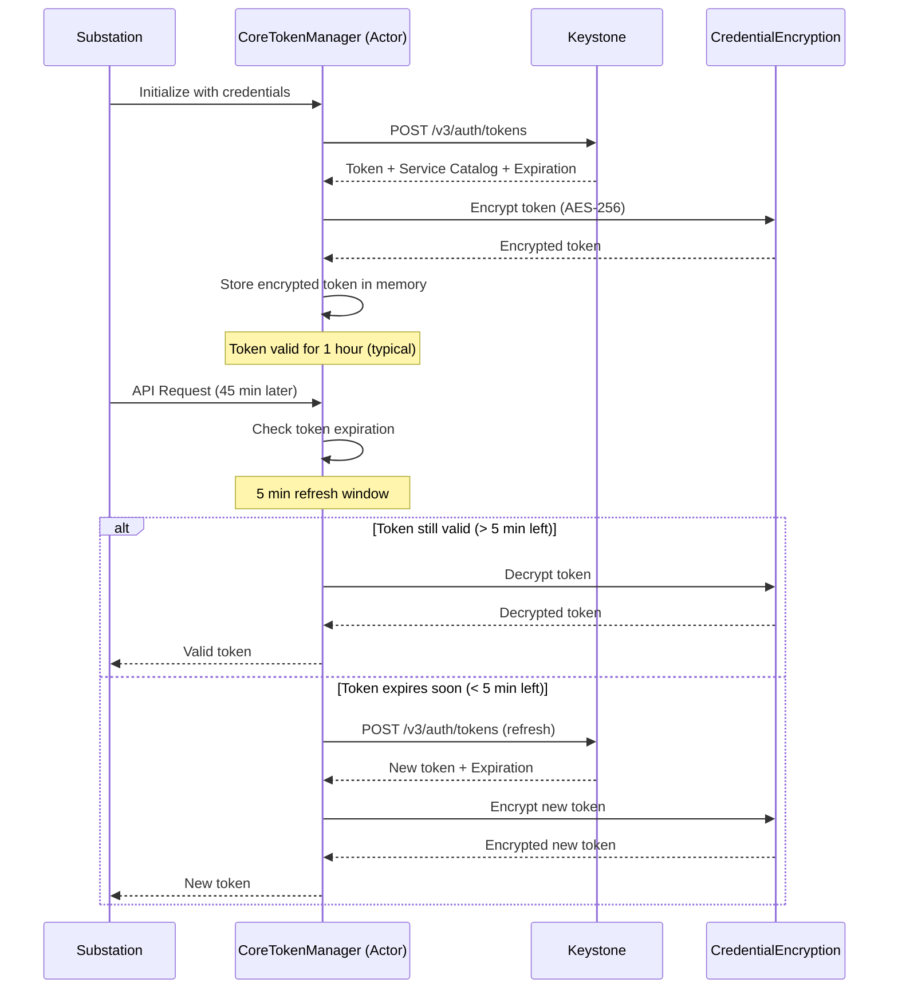
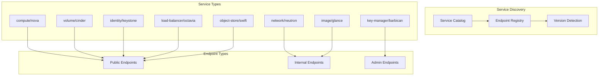
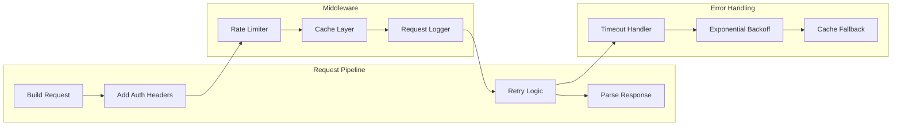
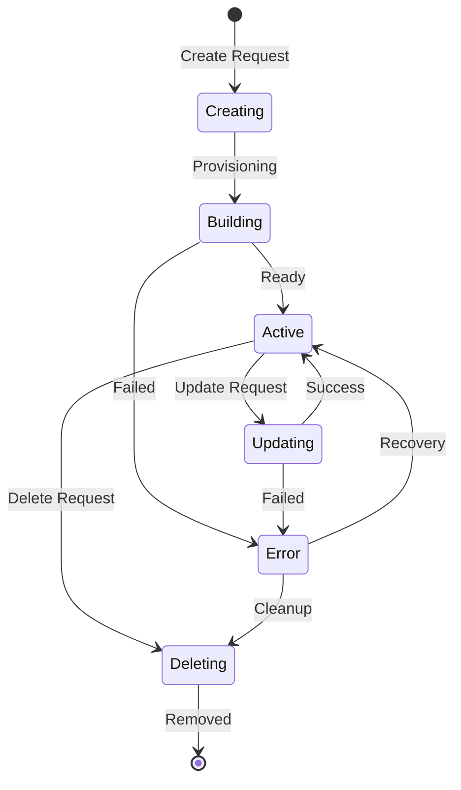
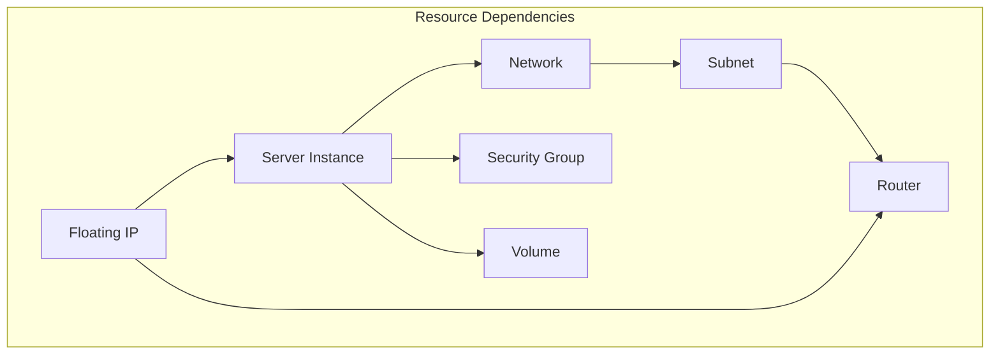
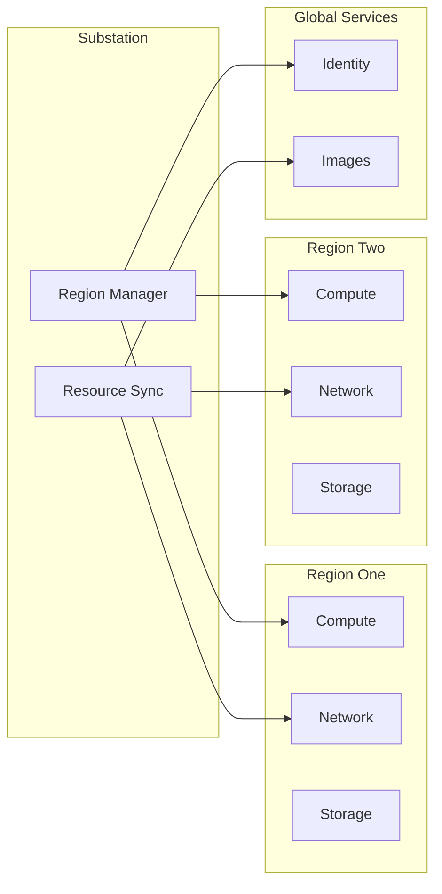
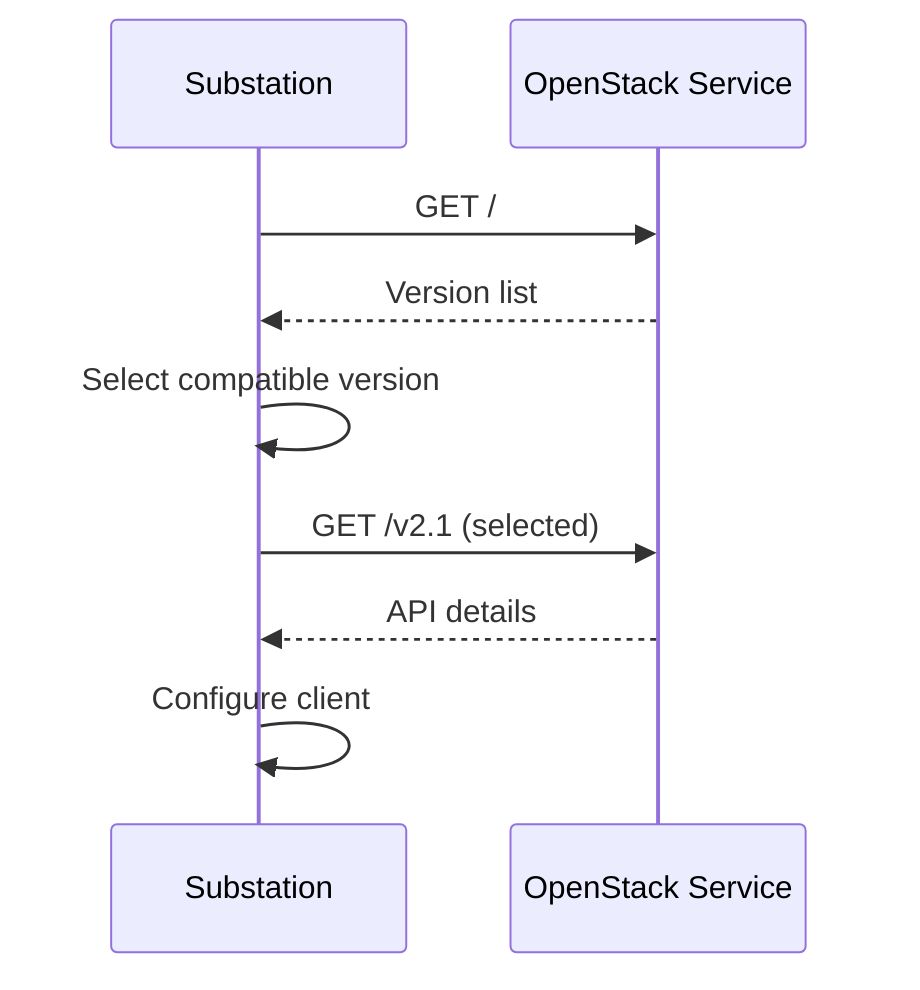
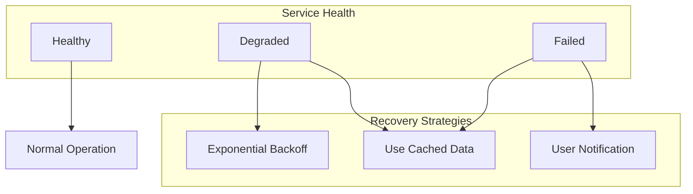
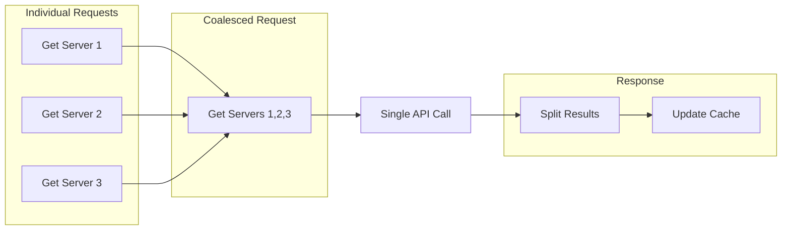

# OpenStack Integration

Substation provides comprehensive integration with OpenStack services, supporting all major components and APIs. This documentation covers authentication, service endpoints, API patterns, and resource management strategies.

## Supported OpenStack Versions

Substation is tested and supported with:

- **2023.1** (Antelope) - Tested extensively
- **2023.2** (Bobcat) and later - Should work
- **2024.1** (Caracal) and later - Tested extensively
- **2025.1** (Epoxy) - Should work

**Microversion Support:** Substation automatically negotiates the highest compatible API microversion with your OpenStack deployment. This ensures you get the latest features available in your cloud.

## Service Support Matrix

### Core Services (Required)

| Service | Component | API Version | Status |
|---------|-----------|-------------|--------|
| **Keystone** | Identity | v3 | Full support |
| **Nova** | Compute | v2.1 | Full support |
| **Neutron** | Networking | v2.0 | Full support |

### Extended Services (Optional)

| Service | Component | API Version | Status |
|---------|-----------|-------------|--------|
| **Cinder** | Block Storage | v3 | Full support |
| **Glance** | Image | v2 | Partial support |
| **Barbican** | Key Manager | v1 | Full support |
| **Octavia** | Load Balancer | v2 | planned |
| **Swift** | Object Storage | v1 | planned |
| **Heat** | Orchestration | v1 | planned |

### Service Capabilities Detail

#### Nova (Compute Service)

**Full Resource Support:**

- Servers (instances): List, create, delete, start, stop, reboot, rebuild, resize
- Flavors: List, show, create (admin), delete (admin)
- Keypairs: List, create, delete, import
- Server Groups: List, create, delete, add members
- Server actions: Pause, unpause, suspend, resume, lock, unlock, backup

**Advanced Features:**

- Metadata management
- Console access (VNC, SPICE)
- Volume attachment/detachment
- Interface attachment/detachment
- Server group policies (affinity, anti-affinity)

#### Neutron (Networking Service)

**Full Resource Support:**

- Networks: List, create, delete, update
- Subnets: List, create, delete, update
- Routers: List, create, delete, update, add/remove interfaces
- Ports: List, create, delete, update
- Security Groups: List, create, delete, add/remove rules
- Floating IPs: List, create, delete, associate, disassociate

**Advanced Features:**

- Network topology generation
- Port binding information
- DHCP configuration
- External network management
- Subnet allocation pools

#### Cinder (Block Storage Service)

**Full Resource Support:**

- Volumes: List, create, delete, extend, attach, detach
- Snapshots: List, create, delete, restore
- Volume types: List, create (admin), delete (admin)
- Backups: List, create, restore, delete

**Advanced Features:**

- Volume transfer (between projects)
- Volume cloning
- Multi-attach volumes
- Volume migration

#### Glance (Image Service)

**Full Resource Support:**

- Images: List, create, delete, update metadata
- Image upload/download
- Image activation/deactivation

**Advanced Features:**

- Image import (web-download, copy-image)
- Image members (sharing)
- Image properties and tags
- Protected images

#### Barbican (Secrets Management)

**Full Resource Support:**

- Secrets: Create, list, delete, retrieve payload
- Containers: Create, list, delete
- Secret orders: Create, list

**Advanced Features:**

- Secret types (symmetric, asymmetric, certificate, passphrase)
- ACL management
- Secret metadata

#### Octavia (Load Balancer)

**Full Resource Support:**

- Load Balancers: List, create, delete, update
- Listeners: Create, update, delete
- Pools: Create, update, delete, manage members
- Health Monitors: Create, update, delete

**Advanced Features:**

- L7 policies and rules
- Load balancer statistics
- Amphora management

#### Swift (Object Storage)

**Full Resource Support:**

- Containers: List, create, delete
- Objects: Upload, download, delete, list
- Account metadata

**Advanced Features:**

- Large object support (SLO, DLO)
- Container ACLs
- Object versioning
- Temporary URLs

## Authentication Architecture

### Supported Authentication Methods

Substation supports three authentication methods, in order of recommendation:

#### 1. Application Credentials (Recommended)

**Most Secure**: Application credentials are scoped tokens that can be project-scoped or unscoped.

```yaml
clouds:
  production:
    auth:
      auth_url: https://keystone.example.com:5000/v3
      application_credential_id: "abc123def456..."
      application_credential_secret: "secret789xyz..."
    region_name: RegionOne
```

**Advantages:**

- Cannot be used to create additional credentials
- Can be scoped to specific projects
- Can have expiration dates
- Can be revoked without password changes
- More secure for automation

**Creating Application Credentials:**

```bash
openstack application credential create \
    --description "Substation TUI" \
    --expiration "2026-12-31T23:59:59" \
    substation
```

#### 2. Password Authentication (Common)

**Project-Scoped**: Authenticate with username/password to a specific project.

```yaml
clouds:
  production:
    auth:
      auth_url: https://keystone.example.com:5000/v3
      username: operator
      password: secret
      project_name: operations
      project_domain_name: default
      user_domain_name: default
    region_name: RegionOne
```

**Required Fields:**

- `auth_url`: Keystone endpoint (must include `/v3`)
- `username`: Your OpenStack username
- `password`: Your OpenStack password
- `project_name`: Project to scope to
- `project_domain_name`: Domain of the project (usually `default`)
- `user_domain_name`: Domain of the user (usually `default`)

**Note:** Both domain fields are required even if your deployment uses the default domain.

#### 3. Token Authentication (Planned)

Pre-existing token authentication is planned for future implementation.

### Token Management



**Security Features:**

- Tokens stored encrypted in memory (AES-256-GCM on macOS, XOR on Linux)
- Automatic refresh 5 minutes before expiration
- Tokens never written to disk
- Concurrent refresh requests are deduplicated (only one refresh at a time)

**Token Lifetime:**

- Default: 1 hour (3600 seconds) - configurable in Keystone
- Auto-refresh: 5 minutes before expiration (55 minutes in)
- Grace period: Handles clock skew and network delays

## Service Discovery

Substation automatically discovers available services through the Keystone service catalog:



## API Communication Patterns

### Request Flow



### Pagination Handling

Substation automatically handles OpenStack pagination:

```swift
// Automatic pagination for large result sets
let allServers = await client.nova.servers.list()
// Handles marker-based and limit/offset pagination

// Manual pagination control
let page1 = await client.nova.servers.list(limit: 100)
let page2 = await client.nova.servers.list(limit: 100, marker: page1.last?.id)
```

## Resource Management

### Resource Lifecycle



### Dependency Resolution

Substation intelligently manages resource dependencies:



## Multi-Region Support

### Region Management

```yaml
# Enhanced multi-region configuration
clouds:
  multiregion:
    auth:
      auth_url: https://keystone.example.com:5000/v3
      username: operator
      password: secret
    regions:
      - name: RegionOne
        priority: 1
        preferred_interface: public
      - name: RegionTwo
        priority: 2
        preferred_interface: internal
      - name: RegionThree
        priority: 3
        preferred_interface: admin
```

### Cross-Region Operations



## API Versioning

Substation handles API version negotiation automatically:

### Version Discovery



### Microversion Support

```swift
// Automatic microversion negotiation
let client = await OpenStackClient.connect(
    config: config,
    credentials: credentials
)
// Uses highest compatible microversion

// Manual microversion specification
let nova = client.nova(microversion: "2.87")
```

## Error Handling

### OpenStack Error Mapping

| HTTP Code | OpenStack Error | Substation Handling |
|-----------|----------------|---------------------|
| 400 | Bad Request | Validation error with details |
| 401 | Unauthorized | Automatic re-authentication |
| 403 | Forbidden | Permission error message |
| 404 | Not Found | Resource not found error |
| 409 | Conflict | State conflict resolution |
| 413 | Over Limit | Rate limit backoff |
| 500 | Internal Error | Retry with exponential backoff |
| 503 | Service Unavailable | Retry with extended backoff |

### Error Recovery Strategies



## Performance Optimizations

### Resource-Specific Cache TTLs

Substation uses intelligent cache TTL (Time-To-Live) strategies based on how frequently each resource type changes:

| Resource Type | TTL | Rationale |
|--------------|-----|-----------|
| Authentication Tokens | 3600s (1 hour) | Keystone token lifetime |
| Service Endpoints | 1800s (30 min) | Semi-static, rarely change |
| Flavors | 900s (15 min) | Basically static in production |
| Images | 900s (15 min) | Rarely change once uploaded |
| Networks | 300s (5 min) | Moderately dynamic |
| Subnets | 300s (5 min) | Moderately stable |
| Routers | 300s (5 min) | Moderately stable |
| Servers | 120s (2 min) | Highly dynamic (state changes) |
| Volumes | 120s (2 min) | Highly dynamic (attach/detach) |
| Ports | 120s (2 min) | Highly dynamic |
| Security Groups | 300s (5 min) | Change occasionally |

**Why Different TTLs?**

- **Flavors/Images**: Almost never change in production. Long TTL = fewer API calls.
- **Servers/Volumes**: State changes frequently (building, active, error). Short TTL = fresher data.
- **Networks**: Created occasionally, but stable once created. Medium TTL balances freshness and performance.

**Performance Impact:**

With these TTLs, typical cache hit rates:

- **80%+ for flavors/images** (very high, rarely need API)
- **70-80% for networks/subnets** (good hit rate)
- **60-70% for servers/volumes** (acceptable given dynamic nature)

**Overall**: 60-80% reduction in API calls compared to no caching.

### Expected API Response Times

Based on testing with real OpenStack deployments:

| Operation | Without Cache | With Cache (HIT) | Speedup |
|-----------|--------------|------------------|---------|
| List Servers (100 items) | 2-3 seconds | < 1ms | 2000-3000x |
| List Networks (50 items) | 1-2 seconds | < 1ms | 1000-2000x |
| List Flavors (20 items) | 0.5-1 second | < 1ms | 500-1000x |
| Cross-Service Search | 12+ seconds (sequential) | < 500ms | 24x+ |

**Cache Miss Performance:**

- L1 Cache (Memory): < 1ms retrieval (80% hit rate)
- L2 Cache (Larger Memory): ~5ms retrieval (15% hit rate)
- L3 Cache (Disk): ~20ms retrieval (3% hit rate)
- API Call: 2+ seconds (2% miss rate)

**Total Cache Hit Rate**: 98% (L1 + L2 + L3 combined)

### Parallel Search Engine

**Problem:** Sequential search across 6 services takes 12+ seconds (unacceptable).

**Solution:** Concurrent search with service prioritization.

**Configuration:**

```swift
SearchEngine(
    maxConcurrentSearches: 6,         // One per service
    searchTimeoutSeconds: 5.0,        // Hard limit
    cacheManager: multiLevelCacheManager
)
```

**Service Search Priority:**

1. Nova (Compute): Priority 5 - Operators search servers most frequently
2. Neutron (Network): Priority 4 - Networking searches common
3. Cinder (Storage): Priority 3 - Volume searches moderate
4. Glance (Images): Priority 2 - Images searched occasionally
5. Keystone/Swift: Priority 1 - Rarely searched

**Performance:**

- **< 500ms average** search time (with caching)
- **6 services searched in parallel** (not sequential)
- **5-second timeout** with graceful degradation (partial results)
- **70% search cache hit rate** (repeated searches instant)

**Graceful Degradation:**
If one service times out, others still return results. User sees partial results instead of total failure.

### Bulk Operations

```swift
// Efficient bulk operations
let servers = ["server1", "server2", "server3"]
let results = await client.nova.servers.bulkDelete(servers)

// Parallel execution with concurrency control
let operations = servers.map { serverId in
    client.nova.servers.delete(serverId)
}
await withTaskGroup(of: Result<Void, Error>.self) { group in
    for operation in operations {
        group.addTask { await operation }
    }
}
```

**Batch Operation Manager:**

- Default concurrency: 10 parallel operations
- Configurable per-operation type
- Dependency resolution (delete router after ports)
- Progress tracking and partial success handling

### Request Coalescing



## Security Considerations

### Token Management

- Tokens stored in memory only
- Automatic token refresh before expiry
- Secure token transmission (TLS required)
- Support for application credentials

### Certificate Validation

```swift
// Strict certificate validation (default)
let config = OpenStackConfig(
    authUrl: "https://keystone.example.com:5000/v3",
    validateCertificates: true
)

// Custom CA certificate
let config = OpenStackConfig(
    authUrl: "https://keystone.example.com:5000/v3",
    caCertificate: "/path/to/ca.pem"
)
```

### Audit Logging

All API operations are logged for audit purposes:

```log
2024-01-15 10:23:45 [AUDIT] User: operator, Action: CREATE, Resource: Server, ID: abc-123
2024-01-15 10:23:46 [AUDIT] User: operator, Action: ATTACH, Resource: Volume, ID: def-456
2024-01-15 10:23:47 [AUDIT] User: operator, Action: DELETE, Resource: Network, ID: ghi-789
```

## Best Practices

### 1. Connection Management

- Use connection pooling for better performance
- Configure appropriate timeouts
- Enable keepalive for long-running operations

### 2. Error Recovery

- Implement retry logic with exponential backoff
- Cache responses for resilience
- Monitor service health and adjust timeouts

### 3. Resource Cleanup

- Always clean up resources in reverse dependency order
- Use tags/metadata for resource tracking
- Implement garbage collection for orphaned resources

### 4. Performance

- Enable caching for read-heavy workloads
- Use batch operations where possible
- Implement pagination for large datasets
